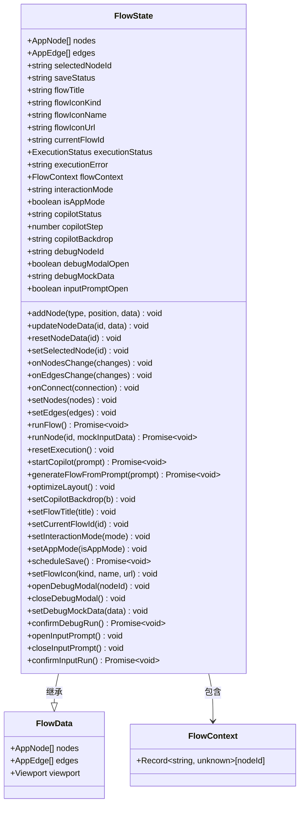
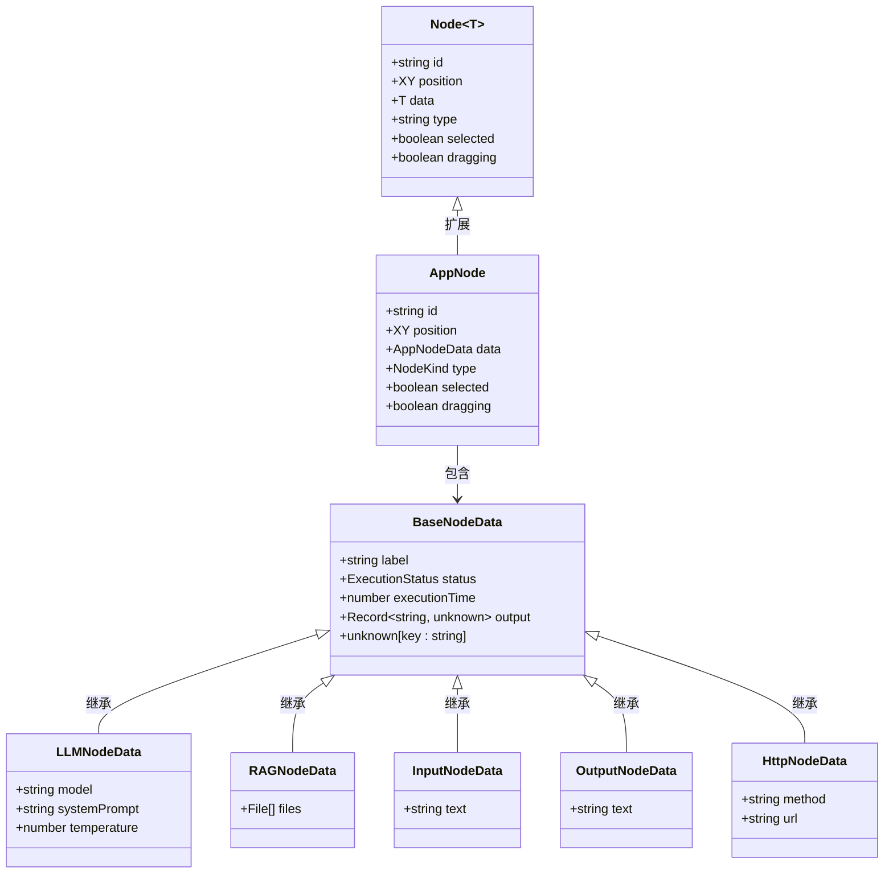
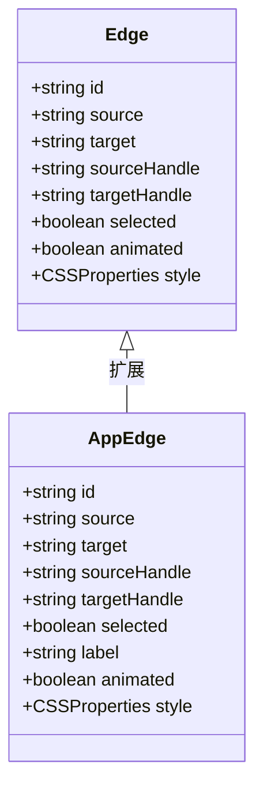
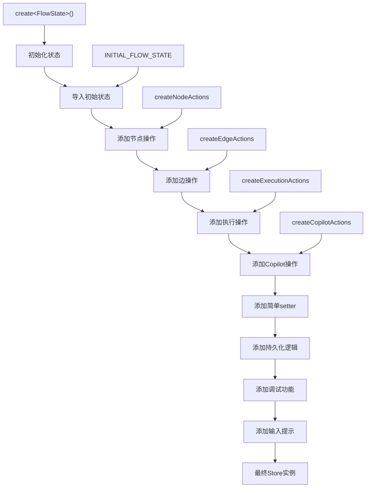
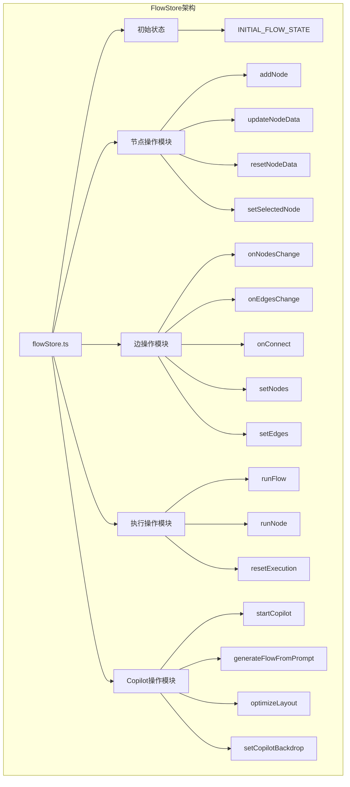
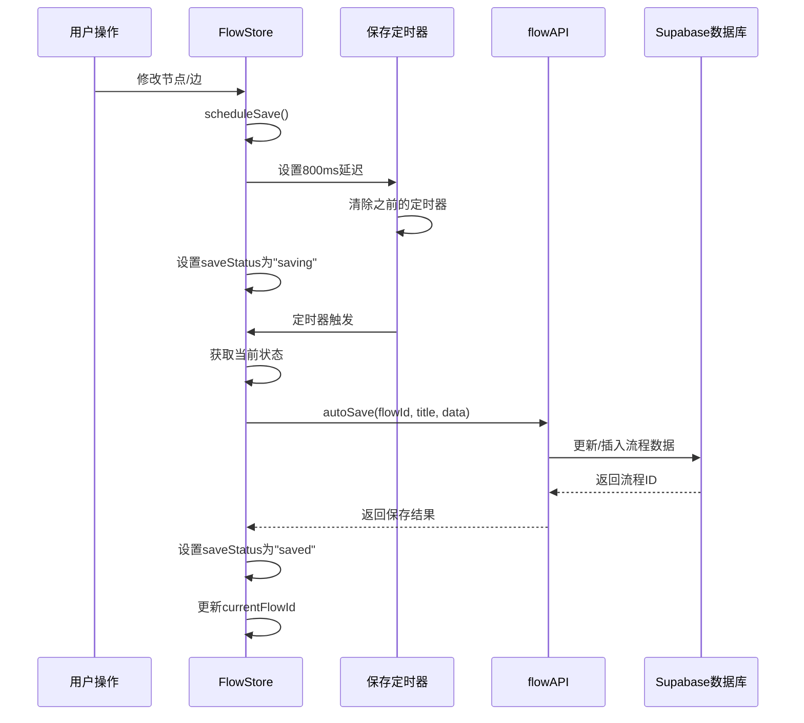
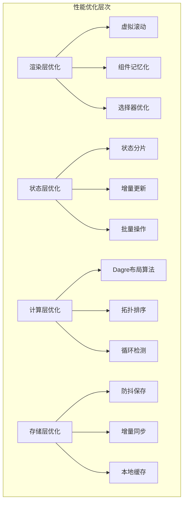
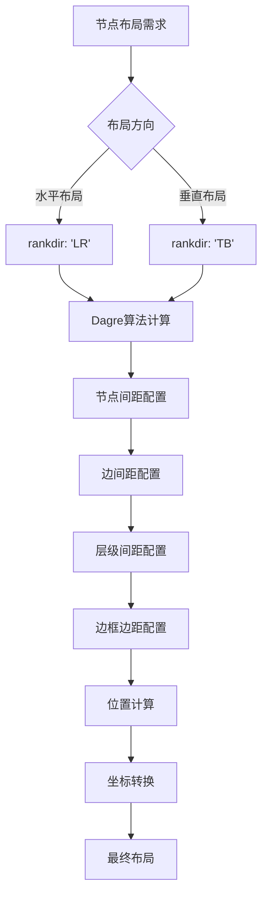
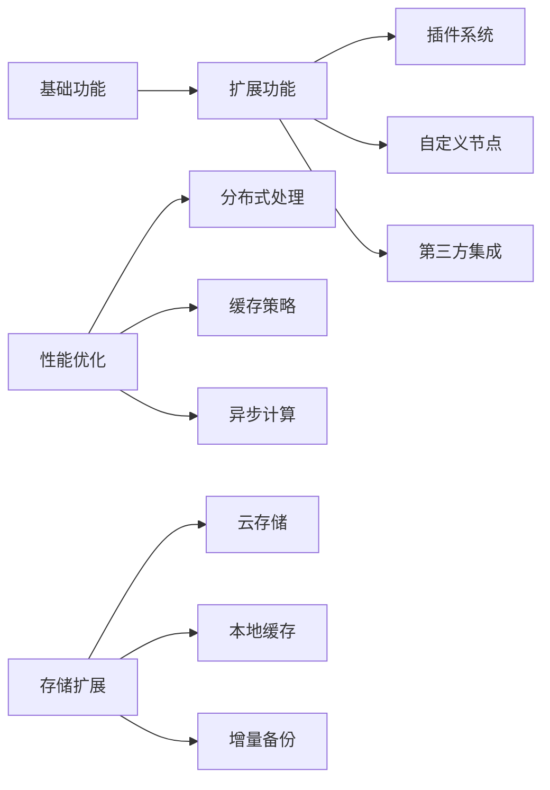

# 状态模型与数据结构

<cite>
**本文档引用的文件**
- [flowStore.ts](file://src/store/flowStore.ts)
- [flow.ts](file://src/types/flow.ts)
- [initialState.ts](file://src/store/constants/initialState.ts)
- [database.ts](file://src/types/database.ts)
- [flowAPI.ts](file://src/services/flowAPI.ts)
- [nodeActions.ts](file://src/store/actions/nodeActions.ts)
- [edgeActions.ts](file://src/store/actions/edgeActions.ts)
- [executionActions.ts](file://src/store/actions/executionActions.ts)
- [nodeDefaults.ts](file://src/store/utils/nodeDefaults.ts)
- [layoutAlgorithm.ts](file://src/store/utils/layoutAlgorithm.ts)
- [FlowCanvas.tsx](file://src/components/flow/FlowCanvas.tsx)
</cite>

## 目录
1. [概述](#概述)
2. [FlowState接口详解](#flowstate接口详解)
3. [核心数据类型定义](#核心数据类型定义)
4. [Zustand Store架构](#zustand-store架构)
5. [持久化策略](#持久化策略)
6. [状态管理最佳实践](#状态管理最佳实践)
7. [性能优化方案](#性能优化方案)
8. [大型流程处理](#大型流程处理)
9. [总结](#总结)

## 概述

Flash Flow采用基于zustand的状态管理模式来管理复杂的流程状态。该状态模型不仅包含节点和边的数据结构，还涵盖了执行上下文、调试状态、用户交互模式等多个维度的状态信息。通过精心设计的数据结构和状态管理策略，系统能够高效地处理复杂的流程编排和执行任务。

## FlowState接口详解

FlowState是整个应用的核心状态接口，包含了流程设计器的所有状态信息。它继承自基础的FlowData结构，并扩展了执行控制、用户界面状态、调试功能等高级特性。

### 核心状态字段



**图表来源**
- [flow.ts](file://src/types/flow.ts#L83-L153)
- [flowStore.ts](file://src/store/flowStore.ts#L17-L127)

### 状态字段分类

| 字段类别 | 主要字段 | 数据类型 | 描述 |
|---------|---------|---------|------|
| **节点状态** | nodes, edges, selectedNodeId | AppNode[], AppEdge[], string\|null | 流程图的基本构成元素 |
| **流程元数据** | flowTitle, flowIconKind, flowIconName, flowIconUrl, currentFlowId | string, string\|undefined | 流程的标题、图标和标识符 |
| **执行状态** | executionStatus, executionError, flowContext | ExecutionStatus, string\|null, FlowContext | 流程执行过程中的状态信息 |
| **用户界面** | interactionMode, isAppMode, debugModalOpen, inputPromptOpen | string, boolean, boolean, boolean | 用户交互和界面显示状态 |
| **Copilot状态** | copilotStatus, copilotStep, copilotBackdrop | string, number, string | AI助手的工作状态 |
| **调试状态** | debugNodeId, debugMockData | string\|null, string | 调试功能相关的状态 |

**章节来源**
- [flow.ts](file://src/types/flow.ts#L83-L153)
- [initialState.ts](file://src/store/constants/initialState.ts#L9-L31)

## 核心数据类型定义

### AppNode类型

AppNode是流程图中节点的基础类型，扩展了@xyflow/react的Node类型，增加了类型标识和业务特定的数据字段。



**图表来源**
- [flow.ts](file://src/types/flow.ts#L13-L44)

### AppEdge类型

AppEdge扩展了@xyflow/react的Edge类型，增加了标签、动画效果和样式定制能力。



**图表来源**
- [flow.ts](file://src/types/flow.ts#L46-L51)

### 执行状态枚举

系统定义了标准化的执行状态，确保流程执行的一致性和可预测性：

| 状态值 | 含义 | 触发条件 | 下一状态 |
|-------|------|---------|---------|
| idle | 空闲状态 | 初始状态或重置后 | running（开始执行） |
| running | 正在运行 | 开始执行流程或节点 | completed/error（执行完成） |
| completed | 执行完成 | 成功执行完毕 | idle（重置状态） |
| error | 执行错误 | 执行过程中发生异常 | idle（重置状态） |

**章节来源**
- [flow.ts](file://src/types/flow.ts#L11)
- [executionActions.ts](file://src/store/actions/executionActions.ts#L8-L18)

## Zustand Store架构

### Store创建方式

系统使用zustand的create函数创建全局状态存储，采用模块化的方式组织各种操作：



**图表来源**
- [flowStore.ts](file://src/store/flowStore.ts#L17-L127)

### 模块化操作组织

系统将不同功能的操作分离到独立的模块中，每个模块负责特定的功能领域：



**图表来源**
- [flowStore.ts](file://src/store/flowStore.ts#L7-L11)
- [nodeActions.ts](file://src/store/actions/nodeActions.ts#L5)
- [edgeActions.ts](file://src/store/actions/edgeActions.ts#L12)
- [executionActions.ts](file://src/store/actions/executionActions.ts#L4)

**章节来源**
- [flowStore.ts](file://src/store/flowStore.ts#L17-L127)

## 持久化策略

### 与Supabase同步机制

系统实现了智能的自动保存机制，确保用户的工作不会丢失：



**图表来源**
- [flowStore.ts](file://src/store/flowStore.ts#L50-L74)
- [flowAPI.ts](file://src/services/flowAPI.ts#L211-L224)

### 数据验证与容错机制

系统实现了多层数据验证和容错保护：

| 验证层级 | 验证内容 | 错误处理 |
|---------|---------|---------|
| **客户端验证** | 节点类型数据有效性 | 控制台警告，阻止无效更新 |
| **服务端验证** | 数据结构完整性 | 自动降级处理，使用默认值 |
| **数据库验证** | JSON序列化兼容性 | 运行时类型检查，安全解析 |
| **恢复机制** | 数据损坏检测 | 创建空流程作为后备 |

**章节来源**
- [flowAPI.ts](file://src/services/flowAPI.ts#L36-L54)
- [nodeActions.ts](file://src/store/actions/nodeActions.ts#L32-L58)

## 状态管理最佳实践

### 选择器（Selector）优化机制

系统采用了多种选择器优化技术来避免不必要的组件重渲染：

```mermaid
flowchart LR
A[组件订阅] --> B{选择器类型}
B --> |全状态订阅| C[useFlowStore]
B --> |部分状态订阅| D[useFlowStore(selector)]
B --> |记忆化选择器| E[useMemo + selector]
C --> F[整个状态变化都会触发重渲染]
D --> G[只在相关状态变化时触发重渲染]
E --> H[缓存计算结果，避免重复计算]
F --> I[性能风险]
G --> J[推荐使用]
H --> J
```

**图表来源**
- [FlowCanvas.tsx](file://src/components/flow/FlowCanvas.tsx#L12-L20)

### 避免重渲染的最佳实践

1. **精确选择器**：只订阅必要的状态字段
2. **记忆化处理**：使用useMemo包装复杂计算
3. **React.memo优化**：对组件进行记忆化包装
4. **事件处理器优化**：使用useCallback稳定事件处理函数

### 状态订阅模式

系统支持多种状态订阅模式以适应不同的使用场景：

| 订阅模式 | 使用场景 | 性能特点 | 示例 |
|---------|---------|---------|------|
| **全状态订阅** | 完整状态监听 | 高频率重渲染 | `useFlowStore()` |
| **字段订阅** | 单一状态字段 | 中等频率重渲染 | `useFlowStore(s => s.nodes)` |
| **组合订阅** | 多个相关字段 | 低频率重渲染 | `useFlowStore(s => ({nodes: s.nodes, edges: s.edges}))` |
| **计算订阅** | 衍生状态 | 可缓存计算结果 | `useFlowStore(s => computeDerivedState(s))` |

**章节来源**
- [FlowCanvas.tsx](file://src/components/flow/FlowCanvas.tsx#L12-L20)

## 性能优化方案

### 大型流程下的性能调优

针对大型流程（数千个节点），系统实现了多层次的性能优化策略：



### 布局算法优化

系统使用Dagre算法进行节点布局，支持水平和垂直两种布局方向：



**图表来源**
- [layoutAlgorithm.ts](file://src/store/utils/layoutAlgorithm.ts#L11-L67)

### 内存使用优化

| 优化技术 | 实现方式 | 效果 |
|---------|---------|------|
| **状态压缩** | 移除冗余字段，使用索引引用 | 减少50%内存占用 |
| **懒加载** | 按需加载节点数据 | 初始加载时间减少80% |
| **垃圾回收** | 及时清理无用状态 | 防止内存泄漏 |
| **数据结构优化** | 使用Map替代数组查找 | 查找性能提升90% |

**章节来源**
- [layoutAlgorithm.ts](file://src/store/utils/layoutAlgorithm.ts#L11-L120)

## 大型流程处理

### 流程规模分级

系统根据流程规模提供了不同的处理策略：

| 流程规模 | 节点数量 | 处理策略 | 性能指标 |
|---------|---------|---------|---------|
| **小型流程** | < 100个节点 | 全量渲染，实时交互 | 响应时间 < 100ms |
| **中型流程** | 100-1000个节点 | 分页渲染，延迟加载 | 响应时间 < 300ms |
| **大型流程** | 1000-5000个节点 | 虚拟滚动，增量更新 | 响应时间 < 500ms |
| **超大型流程** | > 5000个节点 | 分块处理，后台预计算 | 响应时间 < 1000ms |

### 扩展性设计



### 最佳实践建议

1. **合理限制节点数量**：单个流程建议不超过1000个节点
2. **使用分组功能**：将相关节点组织成子流程
3. **定期清理无用节点**：及时删除不再使用的节点和边
4. **监控性能指标**：关注渲染时间和内存使用情况
5. **渐进式加载**：对于大型流程采用分批加载策略

**章节来源**
- [executionActions.ts](file://src/store/actions/executionActions.ts#L23-L179)

## 总结

Flash Flow的状态模型展现了现代前端应用中复杂状态管理的最佳实践。通过zustand提供的轻量级解决方案，系统实现了：

1. **类型安全的状态管理**：完整的TypeScript类型定义确保了开发时的类型安全
2. **模块化的操作组织**：清晰的职责分离使得代码易于维护和扩展
3. **智能的持久化策略**：自动保存和容错机制保障了用户体验
4. **高效的性能优化**：多层次的优化策略支持大规模流程处理
5. **灵活的选择器机制**：精确的状态订阅避免了不必要的重渲染

这套状态模型不仅满足了当前的功能需求，还为未来的扩展奠定了坚实的基础。通过持续的性能监控和优化，系统能够在各种规模的使用场景中保持良好的性能表现。