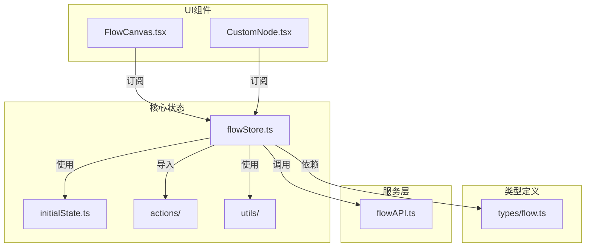
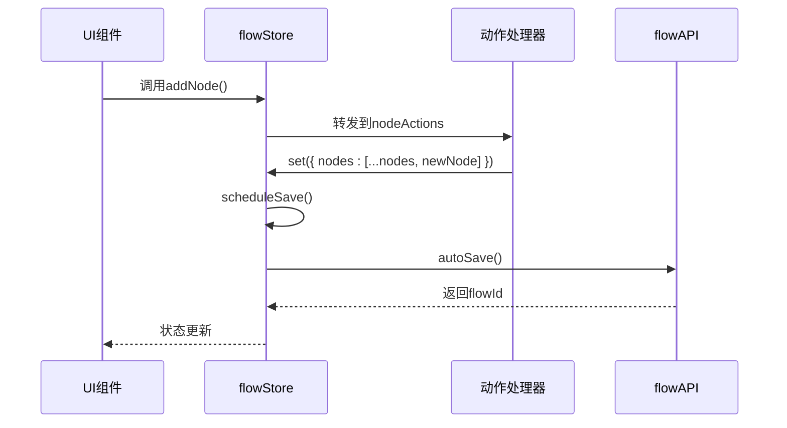
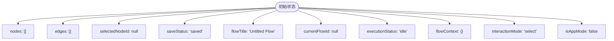
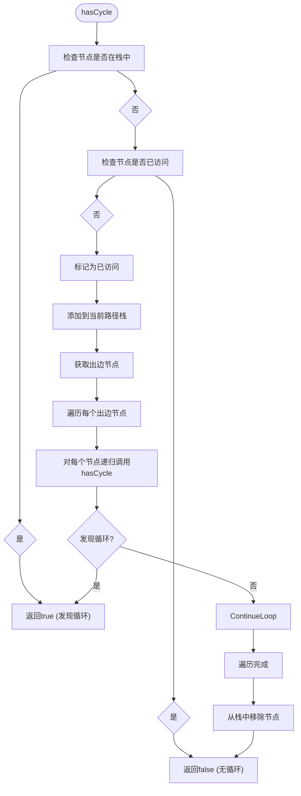
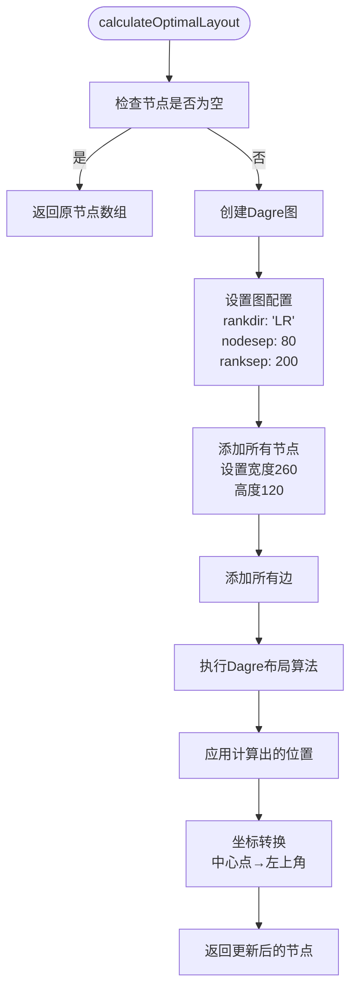
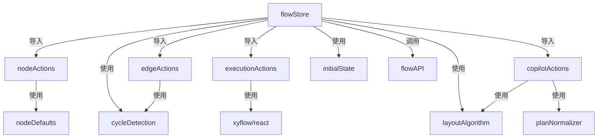

# 状态管理机制

<cite>
**本文档引用的文件**  
- [flowStore.ts](file://src/store/flowStore.ts)
- [initialState.ts](file://src/store/constants/initialState.ts)
- [cycleDetection.ts](file://src/store/utils/cycleDetection.ts)
- [layoutAlgorithm.ts](file://src/store/utils/layoutAlgorithm.ts)
- [nodeActions.ts](file://src/store/actions/nodeActions.ts)
- [edgeActions.ts](file://src/store/actions/edgeActions.ts)
- [executionActions.ts](file://src/store/actions/executionActions.ts)
- [copilotActions.ts](file://src/store/actions/copilotActions.ts)
- [flowAPI.ts](file://src/services/flowAPI.ts)
- [flow.ts](file://src/types/flow.ts)
- [FlowCanvas.tsx](file://src/components/flow/FlowCanvas.tsx)
- [CustomNode.tsx](file://src/components/flow/CustomNode.tsx)
</cite>

## 目录
1. [简介](#简介)
2. [项目结构](#项目结构)
3. [核心组件](#核心组件)
4. [架构概述](#架构概述)
5. [详细组件分析](#详细组件分析)
6. [依赖分析](#依赖分析)
7. [性能考虑](#性能考虑)
8. [故障排除指南](#故障排除指南)
9. [结论](#结论)

## 简介
本项目采用Zustand作为核心状态管理库，构建了一个用于流程编排的可视化应用。状态管理系统负责维护流程节点（AppNode）、边（AppEdge）、执行上下文和UI状态，并支持撤销/重做、实时更新、自动保存等特性。系统通过模块化设计将状态、动作和工具函数分离，实现了高内聚低耦合的架构。

## 项目结构



**图示来源**
- [flowStore.ts](file://src/store/flowStore.ts)
- [initialState.ts](file://src/store/constants/initialState.ts)
- [flowAPI.ts](file://src/services/flowAPI.ts)
- [FlowCanvas.tsx](file://src/components/flow/FlowCanvas.tsx)

## 核心组件

状态管理系统由多个核心部分组成：初始状态定义、节点与边的动作处理器、执行逻辑、AI辅助功能以及持久化机制。这些组件共同协作，确保了应用状态的一致性和可预测性。

**组件来源**
- [flowStore.ts](file://src/store/flowStore.ts#L1-L131)
- [initialState.ts](file://src/store/constants/initialState.ts#L1-L32)

## 架构概述

```mermaid
graph TB
subgraph "状态层"
S1[节点状态<br/>nodes: AppNode[]]
S2[边状态<br/>edges: AppEdge[]]
S3[执行上下文<br/>flowContext: FlowContext]
S4[UI状态<br/>selectedNodeId, saveStatus等]
end
subgraph "动作层"
A1[节点操作<br/>addNode, updateNodeData]
A2[边操作<br/>onConnect, onEdgesChange]
A3[执行操作<br/>runFlow, runNode]
A4[AI辅助操作<br/>startCopilot, optimizeLayout]
end
subgraph "工具层"
T1[cycleDetection<br/>循环检测]
T2[layoutAlgorithm<br/>布局算法]
T3[nodeDefaults<br/>节点默认值]
T4[planNormalizer<br/>计划规范化]
end
subgraph "服务层"
API[flowAPI<br/>数据持久化]
end
S1 --> A1
S2 --> A2
S3 --> A3
S4 --> A4
A1 --> T3
A2 --> T1
A3 --> API
A4 --> T2
A4 --> T4
A4 --> API
```

**图示来源**
- [flowStore.ts](file://src/store/flowStore.ts)
- [actions/nodeActions.ts](file://src/store/actions/nodeActions.ts)
- [actions/edgeActions.ts](file://src/store/actions/edgeActions.ts)
- [utils/cycleDetection.ts](file://src/store/utils/cycleDetection.ts)
- [utils/layoutAlgorithm.ts](file://src/store/utils/layoutAlgorithm.ts)
- [services/flowAPI.ts](file://src/services/flowAPI.ts)

## 详细组件分析

### 状态结构设计

状态系统基于Zustand创建，采用扁平化结构存储所有相关数据。`FlowState`类型定义了完整的状态契约，包括节点、边、执行状态、UI状态等。初始状态通过`INITIAL_FLOW_STATE`常量定义，确保每次创建新流程时都从干净的状态开始。

```mermaid
classDiagram
class FlowState {
+nodes : AppNode[]
+edges : AppEdge[]
+selectedNodeId : string | null
+saveStatus : "saved" | "saving"
+flowTitle : string
+currentFlowId : string | null
+executionStatus : ExecutionStatus
+flowContext : FlowContext
+interactionMode : "select" | "pan"
+isAppMode : boolean
+debugNodeId : string | null
+debugModalOpen : boolean
...
}
class AppNode {
+id : string
+type : NodeKind
+position : {x : number, y : number}
+data : AppNodeData
}
class AppEdge {
+id : string
+source : string
+target : string
+label? : string
+animated? : boolean
}
class FlowContext {
[nodeId : string] : Record<string, unknown>
}
FlowState "1" *-- "0..*" AppNode : 包含
FlowState "1" *-- "0..*" AppEdge : 包含
FlowState --> FlowContext : 维护
```

**图示来源**
- [flowStore.ts](file://src/store/flowStore.ts#L17-L127)
- [types/flow.ts](file://src/types/flow.ts#L83-L152)
- [initialState.ts](file://src/store/constants/initialState.ts#L9-L31)

### Action分发机制

动作系统采用模块化设计，将不同领域的操作分离到独立的模块中。每个动作模块接收`set`和`get`函数作为参数，返回一组动作函数。这些动作函数通过`...`操作符合并到主状态对象中，实现了关注点分离。



**图示来源**
- [flowStore.ts](file://src/store/flowStore.ts#L7-L31)
- [actions/nodeActions.ts](file://src/store/actions/nodeActions.ts#L5-L92)
- [actions/edgeActions.ts](file://src/store/actions/edgeActions.ts#L12-L79)
- [flowAPI.ts](file://src/services/flowAPI.ts#L10-L239)

### 初始状态定义

初始状态定义在`initialState.ts`文件中，采用空数组作为节点和边的初始值，确保新创建的流程从空白画布开始。这种设计符合用户期望，避免了预填充节点带来的困惑。



**图示来源**
- [initialState.ts](file://src/store/constants/initialState.ts#L9-L31)
- [flowStore.ts](file://src/store/flowStore.ts#L13)

### 工具函数分析

#### 循环检测工具


**图示来源**
- [cycleDetection.ts](file://src/store/utils/cycleDetection.ts#L13-L32)

#### 布局算法工具


**图示来源**
- [layoutAlgorithm.ts](file://src/store/utils/layoutAlgorithm.ts#L11-L68)

## 依赖分析



**图示来源**
- [flowStore.ts](file://src/store/flowStore.ts)
- [actions/nodeActions.ts](file://src/store/actions/nodeActions.ts)
- [actions/edgeActions.ts](file://src/store/actions/edgeActions.ts)
- [actions/copilotActions.ts](file://src/store/actions/copilotActions.ts)
- [utils/](file://src/store/utils/)

## 性能考虑

状态管理系统通过以下方式优化性能：
1. **选择性订阅**：UI组件只订阅所需的状态片段，避免不必要的重渲染
2. **防抖保存**：自动保存操作使用800ms防抖，减少频繁的API调用
3. **批量更新**：状态更新通过`set`函数批量处理，最小化渲染次数
4. **计算优化**：布局算法和循环检测等复杂计算只在必要时执行

## 故障排除指南

### 状态调试技巧
1. 使用浏览器开发者工具的Zustand插件查看完整状态树
2. 监听`saveStatus`变化跟踪自动保存流程
3. 检查`executionError`获取执行失败的详细信息
4. 通过`flowContext`查看各节点的输出数据流

### 常见问题
- **节点无法连接**：检查是否形成循环或自环
- **状态未更新**：确认是否正确使用`set`函数并触发了状态变更
- **自动保存失败**：检查网络连接和API端点状态
- **布局异常**：验证节点宽度和高度配置是否匹配实际UI尺寸

**组件来源**
- [flowStore.ts](file://src/store/flowStore.ts#L49-L74)
- [executionActions.ts](file://src/store/actions/executionActions.ts#L7-L290)
- [flowAPI.ts](file://src/services/flowAPI.ts#L208-L224)

## 结论

该状态管理系统采用Zustand构建，具有良好的模块化设计和清晰的关注点分离。通过将状态、动作和工具函数分别组织，系统实现了高可维护性和可扩展性。循环检测、布局优化等工具函数增强了核心功能，而与API层的集成确保了数据的持久化。整体架构支持复杂的流程编排需求，同时保持了良好的性能特征。