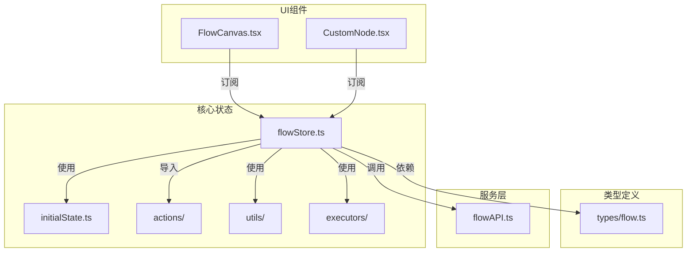
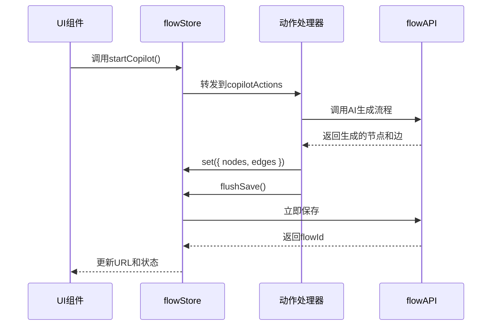
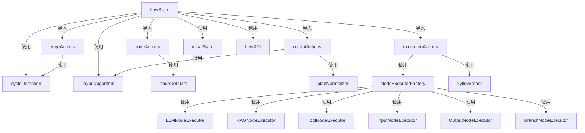

# 状态管理机制

<cite>
**本文档引用的文件**  
- [flowStore.ts](file://src/store/flowStore.ts) - *Zustand状态管理核心实现*
- [initialState.ts](file://src/store/constants/initialState.ts) - *初始状态定义*
- [cycleDetection.ts](file://src/store/utils/cycleDetection.ts) - *循环检测工具*
- [layoutAlgorithm.ts](file://src/store/utils/layoutAlgorithm.ts) - *布局算法工具*
- [nodeActions.ts](file://src/store/actions/nodeActions.ts) - *节点动作系统*
- [edgeActions.ts](file://src/store/actions/edgeActions.ts) - *边动作系统*
- [executionActions.ts](file://src/store/actions/executionActions.ts) - *执行动作系统*
- [copilotActions.ts](file://src/store/actions/copilotActions.ts) - *智能助手动作系统*
- [flowAPI.ts](file://src/services/flowAPI.ts) - *数据持久化服务*
- [flow.ts](file://src/types/flow.ts) - *类型定义*
- [FlowCanvas.tsx](file://src/components/flow/FlowCanvas.tsx) - *画布组件*
- [CustomNode.tsx](file://src/components/flow/CustomNode.tsx) - *自定义节点组件*
- [NodeExecutorFactory.ts](file://src/store/executors/NodeExecutorFactory.ts) - *节点执行器工厂*
- [ToolNodeExecutor.ts](file://src/store/executors/ToolNodeExecutor.ts) - *工具节点执行器*
</cite>

## 更新摘要
**变更内容**   
- 更新了状态管理机制文档以包含新的状态管理功能
- 新增了Zustand store的完整实现细节
- 扩展了节点/边/执行/智能助手动作系统的说明
- 增加了节点执行器模式的详细解释
- 更新了自动保存机制的异步处理逻辑
- 添加了调试对话框系统的完整描述

## 目录
1. [简介](#简介)
2. [项目结构](#项目结构)
3. [核心组件](#核心组件)
4. [架构概述](#架构概述)
5. [详细组件分析](#详细组件分析)
6. [依赖分析](#依赖分析)
7. [性能考虑](#性能考虑)
8. [故障排除指南](#故障排除指南)
9. [结论](#结论)

## 简介
本项目采用Zustand作为核心状态管理库，构建了一个用于流程编排的可视化应用。状态管理系统负责维护流程节点（AppNode）、边（AppEdge）、执行上下文和UI状态，并支持撤销/重做、实时更新、自动保存等特性。系统通过模块化设计将状态、动作和工具函数分离，实现了高内聚低耦合的架构。新增了完整的动作系统，包括节点、边、执行和智能助手四大模块，以及基于执行器模式的节点执行机制。

## 项目结构



**图示来源**
- [flowStore.ts](file://src/store/flowStore.ts)
- [initialState.ts](file://src/store/constants/initialState.ts)
- [flowAPI.ts](file://src/services/flowAPI.ts)
- [FlowCanvas.tsx](file://src/components/flow/FlowCanvas.tsx)

## 核心组件

状态管理系统由多个核心部分组成：初始状态定义、节点与边的动作处理器、执行逻辑、AI辅助功能、持久化机制以及节点执行器模式。这些组件共同协作，确保了应用状态的一致性和可预测性。新增了`flushSave`立即保存机制，解决了智能助手生成流程时的ID获取时机问题。

**组件来源**
- [flowStore.ts](file://src/store/flowStore.ts#L1-L264)
- [initialState.ts](file://src/store/constants/initialState.ts#L1-L45)

## 架构概述

```mermaid
graph TB
subgraph "状态层"
S1[节点状态<br/>nodes: AppNode[]]
S2[边状态<br/>edges: AppEdge[]]
S3[执行上下文<br/>flowContext: FlowContext]
S4[UI状态<br/>selectedNodeId, saveStatus等]
end
subgraph "动作层"
A1[节点操作<br/>addNode, updateNodeData]
A2[边操作<br/>onConnect, onEdgesChange]
A3[执行操作<br/>runFlow, runNode]
A4[AI辅助操作<br/>startCopilot, optimizeLayout]
end
subgraph "工具层"
T1[cycleDetection<br/>循环检测]
T2[layoutAlgorithm<br/>布局算法]
T3[nodeDefaults<br/>节点默认值]
T4[planNormalizer<br/>计划规范化]
end
subgraph "执行器层"
E1[NodeExecutorFactory<br/>执行器工厂]
E2[BaseNodeExecutor<br/>基础执行器]
E3[LLMNodeExecutor<br/>LLM执行器]
E4[RAGNodeExecutor<br/>RAG执行器]
E5[ToolNodeExecutor<br/>工具执行器]
end
subgraph "服务层"
API[flowAPI<br/>数据持久化]
end
S1 --> A1
S2 --> A2
S3 --> A3
S4 --> A4
A1 --> T3
A2 --> T1
A3 --> E1
A3 --> API
A4 --> T2
A4 --> T4
A4 --> API
E1 --> E2
E1 --> E3
E1 --> E4
E1 --> E5
```

**图示来源**
- [flowStore.ts](file://src/store/flowStore.ts)
- [actions/nodeActions.ts](file://src/store/actions/nodeActions.ts)
- [actions/edgeActions.ts](file://src/store/actions/edgeActions.ts)
- [actions/executionActions.ts](file://src/store/actions/executionActions.ts)
- [actions/copilotActions.ts](file://src/store/actions/copilotActions.ts)
- [utils/cycleDetection.ts](file://src/store/utils/cycleDetection.ts)
- [utils/layoutAlgorithm.ts](file://src/store/utils/layoutAlgorithm.ts)
- [executors/NodeExecutorFactory.ts](file://src/store/executors/NodeExecutorFactory.ts)
- [services/flowAPI.ts](file://src/services/flowAPI.ts)

## 详细组件分析

### 状态结构设计

状态系统基于Zustand创建，采用扁平化结构存储所有相关数据。`FlowState`类型定义了完整的状态契约，包括节点、边、执行状态、UI状态等。初始状态通过`INITIAL_FLOW_STATE`常量定义，确保每次创建新流程时都从干净的状态开始。新增了多个调试对话框状态，支持LLM、RAG和工具节点的独立调试。

```mermaid
classDiagram
class FlowState {
+nodes : AppNode[]
+edges : AppEdge[]
+selectedNodeId : string | null
+saveStatus : "saved" | "saving"
+flowTitle : string
+currentFlowId : string | null
+executionStatus : ExecutionStatus
+flowContext : FlowContext
+interactionMode : "select" | "pan"
+isAppMode : boolean
+copilotStatus : "idle" | "thinking" | "completed"
+llmDebugDialogOpen : boolean
+llmDebugNodeId : string | null
+llmDebugInputs : DebugInputs
+ragDebugDialogOpen : boolean
+ragDebugNodeId : string | null
+ragDebugInputs : DebugInputs
+toolDebugDialogOpen : boolean
+toolDebugNodeId : string | null
+toolDebugInputs : DebugInputs
+inputPromptOpen : boolean
...
}
class AppNode {
+id : string
+type : NodeKind
+position : {x : number, y : number}
+data : AppNodeData
}
class AppEdge {
+id : string
+source : string
+target : string
+label? : string
+animated? : boolean
}
class FlowContext {
[nodeId : string] : Record<string, unknown>
}
class DebugInputs {
[variableName : string] : DebugInputValue
}
class DebugInputValue {
+type : 'text' | 'image' | 'file' | 'audio'
+value : string
}
FlowState "1" *-- "0..*" AppNode : 包含
FlowState "1" *-- "0..*" AppEdge : 包含
FlowState --> FlowContext : 维护
FlowState --> DebugInputs : 调试输入
```

**图示来源**
- [flowStore.ts](file://src/store/flowStore.ts#L17-L264)
- [types/flow.ts](file://src/types/flow.ts#L111-L208)
- [initialState.ts](file://src/store/constants/initialState.ts#L9-L44)

### Action分发机制

动作系统采用模块化设计，将不同领域的操作分离到独立的模块中。每个动作模块接收`set`和`get`函数作为参数，返回一组动作函数。这些动作函数通过`...`操作符合并到主状态对象中，实现了关注点分离。新增了`flushSave`动作，用于在智能助手生成流程后立即获取流程ID，避免了800ms防抖延迟导致的URL更新问题。



**图示来源**
- [flowStore.ts](file://src/store/flowStore.ts#L7-L31)
- [actions/nodeActions.ts](file://src/store/actions/nodeActions.ts#L5-L108)
- [actions/edgeActions.ts](file://src/store/actions/edgeActions.ts#L12-L80)
- [actions/executionActions.ts](file://src/store/actions/executionActions.ts#L5-L229)
- [actions/copilotActions.ts](file://src/store/actions/copilotActions.ts#L6-L150)
- [flowAPI.ts](file://src/services/flowAPI.ts#L10-L258)

### 初始状态定义

初始状态定义在`initialState.ts`文件中，采用空数组作为节点和边的初始值，确保新创建的流程从空白画布开始。这种设计符合用户期望，避免了预填充节点带来的困惑。新增了多个调试对话框的初始状态，所有调试对话框默认关闭，调试节点ID为空。

```mermaid
flowchart TD
Start([初始状态]) --> Nodes["nodes: []"]
Start --> Edges["edges: []"]
Start --> Selected["selectedNodeId: null"]
Start --> Status["saveStatus: 'saved'"]
Start --> Title["flowTitle: 'Untitled Flow'"]
Start --> FlowId["currentFlowId: null"]
Start --> ExecStatus["executionStatus: 'idle'"]
Start --> Context["flowContext: {}"]
Start --> Mode["interactionMode: 'pan'"]
Start --> AppMode["isAppMode: false"]
Start --> CopilotStatus["copilotStatus: 'idle'"]
Start --> LLMDebug["llmDebugDialogOpen: false"]
Start --> RAGDebug["ragDebugDialogOpen: false"]
Start --> ToolDebug["toolDebugDialogOpen: false"]
Start --> InputPrompt["inputPromptOpen: false"]
```



**图示来源**
- [initialState.ts](file://src/store/constants/initialState.ts#L9-L44)
- [flowStore.ts](file://src/store/flowStore.ts#L13)

### 工具函数分析

#### 循环检测工具


**图示来源**
- [cycleDetection.ts](file://src/store/utils/cycleDetection.ts#L13-L33)

#### 布局算法工具


**图示来源**
- [layoutAlgorithm.ts](file://src/store/utils/layoutAlgorithm.ts#L11-L68)

### 执行器模式分析

系统采用执行器模式（Executor Pattern）来处理不同类型的节点执行逻辑。`NodeExecutorFactory`根据节点类型返回相应的执行器实例，实现了执行逻辑的解耦和可扩展性。

```mermaid
classDiagram
class NodeExecutorFactory {
+executors : Record<NodeKind, NodeExecutor>
+getExecutor(nodeType : NodeKind) : NodeExecutor
}
class NodeExecutor {
<<interface>>
+execute(node : AppNode, context : FlowContext, mockData? : Record<string, unknown>) : Promise<ExecutionResult>
}
class BaseNodeExecutor {
+execute() : Promise<ExecutionResult>
+measureTime(fn : () => Promise<T>) : Promise<{result : T, time : number}>
+delay(ms : number) : Promise<void>
}
class LLMNodeExecutor {
+execute() : Promise<ExecutionResult>
}
class RAGNodeExecutor {
+execute() : Promise<ExecutionResult>
}
class ToolNodeExecutor {
+execute() : Promise<ExecutionResult>
}
class InputNodeExecutor {
+execute() : Promise<ExecutionResult>
}
class OutputNodeExecutor {
+execute() : Promise<ExecutionResult>
}
class BranchNodeExecutor {
+execute() : Promise<ExecutionResult>
}
NodeExecutorFactory --> NodeExecutor : 实现
BaseNodeExecutor --> NodeExecutor : 实现
LLMNodeExecutor --> BaseNodeExecutor : 继承
RAGNodeExecutor --> BaseNodeExecutor : 继承
ToolNodeExecutor --> BaseNodeExecutor : 继承
InputNodeExecutor --> BaseNodeExecutor : 继承
OutputNodeExecutor --> BaseNodeExecutor : 继承
BranchNodeExecutor --> BaseNodeExecutor : 继承
```

**图示来源**
- [NodeExecutorFactory.ts](file://src/store/executors/NodeExecutorFactory.ts#L1-L27)
- [BaseNodeExecutor.ts](file://src/store/executors/BaseNodeExecutor.ts#L1-L25)
- [ToolNodeExecutor.ts](file://src/store/executors/ToolNodeExecutor.ts#L1-L40)
- [OutputNodeExecutor.ts](file://src/store/executors/OutputNodeExecutor.ts#L1-L39)

## 依赖分析



**图示来源**
- [flowStore.ts](file://src/store/flowStore.ts)
- [actions/nodeActions.ts](file://src/store/actions/nodeActions.ts)
- [actions/edgeActions.ts](file://src/store/actions/edgeActions.ts)
- [actions/copilotActions.ts](file://src/store/actions/copilotActions.ts)
- [executors/](file://src/store/executors/)
- [utils/](file://src/store/utils/)

## 性能考虑

状态管理系统通过以下方式优化性能：
1. **选择性订阅**：UI组件只订阅所需的状态片段，避免不必要的重渲染
2. **防抖保存**：自动保存操作使用800ms防抖，减少频繁的API调用
3. **批量更新**：状态更新通过`set`函数批量处理，最小化渲染次数
4. **计算优化**：布局算法和循环检测等复杂计算只在必要时执行
5. **组件优化**：使用`React.memo`和`useMemo`避免不必要的组件重渲染
6. **立即保存**：提供`flushSave`方法用于关键操作的即时保存

## 故障排除指南

### 状态调试技巧
1. 使用浏览器开发者工具的Zustand插件查看完整状态树
2. 监听`saveStatus`变化跟踪自动保存流程
3. 检查`executionError`获取执行失败的详细信息
4. 通过`flowContext`查看各节点的输出数据流
5. 使用`flushSave`确保关键操作后立即获取流程ID

### 常见问题
- **节点无法连接**：检查是否形成循环或自环
- **状态未更新**：确认是否正确使用`set`函数并触发了状态变更
- **自动保存失败**：检查网络连接和API端点状态
- **布局异常**：验证节点宽度和高度配置是否匹配实际UI尺寸
- **智能助手生成失败**：检查用户配额和认证状态

**组件来源**
- [flowStore.ts](file://src/store/flowStore.ts#L49-L264)
- [executionActions.ts](file://src/store/actions/executionActions.ts#L7-L229)
- [flowAPI.ts](file://src/services/flowAPI.ts#L208-L224)
- [copilotActions.ts](file://src/store/actions/copilotActions.ts#L19-L150)

## 结论

该状态管理系统采用Zustand构建，具有良好的模块化设计和清晰的关注点分离。通过将状态、动作和工具函数分别组织，系统实现了高可维护性和可扩展性。循环检测、布局优化等工具函数增强了核心功能，而与API层的集成确保了数据的持久化。新增的执行器模式使得节点执行逻辑更加清晰和可扩展，而`flushSave`机制解决了智能助手场景下的关键时序问题。整体架构支持复杂的流程编排需求，同时保持了良好的性能特征。