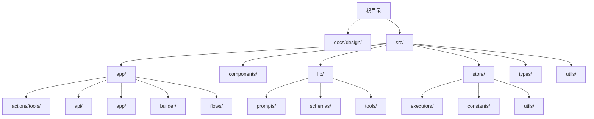
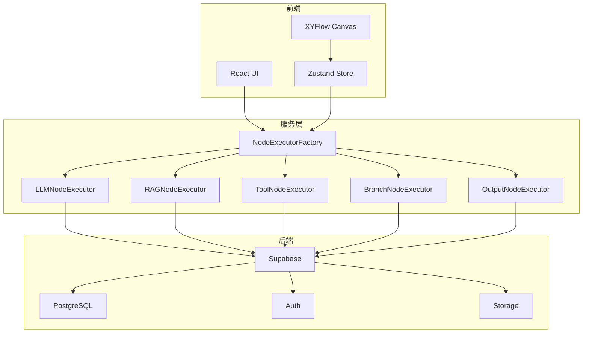
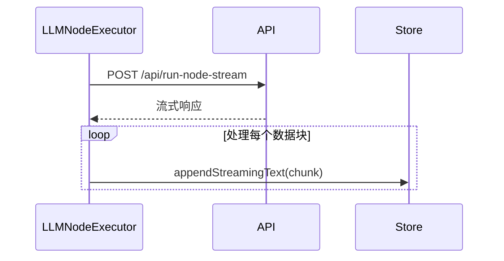
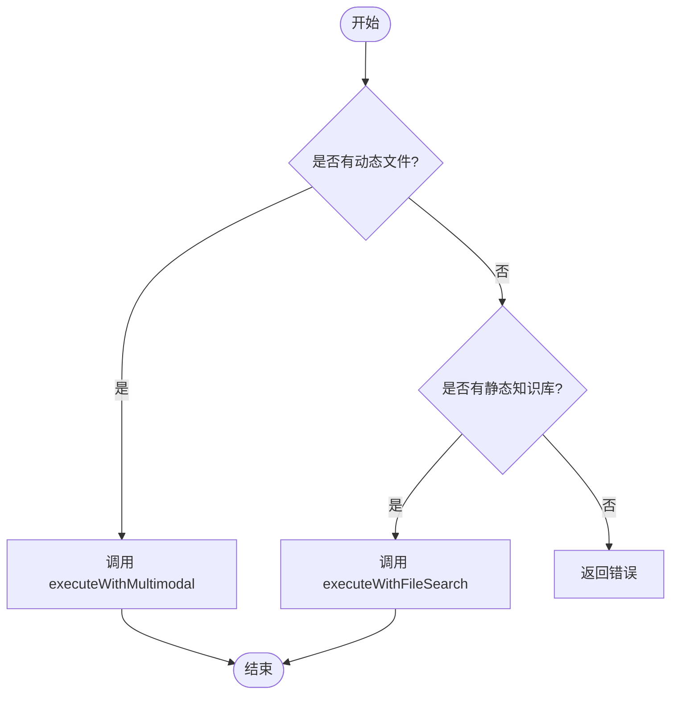
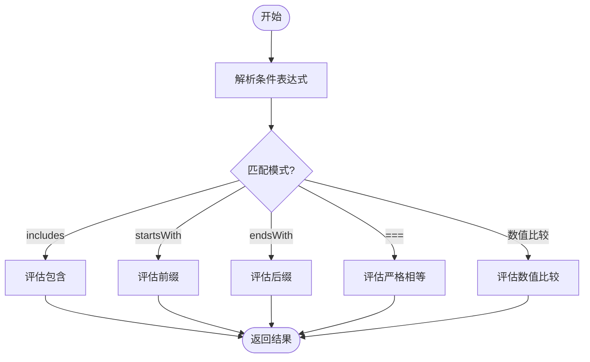
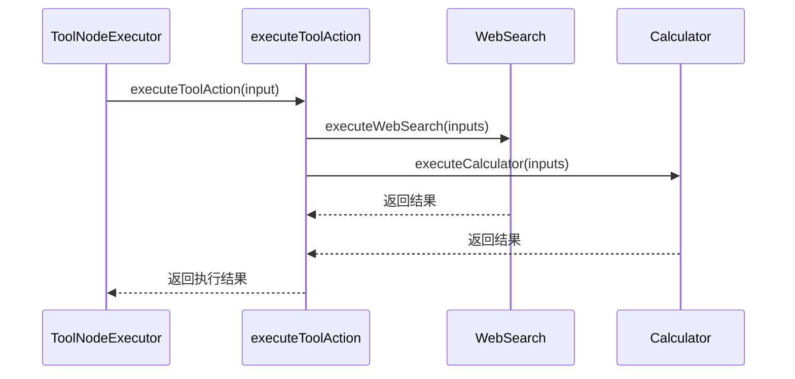
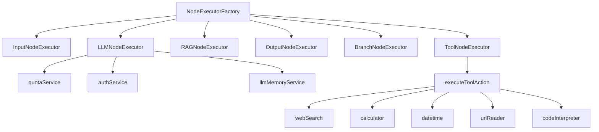

# 节点文档

<cite>
**本文档引用的文件**
- [branch节点详情.md](file://docs/design/branch节点详情.md)
- [input节点详情.md](file://docs/design/input节点详情.md)
- [llm节点详情.md](file://docs/design/llm节点详情.md)
- [output节点详情.md](file://docs/design/output节点详情.md)
- [rag节点详情.md](file://docs/design/rag节点详情.md)
- [tool节点详情.md](file://docs/design/tool节点详情.md)
- [工作流编排机制详情.md](file://docs/design/工作流编排机制详情.md)
- [workflow.ts](file://src/lib/schemas/workflow.ts)
- [BaseNodeExecutor.ts](file://src/store/executors/BaseNodeExecutor.ts)
- [NodeExecutorFactory.ts](file://src/store/executors/NodeExecutorFactory.ts)
- [InputNodeExecutor.ts](file://src/store/executors/InputNodeExecutor.ts)
- [LLMNodeExecutor.ts](file://src/store/executors/LLMNodeExecutor.ts)
- [RAGNodeExecutor.ts](file://src/store/executors/RAGNodeExecutor.ts)
- [OutputNodeExecutor.ts](file://src/store/executors/OutputNodeExecutor.ts)
- [BranchNodeExecutor.ts](file://src/store/executors/BranchNodeExecutor.ts)
- [ToolNodeExecutor.ts](file://src/store/executors/ToolNodeExecutor.ts)
- [index.ts](file://src/app/actions/tools/index.ts)
- [nodeSpecs.ts](file://src/lib/prompts/nodeSpecs.ts)
- [nodeDefaults.ts](file://src/store/utils/nodeDefaults.ts)
- [executorConfig.ts](file://src/store/constants/executorConfig.ts)
- [flow.ts](file://src/types/flow.ts)
</cite>

## 目录
1. [简介](#简介)
2. [项目结构](#项目结构)
3. [核心组件](#核心组件)
4. [架构概览](#架构概览)
5. [详细组件分析](#详细组件分析)
6. [依赖分析](#依赖分析)
7. [性能考量](#性能考量)
8. [故障排除指南](#故障排除指南)
9. [结论](#结论)

## 简介
Flash Flow 是一款革命性的 AI 工作流生成平台，允许用户通过自然语言描述需求，AI 自动生成完整的工作流。该平台支持多种节点类型，包括输入、LLM、RAG、工具、分支和输出节点，覆盖了从数据输入到智能处理再到结果输出的全流程。系统采用模块化执行器架构，确保了节点的独立性和可扩展性。

## 项目结构
该项目采用典型的 Next.js 应用结构，前端基于 React 和 TypeScript 构建，后端服务集成在 API 路由中。主要目录包括：
- `docs/design/`：包含各节点类型的详细设计文档。
- `src/app/`：Next.js 应用的核心页面和 API 路由。
- `src/components/`：可复用的 UI 组件，如流程图节点、表单控件等。
- `src/lib/`：业务逻辑库，包括提示词管理、工具注册表等。
- `src/store/`：状态管理模块，使用 Zustand 管理流程状态和执行逻辑。
- `src/types/`：类型定义，确保类型安全。
- `src/utils/`：通用工具函数。



**图示来源**
- [workflow.ts](file://src/lib/schemas/workflow.ts#L1-L38)
- [BaseNodeExecutor.ts](file://src/store/executors/BaseNodeExecutor.ts#L1-L26)

**章节来源**
- [README.md](file://README.md#L1-L466)

## 核心组件
本项目的核心组件围绕工作流的执行展开，主要包括节点执行器、状态管理、API 接口和服务层。每个节点类型都有对应的执行器，负责处理该节点的逻辑。状态管理模块维护整个工作流的状态，包括节点、边、执行状态等。API 接口提供与外部服务的交互能力，如 LLM 调用、文件上传等。

**章节来源**
- [NodeExecutorFactory.ts](file://src/store/executors/NodeExecutorFactory.ts#L1-L28)
- [flow.ts](file://src/types/flow.ts#L1-L342)

## 架构概览
Flash Flow 的架构分为前端、服务层和后端三个主要部分。前端负责用户界面和交互，服务层处理业务逻辑和节点执行，后端提供数据存储和认证服务。各层之间通过清晰的接口进行通信，确保系统的模块化和可维护性。



**图示来源**
- [NodeExecutorFactory.ts](file://src/store/executors/NodeExecutorFactory.ts#L1-L28)
- [BaseNodeExecutor.ts](file://src/store/executors/BaseNodeExecutor.ts#L1-L26)

## 详细组件分析
### 输入节点分析
输入节点负责接收用户的输入，包括文本、文件和结构化表单。其执行器 `InputNodeExecutor` 从节点数据中提取输入内容，并构建输出对象，包含 `user_input`、`files` 和 `formData`。

```mermaid
classDiagram
class InputNodeExecutor {
+execute(node : AppNode, context : FlowContext, mockData? : Record~string, unknown~) : Promise~ExecutionResult~
}
class BaseNodeExecutor {
+measureTime~T~(fn : () => Promise~T~) : Promise~{ result : T; time : number }~
+delay(ms : number) : Promise~void~
}
InputNodeExecutor --|> BaseNodeExecutor
```

**图示来源**
- [InputNodeExecutor.ts](file://src/store/executors/InputNodeExecutor.ts#L1-L39)
- [BaseNodeExecutor.ts](file://src/store/executors/BaseNodeExecutor.ts#L1-L26)

### LLM 节点分析
LLM 节点执行器 `LLMNodeExecutor` 负责调用大语言模型 API，支持流式响应和对话记忆。它根据下游输出节点的模式决定是否启用流式，并通过 `fetch` 请求与后端 API 交互。



**图示来源**
- [LLMNodeExecutor.ts](file://src/store/executors/LLMNodeExecutor.ts#L1-L502)
- [run-node-stream/route.ts](file://src/app/api/run-node-stream/route.ts)

### RAG 节点分析
RAG 节点支持静态和动态两种模式。静态模式使用预配置的知识库，动态模式则引用上游节点的文件。执行器 `RAGNodeExecutor` 根据配置选择相应的执行路径，并调用后端 API 进行语义搜索。



**图示来源**
- [RAGNodeExecutor.ts](file://src/store/executors/RAGNodeExecutor.ts#L1-L272)
- [rag/search/route.ts](file://src/app/api/rag/search/route.ts)

### 输出节点分析
输出节点支持四种模式：直接输出、选择、合并和模板。执行器 `OutputNodeExecutor` 根据配置的模式解析来源，生成最终输出内容。

```mermaid
classDiagram
class OutputNodeExecutor {
+execute(node : AppNode, context : FlowContext) : Promise~ExecutionResult~
}
class BaseNodeExecutor {
+measureTime~T~(fn : () => Promise~T~) : Promise~{ result : T; time : number }~
+delay(ms : number) : Promise~void~
}
OutputNodeExecutor --|> BaseNodeExecutor
```

**图示来源**
- [OutputNodeExecutor.ts](file://src/store/executors/OutputNodeExecutor.ts#L1-L232)
- [BaseNodeExecutor.ts](file://src/store/executors/BaseNodeExecutor.ts#L1-L26)

### 分支节点分析
分支节点执行器 `BranchNodeExecutor` 使用安全表达式引擎评估条件，支持字符串包含、前缀、后缀、数值比较和严格相等判断。它通过正则表达式白名单防止代码注入攻击。



**图示来源**
- [BranchNodeExecutor.ts](file://src/store/executors/BranchNodeExecutor.ts#L1-L254)

### 工具节点分析
工具节点执行器 `ToolNodeExecutor` 调用注册的工具执行函数，支持网页搜索、计算器、日期时间、网页读取、代码解释器等。它通过 `executeToolAction` 服务端动作与外部工具交互。



**图示来源**
- [ToolNodeExecutor.ts](file://src/store/executors/ToolNodeExecutor.ts#L1-L160)
- [index.ts](file://src/app/actions/tools/index.ts#L1-L89)

## 依赖分析
系统通过 `NodeExecutorFactory` 统一管理所有节点执行器的实例化，确保每个节点类型都有唯一的执行器。各执行器依赖于共享的上下文和状态管理，通过 `FlowContext` 传递数据。服务层组件如 `quotaService` 和 `authService` 提供配额管理和用户认证功能。



**图示来源**
- [NodeExecutorFactory.ts](file://src/store/executors/NodeExecutorFactory.ts#L1-L28)
- [LLMNodeExecutor.ts](file://src/store/executors/LLMNodeExecutor.ts#L1-L502)
- [ToolNodeExecutor.ts](file://src/store/executors/ToolNodeExecutor.ts#L1-L160)

## 性能考量
- **流式响应**：LLM 节点支持流式输出，通过 `run-node-stream` API 实现打字机效果，提升用户体验。
- **延迟优化**：执行器中设置了默认延迟，模拟执行进度，避免用户感知到卡顿。
- **内存管理**：对话记忆功能通过 `llmMemoryService` 管理，限制最大轮数，防止内存溢出。
- **并发控制**：使用乐观锁机制防止配额竞态条件，确保数据一致性。

## 故障排除指南
- **配额不足**：检查 `quotaService` 是否正确扣减配额，确保用户有足够的执行次数。
- **认证失败**：确认 `authService` 获取当前用户信息是否正常，处理未登录状态。
- **API 调用失败**：检查网络请求是否成功，处理 HTTP 错误码和响应体。
- **变量解析错误**：确保 `replaceVariables` 函数正确解析 `{{变量}}` 语法，避免空值或未定义变量。
- **循环检测**：在执行前使用 DFS 校验工作流，防止无限循环。

**章节来源**
- [LLMNodeExecutor.ts](file://src/store/executors/LLMNodeExecutor.ts#L138-L142)
- [authService.ts](file://src/services/authService.ts)
- [quotaService.ts](file://src/services/quotaService.ts)

## 结论
Flash Flow 通过模块化的设计和丰富的节点类型，实现了从自然语言到工作流的自动化生成。其核心在于灵活的执行器架构和强大的变量引用系统，使得复杂的工作流编排变得简单高效。未来可进一步优化性能，增加更多工具和模型支持，提升用户体验。