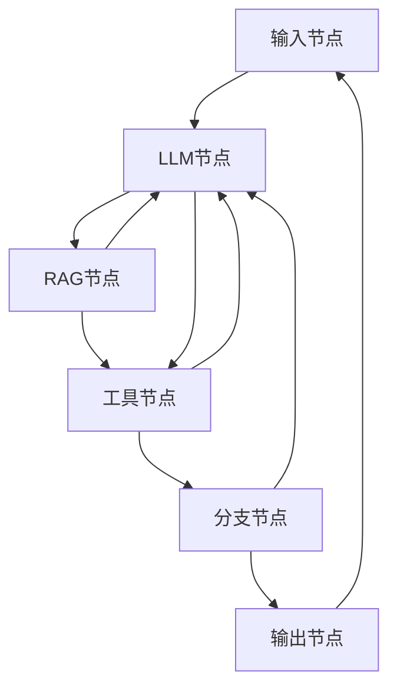
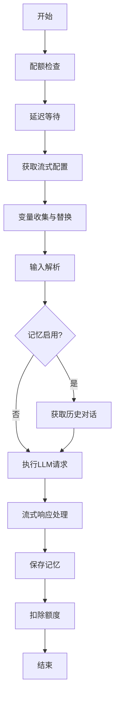

# 节点规范

<cite>
**本文档引用文件**   
- [nodeSpecs.ts](file://src/lib/prompts/nodeSpecs.ts)
- [InputNodeExecutor.ts](file://src/store/executors/InputNodeExecutor.ts)
- [LLMNodeExecutor.ts](file://src/store/executors/LLMNodeExecutor.ts)
- [RAGNodeExecutor.ts](file://src/store/executors/RAGNodeExecutor.ts)
- [BranchNodeExecutor.ts](file://src/store/executors/BranchNodeExecutor.ts)
- [OutputNodeExecutor.ts](file://src/store/executors/OutputNodeExecutor.ts)
- [ToolNodeExecutor.ts](file://src/store/executors/ToolNodeExecutor.ts)
- [BaseNodeExecutor.ts](file://src/store/executors/BaseNodeExecutor.ts)
- [NodeExecutorFactory.ts](file://src/store/executors/NodeExecutorFactory.ts)
- [flow.ts](file://src/types/flow.ts)
- [input节点详情.md](file://docs/design/input节点详情.md)
- [llm节点详情.md](file://docs/design/llm节点详情.md)
- [rag节点详情.md](file://docs/design/rag节点详情.md)
- [branch节点详情.md](file://docs/design/branch节点详情.md)
- [output节点详情.md](file://docs/design/output节点详情.md)
- [tool节点详情.md](file://docs/design/tool节点详情.md)
- [workflow.ts](file://src/lib/schemas/workflow.ts)
- [nodeDefaults.ts](file://src/store/utils/nodeDefaults.ts)
</cite>

## 目录
1. [简介](#简介)
2. [核心节点类型](#核心节点类型)
3. [节点执行架构](#节点执行架构)
4. [输入节点规范](#输入节点规范)
5. [LLM节点规范](#llm节点规范)
6. [RAG节点规范](#rag节点规范)
7. [工具节点规范](#工具节点规范)
8. [分支节点规范](#分支节点规范)
9. [输出节点规范](#输出节点规范)
10. [变量引用系统](#变量引用系统)
11. [节点配置最佳实践](#节点配置最佳实践)

## 简介

本规范文档详细描述了 Flash Flow 工作流引擎中所有节点的类型、功能、参数配置、执行逻辑和最佳实践。Flash Flow 是一个基于自然语言生成工作流的 AI 平台，其核心是通过六种基础节点的组合与连接，实现从用户需求到自动化流程的快速构建。

本文档旨在为开发者、系统维护者和高级用户提供一份权威的节点技术参考，确保对节点行为的理解一致，并指导正确、高效地构建复杂工作流。

**Section sources**
- [README.md](file://README.md#L1-L466)

## 核心节点类型

Flash Flow 工作流由六种核心节点类型构成，每种节点承担特定的职责，共同完成复杂的自动化任务。



**Diagram sources**
- [README.md](file://README.md#L144-L223)

## 节点执行架构

所有节点的执行都遵循统一的模块化架构，由执行器工厂（NodeExecutorFactory）根据节点类型创建对应的执行器（Executor）实例。

```mermaid
classDiagram
class NodeExecutor {
<<interface>>
+execute(node : AppNode, context : FlowContext, mockData? : Record) : Promise~ExecutionResult~
}
class BaseNodeExecutor {
-measureTime(fn) : Promise~{result, time}~
-delay(ms) : Promise~void~
}
class InputNodeExecutor
class LLMNodeExecutor
class RAGNodeExecutor
class ToolNodeExecutor
class BranchNodeExecutor
class OutputNodeExecutor
class NodeExecutorFactory {
+getExecutor(nodeType : NodeKind) : NodeExecutor
}
NodeExecutor <|-- BaseNodeExecutor
BaseNodeExecutor <|-- InputNodeExecutor
BaseNodeExecutor <|-- LLMNodeExecutor
BaseNodeExecutor <|-- RAGNodeExecutor
BaseNodeExecutor <|-- ToolNodeExecutor
BaseNodeExecutor <|-- BranchNodeExecutor
BaseNodeExecutor <|-- OutputNodeExecutor
NodeExecutorFactory --> InputNodeExecutor : "creates"
NodeExecutorFactory --> LLMNodeExecutor : "creates"
NodeExecutorFactory --> RAGNodeExecutor : "creates"
NodeExecutorFactory --> ToolNodeExecutor : "creates"
NodeExecutorFactory --> BranchNodeExecutor : "creates"
NodeExecutorFactory --> OutputNodeExecutor : "creates"
```

**Diagram sources**
- [BaseNodeExecutor.ts](file://src/store/executors/BaseNodeExecutor.ts#L1-L26)
- [NodeExecutorFactory.ts](file://src/store/executors/NodeExecutorFactory.ts#L1-L28)

## 输入节点规范

输入节点是工作流的起点，负责收集用户输入。它支持文本、文件和结构化表单三种输入模式。

### 核心参数

| 参数 | 类型 | 默认值 | 说明 |
|------|------|-------|------|
| `enableTextInput` | boolean | `true` | 启用文本输入框 |
| `enableFileInput` | boolean | `false` | 启用文件上传 |
| `enableStructuredForm` | boolean | `false` | 启用结构化表单 |
| `greeting` | string | `"我是您的智能助手，请告诉我您的需求。"` | 招呼语，引导用户使用 |
| `fileConfig.allowedTypes` | string[] | `["*/*"]` | 允许的文件类型 |
| `fileConfig.maxSizeMB` | number | `100` | 单文件最大体积 (MB) |
| `fileConfig.maxCount` | number | `10` | 最大文件数量 |

### 输出变量

- `{{节点名.user_input}}`: 用户输入的文本内容
- `{{节点名.files}}`: 上传的文件元数据数组
- `{{节点名.formData.字段名}}`: 结构化表单中的字段值

**Section sources**
- [nodeSpecs.ts](file://src/lib/prompts/nodeSpecs.ts#L1-L55)
- [input节点详情.md](file://docs/design/input节点详情.md#L1-L255)
- [InputNodeExecutor.ts](file://src/store/executors/InputNodeExecutor.ts#L1-L39)

## LLM节点规范

LLM节点是工作流的智能核心，负责调用大语言模型生成文本内容，支持多模型切换和对话记忆。

### 核心参数

| 参数 | 类型 | 默认值 | 说明 |
|------|------|-------|------|
| `model` | string | `deepseek-ai/DeepSeek-V3.2` | 模型选择 |
| `systemPrompt` | string | `""` | 系统提示词，支持 `{{变量}}` |
| `temperature` | number | `0.7` | 生成温度 (0.0-1.0) |
| `enableMemory` | boolean | `false` | 是否启用多轮对话记忆 |
| `memoryMaxTurns` | number | `10` | 1-20, 最大记忆轮数 |

### 可用模型

| model 值 | 说明 | 类型 |
|---------|------|------|
| `gemini-3-flash-preview` | gemini-3-Flash | **视觉/文件** ✅ |
| `deepseek-v3-2-251201` | DeepSeek-V3.2 (火山引擎) | 文本 |
| `deepseek-ai/DeepSeek-V3.2` | DeepSeek-V3.2 (SiliconFlow) | 文本 |
| `doubao-1-5-pro-32k-character-250715` | doubao-1-5-pro | 文本 |
| `doubao-seed-1-6-251015` | doubao-seed-1.6 | **视觉/文件** ✅ |
| `zai-org/GLM-4.6V` | 智谱-4.6V | **视觉** ✅ |
| `qwen-flash` | 千问模型-快速 | 文本 |

### 执行流程



**Section sources**
- [nodeSpecs.ts](file://src/lib/prompts/nodeSpecs.ts#L56-L110)
- [llm节点详情.md](file://docs/design/llm节点详情.md#L1-L325)
- [LLMNodeExecutor.ts](file://src/store/executors/LLMNodeExecutor.ts#L1-L502)

## RAG节点规范

RAG节点使用检索增强生成技术，从知识库中检索相关信息以辅助回答。

### 模式配置

| 模式 | 场景 | 配置方式 |
|------|------|------|
| **静态** | 固定知识库问答 | Builder 预上传文档 |
| **动态** | 用户上传即查询 | 引用 `{{输入节点.files}}` |

### 核心参数

| 参数 | 类型 | 默认值 | 说明 |
|------|------|-------|------|
| `maxTokensPerChunk` | number | 200 | 50-500, 静态分块大小 (tokens) |
| `maxOverlapTokens` | number | 20 | 0-100, 静态分块重叠 (tokens) |

### 输出变量

- `{{节点名.documents}}`: 检索到的文档片段列表
- `{{节点名.citations}}`: 引用来源信息

**Section sources**
- [nodeSpecs.ts](file://src/lib/prompts/nodeSpecs.ts#L110-L132)
- [rag节点详情.md](file://docs/design/rag节点详情.md#L1-L501)
- [RAGNodeExecutor.ts](file://src/store/executors/RAGNodeExecutor.ts#L1-L272)

## 工具节点规范

工具节点用于调用外部工具或执行代码，扩展工作流的能力。

### 支持的工具

| 工具 | 功能 | 参数示例 |
|------|------|------|
| 🌐 **网页搜索** | Tavily 实时搜索引擎 | `query: {{user_input}}` |
| 🧮 **计算器** | 复杂数学表达式计算 | `expression: "2+2*3"` |
| 📅 **日期时间** | 获取 / 格式化 / 日期计算 | `format: "YYYY-MM-DD"` |
| 📰 **网页读取** | 智能提取网页正文 | `url: "https://..."` |
| 🐍 **代码执行** | E2B 沙箱 Python 执行 | `code: "print('Hello!')"` |
| ⛅ **天气查询** | 和风天气实时数据 | `city: "北京"` |

### 参数类型规则

1.  **数值型参数**: 必须填入**静态数值** (Number)，**禁止**使用 `{{变量}}`。
2.  **复杂对象/数组**: 必须填入静态 JSON，**禁止**内部引用变量。

**Section sources**
- [nodeSpecs.ts](file://src/lib/prompts/nodeSpecs.ts#L133-L147)
- [tool节点详情.md](file://docs/design/tool节点详情.md#L1-L476)
- [ToolNodeExecutor.ts](file://src/store/executors/ToolNodeExecutor.ts#L1-L160)

## 分支节点规范

分支节点根据条件表达式决定工作流的走向。

### 核心参数

| 参数 | 类型 | 默认值 | 说明 |
|------|------|-------|------|
| `condition` | string | `""` | 判断条件表达式 |

### 规则

- **属性访问强制**: 必须引用节点属性 (如 `Node.data`)。
- **逻辑限制**: 仅支持**单条**表达式，严禁 `&&`, `||`。

### 语法白名单

- 字符串包含: `Node.field.includes('val')`
- 字符串前缀: `Node.field.startsWith('val')`
- 字符串后缀: `Node.field.endsWith('val')`
- 严格相等: `Node.field === 'val'`
- 数值比较: `Node.field > 10`

**Section sources**
- [nodeSpecs.ts](file://src/lib/prompts/nodeSpecs.ts#L151-L171)
- [branch节点详情.md](file://docs/design/branch节点详情.md#L1-L255)
- [BranchNodeExecutor.ts](file://src/store/executors/BranchNodeExecutor.ts#L1-L254)

## 输出节点规范

输出节点是工作流的终点，负责将最终结果呈现给用户。

### 配置模式

| 模式 | 说明 | 适用场景 |
|------|------|------|
| `direct` | 单一来源直接输出 | 单 LLM 直出 |
| `select` | 分支择优选择 | 取第一个非空结果 |
| `merge` | 多源智能合并 | 摘要 + 详情组合 |
| `template` | 自定义模板输出 | 格式化报告 |

### 输出格式

支持完整的 **Markdown 渲染**（表格、代码块、任务列表等）。

**Section sources**
- [nodeSpecs.ts](file://src/lib/prompts/nodeSpecs.ts#L173-L190)
- [output节点详情.md](file://docs/design/output节点详情.md#L1-L255)
- [OutputNodeExecutor.ts](file://src/store/executors/OutputNodeExecutor.ts#L1-L232)

## 变量引用系统

### 引用语法

| 格式 | 示例 | 说明 |
|------|------|------|
| **字段名** | `{{user_input}}` | 自动匹配上游节点 |
| **节点.字段** | `{{用户输入.user_input}}` | 精确指定节点（推荐） |
| **嵌套访问** | `{{输入.formData.stock}}` | 访问表单字段 |
| **数组索引** | `{{输入.files[0].url}}` | 访问文件属性 |

**Section sources**
- [README.md](file://README.md#L228-L240)

## 节点配置最佳实践

### 输入节点
- **文件处理**: `enableFileInput: true` + `fileConfig.allowedTypes`
- **预设选项**: `enableStructuredForm: true` + `formFields`

### LLM节点
- **用户交互**: `enableMemory: true`
- **任务处理**: `enableMemory: false`

### 工具节点
- **代码执行**: `code` 参数应引用 `{{CoderNode.response}}`，而非硬编码。

**Section sources**
- [nodeSpecs.ts](file://src/lib/prompts/nodeSpecs.ts#L17-L109)