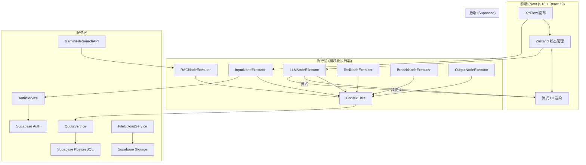
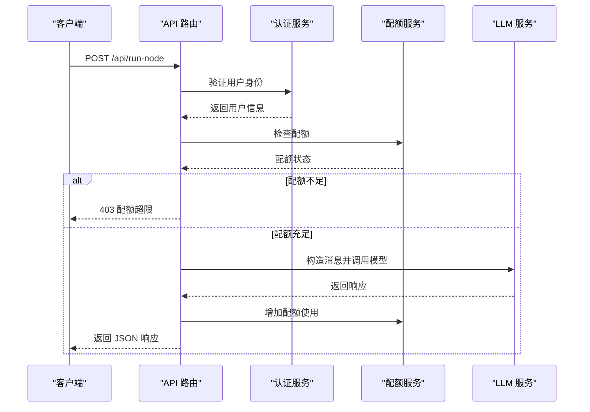
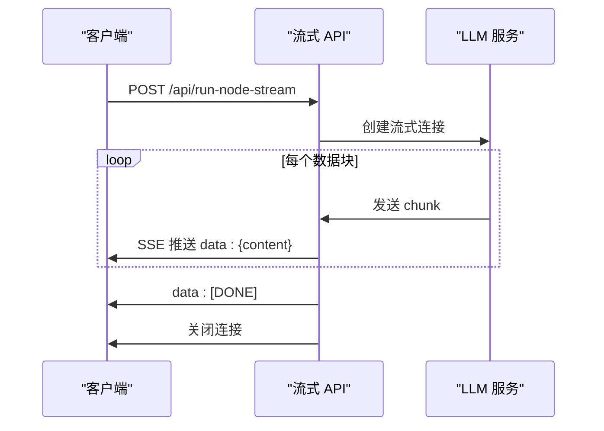
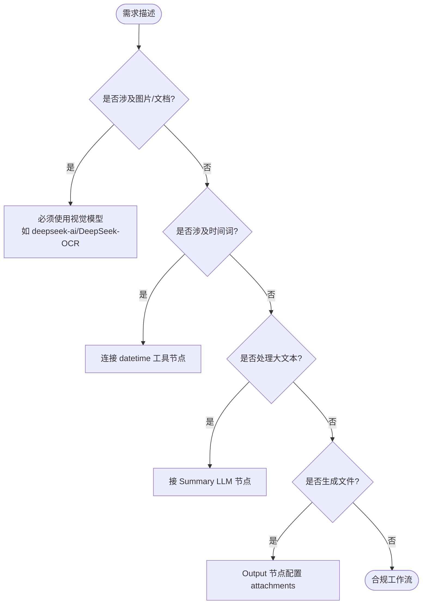
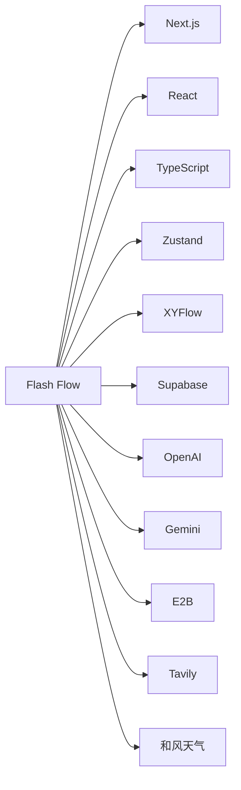

# 规则提示词

<cite>
**本文档中引用的文件**  
- [README.md](file://README.md)
- [package.json](file://package.json)
- [workflow.ts](file://src/lib/schemas/workflow.ts)
- [initialState.ts](file://src/store/constants/initialState.ts)
- [BaseNodeExecutor.ts](file://src/store/executors/BaseNodeExecutor.ts)
- [NodeExecutorFactory.ts](file://src/store/executors/NodeExecutorFactory.ts)
- [run-node/route.ts](file://src/app/api/run-node/route.ts)
- [run-node-stream/route.ts](file://src/app/api/run-node-stream/route.ts)
- [smartRules.ts](file://src/lib/prompts/smartRules.ts)
- [flow.ts](file://src/types/flow.ts)
- [calculator.ts](file://src/app/actions/tools/executors/calculator.ts)
- [codeInterpreter.ts](file://src/app/actions/tools/executors/codeInterpreter.ts)
- [flowAPI.ts](file://src/services/flowAPI.ts)
- [utils.ts](file://src/lib/utils.ts)
</cite>

## 目录
1. [简介](#简介)
2. [项目结构](#项目结构)
3. [核心组件](#核心组件)
4. [架构概览](#架构概览)
5. [详细组件分析](#详细组件分析)
6. [依赖分析](#依赖分析)
7. [性能考虑](#性能考虑)
8. [故障排除指南](#故障排除指南)
9. [结论](#结论)

## 简介
Flash Flow 是一个革命性的 AI 工作流生成平台，允许用户通过自然语言描述需求，AI 自动生成完整的工作流。该平台支持从输入、处理到输出的全流程自动化，涵盖 LLM、RAG、工具调用、分支判断等多种节点类型，实现“一句话生成工作流”的极致体验。

**Section sources**
- [README.md](file://README.md#L1-L466)

## 项目结构
项目采用 Next.js 16 构建，前端基于 React 19 和 TypeScript，使用 Zustand 进行状态管理，XYFlow 实现可视化画布。后端依托 Supabase 提供认证、数据库和文件存储服务。整体结构清晰，模块化程度高，便于扩展和维护。

```
.
├── docs/design/                  # 设计文档
├── src/
│   ├── app/                      # Next.js 应用路由
│   ├── components/               # UI 组件库
│   ├── hooks/                    # 自定义 Hook
│   ├── lib/                      # 工具函数与提示词
│   ├── services/                 # 业务服务层
│   ├── store/                    # Zustand 状态管理
│   ├── types/                    # 类型定义
│   └── utils/                    # 工具函数
├── .env.local                    # 环境变量配置
└── package.json                  # 依赖管理
```

**Section sources**
- [package.json](file://package.json#L1-L67)
- [README.md](file://README.md#L287-L370)

## 核心组件
系统核心由节点执行器（Node Executor）、API 接口、状态管理（Zustand Store）和类型系统构成。节点执行器采用工厂模式统一调度，支持输入、LLM、RAG、工具、分支和输出六类节点。API 层提供非流式与流式两种 LLM 调用方式，适配不同场景需求。

**Section sources**
- [BaseNodeExecutor.ts](file://src/store/executors/BaseNodeExecutor.ts#L1-L26)
- [NodeExecutorFactory.ts](file://src/store/executors/NodeExecutorFactory.ts#L1-L28)
- [run-node/route.ts](file://src/app/api/run-node/route.ts#L1-L105)
- [run-node-stream/route.ts](file://src/app/api/run-node-stream/route.ts#L1-L139)

## 架构概览
系统采用分层架构，从前端交互到后端服务清晰分离，确保高内聚低耦合。



**Diagram sources**
- [README.md](file://README.md#L344-L370)
- [flowAPI.ts](file://src/services/flowAPI.ts#L1-L229)

## 详细组件分析
### 节点执行器分析
系统采用抽象基类 `BaseNodeExecutor` 定义执行接口，各具体执行器继承实现。通过 `NodeExecutorFactory` 工厂类统一管理实例，实现解耦与可扩展性。

```mermaid
classDiagram
class NodeExecutor {
<<interface>>
+execute(node, context, mockData) Promise~ExecutionResult~
}
class BaseNodeExecutor {
-measureTime(fn) Promise~{result, time}~
-delay(ms) Promise~void~
}
class InputNodeExecutor
class LLMNodeExecutor
class RAGNodeExecutor
class ToolNodeExecutor
class BranchNodeExecutor
class OutputNodeExecutor
NodeExecutor <|.. BaseNodeExecutor
BaseNodeExecutor <|-- InputNodeExecutor
BaseNodeExecutor <|-- LLMNodeExecutor
BaseNodeExecutor <|-- RAGNodeExecutor
BaseNodeExecutor <|-- ToolNodeExecutor
BaseNodeExecutor <|-- BranchNodeExecutor
BaseNodeExecutor <|-- OutputNodeExecutor
class NodeExecutorFactory {
+getExecutor(nodeType) NodeExecutor
}
NodeExecutorFactory --> InputNodeExecutor : "创建"
NodeExecutorFactory --> LLMNodeExecutor : "创建"
NodeExecutorFactory --> RAGNodeExecutor : "创建"
NodeExecutorFactory --> ToolNodeExecutor : "创建"
NodeExecutorFactory --> BranchNodeExecutor : "创建"
NodeExecutorFactory --> OutputNodeExecutor : "创建"
```

**Diagram sources**
- [BaseNodeExecutor.ts](file://src/store/executors/BaseNodeExecutor.ts#L1-L26)
- [NodeExecutorFactory.ts](file://src/store/executors/NodeExecutorFactory.ts#L1-L28)

### API 接口调用流程
LLM 节点通过 API 接口调用不同服务商模型，支持动态路由与流式响应。



**Diagram sources**
- [run-node/route.ts](file://src/app/api/run-node/route.ts#L1-L105)

### 流式响应序列图
流式接口通过 ReadableStream 实时推送 LLM 输出，实现打字机效果。



**Diagram sources**
- [run-node-stream/route.ts](file://src/app/api/run-node-stream/route.ts#L1-L139)

### 智能规则逻辑
系统内置智能规则引擎，确保生成工作流的合理性与安全性。



**Diagram sources**
- [smartRules.ts](file://src/lib/prompts/smartRules.ts#L1-L23)

**Section sources**
- [smartRules.ts](file://src/lib/prompts/smartRules.ts#L1-L23)
- [flow.ts](file://src/types/flow.ts#L1-L342)

## 依赖分析
项目依赖清晰，前端使用 Radix UI 组件库与 Tailwind CSS 样式框架，AI 层集成 OpenAI、Gemini、Qwen 等多模型，工具层通过 Tavily、E2B、和风天气等 API 实现功能扩展。



**Diagram sources**
- [package.json](file://package.json#L1-L67)
- [README.md](file://README.md#L287-L340)

**Section sources**
- [package.json](file://package.json#L1-L67)
- [README.md](file://README.md#L287-L340)

## 性能考虑
- **流式响应**：采用 SSE 实现低延迟输出，提升用户体验。
- **配额控制**：服务端检查防止客户端篡改，乐观锁避免竞态条件。
- **循环检测**：执行前通过 DFS 检测工作流循环，防止无限执行。
- **沙箱执行**：代码执行器运行于 E2B 隔离环境，保障系统安全。

**Section sources**
- [run-node-stream/route.ts](file://src/app/api/run-node-stream/route.ts#L1-L139)
- [README.md](file://README.md#L430-L441)

## 故障排除指南
- **API Key 未配置**：检查 `.env.local` 是否包含对应服务商的 API Key。
- **文件上传失败**：确认 Supabase 存储配置正确，且文件大小在限制内。
- **代码执行超时**：E2B 沙箱默认 60 秒超时，复杂任务需优化代码。
- **配额同步问题**：服务端配额检查与 Supabase 实时同步，避免并发修改。

**Section sources**
- [codeInterpreter.ts](file://src/app/actions/tools/executors/codeInterpreter.ts#L1-L216)
- [flowAPI.ts](file://src/services/flowAPI.ts#L1-L229)
- [README.md](file://README.md#L430-L441)

## 结论
Flash Flow 通过自然语言驱动工作流生成，极大降低了 AI 应用开发门槛。其模块化架构、安全机制与丰富工具链，使其成为高效、可靠、易用的 AI 工作流平台。未来可扩展更多工具节点与模型支持，进一步提升自动化能力。