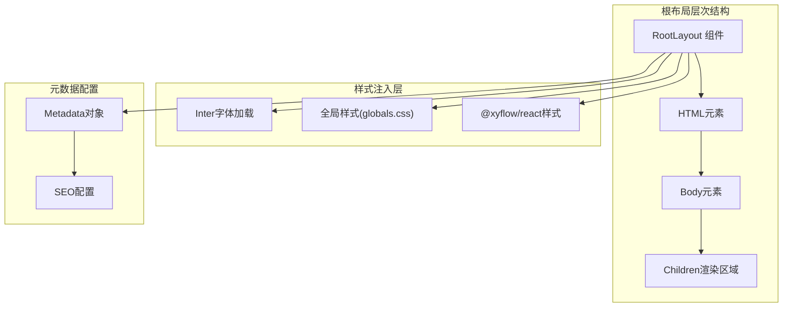
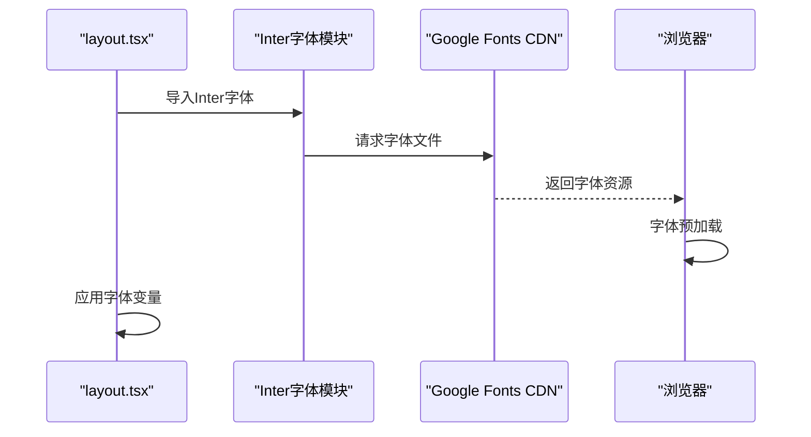
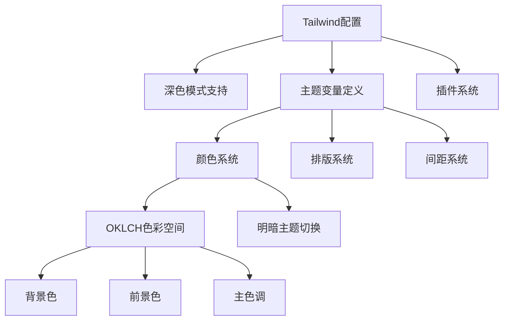
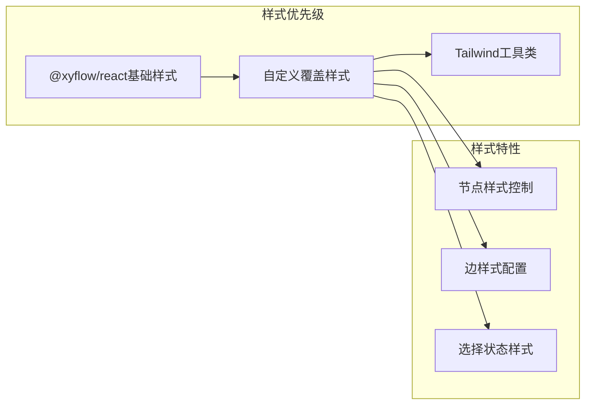
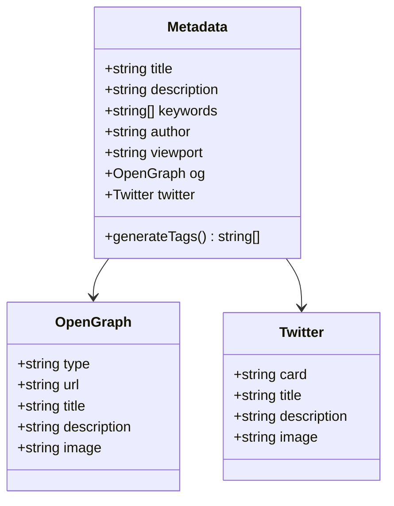
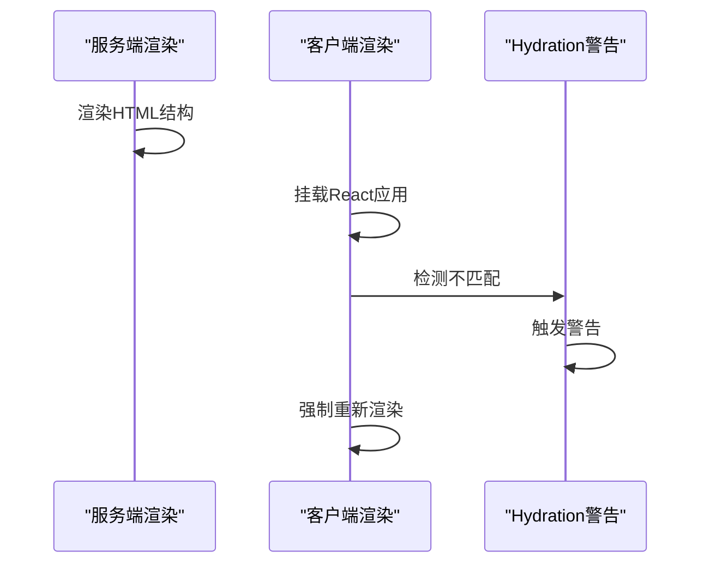
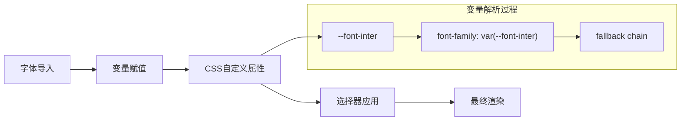
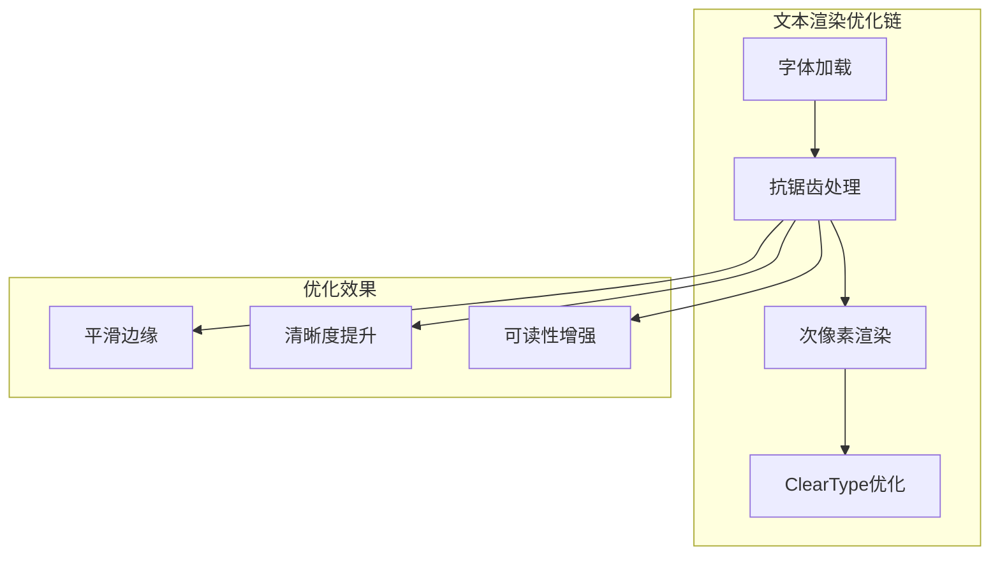
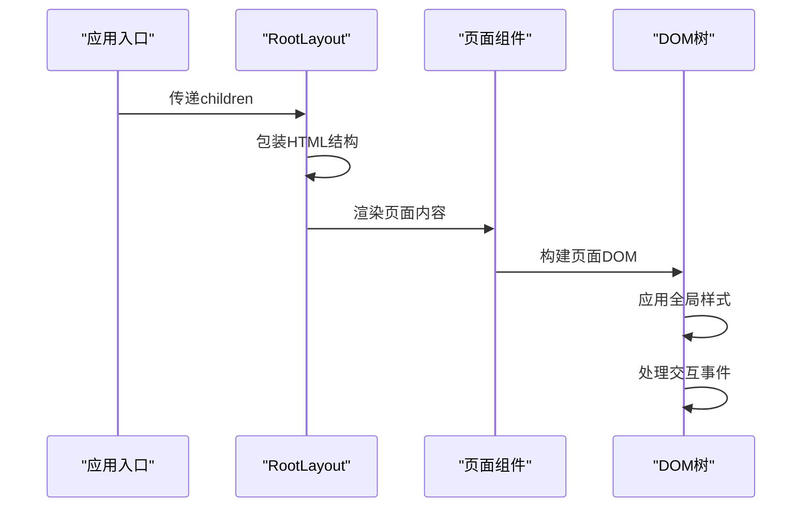

# 全局布局结构

<cite>
**本文档中引用的文件**
- [layout.tsx](file://src/app/layout.tsx)
- [globals.css](file://src/app/globals.css)
- [page.tsx](file://src/app/page.tsx)
- [next.config.ts](file://next.config.ts)
- [package.json](file://package.json)
- [tailwind.config.ts](file://tailwind.config.ts)
- [prompt-bubble.tsx](file://src/components/ui/prompt-bubble.tsx)
</cite>

## 目录
1. [项目概述](#项目概述)
2. [根布局架构](#根布局架构)
3. [字体系统配置](#字体系统配置)
4. [全局样式管理](#全局样式管理)
5. [第三方库样式集成](#第三方库样式集成)
6. [Metadata配置与SEO](#metadata配置与seo)
7. [Hydration警告处理](#hydration警告处理)
8. [CSS变量与字体应用](#css变量与字体应用)
9. [文本渲染优化](#文本渲染优化)
10. [Children渲染机制](#children渲染机制)
11. [最佳实践建议](#最佳实践建议)

## 项目概述

Flash Flow是一个基于Next.js 16.0.4构建的现代化Web应用程序，采用TypeScript开发，集成了多种先进的前端技术和设计模式。该项目的核心特色在于其精心设计的全局布局结构，该结构不仅提供了统一的视觉体验，还确保了良好的性能表现和可维护性。

## 根布局架构

Next.js应用的根布局文件位于`src/app/layout.tsx`，这是整个应用的顶层容器组件，负责定义HTML文档的基本结构和全局样式注入。

**图表来源**
- [layout.tsx](file://src/app/layout.tsx#L16-L30)

**章节来源**
- [layout.tsx](file://src/app/layout.tsx#L1-L31)

## 字体系统配置

### Inter字体加载机制

项目采用Google Fonts的Inter字体作为主要字体系统，通过Next.js内置的字体优化功能实现高性能加载。

**图表来源**
- [layout.tsx](file://src/app/layout.tsx#L6-L9)

### 字体变量配置

Inter字体通过CSS变量系统实现全局应用，这种配置方式提供了灵活的主题定制能力：

- **变量名称**: `--font-inter`
- **子集支持**: Latin字符集
- **变量绑定**: 通过`variable`属性绑定到CSS自定义属性

**章节来源**
- [layout.tsx](file://src/app/layout.tsx#L6-L9)

## 全局样式管理

### Tailwind CSS集成

项目使用Tailwind CSS v4作为核心样式框架，通过自定义配置实现主题化设计。

**图表来源**
- [tailwind.config.ts](file://tailwind.config.ts#L1-L39)
- [globals.css](file://src/app/globals.css#L6-L44)

### CSS变量系统

全局样式通过CSS自定义属性实现响应式主题管理：

| 变量类别 | 变量名称 | 默认值 | 作用范围 |
|---------|---------|--------|----------|
| 颜色系统 | `--background` | `oklch(1 0 0)` | 页面背景 |
| 颜色系统 | `--foreground` | `oklch(0.145 0 0)` | 文本颜色 |
| 排版系统 | `--font-sans` | `var(--font-inter)` | 无衬线字体 |
| 排版系统 | `--font-mono` | `var(--font-inter)` | 等宽字体 |
| 主题系统 | `--radius` | `0.75rem` | 圆角半径 |

**章节来源**
- [globals.css](file://src/app/globals.css#L6-L44)

## 第三方库样式集成

### @xyflow/react样式集成

项目集成了@xyflow/react用于可视化流程图功能，通过显式导入样式文件确保组件外观一致性。

**图表来源**
- [layout.tsx](file://src/app/layout.tsx#L4-L4)
- [globals.css](file://src/app/globals.css#L176-L201)

### 样式覆盖策略

全局样式文件中包含了针对@xyflow/react的专门样式覆盖：

- **节点样式移除**: 移除了默认的边框和阴影效果
- **选择状态优化**: 自定义了节点选中状态的视觉表现
- **交互状态控制**: 定义了hover和focus状态的样式规则

**章节来源**
- [globals.css](file://src/app/globals.css#L176-L201)

## Metadata配置与SEO

### Metadata对象结构

Next.js的Metadata配置提供了完整的SEO和社交分享支持：

**图表来源**
- [layout.tsx](file://src/app/layout.tsx#L11-L14)

### SEO影响分析

当前的Metadata配置虽然简洁，但为SEO优化奠定了基础：

- **标题优化**: 使用动态标题替换静态值
- **描述优化**: 提供清晰的应用描述
- **结构化数据**: 支持OpenGraph和Twitter卡片格式

**章节来源**
- [layout.tsx](file://src/app/layout.tsx#L11-L14)

## Hydration警告处理

### suppressHydrationWarning属性

在根布局中使用`suppressHydrationWarning`属性是为了处理客户端和服务端渲染差异问题。

**图表来源**
- [layout.tsx](file://src/app/layout.tsx#L22-L22)

### 使用场景分析

该属性主要用于以下场景：
- **时间相关的动态内容**
- **用户特定的状态信息**
- **第三方脚本的DOM操作**
- **条件渲染的边界情况**

**章节来源**
- [layout.tsx](file://src/app/layout.tsx#L22-L22)

## CSS变量与字体应用

### 字体变量绑定机制

Inter字体通过CSS变量系统实现全局应用，这种方式提供了更好的灵活性和可维护性。

**图表来源**
- [layout.tsx](file://src/app/layout.tsx#L7-L8)
- [globals.css](file://src/app/globals.css#L8-L9)

### 全局字体应用策略

通过将字体变量绑定到`inter.variable`，实现了以下优势：
- **声明式字体管理**: 在CSS中直接引用字体变量
- **主题一致性**: 确保所有组件使用相同的字体设置
- **性能优化**: 减少重复的字体加载请求

**章节来源**
- [layout.tsx](file://src/app/layout.tsx#L7-L8)
- [globals.css](file://src/app/globals.css#L8-L9)

## 文本渲染优化

### antialiased类名应用

`antialiased`类名是Tailwind CSS提供的文本抗锯齿优化工具类，用于提升文本显示质量。

**图表来源**
- [layout.tsx](file://src/app/layout.tsx#L24-L24)

### 抗锯齿技术原理

抗锯齿技术通过以下方式改善文本显示：
- **边缘平滑**: 减少像素化边缘
- **颜色混合**: 在边缘像素使用中间色调
- **分辨率适配**: 根据屏幕分辨率调整渲染参数

**章节来源**
- [layout.tsx](file://src/app/layout.tsx#L24-L24)

## Children渲染机制

### 嵌套组件渲染流程

根布局的children渲染机制体现了Next.js的流式服务器渲染特性。

**图表来源**
- [layout.tsx](file://src/app/layout.tsx#L25-L26)
- [page.tsx](file://src/app/page.tsx#L8-L85)

### 渲染生命周期

Children渲染遵循以下生命周期：
1. **服务端渲染**: 生成初始HTML标记
2. **客户端水合**: 将静态标记转换为交互式组件
3. **状态同步**: 同步服务端和客户端状态
4. **事件绑定**: 绑定用户交互事件处理器

**章节来源**
- [layout.tsx](file://src/app/layout.tsx#L25-L26)
- [page.tsx](file://src/app/page.tsx#L8-L85)

## 最佳实践建议

### 性能优化建议

1. **字体加载策略**
   - 使用字体预加载链接
   - 实现字体回退机制
   - 优化字体文件大小

2. **样式加载优化**
   - 分离关键CSS和非关键CSS
   - 使用CSS压缩和合并
   - 实现样式懒加载

3. **Hydration优化**
   - 减少Hydration警告
   - 使用Suspense边界
   - 实现渐进式水合

### 维护性改进建议

1. **代码组织**
   - 分离样式和逻辑
   - 实现样式模块化
   - 建立命名规范

2. **测试策略**
   - 添加样式回归测试
   - 实现跨浏览器兼容性测试
   - 建立视觉对比测试

3. **文档维护**
   - 更新样式变更记录
   - 维护组件使用指南
   - 建立设计系统文档

### SEO优化建议

1. **Metadata完善**
   - 添加关键词标签
   - 配置OpenGraph元数据
   - 设置Twitter卡片配置

2. **内容优化**
   - 实现动态标题生成
   - 添加结构化数据
   - 优化页面加载速度

3. **技术SEO**
   - 实现SSR/SSG
   - 优化图片和媒体文件
   - 建立内部链接结构

通过以上分析可以看出，Flash Flow项目的根布局设计体现了现代Web开发的最佳实践，从字体系统到样式管理，从SEO优化到性能考虑，都展现出了专业的开发水准和前瞻性思维。