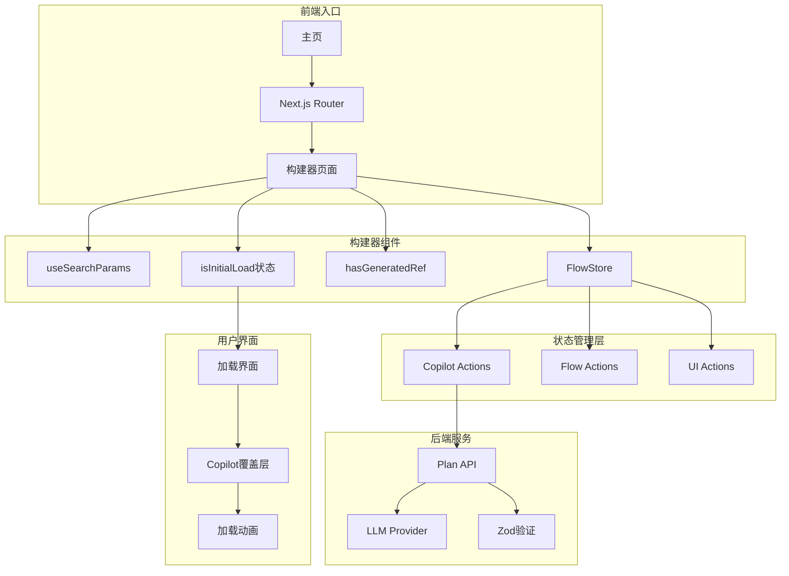
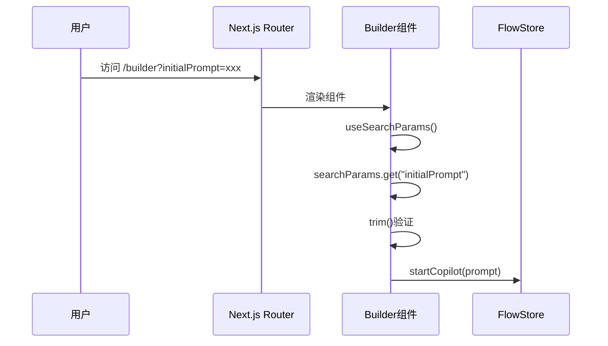
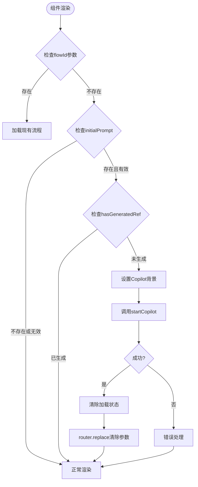
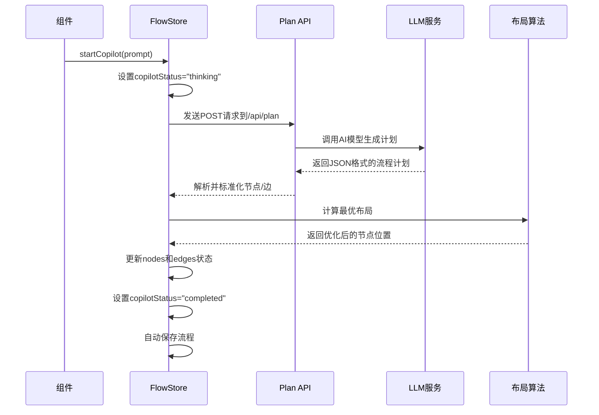
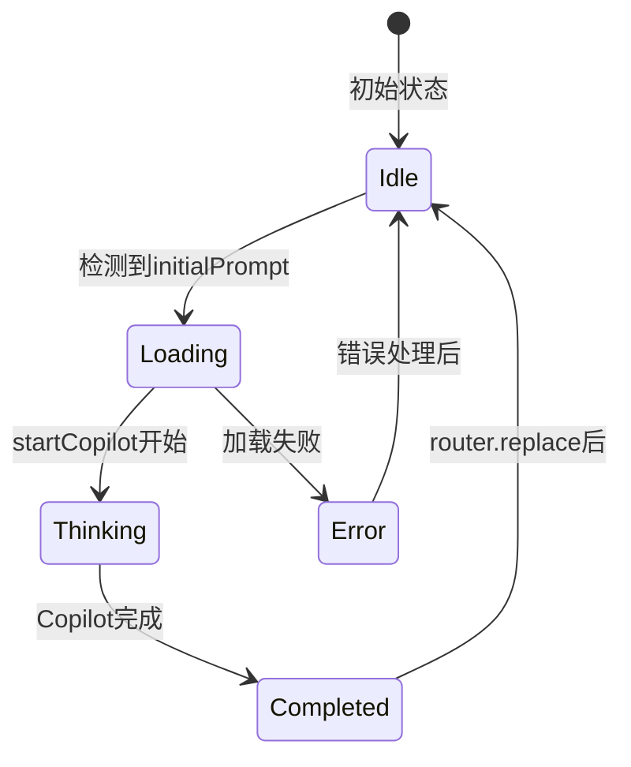
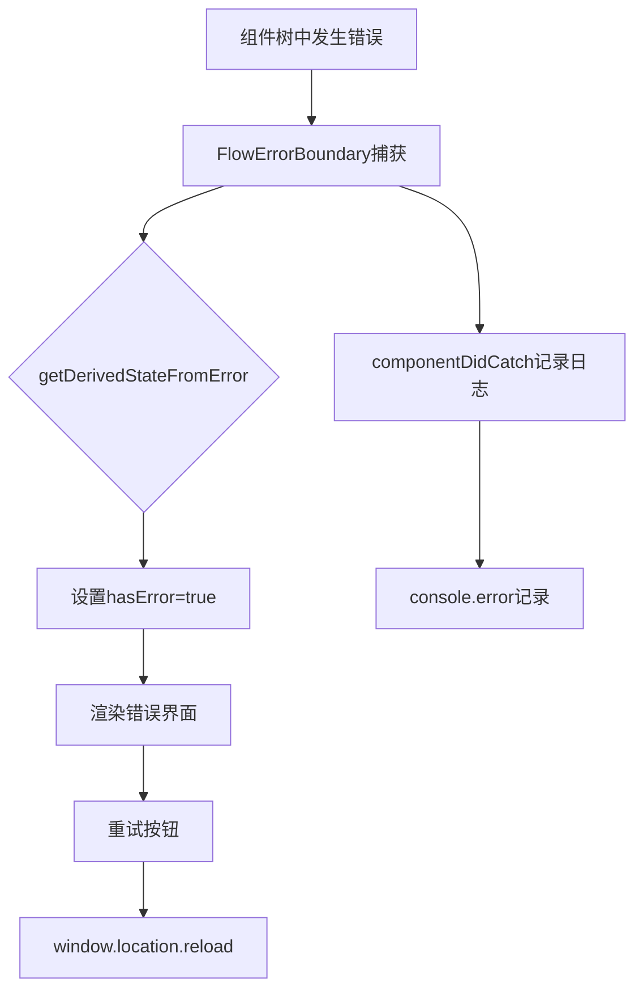

# 新建流程初始化机制深度解析

<cite>
**本文档中引用的文件**
- [page.tsx](file://src/app/builder/page.tsx)
- [homePage.tsx](file://src/app/page.tsx)
- [copilotActions.ts](file://src/store/actions/copilotActions.ts)
- [flowStore.ts](file://src/store/flowStore.ts)
- [flowAPI.ts](file://src/services/flowAPI.ts)
- [validation.ts](file://src/utils/validation.ts)
- [route.ts](file://src/app/api/plan/route.ts)
- [CopilotOverlay.tsx](file://src/components/flow/CopilotOverlay.tsx)
- [FlowErrorBoundary.tsx](file://src/components/FlowErrorBoundary.tsx)
- [initialState.ts](file://src/store/constants/initialState.ts)
- [flow.ts](file://src/types/flow.ts)
</cite>

## 目录
1. [概述](#概述)
2. [系统架构](#系统架构)
3. [参数提取与验证](#参数提取与验证)
4. [初始化流程详解](#初始化流程详解)
5. [状态管理机制](#状态管理机制)
6. [错误处理与边界](#错误处理与边界)
7. [最佳实践总结](#最佳实践总结)

## 概述

Flash Flow的新建流程初始化机制是一个精心设计的系统，通过`initialPrompt`参数实现从主页到编辑器的无缝流程生成。该机制利用React的现代特性（如`useSearchParams`、`useRef`、`useState`）和状态管理库（Zustand）构建了一个可靠的异步初始化流程。

核心功能包括：
- 通过URL参数提取初始提示
- 防止重复执行的引用控制
- 异步Copilot操作的完整生命周期管理
- 初始加载界面的状态控制
- 错误处理和用户反馈机制

## 系统架构

**图表来源**
- [page.tsx](file://src/app/builder/page.tsx#L20-L96)
- [flowStore.ts](file://src/store/flowStore.ts#L17-L32)

## 参数提取与验证

### useSearchParams的参数提取

系统通过`useSearchParams`钩子从URL中提取`initialPrompt`参数：

**图表来源**
- [page.tsx](file://src/app/builder/page.tsx#L38-L42)
- [page.tsx](file://src/app/builder/page.tsx#L73-L74)

### 参数验证逻辑

参数验证采用多层检查机制：

1. **基础存在性检查**：确保参数不为null或undefined
2. **空白字符清理**：使用`trim()`方法移除首尾空白
3. **有效性确认**：双重确认参数的有效性

**章节来源**
- [page.tsx](file://src/app/builder/page.tsx#L38-L42)
- [page.tsx](file://src/app/builder/page.tsx#L73-L74)

## 初始化流程详解

### 异步初始化触发机制

初始化流程的核心在于`useEffect`依赖数组的巧妙设计：

**图表来源**
- [page.tsx](file://src/app/builder/page.tsx#L46-L81)

### startCopilot异步操作流程

`startCopilot`方法执行完整的异步流程：

**图表来源**
- [copilotActions.ts](file://src/store/actions/copilotActions.ts#L8-L35)
- [route.ts](file://src/app/api/plan/route.ts#L6-L119)

### hasGeneratedRef引用控制

`hasGeneratedRef`是一个关键的引用变量，防止重复执行初始化逻辑：

**章节来源**
- [page.tsx](file://src/app/builder/page.tsx#L33-L34)
- [page.tsx](file://src/app/builder/page.tsx#L74-L75)

## 状态管理机制

### isInitialLoad状态控制

`isInitialLoad`状态控制初始加载界面的显示：

**图表来源**
- [page.tsx](file://src/app/builder/page.tsx#L85-L96)

### FlowStore状态结构

FlowStore维护了完整的流程状态：

| 状态字段 | 类型 | 描述 | 默认值 |
|---------|------|------|--------|
| copilotStatus | "idle" \| "thinking" \| "completed" | Copilot执行状态 | "idle" |
| copilotStep | number | 当前执行步骤 | 0 |
| copilotBackdrop | "blank" \| "overlay" | 背景样式 | "overlay" |
| nodes | AppNode[] | 流程节点列表 | [] |
| edges | AppEdge[] | 连接边列表 | [] |
| flowTitle | string | 流程标题 | "Untitled Flow" |
| currentFlowId | string \| null | 当前流程ID | null |

**章节来源**
- [flow.ts](file://src/types/flow.ts#L84-L152)
- [initialState.ts](file://src/store/constants/initialState.ts#L9-L31)

## 错误处理与边界

### FlowErrorBoundary错误边界

系统实现了专门的错误边界组件：

**图表来源**
- [FlowErrorBoundary.tsx](file://src/components/FlowErrorBoundary.tsx#L15-L64)

### 参数验证与错误处理

后端API层面也实现了严格的验证机制：

**章节来源**
- [route.ts](file://src/app/api/plan/route.ts#L11-L14)
- [validation.ts](file://src/utils/validation.ts#L3-L6)

## 最佳实践总结

### 1. 参数提取的最佳实践

- 使用`useSearchParams`进行URL参数提取
- 实施多层验证（存在性、trim、有效性）
- 使用`useState`初始化状态以避免重复计算

### 2. 引用控制机制

- 使用`useRef`防止重复执行
- 在异步操作完成后更新引用状态
- 确保引用的唯一性和稳定性

### 3. 异步操作管理

- 设置明确的加载状态
- 实现优雅的错误恢复机制
- 使用Promise链式调用来保证操作顺序

### 4. 用户体验优化

- 提供即时的视觉反馈（Copilot覆盖层）
- 实现平滑的状态转换动画
- 清除URL参数保持干净的导航历史

### 5. 错误处理策略

- 实现多层次的错误边界
- 提供有意义的错误信息
- 支持自动重试和手动重置

这个初始化机制展示了现代React应用中复杂状态管理和异步操作的最佳实践，通过精心设计的架构确保了用户体验的一致性和系统的可靠性。