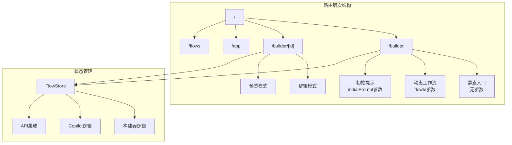
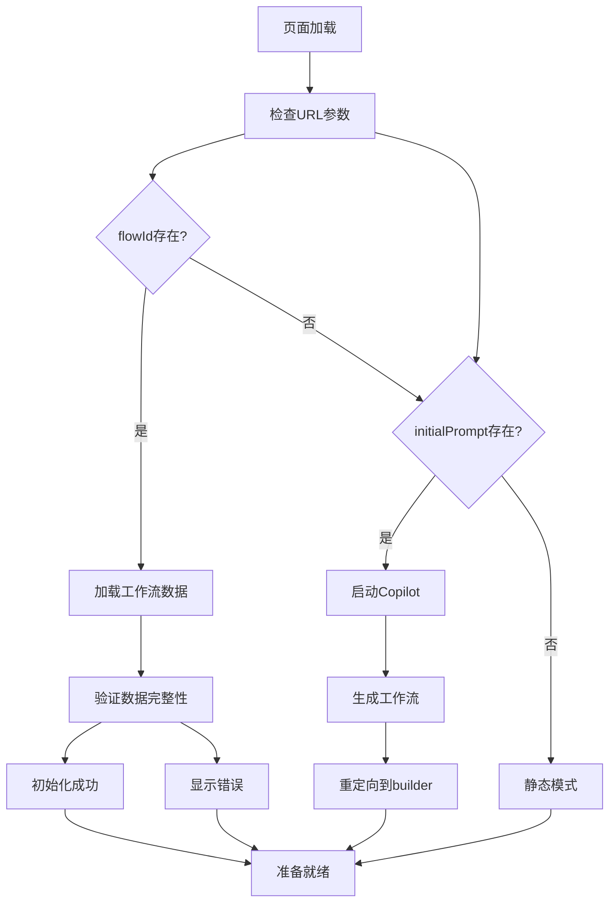
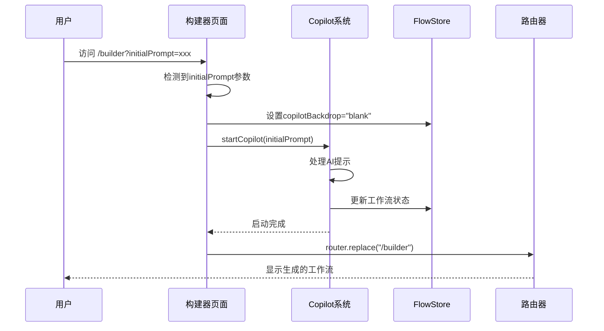
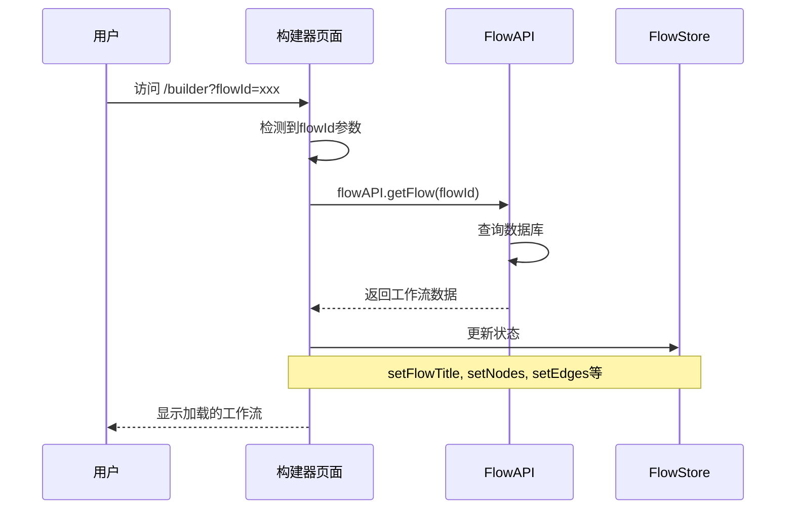
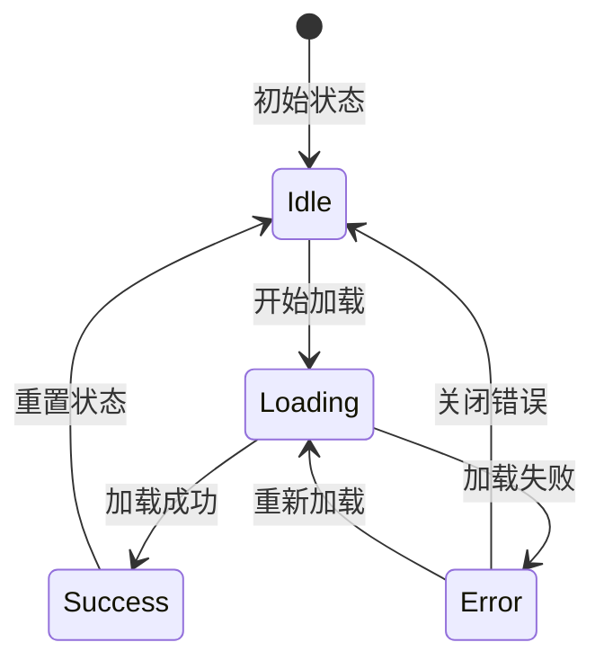
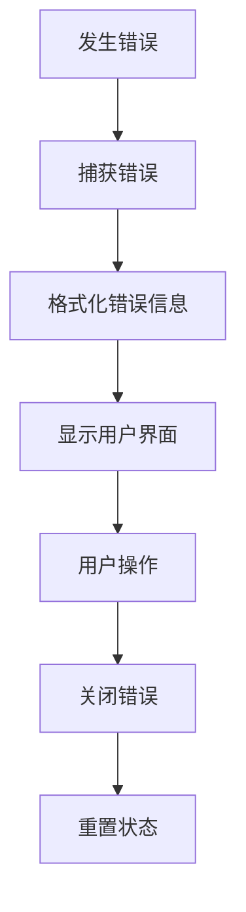
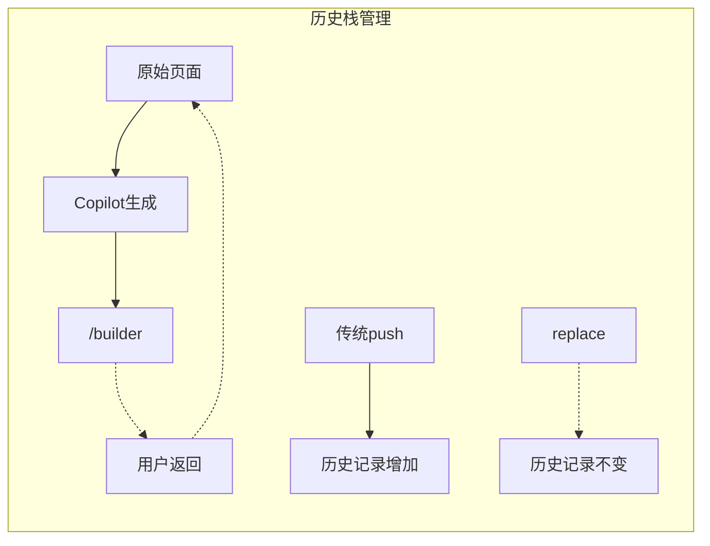
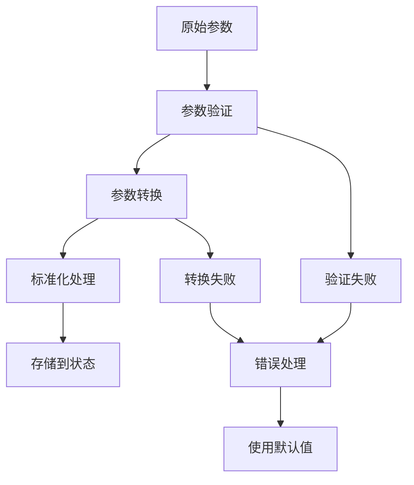

# 构建器路由系统深度解析

<cite>
**本文档引用的文件**
- [src/app/builder/page.tsx](file://src/app/builder/page.tsx)
- [src/app/builder/[id]/page.tsx](file://src/app/builder/[id]/page.tsx)
- [src/app/layout.tsx](file://src/app/layout.tsx)
- [src/store/flowStore.ts](file://src/store/flowStore.ts)
- [src/services/flowAPI.ts](file://src/services/flowAPI.ts)
- [src/components/flow/CopilotOverlay.tsx](file://src/components/flow/CopilotOverlay.tsx)
- [src/types/flow.ts](file://src/types/flow.ts)
- [src/services/chatHistoryAPI.ts](file://src/services/chatHistoryAPI.ts)
- [src/app/app/page.tsx](file://src/app/app/page.tsx)
</cite>

## 目录
1. [项目概述](#项目概述)
2. [路由架构设计](#路由架构设计)
3. [静态入口与动态参数处理](#静态入口与动态参数处理)
4. [useSearchParams参数读取机制](#usesearchparams参数读取机制)
5. [初始化流程详解](#初始化流程详解)
6. [异步加载机制](#异步加载机制)
7. [错误处理策略](#错误处理策略)
8. [URL参数变更响应式更新](#url参数变更响应式更新)
9. [页面间跳转与历史栈管理](#页面间跳转与历史栈管理)
10. [动态路由参数处理](#动态路由参数处理)
11. [最佳实践总结](#最佳实践总结)

## 项目概述

Flash Flow SaaS 是一个基于 Next.js 和 React 的可视化工作流构建平台，提供了强大的路由系统来支持多种使用场景。构建器页面作为核心功能模块，通过精心设计的路由逻辑实现了从静态入口到动态参数处理的完整用户体验。

## 路由架构设计

系统采用 Next.js 的文件系统路由模式，结合动态路由参数，构建了灵活而高效的路由架构：



**图表来源**
- [src/app/builder/page.tsx](file://src/app/builder/page.tsx#L1-L208)
- [src/app/builder/[id]/page.tsx](file://src/app/builder/[id]/page.tsx#L1-L97)

**章节来源**
- [src/app/builder/page.tsx](file://src/app/builder/page.tsx#L1-L208)
- [src/app/builder/[id]/page.tsx](file://src/app/builder/[id]/page.tsx#L1-L97)

## 静态入口与动态参数处理

构建器页面支持三种主要的访问方式，每种方式对应不同的初始化逻辑：

### 静态入口（无参数）
当用户直接访问 `/builder` 时，系统进入空闲状态，允许用户开始创建新的工作流。

### 动态参数入口
系统通过 URL 参数识别不同的初始化场景：

1. **flowId 参数**：加载现有工作流
2. **initialPrompt 参数**：基于AI提示启动Copilot



**图表来源**
- [src/app/builder/page.tsx](file://src/app/builder/page.tsx#L46-L82)

**章节来源**
- [src/app/builder/page.tsx](file://src/app/builder/page.tsx#L20-L82)

## useSearchParams参数读取机制

系统使用 Next.js 提供的 `useSearchParams` Hook 来读取和监控URL参数变化：

### 参数读取实现

```typescript
// 参数读取的核心逻辑
const searchParams = useSearchParams();
const flowId = searchParams.get("flowId");
const initialPrompt = searchParams.get("initialPrompt");
```

### 参数检测机制

系统实现了智能的参数检测机制，能够区分不同类型的初始化请求：

1. **初始提示检测**：
   ```typescript
   const initialPromptParam = searchParams.get("initialPrompt");
   const [isInitialLoad, setIsInitialLoad] = useState(() => {
       return !!(initialPromptParam && initialPromptParam.trim());
   });
   ```

2. **工作流ID检测**：
   ```typescript
   const flowId = searchParams.get("flowId");
   ```

### 参数验证策略

系统对参数进行严格的验证，确保数据安全性和用户体验：

- **空值检查**：验证参数是否存在
- **空白字符清理**：移除不必要的空白字符
- **类型转换**：确保参数符合预期类型

**章节来源**
- [src/app/builder/page.tsx](file://src/app/builder/page.tsx#L21-L42)

## 初始化流程详解

### 基于初始提示的Copilot启动

当检测到 `initialPrompt` 参数时，系统会启动Copilot AI助手来生成工作流：



**图表来源**
- [src/app/builder/page.tsx](file://src/app/builder/page.tsx#L74-L81)

### 加载现有工作流

当提供 `flowId` 参数时，系统会从数据库加载对应的工作流：



**图表来源**
- [src/app/builder/page.tsx](file://src/app/builder/page.tsx#L47-L69)

**章节来源**
- [src/app/builder/page.tsx](file://src/app/builder/page.tsx#L46-L82)

## 异步加载机制

### useEffect中的异步处理

系统使用 `useEffect` 钩子来处理异步数据加载，避免了常见的依赖循环问题：

```typescript
useEffect(() => {
    const flowId = searchParams.get("flowId");
    if (flowId) {
        // 内联异步逻辑，避免函数引用不稳定
        (async () => {
            try {
                setLoadError(null);
                const flow = await flowAPI.getFlow(flowId);
                if (flow) {
                    // 更新状态
                    setFlowTitle(flow.name);
                    setNodes(flow.data?.nodes || []);
                    setEdges(flow.data?.edges || []);
                    setCurrentFlowId(flow.id);
                } else {
                    setLoadError(`流程 ${flowId} 未找到`);
                }
            } catch (error) {
                const errorMsg = error instanceof Error ? error.message : "加载流程失败";
                setLoadError(errorMsg);
            }
        })();
        return;
    }
    // 处理initialPrompt逻辑...
}, [searchParams, setFlowTitle, setNodes, setEdges, setCurrentFlowId, startCopilot, router]);
```

### 加载状态管理

系统实现了完善的加载状态管理：

1. **加载中状态**：显示Copilot加载动画
2. **成功状态**：正常显示工作流界面
3. **错误状态**：显示错误通知



**图表来源**
- [src/app/builder/page.tsx](file://src/app/builder/page.tsx#L84-L96)

**章节来源**
- [src/app/builder/page.tsx](file://src/app/builder/page.tsx#L46-L82)

## 错误处理策略

### loadError状态管理

系统实现了专门的错误状态管理机制：

```typescript
const [loadError, setLoadError] = useState<string | null>(null);
```

### 错误类型与处理

1. **工作流不存在错误**：
   ```typescript
   if (!flow) {
       setLoadError(`流程 ${flowId} 未找到`);
       console.error(`Flow ${flowId} not found`);
   }
   ```

2. **网络请求错误**：
   ```typescript
   catch (error) {
       const errorMsg = error instanceof Error ? error.message : "加载流程失败";
       setLoadError(errorMsg);
       console.error("Failed to load flow:", error);
   }
   ```

### 用户体验优化

错误处理不仅关注技术层面，更注重用户体验：

- **视觉反馈**：固定位置的错误通知栏
- **交互设计**：可关闭的错误提示
- **日志记录**：控制台错误日志便于调试



**图表来源**
- [src/app/builder/page.tsx](file://src/app/builder/page.tsx#L101-L115)

**章节来源**
- [src/app/builder/page.tsx](file://src/app/builder/page.tsx#L34-L69)

## URL参数变更响应式更新

### 响应式参数监听

系统通过 `useEffect` 监听 `searchParams` 变化，实现响应式更新：

```typescript
useEffect(() => {
    // 参数变化时自动重新初始化
    const flowId = searchParams.get("flowId");
    const initialPrompt = searchParams.get("initialPrompt");
    
    // 根据新参数重新执行初始化逻辑
    if (flowId) {
        // 加载新工作流
    } else if (initialPrompt && initialPrompt.trim()) {
        // 启动新Copilot
    }
}, [searchParams]);
```

### 参数变更处理策略

1. **增量更新**：只更新发生变化的部分
2. **状态重置**：在参数变更时重置相关状态
3. **缓存策略**：避免重复加载相同数据

### 性能优化

为了避免不必要的重新渲染，系统采用了以下优化策略：

- **依赖数组优化**：精确控制依赖项
- **条件执行**：只有在必要时才执行初始化
- **引用稳定性**：保持函数引用稳定

**章节来源**
- [src/app/builder/page.tsx](file://src/app/builder/page.tsx#L46-L82)

## 页面间跳转与历史栈管理

### router.replace的使用

系统在Copilot完成后使用 `router.replace` 进行页面跳转：

```typescript
startCopilot(initialPrompt).then(() => {
    setIsInitialLoad(false);
    router.replace("/builder");
});
```

### 历史栈管理最佳实践

1. **不产生新历史记录**：使用 `replace` 避免历史栈膨胀
2. **状态同步**：确保状态与URL同步
3. **用户体验一致性**：保持导航行为的一致性



**图表来源**
- [src/app/builder/page.tsx](file://src/app/builder/page.tsx#L79)

### 导航控制

系统提供了多种导航控制方式：

1. **浏览器后退按钮**：`router.back()`
2. **程序化导航**：`router.push()` 和 `router.replace()`
3. **条件导航**：基于状态的智能导航

**章节来源**
- [src/app/builder/page.tsx](file://src/app/builder/page.tsx#L79,155)

## 动态路由参数处理

### 动态路由结构

系统支持两种主要的动态路由：

1. **工作流编辑路由**：`/builder/[id]`
2. **应用运行路由**：`/app`

### 参数验证与默认值

```typescript
// 参数验证示例
const flowId = searchParams.get("flowId");
if (flowId && !isValidFlowId(flowId)) {
    // 处理无效参数
    router.replace("/builder");
}

// 默认值设置
const [isEditingTitle, setIsEditingTitle] = useState(false);
const [tempTitle, setTempTitle] = useState(flowTitle || "未命名工作流");
```

### 类型安全处理

系统通过TypeScript确保参数类型安全：

```typescript
interface FlowParams {
    id?: string;
    flowId?: string;
    initialPrompt?: string;
}

// 类型安全的参数访问
const params: FlowParams = {
    id: searchParams.get("id"),
    flowId: searchParams.get("flowId"),
    initialPrompt: searchParams.get("initialPrompt")
};
```

### 参数转换与标准化



**图表来源**
- [src/app/builder/[id]/page.tsx](file://src/app/builder/[id]/page.tsx#L16-L34)

**章节来源**
- [src/app/builder/[id]/page.tsx](file://src/app/builder/[id]/page.tsx#L1-L97)

## 最佳实践总结

### 路由设计原则

1. **单一职责**：每个路由专注于特定的功能场景
2. **参数驱动**：通过URL参数控制初始化行为
3. **状态同步**：保持UI状态与URL参数同步
4. **错误恢复**：提供优雅的错误处理和恢复机制

### 性能优化策略

1. **懒加载**：按需加载组件和数据
2. **缓存机制**：合理利用浏览器缓存
3. **防抖处理**：避免频繁的状态更新
4. **内存管理**：及时清理不需要的资源

### 用户体验优化

1. **加载指示**：提供清晰的加载状态反馈
2. **错误提示**：友好的错误信息和解决方案
3. **导航控制**：直观的页面导航和返回机制
4. **响应式设计**：适应不同设备和屏幕尺寸

### 可维护性考虑

1. **代码分离**：清晰的逻辑分层和组件划分
2. **类型安全**：充分利用TypeScript的类型系统
3. **测试覆盖**：关键功能的单元测试和集成测试
4. **文档完善**：详细的API文档和使用指南

这个构建器路由系统展示了现代Web应用中复杂路由逻辑的最佳实践，通过精心设计的参数处理、状态管理和错误处理机制，为用户提供了流畅而可靠的工作流构建体验。