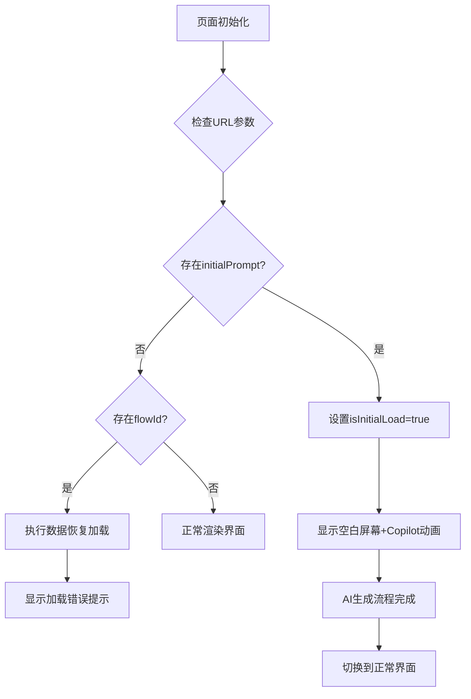
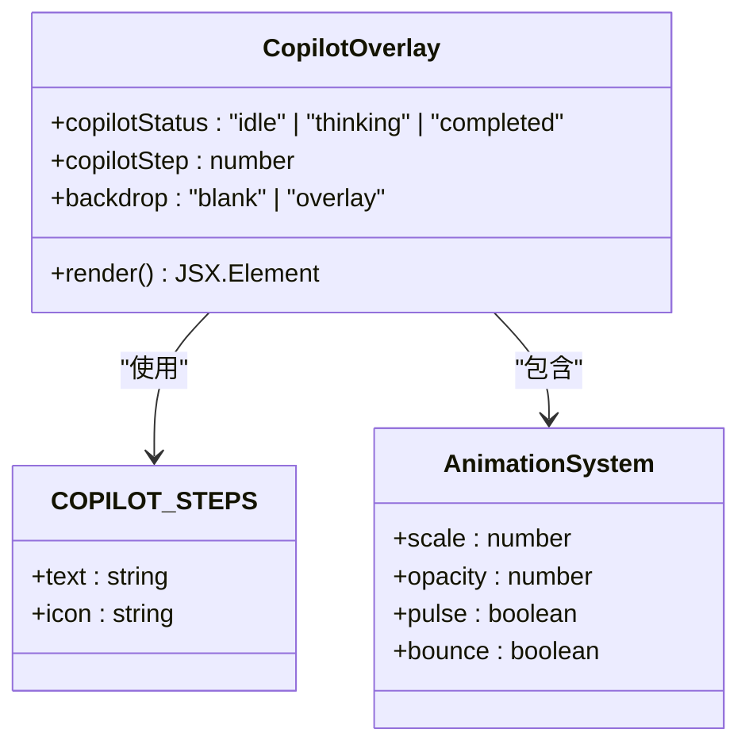
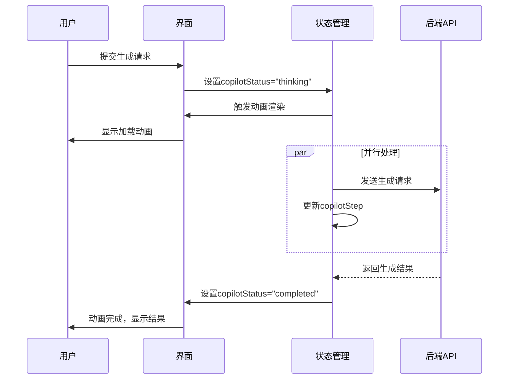
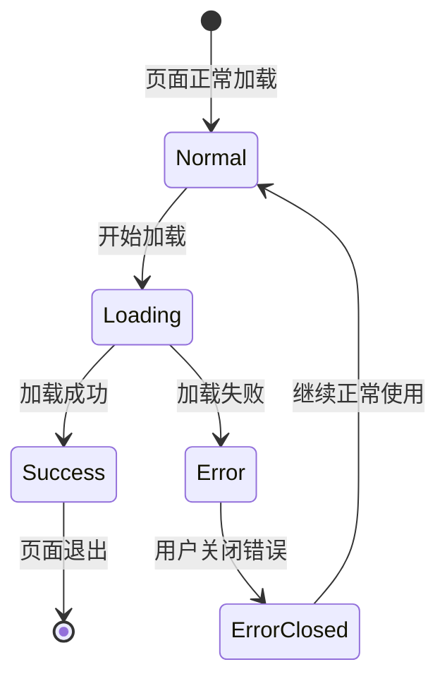
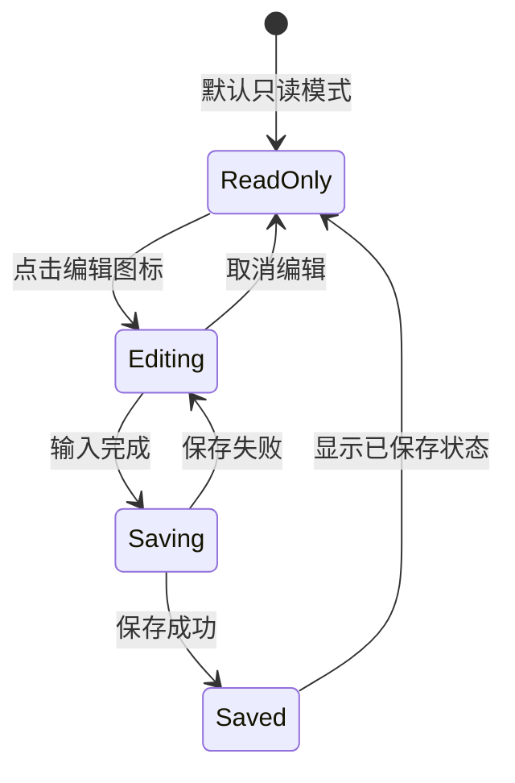

# UI响应与加载状态反馈

<cite>
**本文档引用的文件**
- [src/app/builder/page.tsx](file://src/app/builder/page.tsx)
- [src/app/builder/[id]/page.tsx](file://src/app/builder/[id]/page.tsx)
- [src/components/flow/CopilotOverlay.tsx](file://src/components/flow/CopilotOverlay.tsx)
- [src/components/builder/AppModeOverlay.tsx](file://src/components/builder/AppModeOverlay.tsx)
- [src/store/flowStore.ts](file://src/store/flowStore.ts)
- [src/services/flowAPI.ts](file://src/services/flowAPI.ts)
- [src/types/flow.ts](file://src/types/flow.ts)
- [src/store/constants/copilotSteps.ts](file://src/store/constants/copilotSteps.ts)
</cite>

## 目录
1. [引言](#引言)
2. [项目架构概览](#项目架构概览)
3. [初始加载状态管理](#初始加载状态管理)
4. [Copilot加载动画系统](#copilot加载动画系统)
5. [两种加载场景对比分析](#两种加载场景对比分析)
6. [错误处理与用户反馈机制](#错误处理与用户反馈机制)
7. [标题编辑模式与状态指示](#标题编辑模式与状态指示)
8. [UI设计原则与用户体验](#ui设计原则与用户体验)
9. [性能优化考虑](#性能优化考虑)
10. [总结](#总结)

## 引言

Flash Flow SaaS平台的用户界面响应系统是一个精心设计的状态管理系统，它通过多种视觉反馈机制向用户提供清晰的加载状态信息。该系统主要包含两个核心组件：基于`isInitialLoad`状态的初始加载动画控制，以及CopilotOverlay组件提供的智能生成过程可视化反馈。本文档将深入分析这些机制如何协同工作，为用户提供流畅且知情的交互体验。

## 项目架构概览

系统的UI响应架构采用分层设计，从底层的状态管理到顶层的视觉呈现形成完整的反馈链路：

```mermaid
graph TB
subgraph "用户界面层"
A[Builder页面] --> B[CopilotOverlay]
C[Builder[ID]页面] --> D[标题编辑器]
E[AppModeOverlay] --> F[应用模式界面]
end
subgraph "状态管理层"
G[FlowStore] --> H[加载状态]
G --> I[Copilot状态]
G --> J[保存状态]
G --> K[错误状态]
end
subgraph "服务层"
L[flowAPI] --> M[数据获取]
N[planAPI] --> O[AI生成]
end
A --> G
C --> G
E --> G
G --> L
G --> N
```

**图表来源**
- [src/app/builder/page.tsx](file://src/app/builder/page.tsx#L1-L208)
- [src/app/builder/[id]/page.tsx](file://src/app/builder/[id]/page.tsx#L1-L97)
- [src/store/flowStore.ts](file://src/store/flowStore.ts#L1-L131)

## 初始加载状态管理

### isInitialLoad状态的作用机制

系统通过`isInitialLoad`状态精确控制初始加载动画的显示时机。这个状态的计算逻辑体现了对用户体验的细致考量：



**图表来源**
- [src/app/builder/page.tsx](file://src/app/builder/page.tsx#L37-L82)

### 状态初始化逻辑

`isInitialLoad`状态的初始化采用了延迟计算策略，确保在页面首次渲染时就能准确判断加载类型：

**章节来源**
- [src/app/builder/page.tsx](file://src/app/builder/page.tsx#L37-L42)

这种设计避免了不必要的状态更新，同时确保了加载动画的及时显示。

## Copilot加载动画系统

### CopilotOverlay组件架构

CopilotOverlay组件是系统中最复杂的视觉反馈组件，它通过多阶段的状态变化向用户展示AI生成流程的进度：



**图表来源**
- [src/components/flow/CopilotOverlay.tsx](file://src/components/flow/CopilotOverlay.tsx#L1-L64)
- [src/store/constants/copilotSteps.ts](file://src/store/constants/copilotSteps.ts#L1-L7)

### 多阶段加载进度指示

系统定义了四个明确的AI生成阶段，每个阶段都有对应的视觉标识：

| 阶段 | 文本描述 | 图标类型 | 动画效果 |
|------|----------|----------|----------|
| 0 | 正在解析用户意图... | Sparkles | 脉冲动画 |
| 1 | 正在匹配功能节点 (RAG, LLM)... | Search | 缩放过渡 |
| 2 | 正在构建拓扑逻辑... | GitGraph | 淡入淡出 |
| 3 | 正在生成参数配置... | Settings | 渐变效果 |

**章节来源**
- [src/store/constants/copilotSteps.ts](file://src/store/constants/copilotSteps.ts#L1-L7)

### 视觉反馈的层次结构

CopilotOverlay采用了分层的视觉设计，确保在不同场景下都能提供清晰的反馈：



**图表来源**
- [src/store/actions/copilotActions.ts](file://src/store/actions/copilotActions.ts#L8-L35)
- [src/components/flow/CopilotOverlay.tsx](file://src/components/flow/CopilotOverlay.tsx#L19-L62)

## 两种加载场景对比分析

### 带initialPrompt的智能生成加载

这种场景的特点是立即显示加载动画，给用户即时的视觉反馈：


**图表来源**
- [src/app/builder/page.tsx](file://src/app/builder/page.tsx#L84-L96)

### 纯flowId的数据恢复加载

这种场景专注于数据恢复，优先保证内容的正确加载：


**图表来源**
- [src/app/builder/page.tsx](file://src/app/builder/page.tsx#L44-L72)

### 场景差异对比表

| 特征 | 智能生成加载 | 数据恢复加载 |
|------|-------------|-------------|
| 初始状态 | 白色背景+动画 | 直接显示错误提示 |
| 用户感知 | 即时反馈 | 错误即知 |
| 加载时间 | 可能较长 | 相对稳定 |
| 错误处理 | 动态调整 | 静态提示 |
| 界面切换 | 自动重定向 | 手动关闭 |

**章节来源**
- [src/app/builder/page.tsx](file://src/app/builder/page.tsx#L84-L116)

## 错误处理与用户反馈机制

### loadError状态管理

系统实现了完善的错误处理机制，确保用户即使遇到问题也能继续操作：



**图表来源**
- [src/app/builder/page.tsx](file://src/app/builder/page.tsx#L34-L35)

### 错误提示的设计原则

错误提示采用了非侵入式的设计理念：

1. **位置选择**: 固定在顶部中央，不影响其他操作
2. **交互设计**: 提供关闭按钮，用户可自主清除
3. **视觉层次**: 使用红色警示色，但保持友好外观
4. **信息完整性**: 显示具体错误信息，便于用户理解

**章节来源**
- [src/app/builder/page.tsx](file://src/app/builder/page.tsx#L101-L116)

### 错误恢复机制

系统提供了多种错误恢复途径：

- **自动重试**: 对于临时性错误，系统会尝试重新加载
- **手动关闭**: 用户可以主动关闭错误提示
- **状态重置**: 错误清除后，系统状态恢复正常

## 标题编辑模式与状态指示

### 内容可编辑模式

在Builder[ID]页面中，系统提供了灵活的标题编辑机制：



**图表来源**
- [src/app/builder/[id]/page.tsx](file://src/builder/[id]/page.tsx#L16-L42)

### 标题编辑器的双模式设计

系统采用了两种不同的标题编辑方式，适应不同的使用场景：

| 编辑模式 | 适用场景 | 交互特点 | 视觉反馈 |
|----------|----------|----------|----------|
| contentEditable | 快速修改 | 直接点击编辑 | 实时光标显示 |
| input框 | 精确输入 | 明确的确认流程 | 明确的提交按钮 |

**章节来源**
- [src/app/builder/[id]/page.tsx](file://src/app/builder/[id]/page.tsx#L52-L81)

### 保存状态指示器

系统通过状态指示器增强了用户对数据持久化状态的感知：

```mermaid
flowchart TD
A[用户修改标题] --> B[触发保存状态]
B --> C{保存状态}
C --> |saving| D[显示"正在保存…"]
C --> |saved| E[显示"已保存"]
D --> F[保存完成]
F --> C
E --> G[等待下次修改]
G --> B
```

**图表来源**
- [src/app/builder/[id]/page.tsx](file://src/app/builder/[id]/page.tsx#L83-L84)

**章节来源**
- [src/app/builder/[id]/page.tsx](file://src/app/builder/[id]/page.tsx#L12-L13)

## UI设计原则与用户体验

### 信息传达与界面简洁性的平衡

系统在设计上严格遵循了以下原则：

1. **最小化干扰**: 加载动画和错误提示都采用了半透明背景，不完全遮挡界面
2. **渐进式披露**: 只在需要时显示相关信息，避免界面拥挤
3. **一致性**: 所有状态指示都采用统一的设计语言
4. **可逆性**: 用户可以随时关闭不需要的信息

### 视觉层次设计

系统通过多种视觉元素建立清晰的层次结构：


**图表来源**
- [src/app/builder/page.tsx](file://src/app/builder/page.tsx#L101-L116)
- [src/components/flow/CopilotOverlay.tsx](file://src/components/flow/CopilotOverlay.tsx#L26-L27)

### 响应式反馈设计

系统针对不同网络条件和用户行为提供了相应的反馈：

- **快速响应**: 对于本地操作，反馈几乎实时
- **渐进式加载**: 对于远程请求，提供逐步的进度指示
- **错误优雅降级**: 在网络异常时提供友好的错误信息

## 性能优化考虑

### 状态更新优化

系统采用了多种性能优化策略：

1. **防抖处理**: 标题保存操作使用了800ms的防抖机制
2. **条件渲染**: 只有在需要时才渲染加载动画和错误提示
3. **内存管理**: 及时清理定时器和事件监听器

**章节来源**
- [src/store/flowStore.ts](file://src/store/flowStore.ts#L15-L75)

### 渲染性能优化

- **虚拟滚动**: 对于大量节点的流程，采用虚拟滚动技术
- **懒加载**: 非关键资源采用懒加载策略
- **动画优化**: 使用CSS变换而非重排来实现动画效果

## 总结

Flash Flow SaaS平台的UI响应与加载状态反馈系统展现了现代Web应用的最佳实践。通过精心设计的状态管理、多层次的视觉反馈和人性化的错误处理，系统为用户提供了流畅且知情的交互体验。

### 关键设计亮点

1. **智能的加载状态管理**: 通过`isInitialLoad`状态精确控制不同场景下的加载行为
2. **分层的视觉反馈系统**: CopilotOverlay提供了丰富的进度指示，而错误提示则保持简洁友好
3. **灵活的编辑模式**: 标题编辑器支持多种交互方式，满足不同用户的使用习惯
4. **优雅的错误处理**: 错误信息以非侵入的方式呈现，不影响用户的正常操作

### 用户体验价值

这套UI响应系统不仅提升了应用的可用性，更重要的是建立了用户对系统行为的预期。用户能够清楚地了解当前的操作状态，知道何时需要等待，何时可以继续操作，从而获得更加愉悦的使用体验。

通过持续的优化和改进，这套系统将继续为用户提供更加优秀的交互体验，成为现代Web应用设计的典范。