# Zustand状态同步与数据注入

<cite>
**本文档引用的文件**
- [src/store/flowStore.ts](file://src/store/flowStore.ts)
- [src/app/builder/page.tsx](file://src/app/builder/page.tsx)
- [src/app/builder/[id]/page.tsx](file://src/app/builder/[id]/page.tsx)
- [src/services/flowAPI.ts](file://src/services/flowAPI.ts)
- [src/store/constants/initialState.ts](file://src/store/constants/initialState.ts)
- [src/types/flow.ts](file://src/types/flow.ts)
- [src/components/flow/FlowCanvas.tsx](file://src/components/flow/FlowCanvas.tsx)
- [src/components/flow/Sidebar.tsx](file://src/components/flow/Sidebar.tsx)
- [src/store/actions/nodeActions.ts](file://src/store/actions/nodeActions.ts)
- [src/store/actions/edgeActions.ts](file://src/store/actions/edgeActions.ts)
</cite>

## 目录
1. [概述](#概述)
2. [项目架构分析](#项目架构分析)
3. [Zustand Store核心结构](#zustand-store核心结构)
4. [状态同步机制详解](#状态同步机制详解)
5. [数据注入过程分析](#数据注入过程分析)
6. [组件渲染同步](#组件渲染同步)
7. [状态更新链路](#状态更新链路)
8. [竞态条件与解决方案](#竞态条件与解决方案)
9. [性能优化策略](#性能优化策略)
10. [最佳实践建议](#最佳实践建议)

## 概述

Flash Flow SaaS应用采用Zustand作为全局状态管理解决方案，实现了高效的UI状态同步机制。当用户成功获取流程数据后，系统通过一系列精心设计的状态更新操作，确保FlowCanvas、Sidebar等组件能够实时响应数据变化，保持UI与数据的一致性。

本文档深入解析了从flowAPI响应对象提取nodes和edges字段并注入store的完整过程，详细说明了setCurrentFlowId的作用机制，以及如何避免不必要的重复渲染。

## 项目架构分析

### 状态管理层次结构

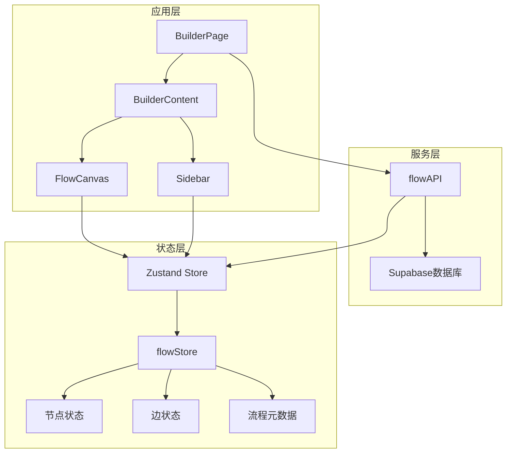

**图表来源**
- [src/app/builder/page.tsx](file://src/app/builder/page.tsx#L1-L208)
- [src/store/flowStore.ts](file://src/store/flowStore.ts#L1-L131)
- [src/services/flowAPI.ts](file://src/services/flowAPI.ts#L1-L240)

### 核心组件关系图

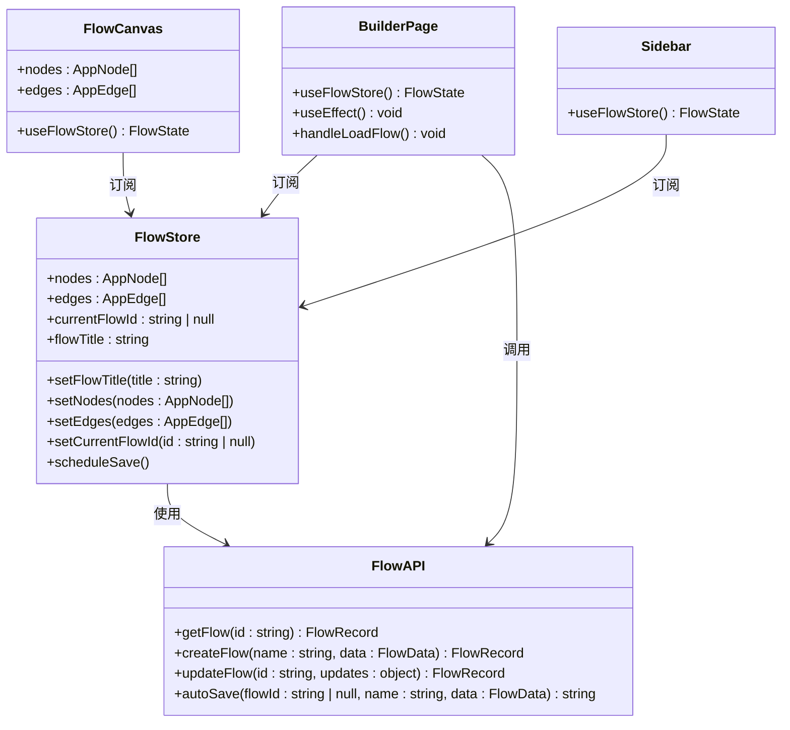

**图表来源**
- [src/store/flowStore.ts](file://src/store/flowStore.ts#L17-L131)
- [src/services/flowAPI.ts](file://src/services/flowAPI.ts#L10-L240)
- [src/app/builder/page.tsx](file://src/app/builder/page.tsx#L20-L82)

## Zustand Store核心结构

### 初始状态定义

Zustand store采用模块化的设计模式，将不同功能的状态分离到独立的action模块中：

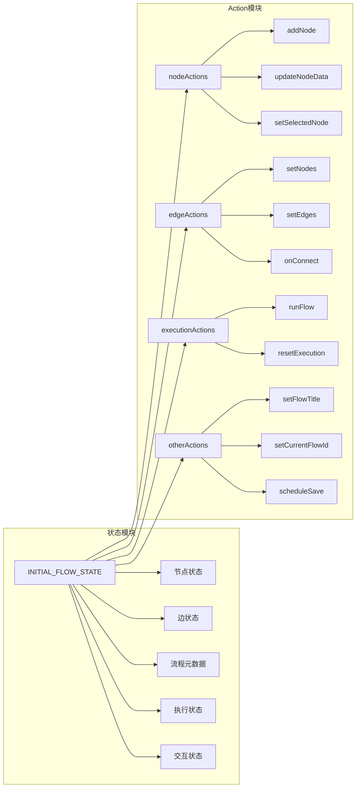

**图表来源**
- [src/store/constants/initialState.ts](file://src/store/constants/initialState.ts#L1-L32)
- [src/store/flowStore.ts](file://src/store/flowStore.ts#L17-L32)

**章节来源**
- [src/store/flowStore.ts](file://src/store/flowStore.ts#L17-L131)
- [src/store/constants/initialState.ts](file://src/store/constants/initialState.ts#L1-L32)

### 关键状态字段说明

| 状态字段 | 类型 | 默认值 | 作用 |
|---------|------|--------|------|
| `nodes` | `AppNode[]` | `[]` | 存储所有流程节点的数据 |
| `edges` | `AppEdge[]` | `[]` | 存储节点间的连接关系 |
| `currentFlowId` | `string \| null` | `null` | 当前编辑流程的唯一标识符 |
| `flowTitle` | `string` | `"Untitled Flow"` | 流程标题，支持实时编辑 |
| `saveStatus` | `"saved" \| "saving"` | `"saved"` | 保存状态指示器 |

## 状态同步机制详解

### setFlowTitle状态更新

`setFlowTitle`方法展示了Zustand状态更新的核心机制：

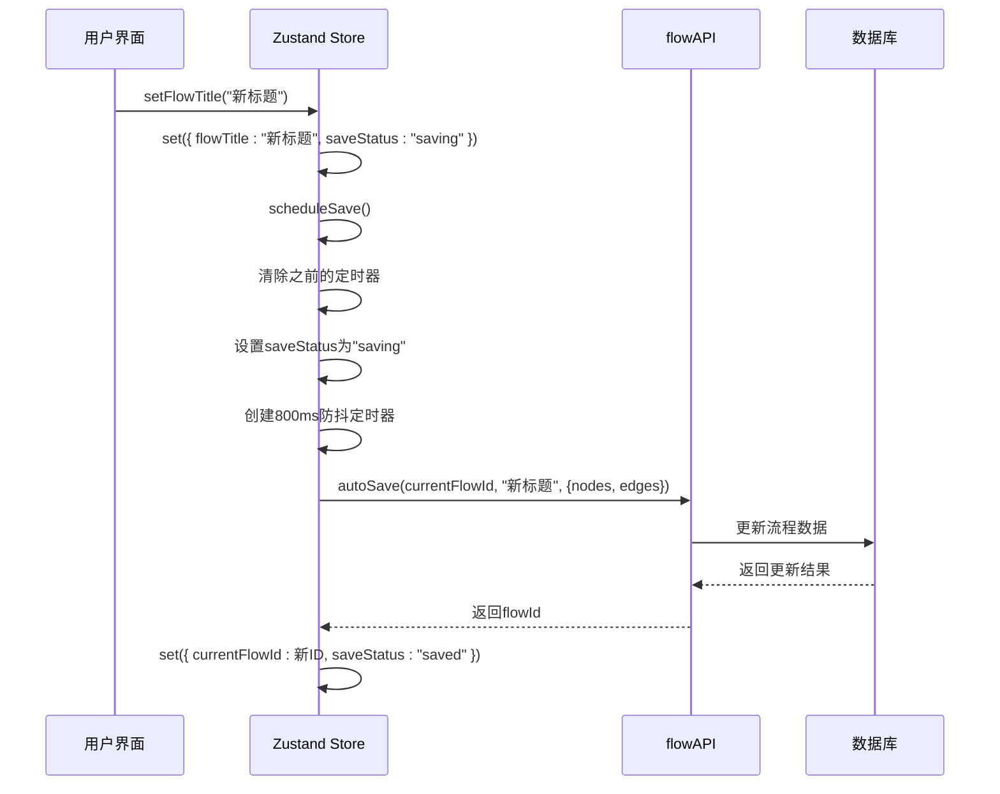

**图表来源**
- [src/store/flowStore.ts](file://src/store/flowStore.ts#L34-L37)
- [src/store/flowStore.ts](file://src/store/flowStore.ts#L50-L74)

### setNodes和setEdges状态更新

这两个方法直接更新store中的节点和边数组，触发相关组件的重新渲染：

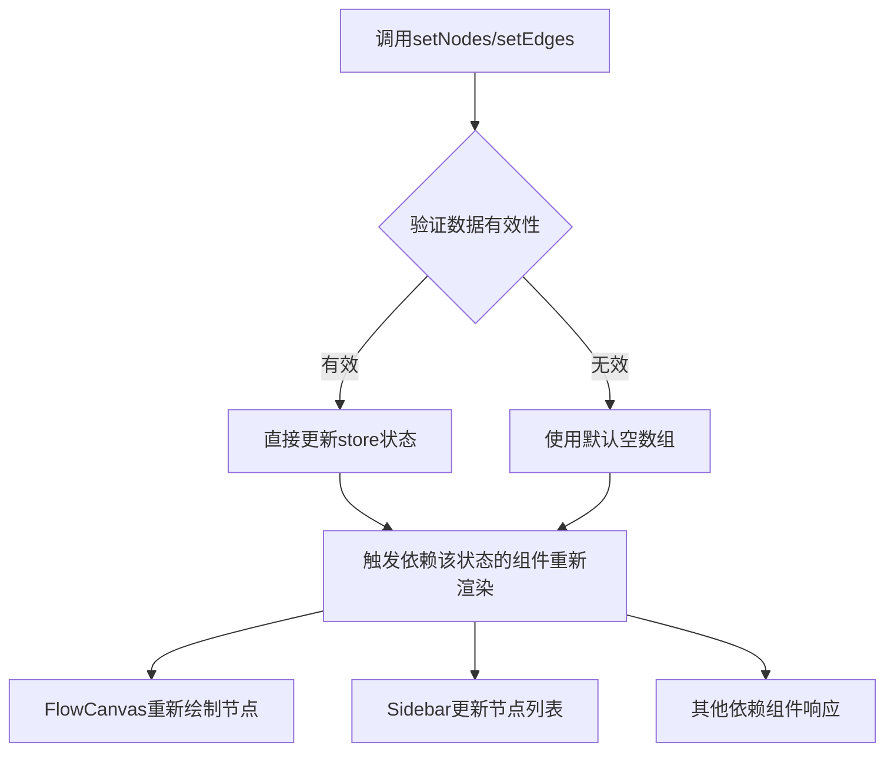

**图表来源**
- [src/store/actions/edgeActions.ts](file://src/store/actions/edgeActions.ts#L73-L78)
- [src/store/actions/nodeActions.ts](file://src/store/actions/nodeActions.ts#L9-L19)

**章节来源**
- [src/store/flowStore.ts](file://src/store/flowStore.ts#L34-L44)
- [src/store/actions/edgeActions.ts](file://src/store/actions/edgeActions.ts#L73-L78)

### setCurrentFlowId的作用机制

`setCurrentFlowId`方法不仅记录当前上下文，还影响后续保存操作的语义：

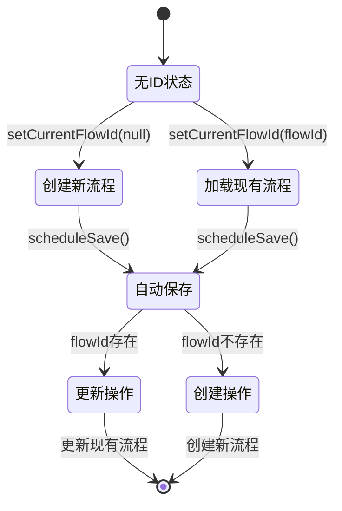

**图表来源**
- [src/store/flowStore.ts](file://src/store/flowStore.ts#L43)
- [src/services/flowAPI.ts](file://src/services/flowAPI.ts#L211-L224)

## 数据注入过程分析

### 从flowAPI响应对象提取数据

在`BuilderPage`组件中，系统从flowAPI响应对象中提取nodes和edges字段并注入store：

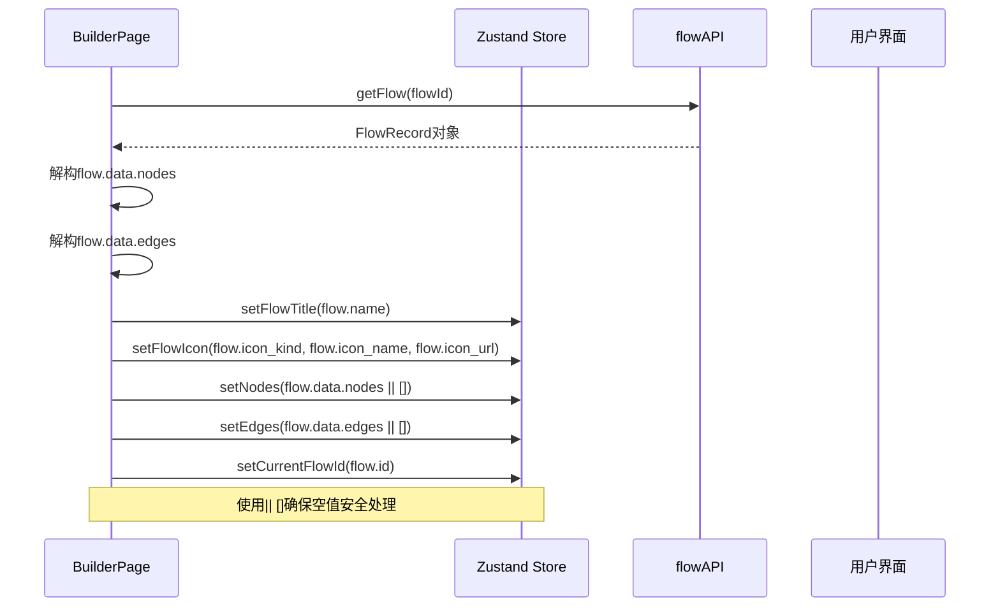

**图表来源**
- [src/app/builder/page.tsx](file://src/app/builder/page.tsx#L46-L71)
- [src/services/flowAPI.ts](file://src/services/flowAPI.ts#L75-L101)

### 空值处理策略

系统采用多种策略确保空值的安全处理：

| 场景 | 处理方式 | 实现位置 |
|------|----------|----------|
| nodes为空 | 使用`flow.data.nodes || []` | [src/app/builder/page.tsx](file://src/app/builder/page.tsx#L58) |
| edges为空 | 使用`flow.data.edges || []` | [src/app/builder/page.tsx](file://src/app/builder/page.tsx#L59) |
| icon字段为空 | 使用可选链操作符 | [src/app/builder/page.tsx](file://src/app/builder/page.tsx#L57) |
| 流程不存在 | 显示错误提示 | [src/app/builder/page.tsx](file://src/app/builder/page.tsx#L61-L64) |

**章节来源**
- [src/app/builder/page.tsx](file://src/app/builder/page.tsx#L46-L71)
- [src/services/flowAPI.ts](file://src/services/flowAPI.ts#L75-L101)

## 组件渲染同步

### FlowCanvas组件订阅机制

FlowCanvas组件通过useFlowStore订阅节点和边状态的变化：

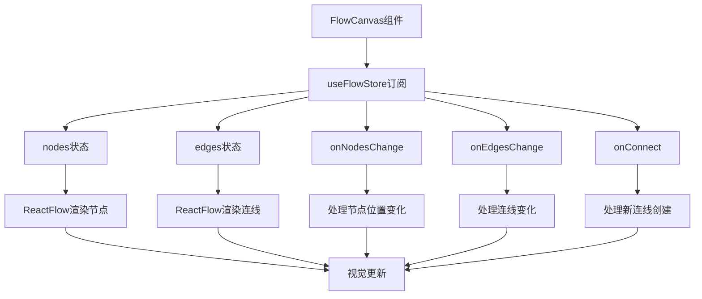

**图表来源**
- [src/components/flow/FlowCanvas.tsx](file://src/components/flow/FlowCanvas.tsx#L12-L20)

### Sidebar组件响应机制

Sidebar组件同样订阅store状态，但主要关注节点类型的分类显示：

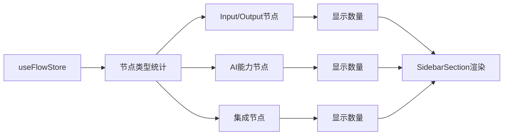

**图表来源**
- [src/components/flow/Sidebar.tsx](file://src/components/flow/Sidebar.tsx#L56-L142)

**章节来源**
- [src/components/flow/FlowCanvas.tsx](file://src/components/flow/FlowCanvas.tsx#L12-L82)
- [src/components/flow/Sidebar.tsx](file://src/components/flow/Sidebar.tsx#L56-L142)

## 状态更新链路

### 完整的状态更新流程

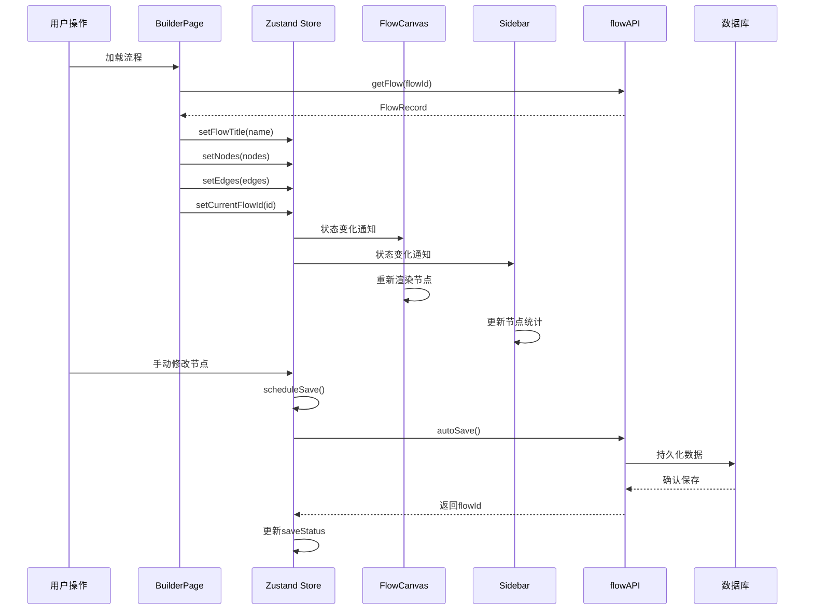

**图表来源**
- [src/app/builder/page.tsx](file://src/app/builder/page.tsx#L46-L71)
- [src/store/flowStore.ts](file://src/store/flowStore.ts#L50-L74)

### 状态更新的时间线

| 时间点 | 操作 | 影响范围 |
|--------|------|----------|
| T0 | 页面加载 | 初始化store状态 |
| T1 | API调用完成 | 更新flowTitle、nodes、edges |
| T2 | 状态更新完成 | 触发组件重新渲染 |
| T3 | 用户交互 | 更新节点数据 |
| T4 | 防抖保存 | 自动持久化到数据库 |
| T5 | 保存确认 | 更新saveStatus |

**章节来源**
- [src/app/builder/page.tsx](file://src/app/builder/page.tsx#L46-L71)
- [src/store/flowStore.ts](file://src/store/flowStore.ts#L50-L74)

## 竞态条件与解决方案

### 主要竞态条件分析

1. **异步加载竞态条件**
   - 问题：多个异步请求同时进行可能导致状态不一致
   - 解决方案：使用useEffect的依赖数组控制加载时机

2. **自动保存竞态条件**
   - 问题：频繁的状态更新可能触发多次保存
   - 解决方案：实现800ms防抖机制

3. **状态同步竞态条件**
   - 问题：store状态更新与组件渲染可能存在时间差
   - 解决方案：使用Zustand的原子性更新特性

### 现有解决方案

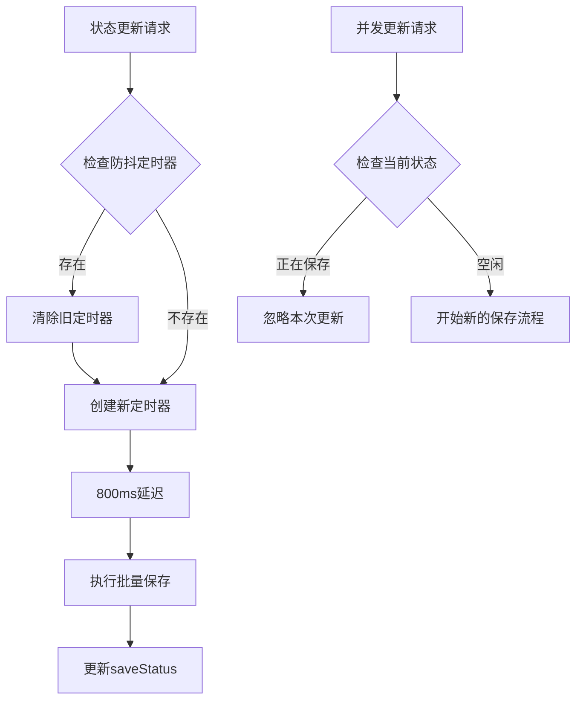

**图表来源**
- [src/store/flowStore.ts](file://src/store/flowStore.ts#L50-L74)

**章节来源**
- [src/store/flowStore.ts](file://src/store/flowStore.ts#L50-L74)

## 性能优化策略

### 避免不必要的重复渲染

1. **状态选择优化**
   ```typescript
   // 只订阅需要的状态
   const nodes = useFlowStore((s) => s.nodes);
   const edges = useFlowStore((s) => s.edges);
   ```

2. **防抖机制**
   - 自动保存采用800ms防抖
   - 避免频繁的数据库写入操作

3. **状态更新批处理**
   - 将多个状态更新合并为单次操作
   - 减少组件重新渲染次数

### 内存管理优化

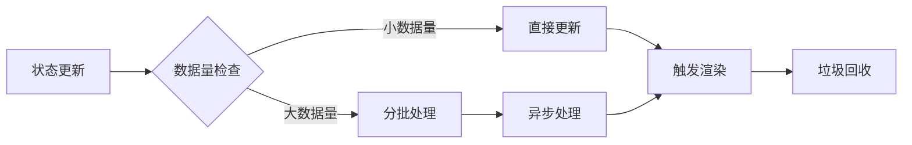

**章节来源**
- [src/store/flowStore.ts](file://src/store/flowStore.ts#L50-L74)

## 最佳实践建议

### 状态管理最佳实践

1. **单一数据源原则**
   - 所有流程数据集中存储在Zustand store中
   - 避免组件内部维护局部状态

2. **不可变更新原则**
   - 使用Zustand的原子性更新
   - 避免直接修改store中的对象引用

3. **异步操作封装**
   - 将API调用封装到store action中
   - 统一处理错误和加载状态

### 开发调试建议

1. **状态监控**
   - 使用React DevTools监控store状态变化
   - 设置断点观察状态更新路径

2. **性能分析**
   - 监控组件重新渲染频率
   - 识别性能瓶颈点

3. **错误处理**
   - 实现完善的错误边界
   - 提供友好的用户反馈

### 代码组织建议

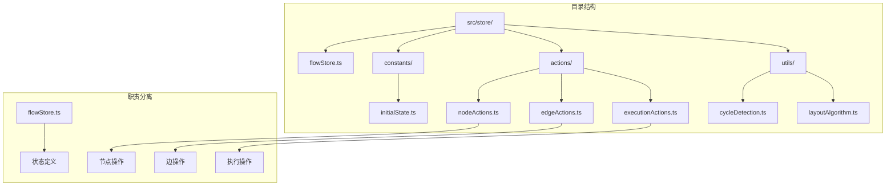

**图表来源**
- [src/store/flowStore.ts](file://src/store/flowStore.ts#L1-L131)
- [src/store/constants/initialState.ts](file://src/store/constants/initialState.ts#L1-L32)

通过以上深入分析，我们可以看到Flash Flow SaaS应用的Zustand状态管理系统设计精良，通过合理的架构设计和优化策略，实现了高效的状态同步和数据注入机制。这种设计不仅保证了UI与数据的一致性，还提供了良好的开发体验和运行性能。