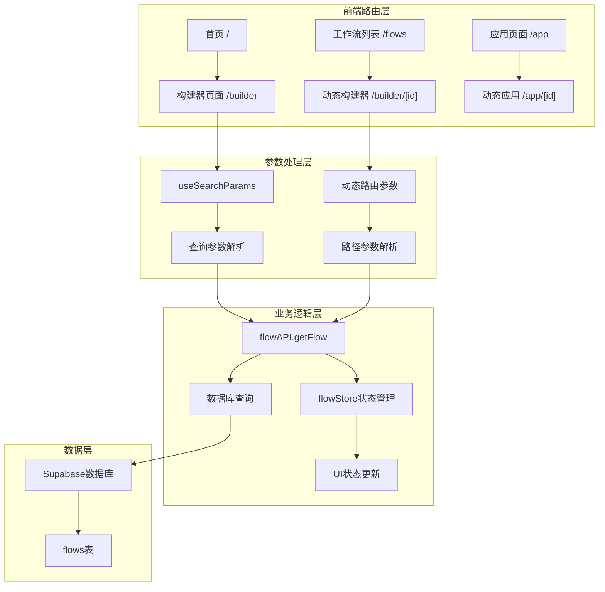
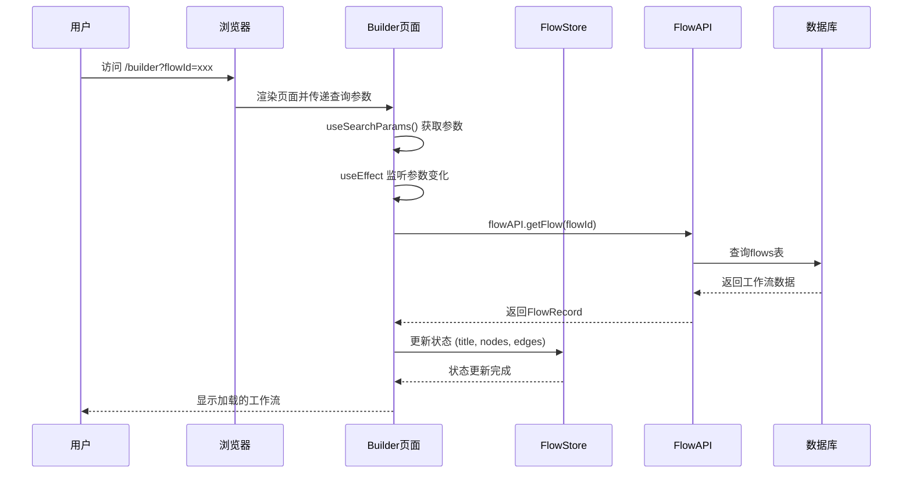
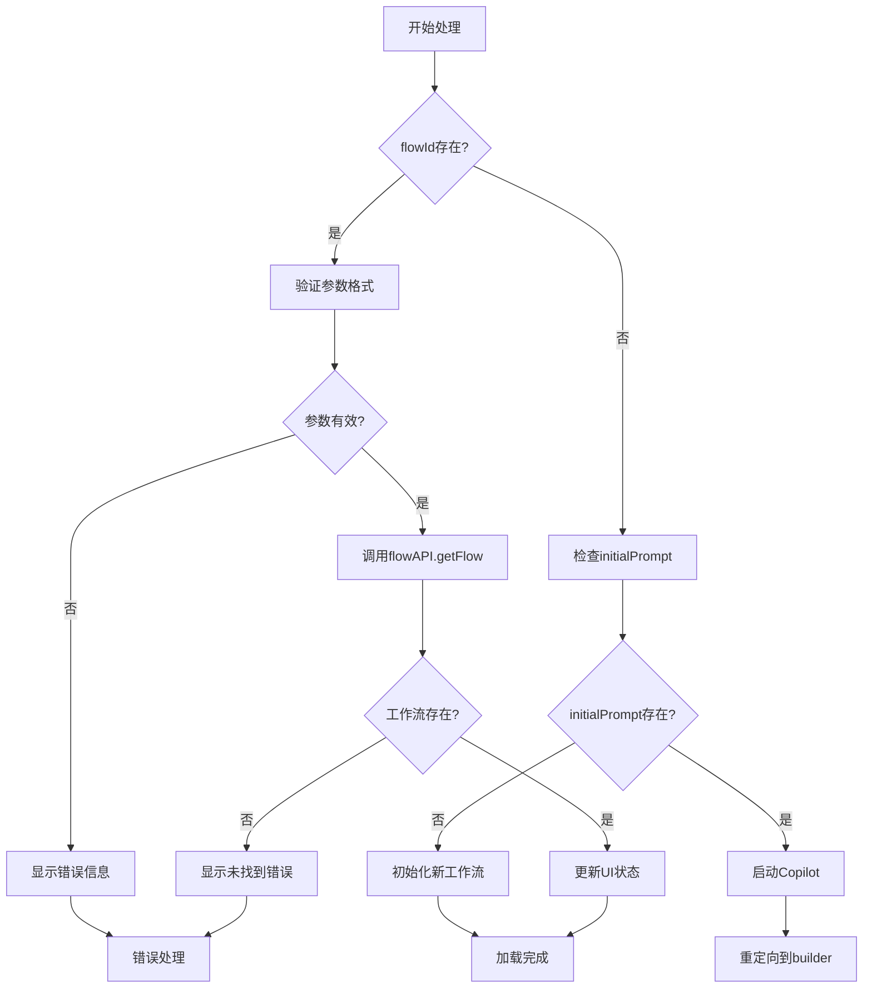
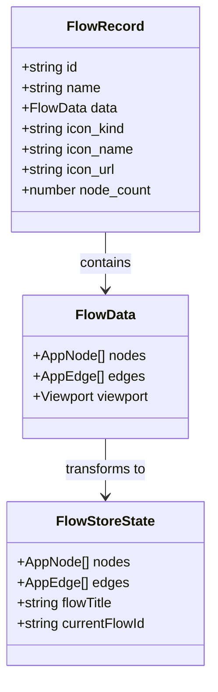
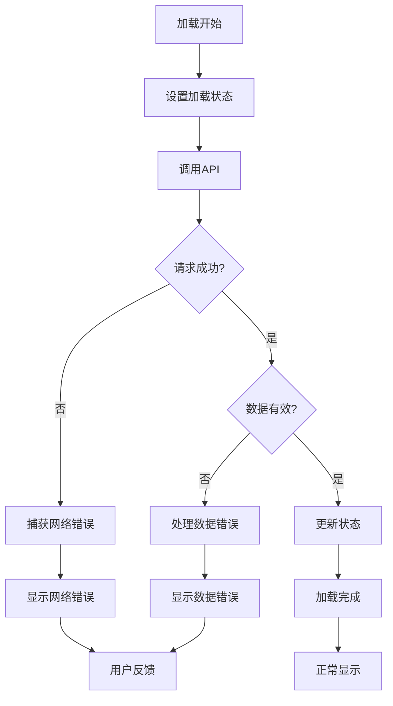
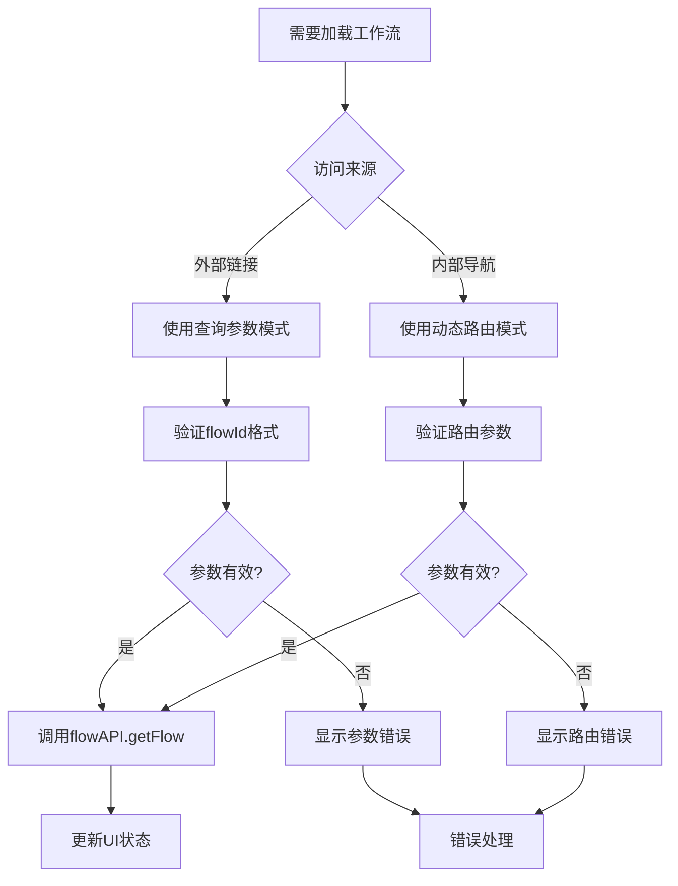

# flowId参数解析与路由处理

<cite>
**本文档引用的文件**
- [src/app/builder/page.tsx](file://src/app/builder/page.tsx)
- [src/app/builder/[id]/page.tsx](file://src/app/builder/[id]/page.tsx)
- [src/services/flowAPI.ts](file://src/services/flowAPI.ts)
- [src/types/flow.ts](file://src/types/flow.ts)
- [src/store/flowStore.ts](file://src/store/flowStore.ts)
- [src/app/flows/page.tsx](file://src/app/flows/page.tsx)
- [src/app/page.tsx](file://src/app/page.tsx)
- [src/components/flows/FlowCard.tsx](file://src/components/flows/FlowCard.tsx)
</cite>

## 目录
1. [概述](#概述)
2. [项目架构](#项目架构)
3. [URL查询参数flowId处理](#url查询参数flowid处理)
4. [动态路由参数处理](#动态路由参数处理)
5. [参数提取与验证机制](#参数提取与验证机制)
6. [加载流程详解](#加载流程详解)
7. [错误处理与用户体验](#错误处理与用户体验)
8. [适用场景对比](#适用场景对比)
9. [最佳实践建议](#最佳实践建议)
10. [总结](#总结)

## 概述

Flash Flow SaaS系统提供了两种主要的工作流加载机制：基于URL查询参数的`flowId`加载和基于动态路由的直接访问。这两种机制分别适用于不同的使用场景，为用户提供灵活的工作流访问方式。

系统的核心设计理念是通过`flowId`参数实现工作流的快速加载和共享，支持从外部链接直接打开特定工作流，同时也支持内部导航到工作流编辑器。

## 项目架构



**图表来源**
- [src/app/builder/page.tsx](file://src/app/builder/page.tsx#L1-L208)
- [src/app/builder/[id]/page.tsx](file://src/app/builder/[id]/page.tsx#L1-L97)

## URL查询参数flowId处理

### useSearchParams Hook的使用

在`/builder`页面中，系统通过`useSearchParams` Hook获取URL查询参数，这是实现外部链接加载工作流的关键机制。



**图表来源**
- [src/app/builder/page.tsx](file://src/app/builder/page.tsx#L44-L72)
- [src/services/flowAPI.ts](file://src/services/flowAPI.ts#L75-L101)

### 参数监听机制

系统使用`useEffect`依赖数组来监听查询参数的变化，确保当URL参数发生变化时能够重新加载相应的工作流。

**章节来源**
- [src/app/builder/page.tsx](file://src/app/builder/page.tsx#L44-L82)

### 内联异步函数设计

为了避免副作用函数引用不稳定导致的无限循环问题，系统采用内联异步函数的方式处理工作流加载逻辑。

**章节来源**
- [src/app/builder/page.tsx](file://src/app/builder/page.tsx#L46-L71)

## 动态路由参数处理

### 路由结构设计

系统采用Next.js的动态路由特性，通过`[id]`占位符实现动态参数捕获。

```mermaid
graph LR
A[静态路由] --> B[动态路由]
B --> C[参数提取]
C --> D[工作流加载]
subgraph "路由层级"
E[/builder] --> F[/builder/[id]]
G[/app] --> H[/app/[id]]
end
subgraph "参数类型"
I[查询参数] --> J[flowId]
K[路径参数] --> L[id]
end
```

**图表来源**
- [src/app/builder/[id]/page.tsx](file://src/app/builder/[id]/page.tsx#L1-L97)

### 路由导航机制

动态路由主要用于内部导航，当用户在应用内部切换工作流时使用这种方式。

**章节来源**
- [src/components/flows/FlowCard.tsx](file://src/components/flows/FlowCard.tsx#L130-L139)

## 参数提取与验证机制

### 查询参数提取逻辑

系统通过`searchParams.get("flowId")`安全地提取查询参数，这种设计确保了参数提取的健壮性。



**图表来源**
- [src/app/builder/page.tsx](file://src/app/builder/page.tsx#L44-L72)

### 类型安全的数据处理

系统通过TypeScript确保参数类型的正确性，并提供默认值处理机制。

**章节来源**
- [src/types/flow.ts](file://src/types/flow.ts#L59-L63)

## 加载流程详解

### 数据结构转换

当成功获取工作流数据后，系统会将其转换为适合UI渲染的数据结构：



**图表来源**
- [src/types/flow.ts](file://src/types/flow.ts#L65-L77)
- [src/store/flowStore.ts](file://src/store/flowStore.ts#L85-L106)

### 状态更新流程

系统通过多个状态管理函数将远程数据同步到本地状态：

**章节来源**
- [src/app/builder/page.tsx](file://src/app/builder/page.tsx#L55-L60)

## 错误处理与用户体验

### 多层次错误处理

系统实现了多层次的错误处理机制，包括网络错误、数据格式错误和业务逻辑错误。



**图表来源**
- [src/app/builder/page.tsx](file://src/app/builder/page.tsx#L65-L69)

### 用户体验优化

系统提供了丰富的用户反馈机制，包括加载指示器、错误通知和状态提示。

**章节来源**
- [src/app/builder/page.tsx](file://src/app/builder/page.tsx#L101-L116)

## 适用场景对比

### 查询参数模式（/builder?flowId=xxx）

| 特性 | 描述 | 优势 | 适用场景 |
|------|------|------|----------|
| **外部访问** | 支持从外部链接直接访问 | 快速分享和协作 | 共享工作流、演示场景 |
| **参数灵活性** | 可以包含其他查询参数 | 扩展性强 | 带初始数据的加载 |
| **缓存友好** | URL可被浏览器缓存 | 性能优化 | 书签和收藏 |
| **深度链接** | 支持精确的工作流定位 | 导航精准 | 应用集成和自动化 |

### 动态路由模式（/builder/[id]）

| 特性 | 描述 | 优势 | 适用场景 |
|------|------|------|----------|
| **内部导航** | 主要用于应用内部导航 | 导航流畅 | 应用内工作流切换 |
| **SEO友好** | 支持搜索引擎索引 | 可发现性好 | 公开工作流展示 |
| **性能优化** | 减少参数解析开销 | 加载速度快 | 常用工作流访问 |
| **路由管理** | 利用Next.js路由特性 | 功能丰富 | 复杂导航需求 |

### 场景选择指南



**图表来源**
- [src/app/builder/page.tsx](file://src/app/builder/page.tsx#L44-L72)
- [src/components/flows/FlowCard.tsx](file://src/components/flows/FlowCard.tsx#L130-L139)

## 最佳实践建议

### 参数验证策略

1. **严格的数据验证**：始终验证`flowId`参数的有效性
2. **类型安全处理**：使用TypeScript确保类型安全
3. **默认值处理**：为缺失或无效的参数提供合理的默认值
4. **错误边界**：实现完整的错误处理机制

### 性能优化建议

1. **防抖处理**：对于频繁的参数变化，考虑使用防抖技术
2. **缓存策略**：实现工作流数据的客户端缓存
3. **并发控制**：避免同时发起多个相同的工作流加载请求
4. **懒加载**：对于大型工作流，考虑分块加载策略

### 安全考虑

1. **输入验证**：严格验证所有外部输入参数
2. **权限检查**：确保用户有权访问指定的工作流
3. **XSS防护**：对显示的文本内容进行适当的转义
4. **CSRF保护**：在相关操作中实施CSRF保护机制

### 开发调试技巧

1. **日志记录**：在关键步骤添加详细的日志记录
2. **单元测试**：为参数处理逻辑编写单元测试
3. **集成测试**：测试不同路由模式的兼容性
4. **性能监控**：监控加载时间和资源使用情况

## 总结

Flash Flow SaaS系统通过精心设计的双路由机制，为用户提供了灵活而强大的工作流加载能力。查询参数模式支持外部访问和深度链接，而动态路由模式则优化了内部导航体验。

系统的核心优势在于：
- **双重加载机制**：满足不同使用场景的需求
- **类型安全设计**：利用TypeScript确保代码质量
- **完善的错误处理**：提供良好的用户体验
- **灵活的参数验证**：保证系统的稳定性和安全性

通过合理选择和使用这两种加载机制，开发者可以构建出既强大又易用的工作流管理系统，为用户提供优秀的协作和开发体验。