# 加载错误处理与用户反馈机制

<cite>
**本文档引用的文件**
- [src/app/builder/page.tsx](file://src/app/builder/page.tsx)
- [src/components/FlowErrorBoundary.tsx](file://src/components/FlowErrorBoundary.tsx)
- [src/services/flowAPI.ts](file://src/services/flowAPI.ts)
- [src/app/flows/page.tsx](file://src/app/flows/page.tsx)
- [src/components/builder/ControlDock.tsx](file://src/components/builder/ControlDock.tsx)
- [src/lib/supabase.ts](file://src/lib/supabase.ts)
- [src/app/api/health/route.ts](file://src/app/api/health/route.ts)
</cite>

## 目录
1. [概述](#概述)
2. [系统架构](#系统架构)
3. [核心错误处理组件](#核心错误处理组件)
4. [加载错误处理机制](#加载错误处理机制)
5. [用户界面反馈系统](#用户界面反馈系统)
6. [错误类型与处理策略](#错误类型与处理策略)
7. [错误状态管理](#错误状态管理)
8. [改进建议](#改进建议)
9. [总结](#总结)

## 概述

Flash Flow SaaS 应用采用分层错误处理架构，通过多种机制确保用户在流程加载过程中遇到问题时能够获得及时、清晰的反馈。系统实现了两种主要的错误处理策略：业务级错误处理（用于数据获取失败）和渲染级错误边界处理（用于组件渲染异常）。

## 系统架构

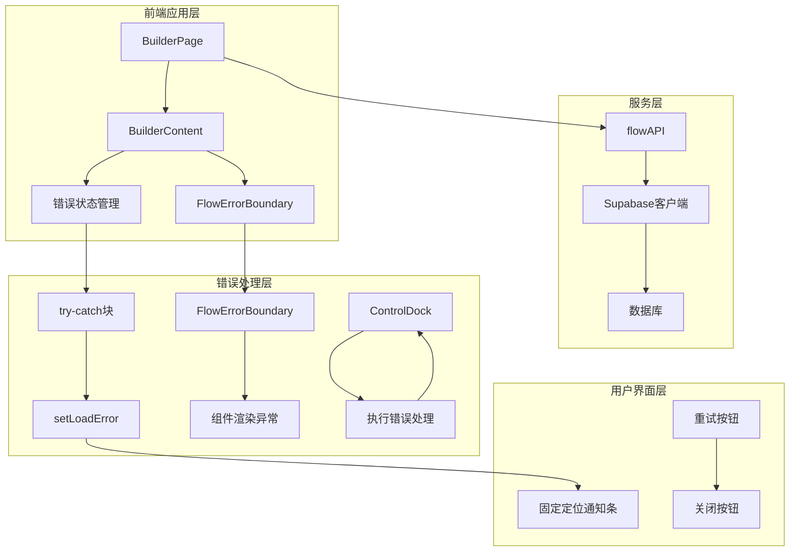

**图表来源**
- [src/app/builder/page.tsx](file://src/app/builder/page.tsx#L1-L208)
- [src/components/FlowErrorBoundary.tsx](file://src/components/FlowErrorBoundary.tsx#L1-L65)

## 核心错误处理组件

### FlowErrorBoundary 组件

FlowErrorBoundary 是系统的核心渲染级错误边界组件，负责捕获和处理组件树中的渲染异常。

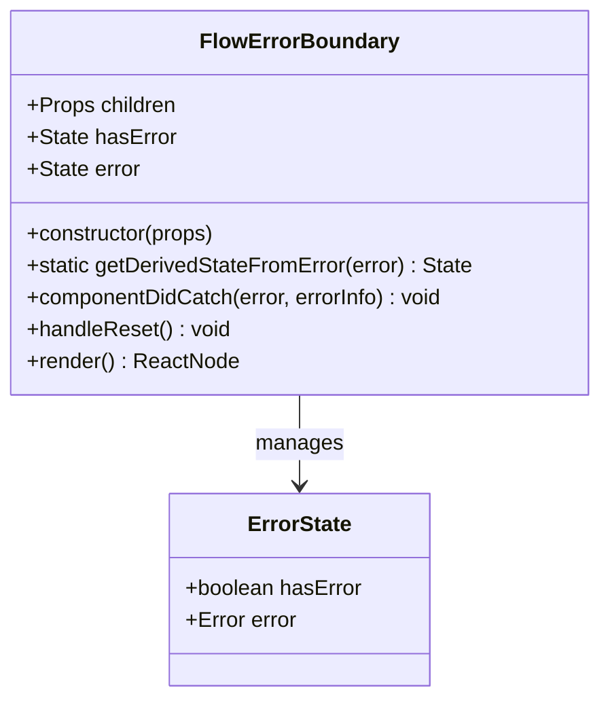

**图表来源**
- [src/components/FlowErrorBoundary.tsx](file://src/components/FlowErrorBoundary.tsx#L15-L65)

**章节来源**
- [src/components/FlowErrorBoundary.tsx](file://src/components/FlowErrorBoundary.tsx#L1-L65)

### BuilderContent 错误处理

BuilderContent 组件实现了业务级错误处理，专门针对流程加载过程中的数据获取失败。

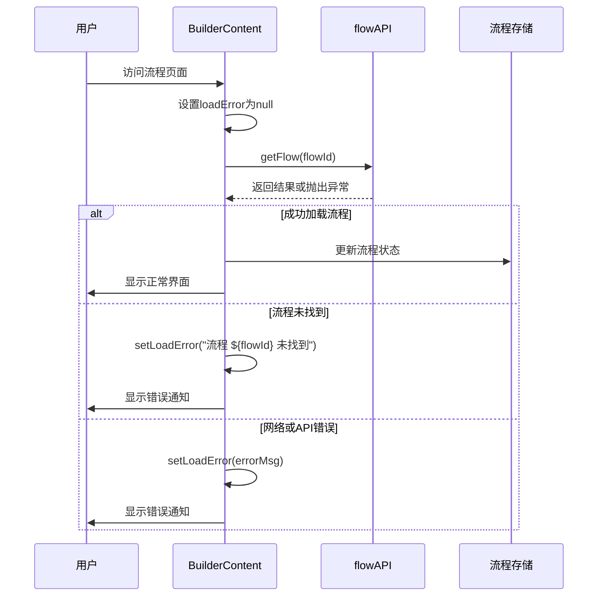

**图表来源**
- [src/app/builder/page.tsx](file://src/app/builder/page.tsx#L44-L72)

**章节来源**
- [src/app/builder/page.tsx](file://src/app/builder/page.tsx#L34-L72)

## 加载错误处理机制

### try-catch 块实现

系统在多个关键位置使用 try-catch 块来捕获和处理异步操作中的错误：

#### 流程加载错误处理

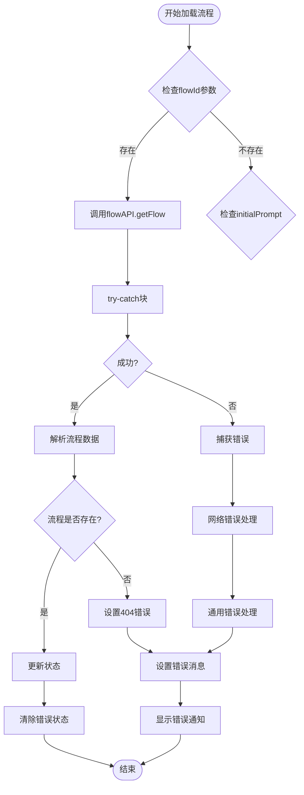

**图表来源**
- [src/app/builder/page.tsx](file://src/app/builder/page.tsx#L44-L72)

#### 数据列表加载错误处理

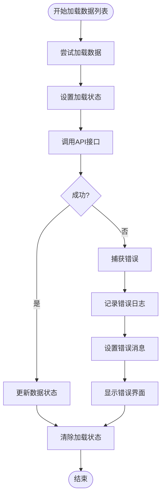

**图表来源**
- [src/app/flows/page.tsx](file://src/app/flows/page.tsx#L23-L35)

**章节来源**
- [src/app/builder/page.tsx](file://src/app/builder/page.tsx#L44-L72)
- [src/app/flows/page.tsx](file://src/app/flows/page.tsx#L23-L35)

### Supabase 错误处理

系统通过 Supabase 客户端进行数据库操作，并实现了多层错误处理：

#### 数据库连接健康检查

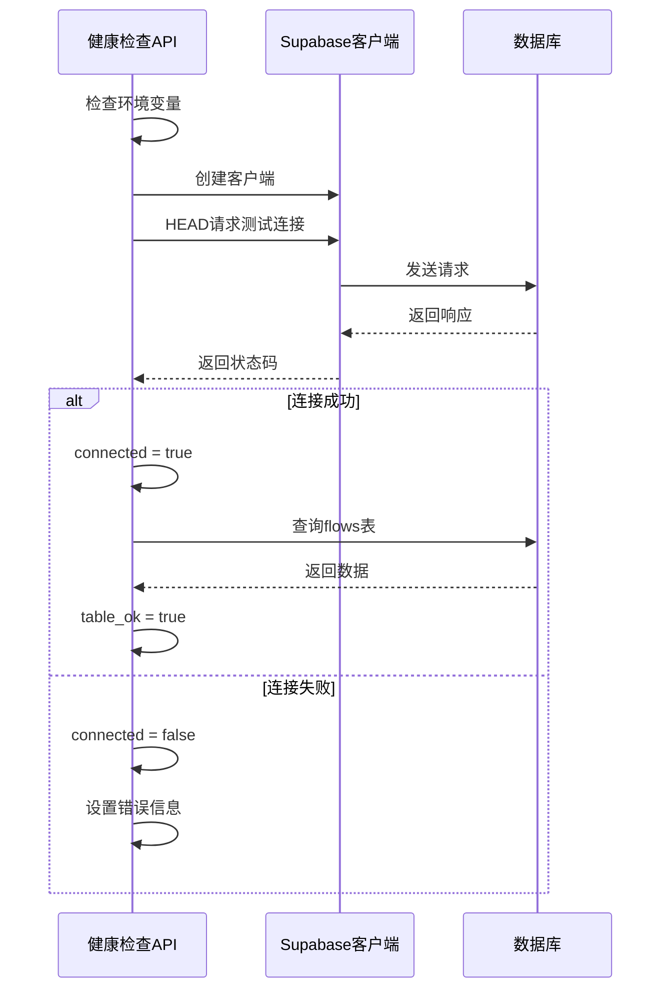

**图表来源**
- [src/app/api/health/route.ts](file://src/app/api/health/route.ts#L19-L48)

**章节来源**
- [src/app/api/health/route.ts](file://src/app/api/health/route.ts#L1-L51)

## 用户界面反馈系统

### 固定定位错误通知条

系统实现了统一的错误通知界面，采用固定定位设计，确保用户能够及时感知加载失败。

#### Builder 页面错误通知

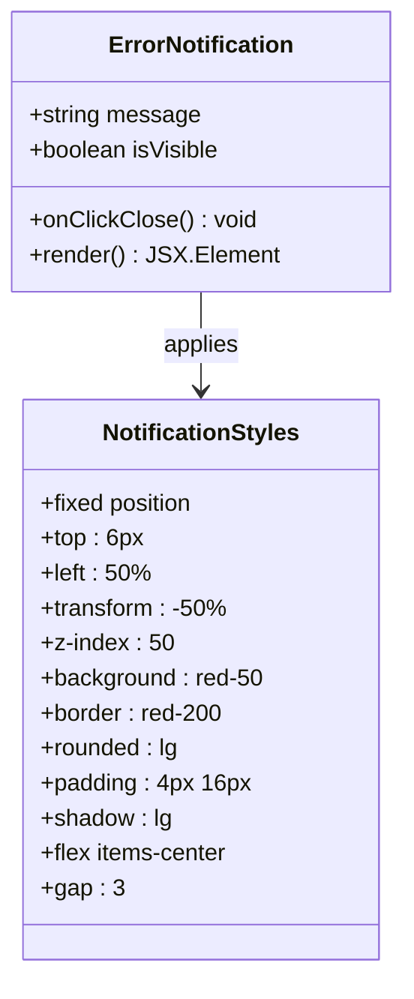

**图表来源**
- [src/app/builder/page.tsx](file://src/app/builder/page.tsx#L101-L116)

#### 执行错误通知

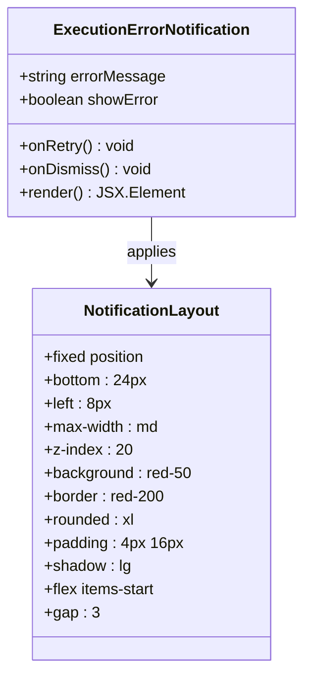

**图表来源**
- [src/components/builder/ControlDock.tsx](file://src/components/builder/ControlDock.tsx#L180-L224)

### 图标与视觉元素

系统使用一致的图标系统来增强错误反馈的可识别性：

| 错误类型 | 图标 | 颜色 | 用途 |
|---------|------|------|------|
| 加载错误 | AlertCircle | red-600 | 流程加载失败 |
| 渲染错误 | AlertTriangle | red-500 | 组件渲染异常 |
| 执行错误 | AlertCircle | red-600 | 流程执行失败 |
| 重试按钮 | RotateCcw | red-600 | 重新尝试操作 |
| 关闭按钮 | X | red-600 | 关闭错误通知 |

**章节来源**
- [src/app/builder/page.tsx](file://src/app/builder/page.tsx#L101-L116)
- [src/components/builder/ControlDock.tsx](file://src/components/builder/ControlDock.tsx#L180-L224)

## 错误类型与处理策略

### 网络请求错误

#### 404 流程未找到

当用户访问不存在的流程ID时，系统会显示特定的错误消息：

```typescript
// 错误处理示例路径
// src/app/builder/page.tsx#L62-L63
setLoadError(`流程 ${flowId} 未找到`);
console.error(`Flow ${flowId} not found`);
```

#### 网络超时与连接失败

系统通过 Supabase 的错误检测机制处理网络相关问题：

```typescript
// 错误检测示例路径
// src/app/api/health/route.ts#L33-L35
if (msg.includes("failed to fetch") || msg.includes("network")) {
    connected = false;
}
```

#### 认证失败

系统通过环境变量验证和 API 响应状态码检测认证问题：

```typescript
// 认证检测示例路径
// src/app/api/health/route.ts#L26-L27
connected = resp.ok || resp.status === 401 || resp.status === 404;
auth_ok = resp.status !== 401;
```

### 数据库错误

#### 表结构验证

flowAPI 实现了严格的数据结构验证：

```typescript
// 数据验证示例路径
// src/services/flowAPI.ts#L38-L54
let flowData: FlowData;
try {
    const rawData = row.data as unknown;
    if (typeof rawData === 'object' && rawData !== null) {
        flowData = rawData as FlowData;
        if (!Array.isArray(flowData.nodes)) flowData.nodes = [];
        if (!Array.isArray(flowData.edges)) flowData.edges = [];
    } else {
        flowData = { nodes: [], edges: [] };
    }
} catch (e) {
    console.error('[flowAPI] Failed to parse flow data:', e);
    flowData = { nodes: [], edges: [] };
}
```

### 执行错误

#### 流程执行失败

系统提供了专门的执行错误处理机制：

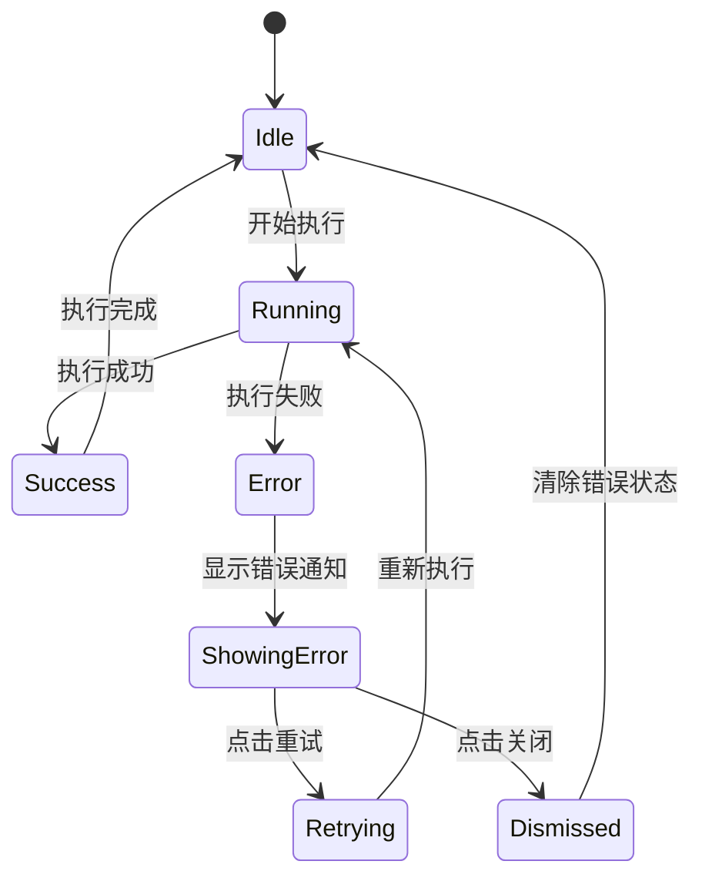

**图表来源**
- [src/components/builder/ControlDock.tsx](file://src/components/builder/ControlDock.tsx#L35-L51)

**章节来源**
- [src/app/builder/page.tsx](file://src/app/builder/page.tsx#L62-L63)
- [src/app/api/health/route.ts](file://src/app/api/health/route.ts#L33-L35)
- [src/services/flowAPI.ts](file://src/services/flowAPI.ts#L38-L54)

## 错误状态管理

### 状态清除机制

系统实现了多种错误状态清除机制：

#### Builder 页面错误清除

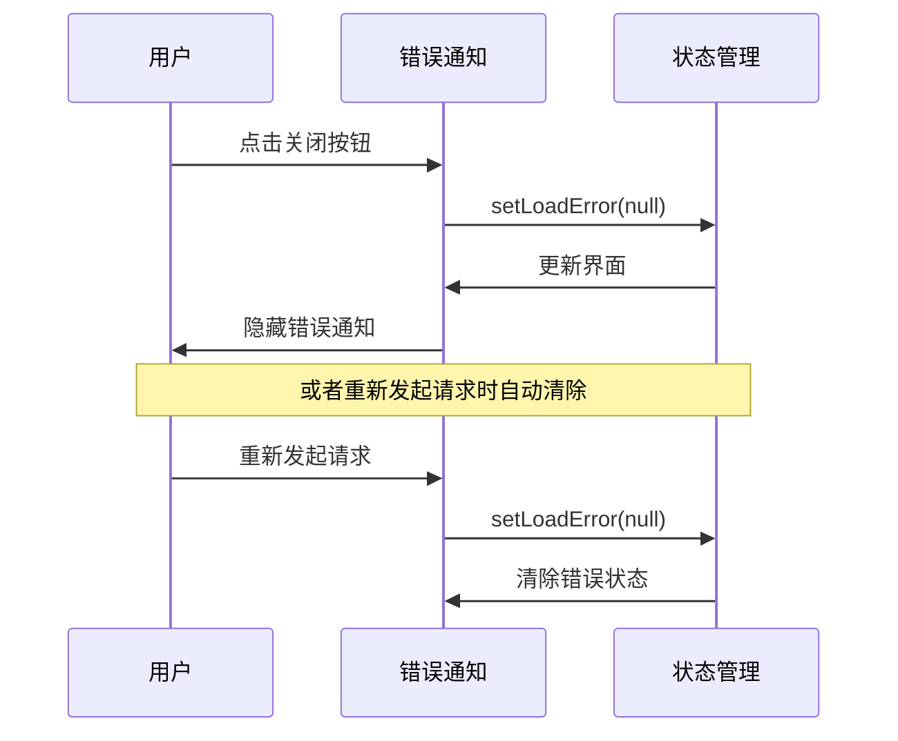

**图表来源**
- [src/app/builder/page.tsx](file://src/app/builder/page.tsx#L109-L110)

#### 执行错误清除

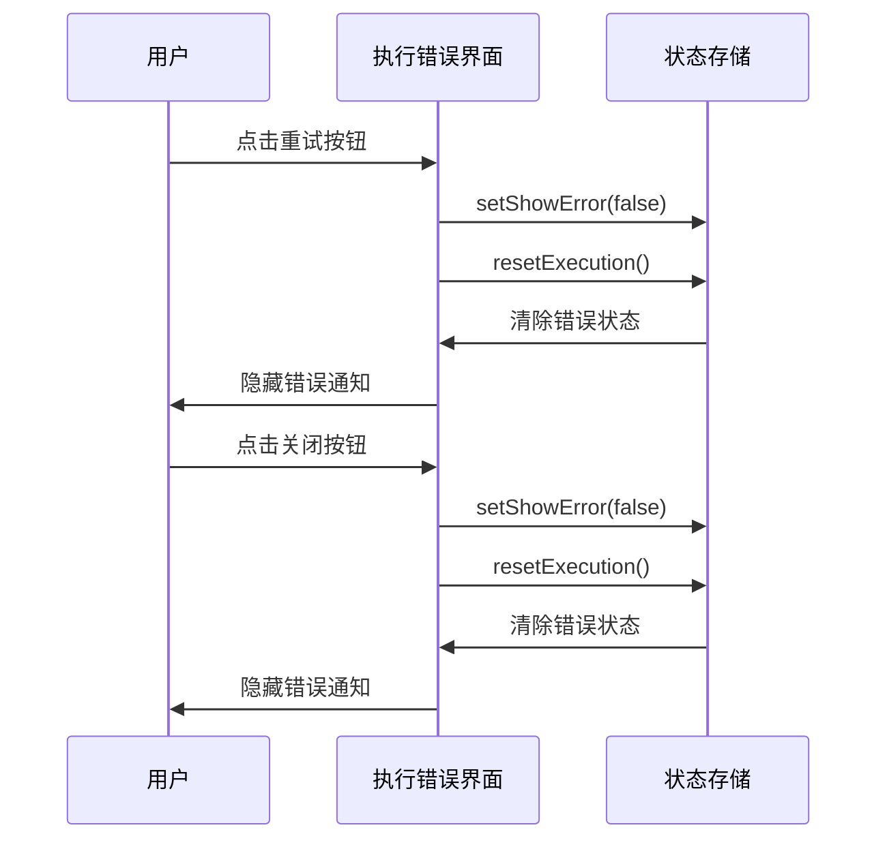

**图表来源**
- [src/components/builder/ControlDock.tsx](file://src/components/builder/ControlDock.tsx#L42-L51)

### 错误边界与业务错误的分工

#### FlowErrorBoundary 职责

- **渲染异常捕获**：捕获组件树中的 JavaScript 错误
- **降级界面展示**：提供友好的错误页面
- **自动重载功能**：提供页面刷新选项

#### 业务错误提示职责

- **数据获取失败**：处理 API 调用失败
- **流程加载失败**：处理流程数据加载异常
- **用户操作反馈**：提供具体的操作指导

**章节来源**
- [src/app/builder/page.tsx](file://src/app/builder/page.tsx#L109-L110)
- [src/components/builder/ControlDock.tsx](file://src/components/builder/ControlDock.tsx#L42-L51)

## 改进建议

### 增加重试机制

#### 自动重试策略

```typescript
// 建议的自动重试实现
const MAX_RETRIES = 3;
const RETRY_DELAY = 1000;

async function loadWithRetry(loadFunction, retries = 0) {
    try {
        return await loadFunction();
    } catch (error) {
        if (retries < MAX_RETRIES) {
            await new Promise(resolve => setTimeout(resolve, RETRY_DELAY * (retries + 1)));
            return loadWithRetry(loadFunction, retries + 1);
        }
        throw error;
    }
}
```

#### 智能重试条件

```typescript
// 建议的智能重试判断
function shouldRetry(error) {
    const errorMessage = error.message.toLowerCase();
    return errorMessage.includes('network') || 
           errorMessage.includes('timeout') ||
           error.status === 500 ||
           error.status === 503;
}
```

### 错误代码追踪

#### 结构化错误信息

```typescript
// 建议的错误对象结构
interface ErrorInfo {
    code: string;
    message: string;
    timestamp: number;
    context: Record<string, any>;
    stack?: string;
}

// 错误追踪示例
function trackError(error: Error, context: Record<string, any>) {
    const errorInfo: ErrorInfo = {
        code: generateErrorCode(),
        message: error.message,
        timestamp: Date.now(),
        context,
        stack: error.stack
    };
    
    // 发送到错误监控服务
    sendToErrorTracking(errorInfo);
}
```

### 用户体验优化

#### 加载状态指示器

```typescript
// 建议的加载状态管理
interface LoadingState {
    isLoading: boolean;
    progress?: number;
    message?: string;
    error?: string;
}

// 使用示例
const [loadingState, setLoadingState] = useState<LoadingState>({
    isLoading: false,
    message: '正在加载...'
});
```

#### 错误分类与优先级

```typescript
// 建议的错误分类系统
enum ErrorPriority {
    LOW = 'low',
    MEDIUM = 'medium',
    HIGH = 'high',
    CRITICAL = 'critical'
}

function classifyError(error: Error): ErrorPriority {
    const message = error.message.toLowerCase();
    
    if (message.includes('network')) return ErrorPriority.HIGH;
    if (message.includes('timeout')) return ErrorPriority.MEDIUM;
    if (message.includes('not found')) return ErrorPriority.LOW;
    return ErrorPriority.CRITICAL;
}
```

### 监控与告警

#### 错误统计仪表板

```typescript
// 建议的错误监控指标
interface ErrorMetrics {
    totalErrors: number;
    errorsByType: Record<string, number>;
    errorsByRoute: Record<string, number>;
    averageResponseTime: number;
    errorRate: number;
}
```

## 总结

Flash Flow SaaS 应用的错误处理与用户反馈机制体现了现代 Web 应用的最佳实践。系统通过分层架构实现了全面的错误覆盖：

1. **FlowErrorBoundary** 提供了渲染级的错误保护，确保应用不会因单个组件的错误而崩溃
2. **业务错误处理** 针对数据获取失败提供了具体的用户反馈和操作指导
3. **统一的用户界面** 通过固定定位的通知条和一致的视觉设计，确保用户能够及时感知和处理错误
4. **灵活的状态管理** 支持多种错误清除机制，包括自动清除和用户主动清除

这套机制不仅提高了应用的稳定性和用户体验，还为后续的功能扩展和维护奠定了坚实的基础。通过持续的改进和优化，可以进一步提升系统的可靠性和用户满意度。