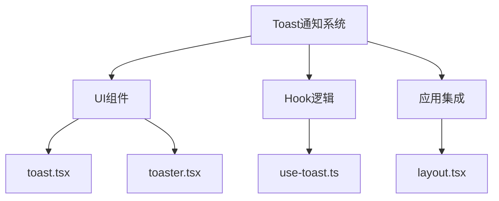
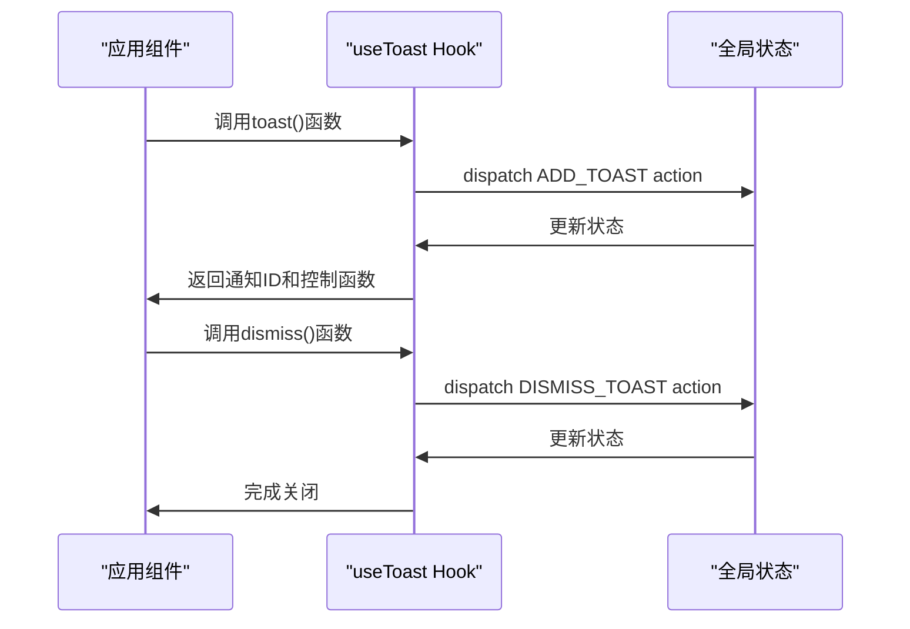
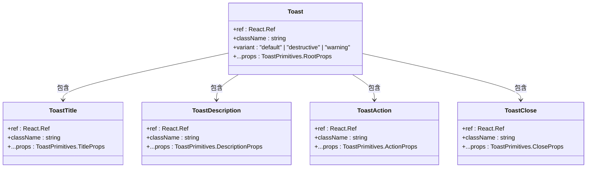
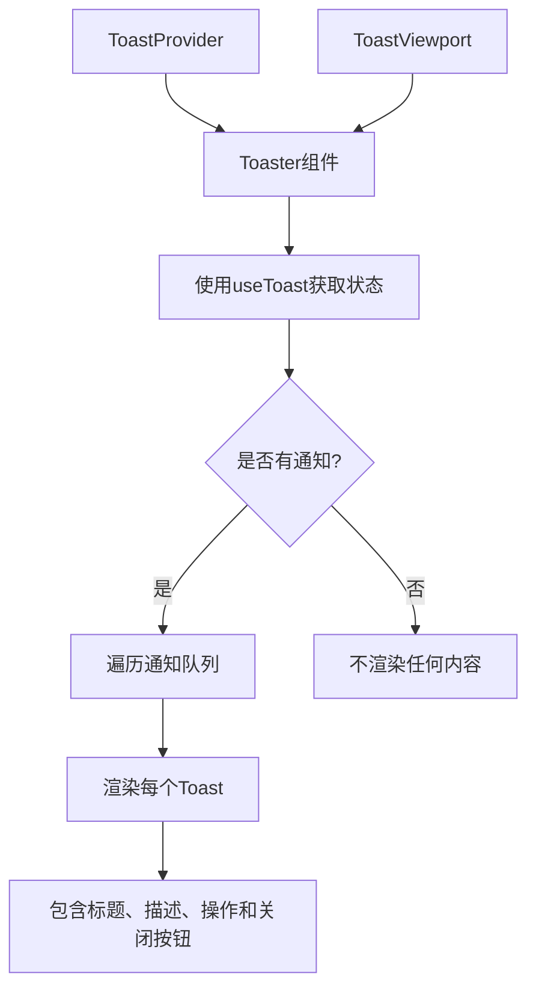
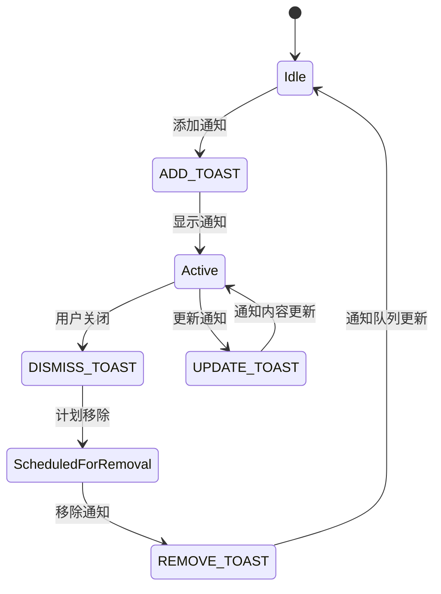

# Toast通知系统

<cite>
**本文档引用的文件**   
- [use-toast.ts](file://src/hooks/use-toast.ts)
- [toast.tsx](file://src/components/ui/toast.tsx)
- [toaster.tsx](file://src/components/ui/toaster.tsx)
- [layout.tsx](file://src/app/layout.tsx)
</cite>

## 目录
1. [简介](#简介)
2. [项目结构](#项目结构)
3. [核心组件](#核心组件)
4. [架构概述](#架构概述)
5. [详细组件分析](#详细组件分析)
6. [依赖分析](#依赖分析)
7. [性能考虑](#性能考虑)
8. [故障排除指南](#故障排除指南)
9. [结论](#结论)

## 简介
Toast通知系统是Flash Flow SaaS平台中的一个关键用户反馈机制，用于向用户提供即时的操作反馈、状态更新和错误提示。该系统基于Radix UI的Toast组件构建，结合自定义的React Hook实现了一套完整的通知管理方案。

## 项目结构
Toast通知系统主要由三个核心文件组成，分别位于不同的目录中，形成了清晰的分层架构。



**图示来源**
- [toast.tsx](file://src/components/ui/toast.tsx)
- [toaster.tsx](file://src/components/ui/toaster.tsx)
- [use-toast.ts](file://src/hooks/use-toast.ts)
- [layout.tsx](file://src/app/layout.tsx)

**章节来源**
- [src/components/ui/toast.tsx](file://src/components/ui/toast.tsx)
- [src/components/ui/toaster.tsx](file://src/components/ui/toaster.tsx)
- [src/hooks/use-toast.ts](file://src/hooks/use-toast.ts)

## 核心组件
Toast通知系统的核心功能由`use-toast.ts`中的自定义Hook提供，该Hook实现了通知的添加、更新、关闭和移除等操作。系统通过全局状态管理来维护通知队列，并提供了简洁的API供其他组件调用。

**章节来源**
- [use-toast.ts](file://src/hooks/use-toast.ts#L1-L193)

## 架构概述
Toast通知系统的架构采用了典型的React组件模式，通过组合UI组件和逻辑Hook来实现功能。`toast.tsx`定义了通知的UI样式和基本行为，`toaster.tsx`负责渲染通知队列，而`use-toast.ts`则提供了通知管理的逻辑。



**图示来源**
- [use-toast.ts](file://src/hooks/use-toast.ts#L76-L128)
- [toaster.tsx](file://src/components/ui/toaster.tsx#L13-L35)

## 详细组件分析

### Toast组件分析
Toast组件是通知系统的UI基础，定义了通知的外观和交互行为。它基于Radix UI的Toast Primitives构建，确保了无障碍性和跨浏览器兼容性。



**图示来源**
- [toast.tsx](file://src/components/ui/toast.tsx#L43-L113)

**章节来源**
- [toast.tsx](file://src/components/ui/toast.tsx#L1-L130)

### Toaster组件分析
Toaster组件负责管理通知队列的渲染，它订阅了全局通知状态，并根据状态变化动态更新UI。



**图示来源**
- [toaster.tsx](file://src/components/ui/toaster.tsx#L13-L35)

**章节来源**
- [toaster.tsx](file://src/components/ui/toaster.tsx#L1-L35)

### useToast Hook分析
useToast Hook是通知系统的核心逻辑，实现了通知的生命周期管理。它使用了Redux风格的reducer模式来处理状态变更。



**图示来源**
- [use-toast.ts](file://src/hooks/use-toast.ts#L76-L128)

**章节来源**
- [use-toast.ts](file://src/hooks/use-toast.ts#L1-L193)

## 依赖分析
Toast通知系统依赖于多个外部库和内部组件，形成了一个完整的生态系统。

```mermaid
graph LR
A[Toast通知系统] --> B[Radix UI]
A --> C[Class Variance Authority]
A --> D[Lucide React]
A --> E[React]
B --> F[@radix-ui/react-toast]
C --> G[cva]
D --> H[X图标]
E --> I[React Hooks]
```

**图示来源**
- [toast.tsx](file://src/components/ui/toast.tsx#L2-L4)
- [use-toast.ts](file://src/hooks/use-toast.ts#L3-L4)

## 性能考虑
Toast通知系统在设计时考虑了性能优化，通过限制通知队列的长度和使用高效的reducer模式来确保系统的响应性。

**章节来源**
- [use-toast.ts](file://src/hooks/use-toast.ts#L10-L11)

## 故障排除指南
当Toast通知系统出现问题时，可以检查以下几个方面：
1. 确保`Toaster`组件已在应用的根布局中正确引入
2. 检查`use-toast.ts`中的状态管理逻辑是否正常工作
3. 验证通知的样式类是否正确应用

**章节来源**
- [layout.tsx](file://src/app/layout.tsx#L6)
- [toaster.tsx](file://src/components/ui/toaster.tsx#L13)

## 结论
Toast通知系统为Flash Flow SaaS平台提供了一个可靠、灵活且易于使用的用户反馈机制。通过合理的架构设计和组件分离，该系统既保证了功能的完整性，又保持了代码的可维护性。