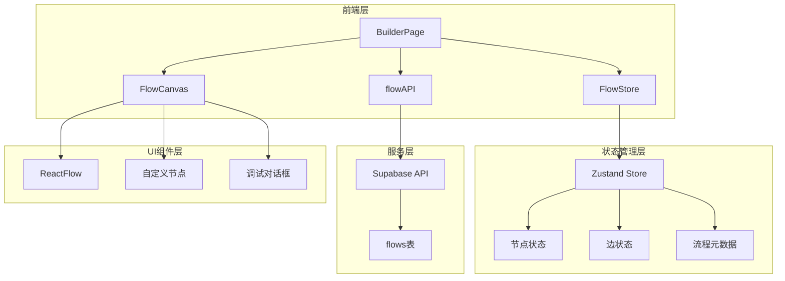
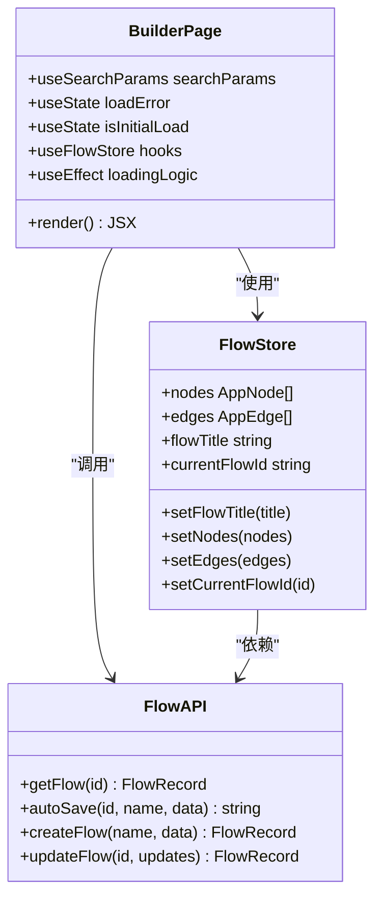
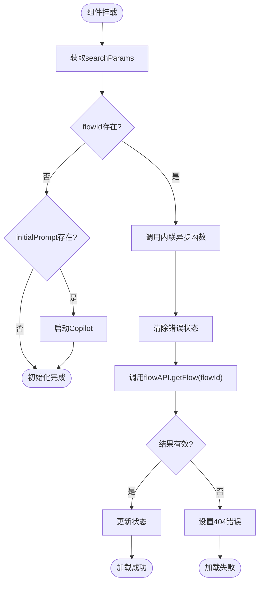
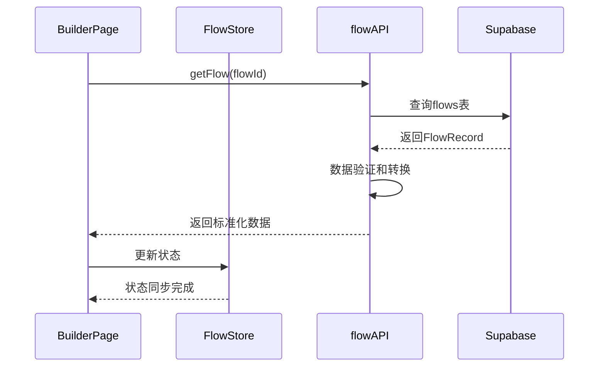
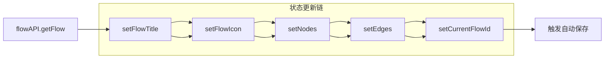
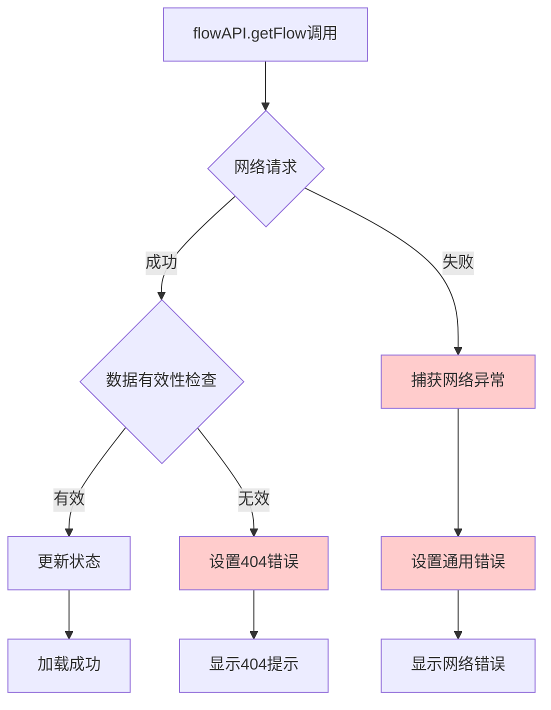
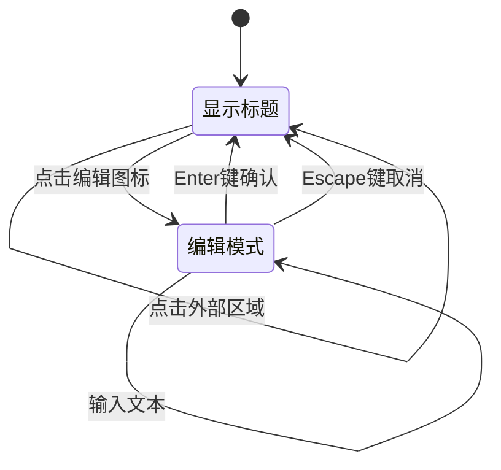

# 现有流程加载

<cite>
**本文档引用的文件**
- [src/app/builder/page.tsx](file://src/app/builder/page.tsx)
- [src/app/builder/[id]/page.tsx](file://src/app/builder/[id]/page.tsx)
- [src/services/flowAPI.ts](file://src/services/flowAPI.ts)
- [src/store/flowStore.ts](file://src/store/flowStore.ts)
- [src/types/flow.ts](file://src/types/flow.ts)
- [src/store/actions/nodeActions.ts](file://src/store/actions/nodeActions.ts)
- [src/store/actions/edgeActions.ts](file://src/store/actions/edgeActions.ts)
- [src/store/constants/initialState.ts](file://src/store/constants/initialState.ts)
- [src/components/flow/FlowCanvas.tsx](file://src/components/flow/FlowCanvas.tsx)
- [src/components/flow/InputPromptDialog.tsx](file://src/components/flow/InputPromptDialog.tsx)
- [src/components/flow/NodeDebugDialog.tsx](file://src/components/flow/NodeDebugDialog.tsx)
</cite>

## 目录
1. [概述](#概述)
2. [项目架构](#项目架构)
3. [核心组件分析](#核心组件分析)
4. [useEffect条件判断逻辑](#useeffect条件判断逻辑)
5. [异步数据获取流程](#异步数据获取流程)
6. [状态同步机制](#状态同步机制)
7. [错误处理机制](#错误处理机制)
8. [UI反馈机制](#ui反馈机制)
9. [性能优化策略](#性能优化策略)
10. [总结](#总结)

## 概述

本文档详细分析了Flash Flow SaaS平台中通过flowId参数加载现有工作流的技术实现。该功能是平台的核心特性之一，允许用户从URL参数中直接加载已保存的工作流，实现无缝的工作流编辑体验。

系统采用React + Next.js + Zustand的状态管理模式，结合Supabase数据库进行持久化存储，提供了完整的流程加载、状态同步和错误处理机制。

## 项目架构



**图表来源**
- [src/app/builder/page.tsx](file://src/app/builder/page.tsx#L1-L208)
- [src/store/flowStore.ts](file://src/store/flowStore.ts#L1-L131)
- [src/services/flowAPI.ts](file://src/services/flowAPI.ts#L1-L240)

## 核心组件分析

### BuilderPage组件结构

BuilderPage组件是流程加载功能的主要入口点，负责协调整个加载过程。该组件包含以下关键部分：

1. **状态管理集成**：通过Zustand store管理全局状态
2. **路由参数处理**：使用Next.js的useSearchParams获取URL参数
3. **错误状态管理**：维护加载错误状态供UI反馈
4. **条件渲染**：根据加载状态显示不同的UI元素



**图表来源**
- [src/app/builder/page.tsx](file://src/app/builder/page.tsx#L20-L35)
- [src/store/flowStore.ts](file://src/store/flowStore.ts#L17-L44)
- [src/services/flowAPI.ts](file://src/services/flowAPI.ts#L75-L102)

**章节来源**
- [src/app/builder/page.tsx](file://src/app/builder/page.tsx#L1-L208)
- [src/store/flowStore.ts](file://src/store/flowStore.ts#L1-L131)

## useEffect条件判断逻辑

### searchParams.get('flowId')的条件判断

在BuilderPage组件中，useEffect钩子负责处理基于URL参数的流程加载逻辑。核心判断逻辑如下：



**图表来源**
- [src/app/builder/page.tsx](file://src/app/builder/page.tsx#L46-L82)

### 内联异步函数的设计优势

系统采用了内联异步函数而非外部函数的方式，这一设计解决了重要的性能问题：

1. **避免依赖数组问题**：防止因函数引用变化导致的无限循环
2. **简化依赖管理**：减少useEffect依赖数组的复杂性
3. **提高代码可读性**：将相关逻辑集中在一个作用域内

**章节来源**
- [src/app/builder/page.tsx](file://src/app/builder/page.tsx#L46-L82)

## 异步数据获取流程

### flowAPI.getFlow()调用机制

当检测到有效的flowId时，系统会调用flowAPI.getFlow方法获取持久化数据：



**图表来源**
- [src/app/builder/page.tsx](file://src/app/builder/page.tsx#L52-L69)
- [src/services/flowAPI.ts](file://src/services/flowAPI.ts#L75-L102)

### 数据获取的错误处理

flowAPI.getFlow方法实现了完善的错误处理机制：

1. **网络错误捕获**：捕获数据库查询过程中的网络异常
2. **空数据处理**：优雅处理不存在的流程记录
3. **数据格式验证**：确保返回的数据符合预期结构

**章节来源**
- [src/services/flowAPI.ts](file://src/services/flowAPI.ts#L75-L102)

## 状态同步机制

### 成功响应后的状态更新流程

当成功获取到流程数据后，系统执行以下状态更新序列：



**图表来源**
- [src/app/builder/page.tsx](file://src/app/builder/page.tsx#L56-L60)

### Zustand状态同步操作详解

#### 1. setFlowTitle状态更新
- 更新流程标题
- 触发保存状态切换为"saving"
- 自动调度保存操作

#### 2. setNodes和setEdges状态更新
- 直接替换当前的节点和边数组
- 触发React组件重新渲染
- 维护ReactFlow画布的同步

#### 3. setCurrentFlowId设置
- 记录当前加载的流程ID
- 支持后续的更新和删除操作
- 作为自动保存的关键标识

**章节来源**
- [src/app/builder/page.tsx](file://src/app/builder/page.tsx#L56-L60)
- [src/store/flowStore.ts](file://src/store/flowStore.ts#L34-L44)

## 错误处理机制

### 网络异常处理

系统实现了多层次的错误处理机制：



**图表来源**
- [src/app/builder/page.tsx](file://src/app/builder/page.tsx#L65-L69)

### 404未找到情况处理

当flowId对应的流程不存在时：
1. 设置明确的错误消息："流程 ${flowId} 未找到"
2. 清除之前的加载错误状态
3. 在控制台记录详细的错误信息
4. 用户界面显示友好的错误提示

### 通用错误处理

对于其他类型的错误：
1. 捕获所有异常并转换为字符串消息
2. 设置统一的错误状态
3. 在控制台记录详细的错误堆栈
4. 向用户提供简洁的错误提示

**章节来源**
- [src/app/builder/page.tsx](file://src/app/builder/page.tsx#L62-L69)

## UI反馈机制

### 标题编辑功能

系统提供了完整的标题编辑体验：



**图表来源**
- [src/app/builder/[id]/page.tsx](file://src/app/builder/[id]/page.tsx#L16-L34)

### 保存状态显示

系统实时显示保存状态，提供即时的用户反馈：

- **"正在保存…"**：当数据正在保存过程中
- **"已保存"**：当数据保存完成
- 状态通过Zustand store管理，自动同步到UI

### 错误提示机制

当加载失败时，系统显示固定位置的错误通知：

1. **位置**：屏幕顶部中央
2. **样式**：红色背景，带关闭按钮
3. **内容**：具体的错误信息
4. **交互**：点击关闭按钮可手动移除

**章节来源**
- [src/app/builder/[id]/page.tsx](file://src/app/builder/[id]/page.tsx#L83-L88)
- [src/app/builder/page.tsx](file://src/app/builder/page.tsx#L101-L116)

## 性能优化策略

### 防止无限循环的优化

系统采用了内联异步函数的方式，避免了useEffect依赖数组的问题：

```typescript
// 错误的做法：可能导致无限循环
useEffect(() => {
    loadFlow();
}, [loadFlow]);

// 正确的做法：内联异步函数
useEffect(() => {
    const flowId = searchParams.get("flowId");
    if (flowId) {
        (async () => {
            // 异步逻辑
        })();
    }
}, [searchParams]);
```

### 自动保存优化

系统实现了智能的自动保存机制：

1. **防抖处理**：使用setTimeout延迟保存操作
2. **状态管理**：实时显示保存状态
3. **错误恢复**：保存失败时保持正常状态

**章节来源**
- [src/app/builder/page.tsx](file://src/app/builder/page.tsx#L51-L71)
- [src/store/flowStore.ts](file://src/store/flowStore.ts#L50-L75)

## 总结

Flash Flow SaaS平台的现有流程加载功能展现了现代Web应用的最佳实践：

### 技术亮点

1. **状态管理**：采用Zustand实现高效的状态管理
2. **错误处理**：多层次的错误捕获和用户友好提示
3. **性能优化**：内联异步函数防止无限循环
4. **用户体验**：实时状态反馈和直观的错误提示

### 架构优势

1. **模块化设计**：清晰的组件分离和职责划分
2. **可扩展性**：易于添加新的节点类型和功能
3. **可维护性**：类型安全的TypeScript实现
4. **可靠性**：完善的错误处理和数据验证

### 最佳实践

1. **useEffect最佳实践**：正确的依赖管理和异步处理
2. **状态同步**：原子性的状态更新操作
3. **错误边界**：全面的错误处理机制
4. **用户体验**：及时的状态反馈和友好的错误提示

这个实现不仅满足了基本的功能需求，更体现了现代前端开发的最佳实践，为用户提供了流畅、可靠的流程编辑体验。