# 流程列表路由

<cite>
**本文档中引用的文件**
- [src/app/flows/page.tsx](file://src/app/flows/page.tsx)
- [src/services/flowAPI.ts](file://src/services/flowAPI.ts)
- [src/components/flows/FlowCard.tsx](file://src/components/flows/FlowCard.tsx)
- [src/types/flow.ts](file://src/types/flow.ts)
- [src/app/layout.tsx](file://src/app/layout.tsx)
- [src/components/ui/sidebar-drawer.tsx](file://src/components/ui/sidebar-drawer.tsx)
- [src/app/globals.css](file://src/app/globals.css)
- [package.json](file://package.json)
</cite>

## 目录
1. [简介](#简介)
2. [项目结构](#项目结构)
3. [核心组件](#核心组件)
4. [架构概览](#架构概览)
5. [详细组件分析](#详细组件分析)
6. [数据获取与状态管理](#数据获取与状态管理)
7. [搜索过滤功能](#搜索过滤功能)
8. [错误处理与恢复机制](#错误处理与恢复机制)
9. [用户交互与导航](#用户交互与导航)
10. [性能优化策略](#性能优化策略)
11. [总结](#总结)

## 简介

流程列表路由（/flows）是 Flash Flow SaaS 平台的核心页面之一，为用户提供了一个直观的工作流管理界面。该页面实现了完整的工作流生命周期管理功能，包括工作流的展示、搜索、创建、编辑和删除操作。页面采用现代化的 React 架构，结合 Next.js 的服务端渲染能力和 Tailwind CSS 的响应式设计，为用户提供了流畅的交互体验。

## 项目结构

流程列表页面位于 `src/app/flows/page.tsx`，采用了 Next.js 13+ 的 App Router 结构。整个应用采用模块化的组织方式，主要分为以下几个层次：

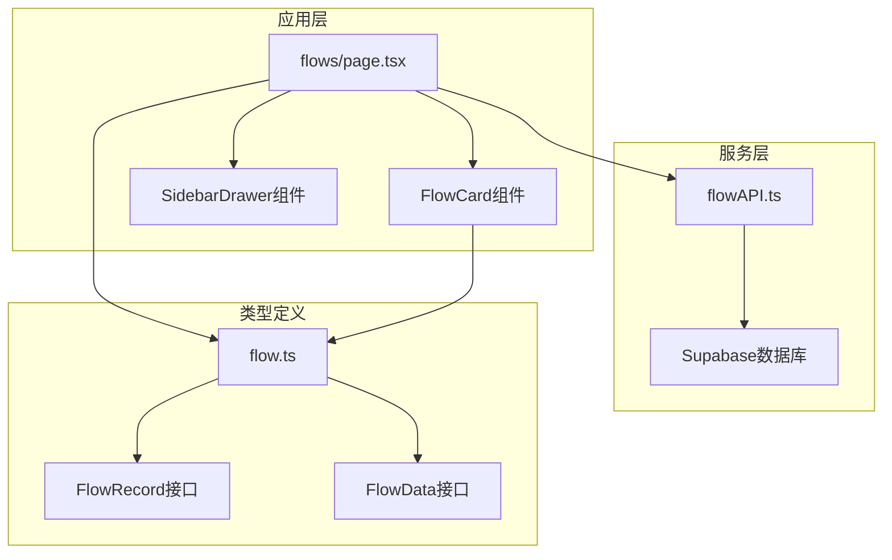

**图表来源**
- [src/app/flows/page.tsx](file://src/app/flows/page.tsx#L1-L147)
- [src/services/flowAPI.ts](file://src/services/flowAPI.ts#L1-L240)
- [src/types/flow.ts](file://src/types/flow.ts#L65-L77)

**章节来源**
- [src/app/flows/page.tsx](file://src/app/flows/page.tsx#L1-L147)
- [src/services/flowAPI.ts](file://src/services/flowAPI.ts#L1-L240)

## 核心组件

流程列表页面由多个核心组件构成，每个组件都有明确的职责分工：

### 主要组件组成

1. **FlowsPage 组件**：页面的主要容器，负责数据获取和状态管理
2. **FlowCard 组件**：单个工作流卡片，提供编辑、删除等操作
3. **SidebarDrawer 组件**：侧边导航抽屉，提供快速访问功能
4. **flowAPI 服务**：数据访问层，封装了所有与后端的交互逻辑

### 组件关系图

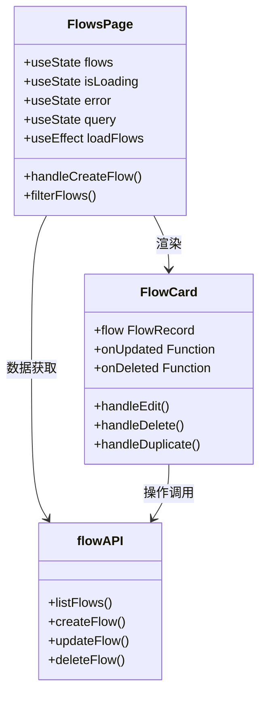

**图表来源**
- [src/app/flows/page.tsx](file://src/app/flows/page.tsx#L12-L147)
- [src/components/flows/FlowCard.tsx](file://src/components/flows/FlowCard.tsx#L24-L208)
- [src/services/flowAPI.ts](file://src/services/flowAPI.ts#L10-L240)

**章节来源**
- [src/app/flows/page.tsx](file://src/app/flows/page.tsx#L12-L147)
- [src/components/flows/FlowCard.tsx](file://src/components/flows/FlowCard.tsx#L24-L208)

## 架构概览

流程列表页面采用了现代的前端架构模式，结合了 React Hooks、TypeScript 类型系统和 Next.js 的路由机制：

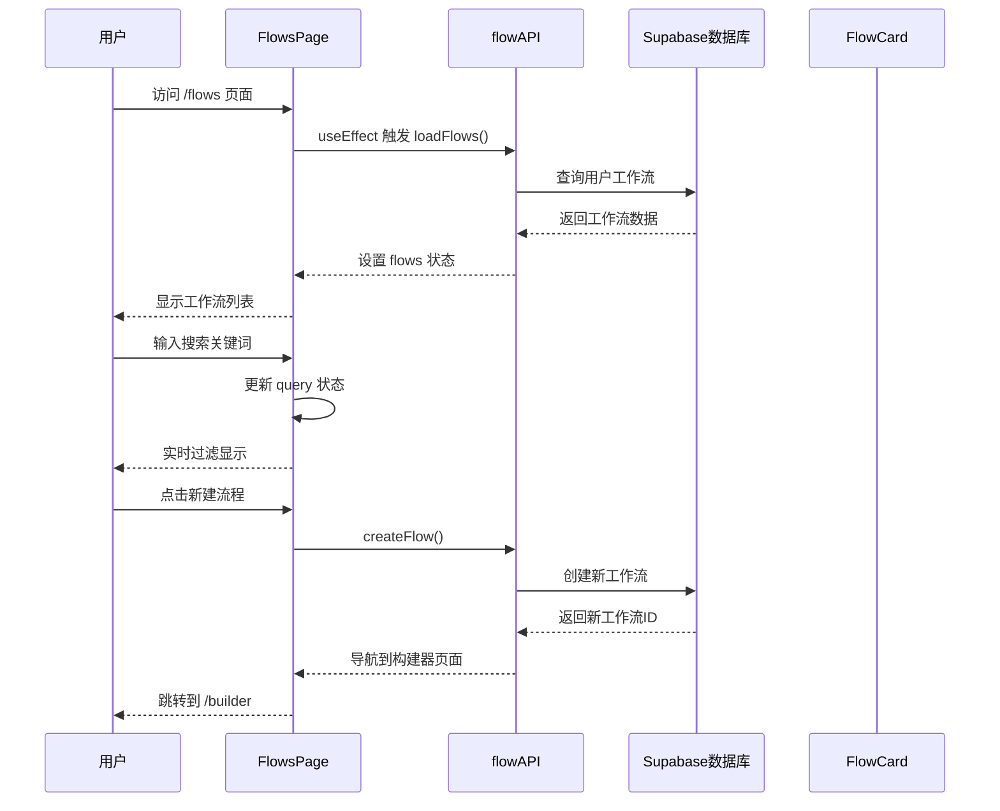

**图表来源**
- [src/app/flows/page.tsx](file://src/app/flows/page.tsx#L19-L35)
- [src/services/flowAPI.ts](file://src/services/flowAPI.ts#L14-L70)
- [src/app/flows/page.tsx](file://src/app/flows/page.tsx#L37-L49)

## 详细组件分析

### FlowsPage 主页面组件

FlowsPage 是整个流程列表的核心组件，负责管理页面的状态和用户交互：

#### 状态管理机制

组件使用了四个关键的状态变量来管理不同的数据状态：

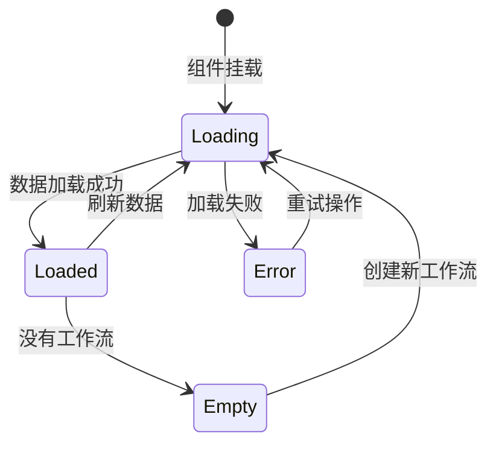

**图表来源**
- [src/app/flows/page.tsx](file://src/app/flows/page.tsx#L14-L17)

#### 数据获取流程

组件在挂载时自动触发数据加载，使用 `useEffect` 钩子确保只执行一次：

**章节来源**
- [src/app/flows/page.tsx](file://src/app/flows/page.tsx#L19-L35)

### FlowCard 工作流卡片组件

FlowCard 组件为每个工作流提供详细的视图和操作功能：

#### 卡片功能特性

1. **基本信息展示**：显示工作流名称、描述、节点数量和更新时间
2. **图标系统**：支持自定义图标（表情符号、Lucide 图标、自定义图片）
3. **操作菜单**：提供编辑、删除、复制等操作选项
4. **交互动画**：鼠标悬停时显示操作按钮

#### 图标渲染逻辑

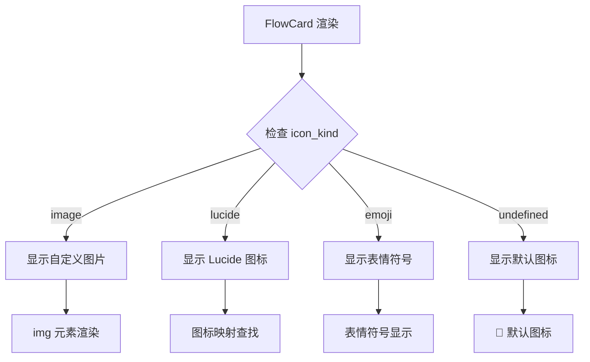

**图表来源**
- [src/components/flows/FlowCard.tsx](file://src/components/flows/FlowCard.tsx#L77-L91)

**章节来源**
- [src/components/flows/FlowCard.tsx](file://src/components/flows/FlowCard.tsx#L24-L208)

## 数据获取与状态管理

### useEffect 数据加载机制

页面使用 `useEffect` 钩子在组件挂载时自动加载工作流数据：

#### 加载流程详解

1. **初始化状态**：设置 `isLoading` 为 true，清除之前的错误状态
2. **API 调用**：调用 `flowAPI.listFlows()` 获取用户工作流
3. **错误处理**：捕获异常并设置错误状态
4. **状态更新**：无论成功还是失败，都结束加载状态

#### 错误处理策略

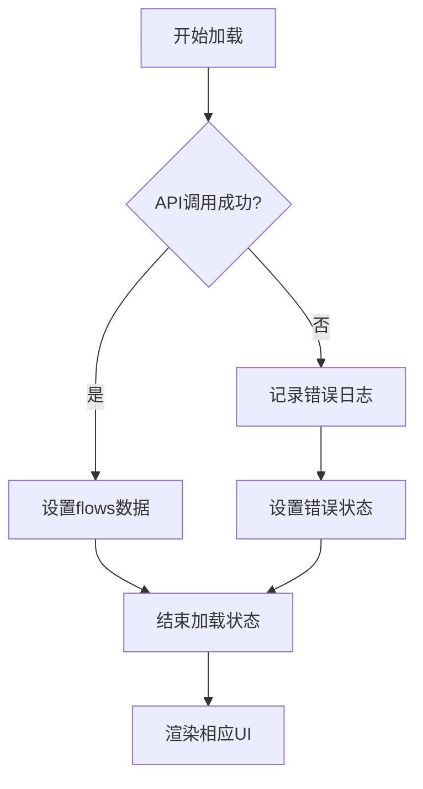

**图表来源**
- [src/app/flows/page.tsx](file://src/app/flows/page.tsx#L23-L35)

**章节来源**
- [src/app/flows/page.tsx](file://src/app/flows/page.tsx#L19-L35)

### flowAPI 服务层设计

flowAPI 作为数据访问层，提供了完整的 CRUD 操作：

#### 核心方法功能

| 方法名 | 功能描述 | 参数 | 返回值 |
|--------|----------|------|--------|
| listFlows | 获取用户工作流列表 | ownerId?: string | Promise\<FlowRecord[]\> |
| getFlow | 获取单个工作流详情 | id: string | Promise\<FlowRecord \| null\> |
| createFlow | 创建新工作流 | name, flowData, ownerId, description? | Promise\<FlowRecord\> |
| updateFlow | 更新工作流信息 | id, updates | Promise\<FlowRecord\> |
| deleteFlow | 删除工作流 | id: string | Promise\<void\> |

**章节来源**
- [src/services/flowAPI.ts](file://src/services/flowAPI.ts#L14-L240)

## 搜索过滤功能

### useState 状态管理

搜索功能通过 `useState` 管理查询字符串状态：

#### 状态同步机制

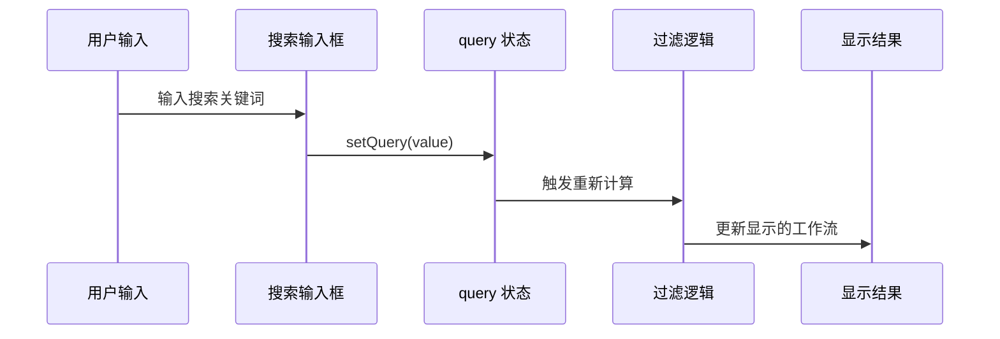

**图表来源**
- [src/app/flows/page.tsx](file://src/app/flows/page.tsx#L76-L77)

### useMemo 性能优化

为了提高搜索性能，使用 `useMemo` 缓存过滤结果：

#### 优化策略

1. **依赖追踪**：只在 `flows` 或 `query` 变化时重新计算
2. **浅比较**：避免不必要的重新渲染
3. **计算分离**：将复杂的过滤逻辑从渲染函数中分离

#### 过滤算法

搜索功能支持对工作流名称和描述的模糊匹配：

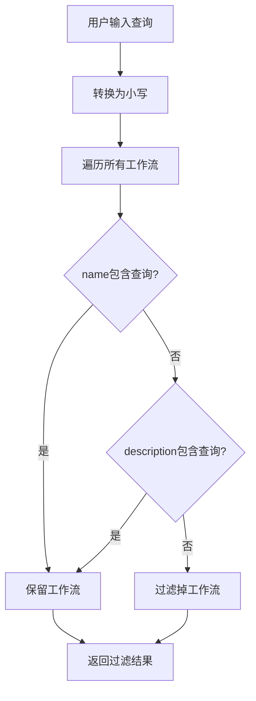

**图表来源**
- [src/app/flows/page.tsx](file://src/app/flows/page.tsx#L52)

**章节来源**
- [src/app/flows/page.tsx](file://src/app/flows/page.tsx#L16-L17)
- [src/app/flows/page.tsx](file://src/app/flows/page.tsx#L52)

## 错误处理与恢复机制

### 多层次错误处理

页面实现了完整的错误处理机制，包括加载错误、操作错误和网络错误：

#### 错误状态管理

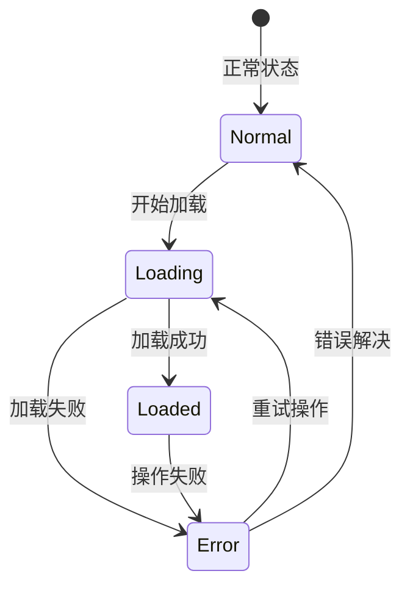

**图表来源**
- [src/app/flows/page.tsx](file://src/app/flows/page.tsx#L15-L17)

#### 错误恢复机制

1. **重试按钮**：错误状态下提供重试按钮
2. **自动重试**：某些情况下自动触发重试
3. **降级处理**：在错误状态下提供基本功能

#### 错误类型分类

| 错误类型 | 处理方式 | 用户体验 |
|----------|----------|----------|
| 网络错误 | 显示重试按钮 | 提供手动重试机会 |
| 数据格式错误 | 记录日志并降级 | 显示部分功能 |
| 权限错误 | 引导用户登录 | 提供登录入口 |
| 服务器错误 | 显示通用错误信息 | 建议联系支持 |

**章节来源**
- [src/app/flows/page.tsx](file://src/app/flows/page.tsx#L23-L35)
- [src/app/flows/page.tsx](file://src/app/flows/page.tsx#L89-L100)

## 用户交互与导航

### 新建流程功能

新建流程功能通过 `handleCreateFlow` 方法实现：

#### 创建流程流程

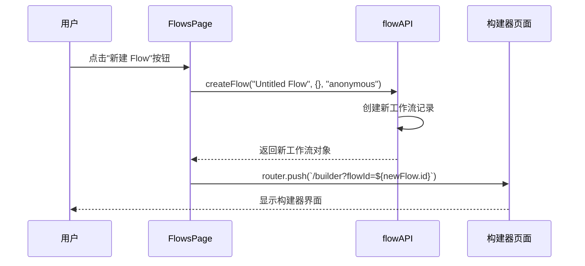

**图表来源**
- [src/app/flows/page.tsx](file://src/app/flows/page.tsx#L37-L49)

### 导航系统

页面集成了完整的导航系统，包括：

1. **面包屑导航**：显示当前页面位置
2. **侧边栏导航**：提供快速访问功能
3. **按钮导航**：首页、新建流程等快捷操作

#### 导航状态管理

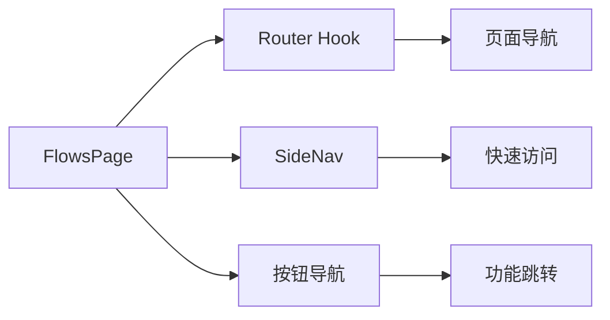

**图表来源**
- [src/app/flows/page.tsx](file://src/app/flows/page.tsx#L13)
- [src/app/flows/page.tsx](file://src/app/flows/page.tsx#L79-L84)

**章节来源**
- [src/app/flows/page.tsx](file://src/app/flows/page.tsx#L37-L49)
- [src/app/flows/page.tsx](file://src/app/flows/page.tsx#L79-L84)

## 性能优化策略

### useMemo 优化

页面使用 `useMemo` 对过滤逻辑进行优化：

#### 优化效果

1. **减少计算开销**：避免每次渲染都重新计算过滤结果
2. **提升响应速度**：搜索操作更加流畅
3. **降低 CPU 使用率**：减少不必要的 JavaScript 执行

### 状态更新优化

#### 批量状态更新

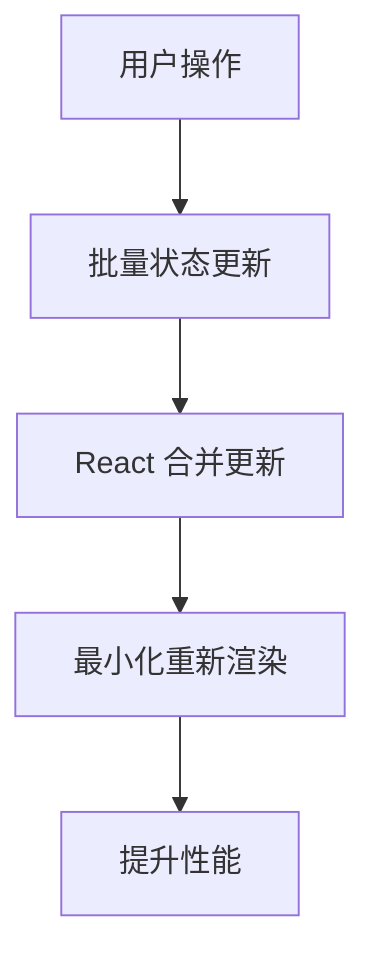

**图表来源**
- [src/app/flows/page.tsx](file://src/app/flows/page.tsx#L52)

### 组件懒加载

页面使用动态导入来优化初始加载性能：

#### 懒加载策略

1. **按需加载**：只在需要时加载组件
2. **代码分割**：减少初始包大小
3. **并行加载**：同时加载多个模块

**章节来源**
- [src/app/flows/page.tsx](file://src/app/flows/page.tsx#L52)
- [src/components/ui/sidebar-drawer.tsx](file://src/components/ui/sidebar-drawer.tsx#L50-L86)

## 总结

流程列表路由页面展现了现代 React 应用的最佳实践，通过以下关键特性提供了优秀的用户体验：

### 技术亮点

1. **完整的状态管理**：使用 React Hooks 实现了清晰的状态管理
2. **智能的性能优化**：通过 useMemo 和状态合并提升性能
3. **健壮的错误处理**：多层次的错误处理和恢复机制
4. **流畅的用户交互**：实时搜索和即时反馈
5. **模块化的设计**：清晰的组件分层和职责分离

### 架构优势

- **可维护性**：清晰的代码结构和类型定义
- **可扩展性**：模块化设计便于功能扩展
- **可测试性**：独立的组件和服务便于单元测试
- **用户体验**：响应式设计和流畅的交互

### 最佳实践体现

1. **TypeScript 类型安全**：完整的类型定义确保代码质量
2. **错误边界处理**：优雅的错误处理机制
3. **性能优化**：合理的优化策略提升用户体验
4. **可访问性**：符合 Web 可访问性标准

这个流程列表页面不仅是一个功能完整的工具，更是现代前端开发最佳实践的优秀范例，展示了如何构建高质量、高性能的 Web 应用程序。