# 路由与导航结构

<cite>
**本文档引用的文件**
- [layout.tsx](file://src/app/layout.tsx)
- [page.tsx](file://src/app/page.tsx)
- [app/page.tsx](file://src/app/app/page.tsx)
- [builder/page.tsx](file://src/app/builder/page.tsx)
- [builder/[id]/page.tsx](file://src/app/builder/[id]/page.tsx)
- [flows/page.tsx](file://src/app/flows/page.tsx)
- [flowAPI.ts](file://src/services/flowAPI.ts)
- [flowStore.ts](file://src/store/flowStore.ts)
- [sidebar-drawer.tsx](file://src/components/ui/sidebar-drawer.tsx)
- [route.ts](file://src/app/api/run-node/route.ts)
- [route.ts](file://src/app/api/modify-flow/route.ts)
- [flow.ts](file://src/types/flow.ts)
</cite>

## 目录
1. [项目概述](#项目概述)
2. [App Router架构](#app-router架构)
3. [路由层次结构](#路由层次结构)
4. [全局布局系统](#全局布局系统)
5. [页面组件分析](#页面组件分析)
6. [导航逻辑与路由参数](#导航逻辑与路由参数)
7. [数据获取策略](#数据获取策略)
8. [动态路由处理](#动态路由处理)
9. [最佳实践与错误处理](#最佳实践与错误处理)
10. [总结](#总结)

## 项目概述

Flash Flow是一个基于Next.js App Router构建的AI工作流设计器应用，采用现代化的路由架构和状态管理模式。该应用提供了从工作流设计到执行的完整体验，包含首页、工作流构建器、流程列表等多个核心功能模块。

## App Router架构

Next.js App Router采用了全新的文件系统路由模式，通过文件夹结构自动映射URL路径。本项目的核心路由结构体现了清晰的功能分离和用户体验设计。

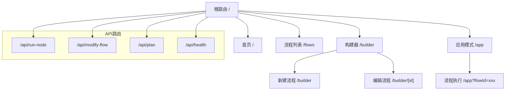

**图表来源**
- [layout.tsx](file://src/app/layout.tsx#L1-L31)
- [page.tsx](file://src/app/page.tsx#L1-L85)
- [builder/page.tsx](file://src/app/builder/page.tsx#L1-L208)
- [flows/page.tsx](file://src/app/flows/page.tsx#L1-L147)

## 路由层次结构

### 根级路由映射

| 路径 | 组件 | 功能描述 |
|------|------|----------|
| `/` | `src/app/page.tsx` | 应用首页，提供AI提示输入和快速创建入口 |
| `/app` | `src/app/app/page.tsx` | 流程执行界面，支持实时对话和流程运行 |
| `/builder` | `src/app/builder/page.tsx` | 工作流构建器主界面 |
| `/builder/[id]` | `src/app/builder/[id]/page.tsx` | 具体流程的编辑页面 |
| `/flows` | `src/app/flows/page.tsx` | 流程列表管理页面 |

### 动态路由处理

动态路由通过方括号语法实现，支持可变参数的捕获和处理：

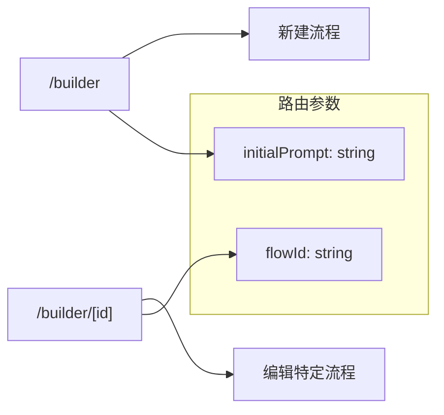

**节来源**
- [builder/page.tsx](file://src/app/builder/page.tsx#L21-L42)
- [builder/[id]/page.tsx](file://src/app/builder/[id]/page.tsx#L1-L97)

## 全局布局系统

### Layout组件架构

全局布局通过RootLayout组件实现，提供统一的基础结构和样式：

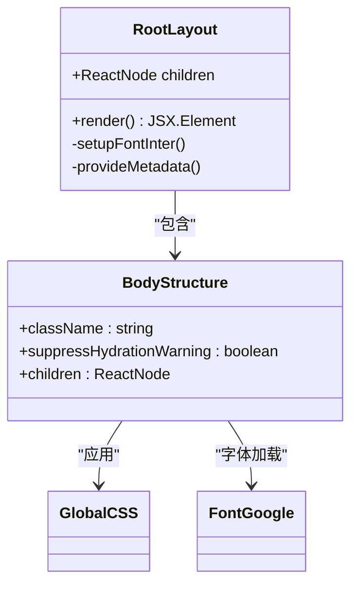

**图表来源**
- [layout.tsx](file://src/app/layout.tsx#L16-L30)

### 布局特性

- **字体系统**: 使用Google Fonts的Inter字体，提供良好的可读性
- **CSS变量**: 定义全局字体变量，支持主题定制
- **水合警告抑制**: 处理客户端服务端渲染差异
- **全局样式**: 包含XYFlow React库样式和应用全局样式

**节来源**
- [layout.tsx](file://src/app/layout.tsx#L1-L31)

## 页面组件分析

### 首页页面 (/)

首页作为应用的主要入口点，提供直观的用户交互体验：

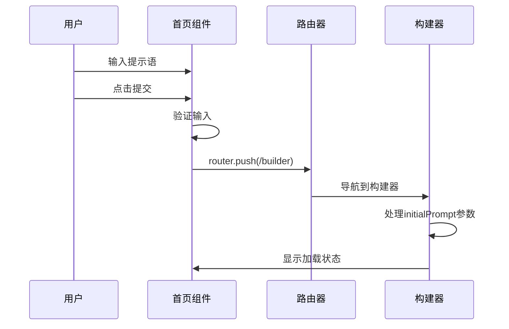

**图表来源**
- [page.tsx](file://src/app/page.tsx#L13-L25)

### 构建器页面 (/builder)

构建器是应用的核心功能模块，支持流程的设计和编辑：

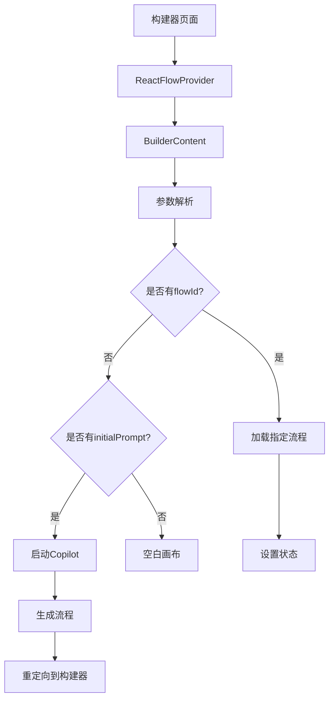

**图表来源**
- [builder/page.tsx](file://src/app/builder/page.tsx#L44-L82)

### 流程列表页面 (/flows)

流程列表页面提供流程的管理和浏览功能：

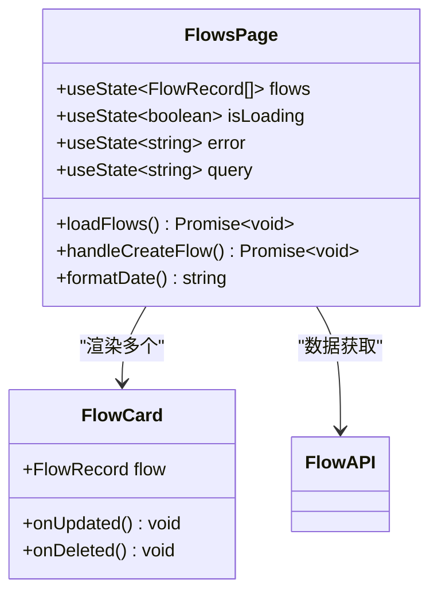

**图表来源**
- [flows/page.tsx](file://src/app/flows/page.tsx#L12-L147)

**节来源**
- [page.tsx](file://src/app/page.tsx#L1-L85)
- [builder/page.tsx](file://src/app/builder/page.tsx#L1-L208)
- [flows/page.tsx](file://src/app/flows/page.tsx#L1-L147)

## 导航逻辑与路由参数

### useRouter Hook使用

应用广泛使用Next.js提供的`useRouter` Hook进行程序化导航：

| 导航场景 | 实现方式 | 参数传递 |
|----------|----------|----------|
| 首页创建流程 | `router.push('/builder?initialPrompt=xxx')` | 查询参数 |
| 编辑流程 | `router.push('/builder?flowId=xxx')` | 查询参数 |
| 返回上一页 | `router.back()` | 无参数 |
| 列表页面 | `router.push('/flows')` | 无参数 |
| 应用模式 | `router.push('/app?flowId=xxx')` | 查询参数 |

### 参数处理机制

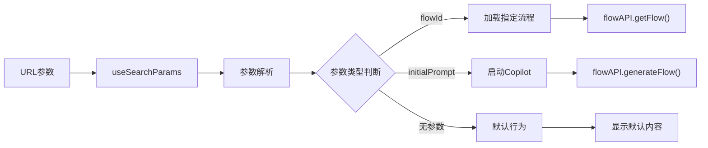

**图表来源**
- [builder/page.tsx](file://src/app/builder/page.tsx#L21-L42)
- [flows/page.tsx](file://src/app/flows/page.tsx#L37-L49)

### 路由替换策略

应用使用多种导航策略以优化用户体验：

- **push**: 用于常规导航，保持浏览器历史记录
- **replace**: 用于参数更新，避免历史记录堆积
- **back**: 用于返回操作，模拟浏览器后退功能

**节来源**
- [builder/page.tsx](file://src/app/builder/page.tsx#L17-L18)
- [flows/page.tsx](file://src/app/flows/page.tsx#L37-L49)
- [sidebar-drawer.tsx](file://src/components/ui/sidebar-drawer.tsx#L42-L43)

## 数据获取策略

### fetch调用与API集成

应用采用声明式数据获取模式，结合React状态管理：

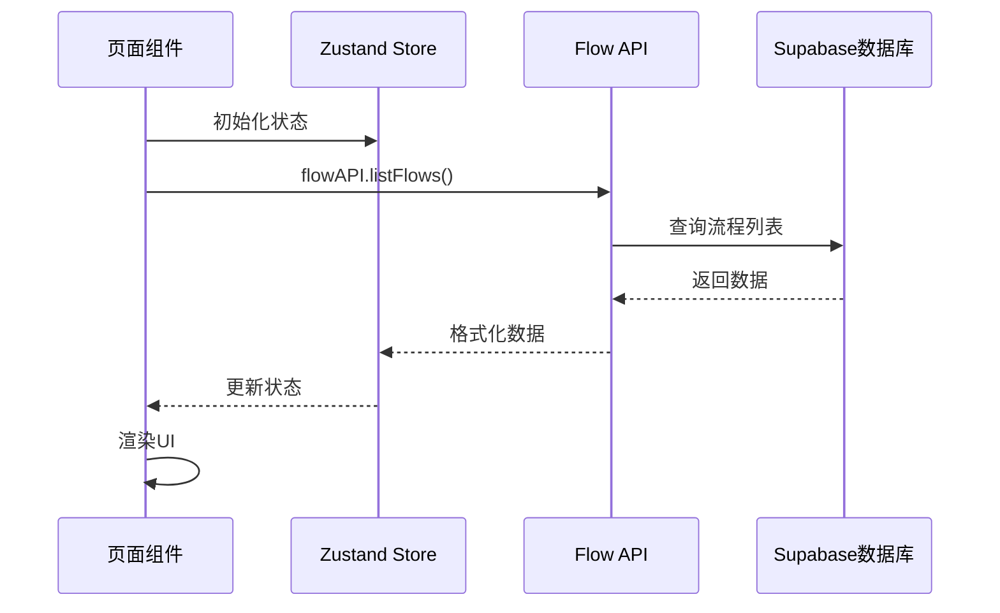

**图表来源**
- [flows/page.tsx](file://src/app/flows/page.tsx#L19-L35)
- [flowAPI.ts](file://src/services/flowAPI.ts#L14-L70)

### 数据获取模式

| 获取场景 | 方法 | 错误处理 | 缓存策略 |
|----------|------|----------|----------|
| 流程列表 | `flowAPI.listFlows()` | 异常捕获 | 内存缓存 |
| 单个流程 | `flowAPI.getFlow(id)` | 404处理 | 按需加载 |
| 流程创建 | `flowAPI.createFlow()` | 表单验证 | 自动保存 |
| 流程更新 | `flowAPI.updateFlow()` | 版本检查 | 防抖保存 |

### 自动保存机制

应用实现了智能的自动保存功能：

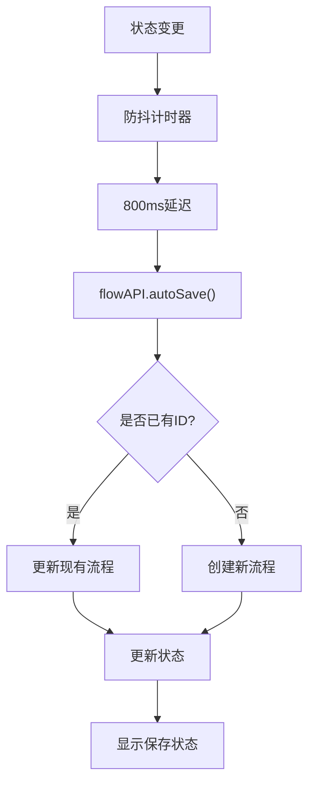

**图表来源**
- [flowStore.ts](file://src/store/flowStore.ts#L50-L74)

**节来源**
- [flows/page.tsx](file://src/app/flows/page.tsx#L19-L35)
- [flowAPI.ts](file://src/services/flowAPI.ts#L14-L240)
- [flowStore.ts](file://src/store/flowStore.ts#L50-L74)

## 动态路由处理

### [id]动态段处理

动态路由参数通过Next.js自动解析和传递：

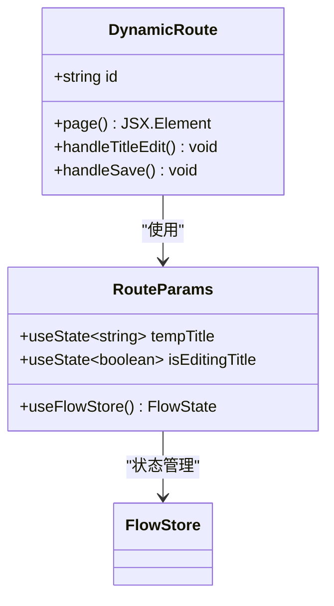

**图表来源**
- [builder/[id]/page.tsx](file://src/app/builder/[id]/page.tsx#L10-L97)

### 参数验证与安全

应用实现了多层参数验证机制：

| 验证层级 | 检查内容 | 处理方式 |
|----------|----------|----------|
| 客户端验证 | 参数格式 | 类型检查 |
| 服务端验证 | 权限控制 | API认证 |
| 数据验证 | 结构完整性 | 运行时检查 |
| 错误边界 | 异常捕获 | 友好提示 |

### 路由守卫

虽然没有显式的路由守卫，但通过条件渲染和状态管理实现了隐式保护：

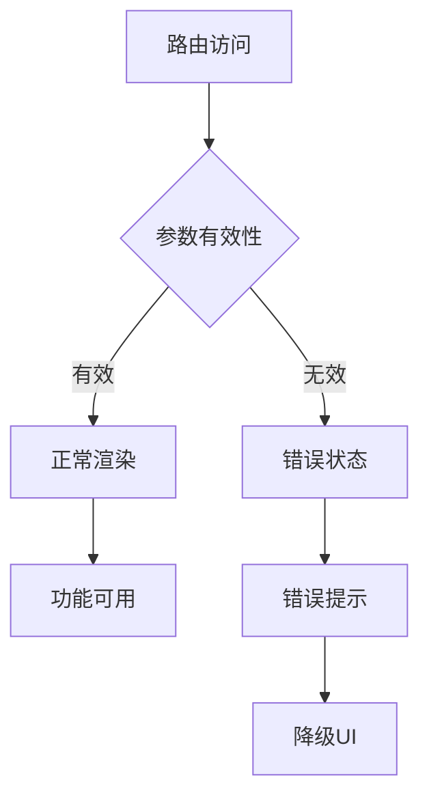

**节来源**
- [builder/[id]/page.tsx](file://src/app/builder/[id]/page.tsx#L1-L97)

## 最佳实践与错误处理

### 导航最佳实践

应用遵循以下导航最佳实践：

1. **参数编码**: 使用`encodeURIComponent()`处理特殊字符
2. **状态同步**: 保持URL参数与应用状态的一致性
3. **用户体验**: 提供加载状态和进度反馈
4. **错误恢复**: 实现重试机制和降级方案

### 错误处理机制

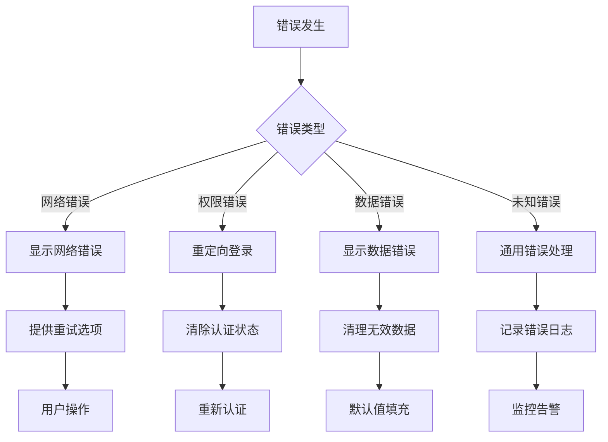

### 性能优化策略

| 优化方面 | 实现方式 | 效果 |
|----------|----------|------|
| 代码分割 | 动态导入 | 减少初始包大小 |
| 懒加载 | React.lazy + Suspense | 提升首屏速度 |
| 防抖处理 | 计时器管理 | 减少API调用频率 |
| 状态缓存 | 内存存储 | 避免重复请求 |

### 可访问性支持

应用实现了完整的可访问性支持：

- **语义化标签**: 正确使用HTML语义元素
- **ARIA属性**: 提供屏幕阅读器支持
- **键盘导航**: 支持全键盘操作
- **焦点管理**: 合理的焦点顺序

**节来源**
- [builder/page.tsx](file://src/app/builder/page.tsx#L34-L82)
- [flows/page.tsx](file://src/app/flows/page.tsx#L89-L100)
- [sidebar-drawer.tsx](file://src/components/ui/sidebar-drawer.tsx#L150-L153)

## 总结

Flash Flow的路由与导航系统展现了现代Next.js应用的最佳实践。通过清晰的路由层次、灵活的参数处理、智能的数据获取策略和完善的错误处理机制，为用户提供了流畅且可靠的使用体验。

### 核心优势

1. **结构清晰**: 基于文件系统的路由映射，易于理解和维护
2. **性能优化**: 通过懒加载和防抖机制提升应用性能
3. **用户体验**: 完善的状态管理和错误处理确保应用稳定性
4. **扩展性强**: 模块化的架构支持功能的平滑扩展

### 技术亮点

- **动态路由**: 灵活的参数处理支持复杂的业务场景
- **状态管理**: 结合React状态和Zustand实现高效的状态同步
- **API集成**: 统一的API层封装，简化数据获取逻辑
- **导航控制**: 程序化导航配合查询参数，提供丰富的交互能力

这套路由与导航系统为AI工作流设计器提供了坚实的技术基础，支撑了从简单流程创建到复杂工作流编排的完整功能需求。