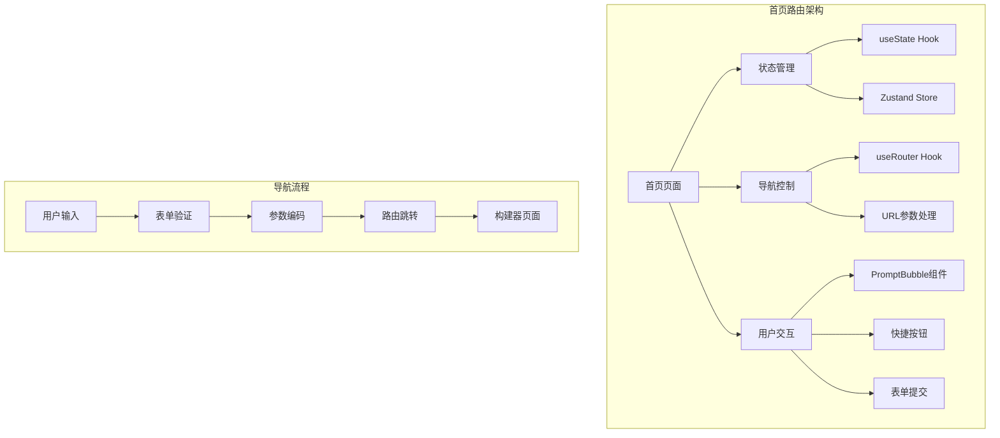
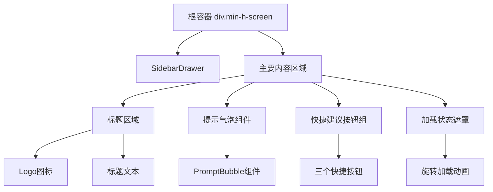
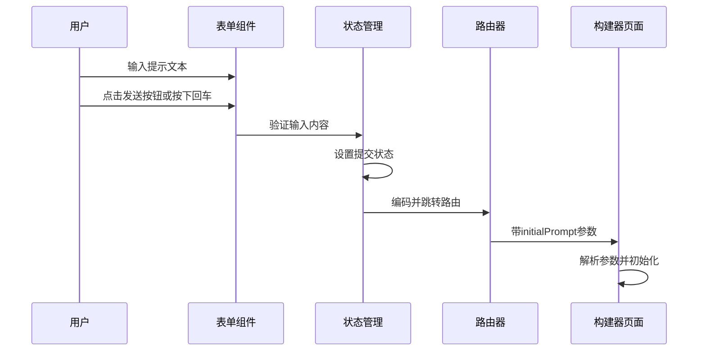
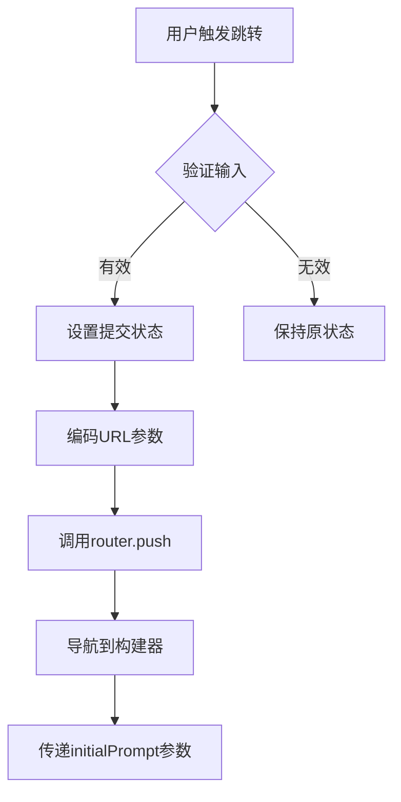
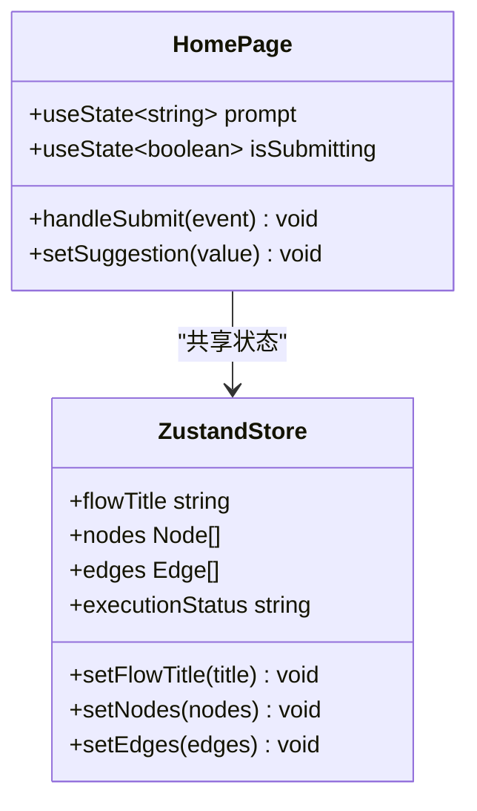
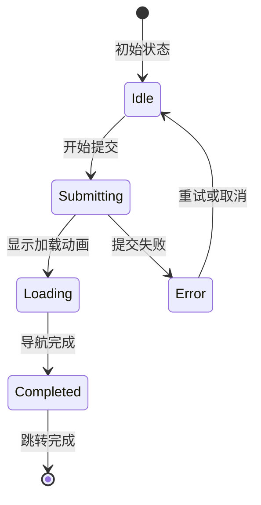
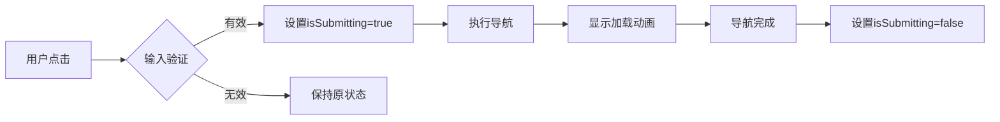
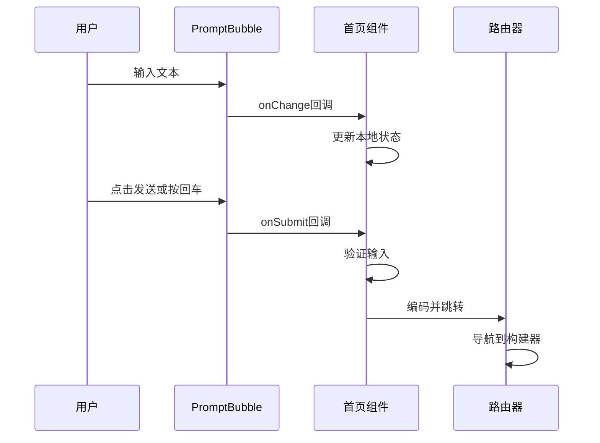

# 首页路由

<cite>
**本文档中引用的文件**
- [src/app/page.tsx](file://src/app/page.tsx)
- [src/components/ui/prompt-bubble.tsx](file://src/components/ui/prompt-bubble.tsx)
- [src/app/layout.tsx](file://src/app/layout.tsx)
- [src/app/builder/page.tsx](file://src/app/builder/page.tsx)
- [src/components/ui/sidebar-drawer.tsx](file://src/components/ui/sidebar-drawer.tsx)
- [src/store/flowStore.ts](file://src/store/flowStore.ts)
</cite>

## 目录
1. [项目概述](#项目概述)
2. [首页路由架构](#首页路由架构)
3. [页面结构分析](#页面结构分析)
4. [用户交互逻辑](#用户交互逻辑)
5. [导航跳转机制](#导航跳转机制)
6. [状态管理集成](#状态管理集成)
7. [路由参数编码最佳实践](#路由参数编码最佳实践)
8. [错误处理与加载状态](#错误处理与加载状态)
9. [PromptBubble组件协同工作流程](#promptbubble组件协同工作流程)
10. [性能优化考虑](#性能优化考虑)
11. [总结](#总结)

## 项目概述

Flash Flow是一个基于Next.js构建的可视化工作流构建平台，首页作为用户的主要入口点，提供了直观的提示输入界面和快速开始功能。首页路由实现了从用户输入到构建器页面的无缝导航体验，支持多种交互方式和状态管理。

## 首页路由架构

首页路由采用Next.js 14的App Router架构，使用客户端组件模式，集成了现代React Hooks和状态管理技术。



**图表来源**
- [src/app/page.tsx](file://src/app/page.tsx#L1-L85)
- [src/store/flowStore.ts](file://src/store/flowStore.ts#L1-L131)

**章节来源**
- [src/app/page.tsx](file://src/app/page.tsx#L1-L85)
- [src/app/layout.tsx](file://src/app/layout.tsx#L1-L31)

## 页面结构分析

首页页面采用简洁的居中布局设计，包含以下核心组件：

### 布局层次结构



**图表来源**
- [src/app/page.tsx](file://src/app/page.tsx#L25-L85)

### 核心组件特性

| 组件 | 功能 | 实现方式 | 样式特点 |
|------|------|----------|----------|
| SidebarDrawer | 侧边导航抽屉 | 客户端组件 | 固定定位，响应式设计 |
| PromptBubble | 提示输入气泡 | 自定义组件 | 可展开的文本区域 |
| 快捷按钮组 | 预设提示建议 | 按钮数组 | 圆角背景，悬停效果 |
| 加载遮罩 | 提交状态指示 | 条件渲染 | 全屏覆盖，居中显示 |

**章节来源**
- [src/app/page.tsx](file://src/app/page.tsx#L25-L85)

## 用户交互逻辑

首页提供了多种用户交互方式，确保不同使用习惯的用户都能快速开始工作流构建。

### 表单提交流程



**图表来源**
- [src/app/page.tsx](file://src/app/page.tsx#L13-L19)
- [src/components/ui/prompt-bubble.tsx](file://src/components/ui/prompt-bubble.tsx#L31-L40)

### 键盘交互支持

PromptBubble组件支持丰富的键盘操作：

| 操作 | 快捷键 | 功能 |
|------|--------|------|
| 发送提示 | Enter | 触发表单提交 |
| 新行插入 | Shift+Enter | 在当前行后换行 |
| 输入验证 | 实时 | 禁用发送按钮直到有有效输入 |

**章节来源**
- [src/components/ui/prompt-bubble.tsx](file://src/components/ui/prompt-bubble.tsx#L31-L40)

## 导航跳转机制

首页使用Next.js的`useRouter` Hook实现客户端导航，支持参数化路由跳转。

### 路由跳转实现



**图表来源**
- [src/app/page.tsx](file://src/app/page.tsx#L13-L19)

### 路由参数传递

首页通过以下方式传递参数：

1. **表单提交路径**：`/builder?initialPrompt=${encodeURIComponent(prompt)}`
2. **快捷按钮路径**：`/builder?initialPrompt=预设提示`
3. **错误处理路径**：`/builder`（无参数）

**章节来源**
- [src/app/page.tsx](file://src/app/page.tsx#L13-L19)

## 状态管理集成

首页集成了React的本地状态管理和Zustand全局状态管理。

### 本地状态管理



**图表来源**
- [src/app/page.tsx](file://src/app/page.tsx#L8-L11)
- [src/store/flowStore.ts](file://src/store/flowStore.ts#L17-L47)

### 状态同步机制

| 状态类型 | 存储位置 | 更新时机 | 同步方式 |
|----------|----------|----------|----------|
| 用户输入 | 本地状态 | 实时更新 | useState hook |
| 提交状态 | 本地状态 | 操作时更新 | useState hook |
| 全局状态 | Zustand store | 流程执行时 | store actions |
| 路由状态 | Next.js router | 导航时更新 | useRouter hook |

**章节来源**
- [src/app/page.tsx](file://src/app/page.tsx#L8-L11)
- [src/store/flowStore.ts](file://src/store/flowStore.ts#L17-L47)

## 路由参数编码最佳实践

首页严格遵循URL编码规范，确保特殊字符的安全传输。

### 编码实现方式

```typescript
// 正确的编码方式
router.push(`/builder?initialPrompt=${encodeURIComponent(prompt)}`);

// 错误的方式（不推荐）
router.push(`/builder?initialPrompt=${prompt}`);
```

### 编码规则应用

| 字符类型 | 编码前 | 编码后 | 用途 |
|----------|--------|--------|------|
| 空格 | ` ` | `%20` | 用户输入中的空白字符 |
| 特殊符号 | `!@#$%^&*()` | `%21%40%23%24%25%5E%26%2A%28%29` | 包含特殊字符的提示 |
| 中文字符 | `你好` | `%E4%BD%A0%E5%A5%BD` | 多语言支持 |
| URL分隔符 | `?&=` | `%3F%26%3D` | 避免参数冲突 |

### 安全性考虑

1. **输入验证**：在编码前检查输入的有效性
2. **长度限制**：避免过长的查询参数
3. **字符过滤**：移除潜在危险字符
4. **错误恢复**：提供默认值和降级方案

**章节来源**
- [src/app/page.tsx](file://src/app/page.tsx#L16-L17)

## 错误处理与加载状态

首页实现了完善的错误处理和加载状态管理机制。

### 加载状态管理



**图表来源**
- [src/app/page.tsx](file://src/app/page.tsx#L76-L80)

### 错误处理策略

| 错误类型 | 处理方式 | 用户反馈 | 恢复机制 |
|----------|----------|----------|----------|
| 空输入 | 禁用提交按钮 | 无视觉反馈 | 用户修正输入 |
| 网络错误 | 显示错误提示 | 加载遮罩 | 重新尝试 |
| 参数编码错误 | 使用默认值 | 控制台日志 | 自动修复 |
| 路由跳转失败 | 降级处理 | 页面刷新 | 手动重试 |

### 加载状态实现



**图表来源**
- [src/app/page.tsx](file://src/app/page.tsx#L76-L80)

**章节来源**
- [src/app/page.tsx](file://src/app/page.tsx#L76-L80)

## PromptBubble组件协同工作流程

PromptBubble组件与首页路由形成了紧密的协作关系，提供了流畅的用户体验。

### 组件交互流程



**图表来源**
- [src/app/page.tsx](file://src/app/page.tsx#L44-L52)
- [src/components/ui/prompt-bubble.tsx](file://src/components/ui/prompt-bubble.tsx#L18-L30)

### 组件属性映射

| 属性名称 | 类型 | 来源 | 用途 |
|----------|------|------|------|
| value | string | 本地状态 | 绑定输入框内容 |
| onChange | function | 本地状态 | 更新输入值 |
| onSubmit | function | 本地状态 | 处理提交事件 |
| placeholder | string | 组件属性 | 提示文本显示 |

### 响应式行为

PromptBubble组件具有智能的响应式行为：

1. **自动展开**：当输入内容超过单行时自动扩展
2. **内容截断检测**：检测内容是否被截断并调整显示
3. **键盘事件处理**：支持Enter和Shift+Enter组合键
4. **禁用状态管理**：根据输入内容动态启用/禁用发送按钮

**章节来源**
- [src/components/ui/prompt-bubble.tsx](file://src/components/ui/prompt-bubble.tsx#L18-L113)

## 性能优化考虑

首页路由实现了多项性能优化措施，确保良好的用户体验。

### 渲染优化

1. **条件渲染**：仅在需要时渲染加载状态
2. **懒加载**：侧边栏抽屉组件按需加载
3. **防抖处理**：输入验证和状态更新的防抖机制
4. **内存管理**：及时清理定时器和事件监听器

### 网络优化

1. **参数压缩**：合理使用URL参数长度
2. **缓存策略**：利用浏览器缓存机制
3. **错误边界**：防止组件崩溃影响整体性能
4. **渐进增强**：基础功能优先，高级功能降级

### 用户体验优化

1. **即时反馈**：输入时实时验证和状态更新
2. **平滑过渡**：使用CSS动画和过渡效果
3. **无障碍设计**：支持键盘导航和屏幕阅读器
4. **响应式布局**：适配不同屏幕尺寸

## 总结

Flash Flow的首页路由实现展现了现代Web应用开发的最佳实践。通过精心设计的组件架构、完善的用户交互逻辑和高效的状态管理，为用户提供了流畅的工作流构建入口体验。

### 关键特性总结

1. **多交互入口**：支持表单输入、快捷按钮和键盘操作
2. **安全的参数传递**：严格的URL编码和验证机制
3. **完善的错误处理**：多层次的错误捕获和用户反馈
4. **优秀的用户体验**：即时反馈、平滑过渡和响应式设计
5. **可维护的架构**：清晰的组件分离和状态管理

### 技术亮点

- **Next.js 14 App Router**：充分利用最新的路由和渲染特性
- **React Hooks**：现代化的状态管理和生命周期控制
- **TypeScript**：强类型支持确保代码质量和开发效率
- **Tailwind CSS**：高效的样式开发和主题管理
- **Zustand**：轻量级的状态管理解决方案

这个首页路由不仅是一个功能性的入口点，更是整个应用用户体验的核心体现，展示了如何通过精心设计的技术架构实现优秀的用户价值。