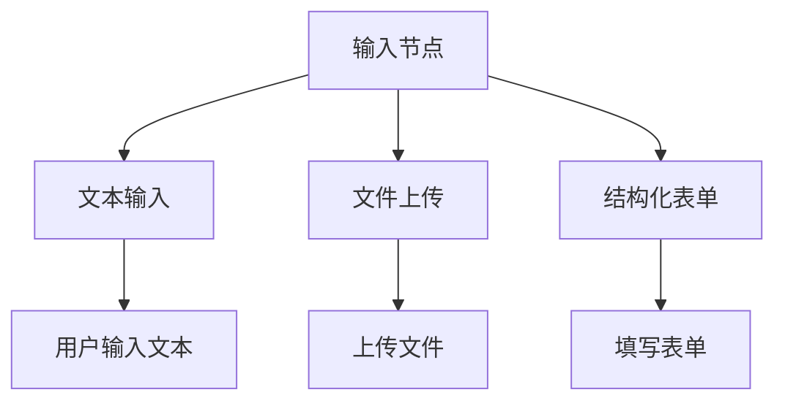
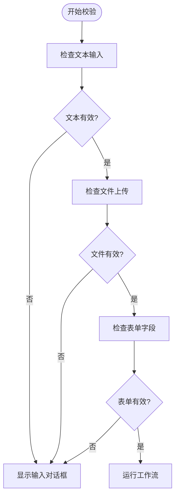
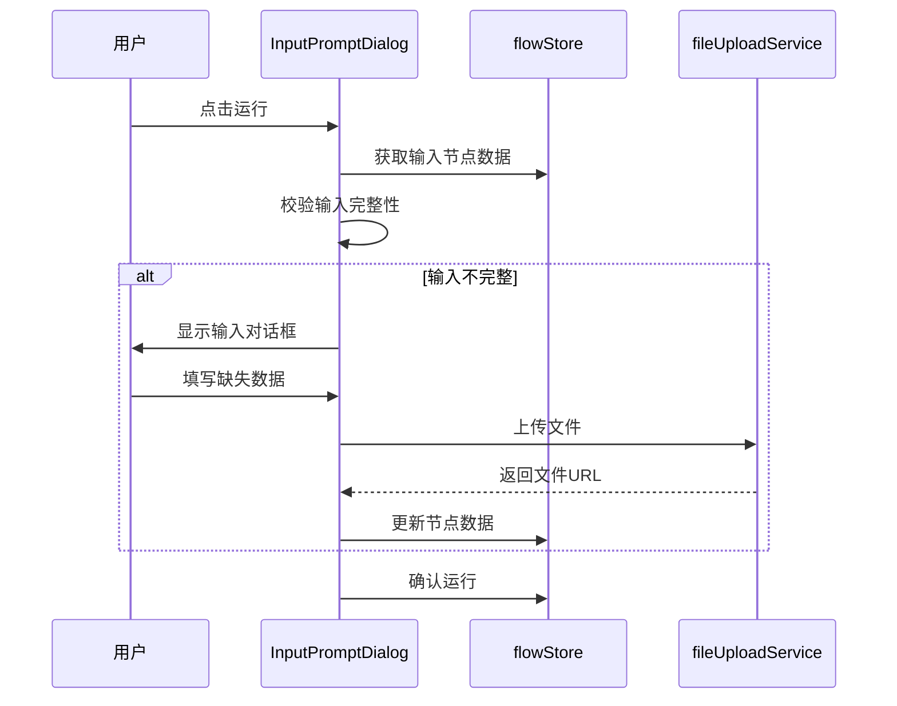

# 输入节点

<cite>
**本文档引用文件**  
- [input节点详情.md](file://docs/design/input节点详情.md)
- [InputNodeExecutor.ts](file://src/store/executors/InputNodeExecutor.ts)
- [flow.ts](file://src/types/flow.ts)
- [InputNodeForm/index.tsx](file://src/components/builder/node-forms/InputNodeForm/index.tsx)
- [InputPromptDialog.tsx](file://src/components/flow/InputPromptDialog.tsx)
- [FileInputSection.tsx](file://src/components/builder/node-forms/InputNodeForm/FileInputSection.tsx)
- [StructuredFormSection.tsx](file://src/components/builder/node-forms/InputNodeForm/StructuredFormSection.tsx)
- [constants.ts](file://src/components/builder/node-forms/InputNodeForm/constants.ts)
- [BaseNodeExecutor.ts](file://src/store/executors/BaseNodeExecutor.ts)
- [index.tsx](file://src/components/apps/FlowAppInterface/index.tsx)
- [flowStore.ts](file://src/store/flowStore.ts)
</cite>

## 目录
1. [简介](#简介)
2. [核心功能](#核心功能)
3. [参数配置](#参数配置)
4. [运行时校验机制](#运行时校验机制)
5. [输出数据结构](#输出数据结构)
6. [实现原理](#实现原理)
7. [用户界面交互](#用户界面交互)
8. [最佳实践](#最佳实践)

## 简介

输入节点是工作流中的用户输入入口，支持文本输入、文件上传和结构化表单三种模式。该节点在构建器中配置，在运行时收集用户输入数据，并将其传递给后续节点进行处理。

**Section sources**
- [input节点详情.md](file://docs/design/input节点详情.md#L1-L255)

## 核心功能

输入节点提供三种输入模式：
- **文本输入**：基础的文本内容输入框
- **文件上传**：支持多种文件类型的上传功能
- **结构化表单**：可配置的表单字段，支持文本、单选和多选类型

这些模式可以单独使用或组合使用，满足不同场景下的用户输入需求。



**Diagram sources**
- [input节点详情.md](file://docs/design/input节点详情.md#L3-L255)
- [InputNodeForm/index.tsx](file://src/components/builder/node-forms/InputNodeForm/index.tsx#L24-L210)

**Section sources**
- [input节点详情.md](file://docs/design/input节点详情.md#L3-L255)

## 参数配置

### 基础参数

| 参数名 | 类型 | 必填 | 默认值 | 描述 |
|-------|------|-----|-------|------|
| `label` | string | ✅ | - | 节点显示名称 |
| `enableTextInput` | boolean | ❌ | `true` | 启用文本输入框 |
| `enableFileInput` | boolean | ❌ | `false` | 启用文件上传 |
| `enableStructuredForm` | boolean | ❌ | `false` | 启用结构化表单 |
| `greeting` | string | ❌ | `""` | 招呼语/欢迎语，在对话页面显示，引导用户使用 |

### 文件上传配置

当启用文件上传时，`fileConfig` 对象包含以下参数：

| 参数名 | 类型 | 默认值 | 描述 |
|-------|------|-------|------|
| `allowedTypes` | string[] | `["*/*"]` | 允许的文件类型列表 |
| `maxSizeMB` | number | `100` | 单文件最大体积 (MB) |
| `maxCount` | number | `10` | 最大文件数量 |

支持的文件类型包括图片、PDF、Word、Excel、文本文件等。

### 结构化表单配置

`formFields` 数组定义表单字段，每个字段包含：

| 字段参数 | 类型 | 必填 | 描述 |
|---------|------|-----|------|
| `type` | string | ✅ | 字段类型：`"text"` / `"select"` / `"multi-select"` |
| `name` | string | ✅ | 变量名 |
| `label` | string | ✅ | 显示标签 |
| `required` | boolean | ❌ | 是否必填 |

**Section sources**
- [input节点详情.md](file://docs/design/input节点详情.md#L8-L82)
- [flow.ts](file://src/types/flow.ts#L92-L111)
- [InputNodeForm/index.tsx](file://src/components/builder/node-forms/InputNodeForm/index.tsx#L24-L210)

## 运行时校验机制

点击"运行 Flow"时，系统会自动检查输入数据的完整性。如果存在缺失情况，会弹出输入对话框。

### 校验规则

1. **文本未填**：启用了文本输入但内容为空
2. **文件未上传**：启用了文件上传但未选择文件
3. **必填字段缺失**：启用了结构化表单且存在必填字段未填写



**Diagram sources**
- [InputPromptDialog.tsx](file://src/components/flow/InputPromptDialog.tsx#L61-L140)
- [input节点详情.md](file://docs/design/input节点详情.md#L83-L137)

**Section sources**
- [InputPromptDialog.tsx](file://src/components/flow/InputPromptDialog.tsx#L61-L140)
- [input节点详情.md](file://docs/design/input节点详情.md#L83-L137)

## 输出数据结构

输入节点执行后输出以下JSON结构：

```typescript
{
  "user_input": string,                       // 文本输入内容
  
  // 仅在启用文件上传且有文件时存在
  "files"?: [
    {
      "name": string,                         // 文件名
      "size": number,                         // 文件大小 (bytes)
      "type": string,                         // MIME类型
      "url": string                           // 文件访问 URL
    }
  ],
  
  // 仅在启用结构化表单且有填写时存在
  "formData"?: {
    "field_123456": string | string[],       // 字段值
  }
}
```

**Section sources**
- [input节点详情.md](file://docs/design/input节点详情.md#L138-L207)
- [InputNodeExecutor.ts](file://src/store/executors/InputNodeExecutor.ts#L9-L38)

## 实现原理

### 执行器逻辑

`InputNodeExecutor` 类负责执行输入节点，其主要逻辑包括：

- 直接返回配置的数据，无需等待
- 执行时间极短（<10ms）
- 根据启用的功能动态生成输出结构

```mermaid
classDiagram
class BaseNodeExecutor {
+execute(node, context, mockData) Promise~ExecutionResult~
-measureTime(fn) Promise~{result, time}~
-delay(ms) Promise~void~
}
class InputNodeExecutor {
+execute(node, context, mockData) Promise~ExecutionResult~
}
InputNodeExecutor --|> BaseNodeExecutor : 继承
```

**Diagram sources**
- [InputNodeExecutor.ts](file://src/store/executors/InputNodeExecutor.ts#L4-L38)
- [BaseNodeExecutor.ts](file://src/store/executors/BaseNodeExecutor.ts#L12-L25)

**Section sources**
- [InputNodeExecutor.ts](file://src/store/executors/InputNodeExecutor.ts#L4-L38)
- [BaseNodeExecutor.ts](file://src/store/executors/BaseNodeExecutor.ts#L12-L25)

## 用户界面交互

### 构建器界面

在构建器中，用户可以通过表单配置输入节点的各项参数，包括启用/禁用各种输入模式和配置具体选项。

### 运行时界面

在应用界面中，用户可以：
- 输入文本内容
- 上传文件
- 填写结构化表单
- 查看招呼语提示



**Diagram sources**
- [InputPromptDialog.tsx](file://src/components/flow/InputPromptDialog.tsx#L48-L393)
- [index.tsx](file://src/components/apps/FlowAppInterface/index.tsx#L16-L103)
- [flowStore.ts](file://src/store/flowStore.ts#L19-L54)

**Section sources**
- [InputPromptDialog.tsx](file://src/components/flow/InputPromptDialog.tsx#L48-L393)
- [index.tsx](file://src/components/apps/FlowAppInterface/index.tsx#L16-L103)

## 最佳实践

1. **合理组合输入方式**：根据实际场景选择合适的输入模式组合
2. **变量命名规范**：使用有意义的变量名，便于后续引用
3. **招呼语编写技巧**：简洁明了，突出核心功能
4. **文件类型限制**：根据实际需求精确限制文件类型

**Section sources**
- [input节点详情.md](file://docs/design/input节点详情.md#L230-L254)