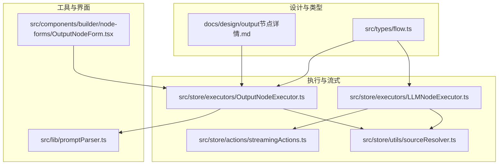
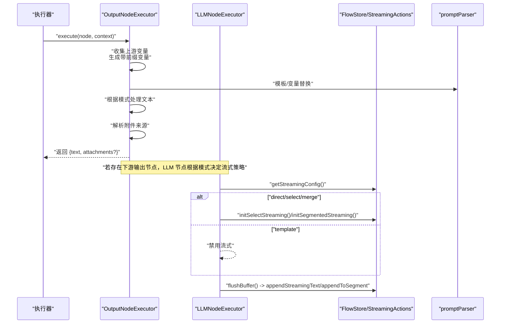
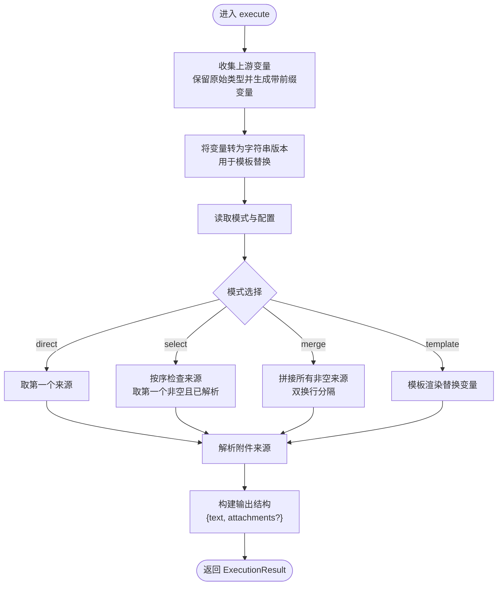
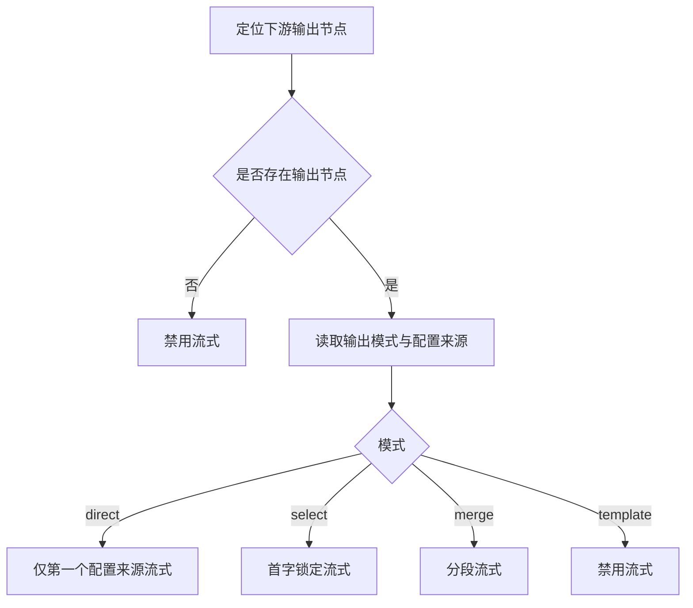
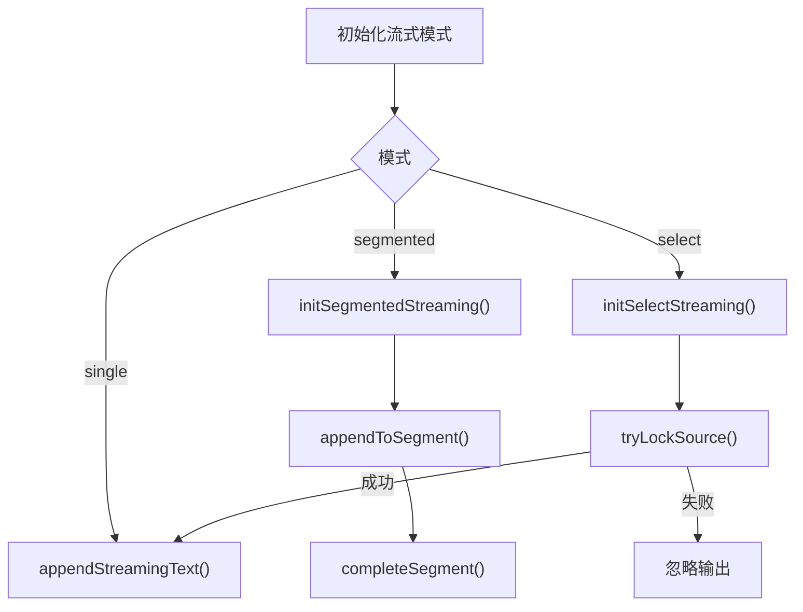
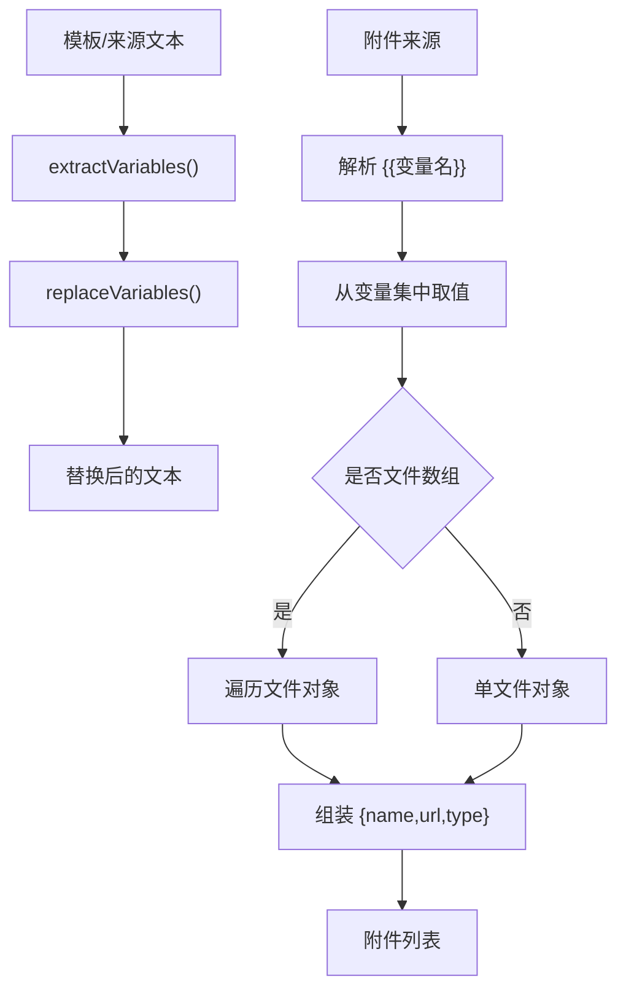
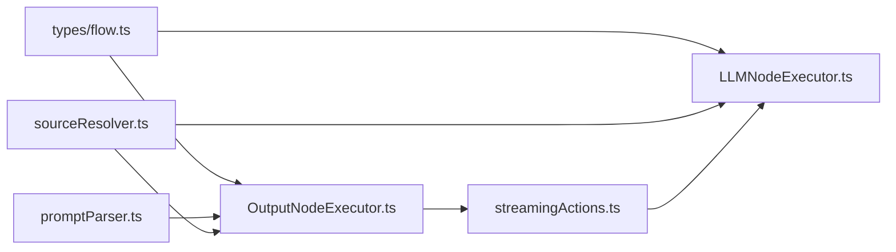

# 输出节点

<cite>
**本文引用的文件**
- [docs/design/output节点详情.md](file://docs/design/output节点详情.md)
- [src/store/executors/OutputNodeExecutor.ts](file://src/store/executors/OutputNodeExecutor.ts)
- [src/store/executors/LLMNodeExecutor.ts](file://src/store/executors/LLMNodeExecutor.ts)
- [src/store/actions/streamingActions.ts](file://src/store/actions/streamingActions.ts)
- [src/lib/promptParser.ts](file://src/lib/promptParser.ts)
- [src/types/flow.ts](file://src/types/flow.ts)
- [src/store/utils/sourceResolver.ts](file://src/store/utils/sourceResolver.ts)
- [src/components/builder/node-forms/OutputNodeForm.tsx](file://src/components/builder/node-forms/OutputNodeForm.tsx)
</cite>

## 目录
1. [简介](#简介)
2. [项目结构](#项目结构)
3. [核心组件](#核心组件)
4. [架构总览](#架构总览)
5. [详细组件分析](#详细组件分析)
6. [依赖关系分析](#依赖关系分析)
7. [性能考量](#性能考量)
8. [故障排查指南](#故障排查指南)
9. [结论](#结论)
10. [附录](#附录)

## 简介
输出节点是工作流的最终出口，负责从上游节点收集变量，依据配置的输出模式（direct/select/merge/template）处理文本内容，并可选择性地返回附件文件。它确保前端能够正确显示最终结果与附件，同时支持多种流式输出策略以提升用户体验。

## 项目结构
输出节点相关的核心实现分布在以下位置：
- 设计文档：docs/design/output节点详情.md
- 执行器：src/store/executors/OutputNodeExecutor.ts
- LLM 节点流式配置：src/store/executors/LLMNodeExecutor.ts
- 流式状态管理：src/store/actions/streamingActions.ts
- 变量替换工具：src/lib/promptParser.ts
- 类型定义：src/types/flow.ts
- 源节点解析：src/store/utils/sourceResolver.ts
- Builder 表单：src/components/builder/node-forms/OutputNodeForm.tsx

**图表来源**
- [docs/design/output节点详情.md](file://docs/design/output节点详情.md#L1-L567)
- [src/store/executors/OutputNodeExecutor.ts](file://src/store/executors/OutputNodeExecutor.ts#L1-L232)
- [src/store/executors/LLMNodeExecutor.ts](file://src/store/executors/LLMNodeExecutor.ts#L1-L502)
- [src/store/actions/streamingActions.ts](file://src/store/actions/streamingActions.ts#L1-L207)
- [src/lib/promptParser.ts](file://src/lib/promptParser.ts#L1-L91)
- [src/types/flow.ts](file://src/types/flow.ts#L1-L342)
- [src/store/utils/sourceResolver.ts](file://src/store/utils/sourceResolver.ts#L1-L135)
- [src/components/builder/node-forms/OutputNodeForm.tsx](file://src/components/builder/node-forms/OutputNodeForm.tsx#L1-L29)

**章节来源**
- [docs/design/output节点详情.md](file://docs/design/output节点详情.md#L1-L567)
- [src/store/executors/OutputNodeExecutor.ts](file://src/store/executors/OutputNodeExecutor.ts#L1-L232)
- [src/store/executors/LLMNodeExecutor.ts](file://src/store/executors/LLMNodeExecutor.ts#L1-L502)
- [src/store/actions/streamingActions.ts](file://src/store/actions/streamingActions.ts#L1-L207)
- [src/lib/promptParser.ts](file://src/lib/promptParser.ts#L1-L91)
- [src/types/flow.ts](file://src/types/flow.ts#L1-L342)
- [src/store/utils/sourceResolver.ts](file://src/store/utils/sourceResolver.ts#L1-L135)
- [src/components/builder/node-forms/OutputNodeForm.tsx](file://src/components/builder/node-forms/OutputNodeForm.tsx#L1-L29)

## 核心组件
- 输出节点执行器：负责变量收集、模式处理、附件解析与最终输出构建。
- LLM 节点执行器：根据下游输出节点模式决定流式策略，并在流式过程中协调 UI 更新。
- 流式状态管理：提供单流、分段流与首字锁定三种模式的状态与动作。
- 变量替换工具：统一处理变量提取与替换，保证模板渲染一致性。
- 源节点解析：从变量引用中解析上游节点 ID，支撑流式配置与模式判断。
- 类型定义：统一输出模式、内容来源、附件来源与流式状态等类型。

**章节来源**
- [src/store/executors/OutputNodeExecutor.ts](file://src/store/executors/OutputNodeExecutor.ts#L1-L232)
- [src/store/executors/LLMNodeExecutor.ts](file://src/store/executors/LLMNodeExecutor.ts#L1-L502)
- [src/store/actions/streamingActions.ts](file://src/store/actions/streamingActions.ts#L1-L207)
- [src/lib/promptParser.ts](file://src/lib/promptParser.ts#L1-L91)
- [src/store/utils/sourceResolver.ts](file://src/store/utils/sourceResolver.ts#L1-L135)
- [src/types/flow.ts](file://src/types/flow.ts#L113-L139)

## 架构总览
输出节点在工作流中的职责是“最终出口”，其执行流程如下：
- 从上下文中收集上游变量，保留原始类型并生成带前缀的变量集合。
- 根据配置模式（direct/select/merge/template）处理文本内容。
- 解析附件来源，收集文件数组或单文件对象。
- 构建标准化输出结构，包含文本与可选附件。
- 若存在下游输出节点，LLM 节点根据模式决定流式策略并驱动 UI 实时更新。

**图表来源**
- [src/store/executors/OutputNodeExecutor.ts](file://src/store/executors/OutputNodeExecutor.ts#L135-L231)
- [src/store/executors/LLMNodeExecutor.ts](file://src/store/executors/LLMNodeExecutor.ts#L60-L123)
- [src/store/actions/streamingActions.ts](file://src/store/actions/streamingActions.ts#L33-L206)
- [src/lib/promptParser.ts](file://src/lib/promptParser.ts#L50-L80)

## 详细组件分析

### 输出节点执行器（OutputNodeExecutor）
- 变量收集：遍历上下文，跳过内部字段，保留原始类型；同时生成带节点 label 与节点 ID 前缀的变量，避免多 LLM 场景下的变量冲突。
- 模式处理：
  - direct：使用第一个配置的来源。
  - select：按优先级检查来源，取第一个非空且已解析的结果。
  - merge：将所有非空且已解析的来源内容拼接（双换行分隔）。
  - template：使用模板渲染，替换变量占位符。
- 附件解析：支持文件数组与单文件对象两种来源，提取文件名、URL 与类型。
- 输出结构：标准化 JSON，包含 text 与可选 attachments；执行耗时封装在 ExecutionResult 中。

**图表来源**
- [src/store/executors/OutputNodeExecutor.ts](file://src/store/executors/OutputNodeExecutor.ts#L135-L231)

**章节来源**
- [src/store/executors/OutputNodeExecutor.ts](file://src/store/executors/OutputNodeExecutor.ts#L1-L232)
- [src/lib/promptParser.ts](file://src/lib/promptParser.ts#L50-L80)
- [src/types/flow.ts](file://src/types/flow.ts#L113-L139)

### LLM 节点流式配置（LLMNodeExecutor）
- 下游输出节点发现：支持直接连接与经分支连接两种路径，定位下游输出节点。
- 流式配置决策：
  - direct：仅第一个配置的来源节点启用流式。
  - select：首字锁定机制，首个输出字符的节点锁定通道，其他节点忽略。
  - merge：分段流式，每个来源独立输出到对应段落，完成后按顺序激活下一来源。
  - template：禁用流式，等待完整结果后再一次性渲染。
- 流式状态管理：通过流式动作初始化与推进，配合 UI 实时展示。

**图表来源**
- [src/store/executors/LLMNodeExecutor.ts](file://src/store/executors/LLMNodeExecutor.ts#L27-L123)
- [src/store/actions/streamingActions.ts](file://src/store/actions/streamingActions.ts#L33-L206)
- [src/store/utils/sourceResolver.ts](file://src/store/utils/sourceResolver.ts#L52-L81)

**章节来源**
- [src/store/executors/LLMNodeExecutor.ts](file://src/store/executors/LLMNodeExecutor.ts#L1-L502)
- [src/store/actions/streamingActions.ts](file://src/store/actions/streamingActions.ts#L1-L207)
- [src/store/utils/sourceResolver.ts](file://src/store/utils/sourceResolver.ts#L1-L135)

### 流式状态管理（StreamingActions）
- 单流模式：向 UI 追加字符，适合 direct 模式。
- 分段流式：维护段落列表，按来源分别追加内容，完成后激活下一个段落。
- 首字锁定：在 select 模式下，仅首个成功锁定的来源可继续输出。
- 错误处理：分段模式下失败会标记所有段落为失败，清空流式状态或中断。

**图表来源**
- [src/store/actions/streamingActions.ts](file://src/store/actions/streamingActions.ts#L33-L206)

**章节来源**
- [src/store/actions/streamingActions.ts](file://src/store/actions/streamingActions.ts#L1-L207)

### 变量替换与附件解析
- 变量替换：统一从模板中提取变量并进行替换，支持缺失变量告警。
- 附件解析：从变量引用中提取文件数组或单文件对象，组装为标准附件结构。

**图表来源**
- [src/lib/promptParser.ts](file://src/lib/promptParser.ts#L17-L80)
- [src/store/executors/OutputNodeExecutor.ts](file://src/store/executors/OutputNodeExecutor.ts#L72-L121)

**章节来源**
- [src/lib/promptParser.ts](file://src/lib/promptParser.ts#L1-L91)
- [src/store/executors/OutputNodeExecutor.ts](file://src/store/executors/OutputNodeExecutor.ts#L72-L121)

### Builder 表单与类型定义
- Builder 表单：提供节点名称输入，作为输出节点的基础配置。
- 类型定义：统一输出模式、内容来源、附件来源与流式状态等类型，保障执行器与 UI 的一致性。

**章节来源**
- [src/components/builder/node-forms/OutputNodeForm.tsx](file://src/components/builder/node-forms/OutputNodeForm.tsx#L1-L29)
- [src/types/flow.ts](file://src/types/flow.ts#L113-L139)

## 依赖关系分析
- 输出节点执行器依赖：
  - 类型定义：OutputMode、ContentSource、AttachmentSource、OutputNodeData。
  - 变量替换工具：统一变量处理。
  - 源节点解析：解析变量引用中的节点 ID，支撑流式配置。
- LLM 节点执行器依赖：
  - 流式状态管理：初始化与推进流式。
  - 源节点解析：确定配置来源节点 ID。
  - 类型定义：OutputInputMappings、StreamingMode。
- 流式状态管理：
  - 维护单流、分段流与首字锁定三种模式的状态与动作。

**图表来源**
- [src/types/flow.ts](file://src/types/flow.ts#L113-L139)
- [src/store/executors/OutputNodeExecutor.ts](file://src/store/executors/OutputNodeExecutor.ts#L1-L232)
- [src/store/executors/LLMNodeExecutor.ts](file://src/store/executors/LLMNodeExecutor.ts#L1-L502)
- [src/lib/promptParser.ts](file://src/lib/promptParser.ts#L1-L91)
- [src/store/utils/sourceResolver.ts](file://src/store/utils/sourceResolver.ts#L1-L135)
- [src/store/actions/streamingActions.ts](file://src/store/actions/streamingActions.ts#L1-L207)

**章节来源**
- [src/types/flow.ts](file://src/types/flow.ts#L113-L139)
- [src/store/executors/OutputNodeExecutor.ts](file://src/store/executors/OutputNodeExecutor.ts#L1-L232)
- [src/store/executors/LLMNodeExecutor.ts](file://src/store/executors/LLMNodeExecutor.ts#L1-L502)
- [src/lib/promptParser.ts](file://src/lib/promptParser.ts#L1-L91)
- [src/store/utils/sourceResolver.ts](file://src/store/utils/sourceResolver.ts#L1-L135)
- [src/store/actions/streamingActions.ts](file://src/store/actions/streamingActions.ts#L1-L207)

## 性能考量
- 节点查找优化：使用 Map 将节点查找从 O(n) 降为 O(1)，减少变量收集与流式配置过程中的开销。
- 变量过滤：跳过内部字段（以下划线开头），减少无效处理。
- 流式缓冲：在 LLM 执行器中按字符逐字刷新 UI，避免大规模积压导致 UI 落后。
- 模板渲染：仅在需要时进行字符串化，避免不必要的序列化成本。

**章节来源**
- [src/store/executors/OutputNodeExecutor.ts](file://src/store/executors/OutputNodeExecutor.ts#L10-L45)
- [src/store/executors/LLMNodeExecutor.ts](file://src/store/executors/LLMNodeExecutor.ts#L476-L501)
- [docs/design/output节点详情.md](file://docs/design/output节点详情.md#L507-L520)

## 故障排查指南
- 配置错误：
  - direct/select/merge 模式缺少来源：抛出错误提示。
  - template 模式缺少模板内容：抛出错误提示。
  - 未知模式：抛出错误提示。
- 流式输出错误：
  - 分段模式失败：标记所有段落为失败，停止流式。
  - 首字锁定模式失败：清除流式状态。
- 变量未解析：
  - select/merge 模式会跳过包含未解析变量引用的来源，确保输出稳定。
- 附件问题：
  - 附件 URL 由上游节点生成，Output 节点仅透传；若未生成 URL，需检查上游节点逻辑。

**章节来源**
- [src/store/executors/OutputNodeExecutor.ts](file://src/store/executors/OutputNodeExecutor.ts#L160-L213)
- [src/store/executors/LLMNodeExecutor.ts](file://src/store/executors/LLMNodeExecutor.ts#L308-L321)
- [docs/design/output节点详情.md](file://docs/design/output节点详情.md#L520-L546)

## 结论
输出节点通过统一的变量收集与模式处理，结合灵活的流式策略，实现了从多上游节点到最终用户展示的高效闭环。其设计兼顾易用性与扩展性，支持多种输出场景，并通过严格的类型定义与错误处理保障稳定性。

## 附录
- 设计文档与实现对照：详见设计文档中的模式说明、流式行为与实现细节。
- 类型与接口：OutputMode、ContentSource、AttachmentSource、OutputNodeData、StreamingMode 等。

**章节来源**
- [docs/design/output节点详情.md](file://docs/design/output节点详情.md#L1-L567)
- [src/types/flow.ts](file://src/types/flow.ts#L113-L139)