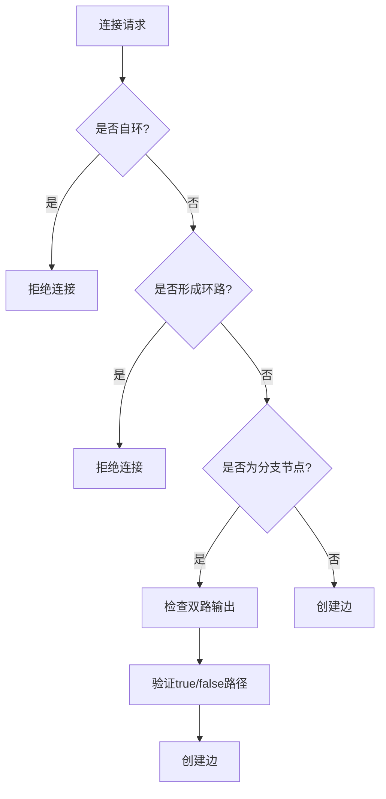
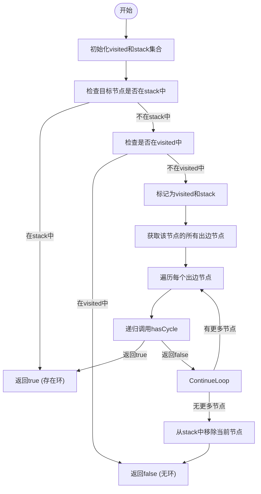
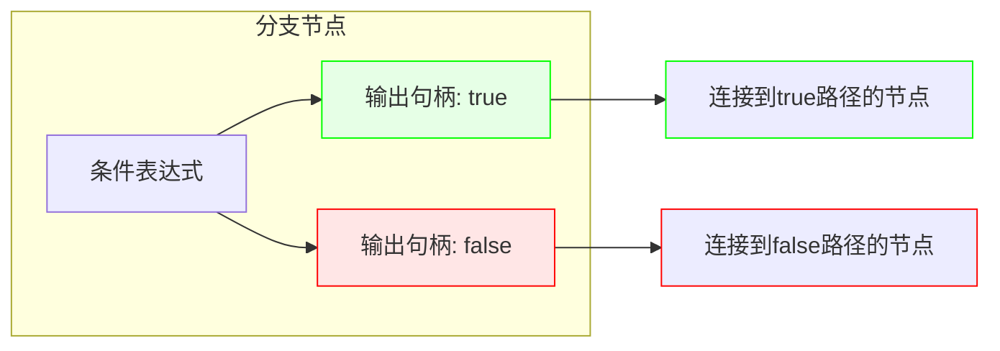
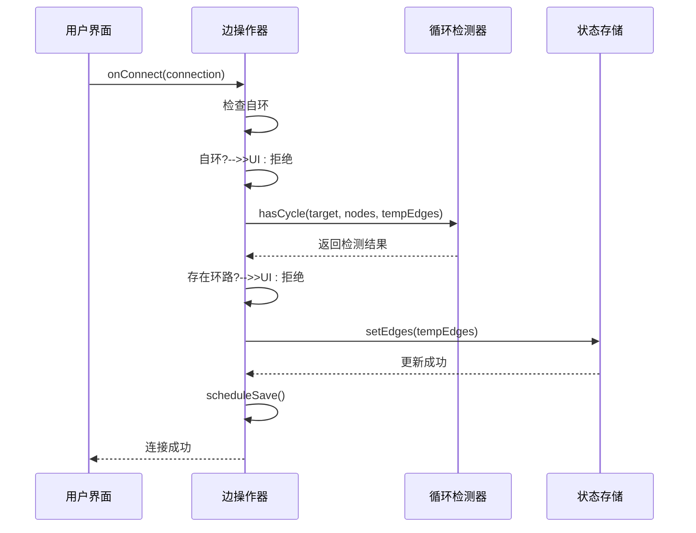

# 边规则

<cite>
**本文档中引用的文件**  
- [edgeRules.ts](file://src/lib/prompts/edgeRules.ts)
- [edgeActions.ts](file://src/store/actions/edgeActions.ts)
- [cycleDetection.ts](file://src/store/utils/cycleDetection.ts)
- [types.ts](file://src/types/flow.ts)
- [BranchNodeForm.tsx](file://src/components/builder/node-forms/BranchNodeForm.tsx)
- [CustomNode.tsx](file://src/components/flow/CustomNode.tsx)
- [BranchNodeExecutor.ts](file://src/store/executors/BranchNodeExecutor.ts)
- [sourceResolver.ts](file://src/store/utils/sourceResolver.ts)
</cite>

## 目录
1. [引言](#引言)
2. [边规则概述](#边规则概述)
3. [核心规则定义](#核心规则定义)
4. [循环检测机制](#循环检测机制)
5. [分支节点特殊规则](#分支节点特殊规则)
6. [边操作实现](#边操作实现)
7. [用户界面交互](#用户界面交互)
8. [执行上下文解析](#执行上下文解析)
9. [结论](#结论)

## 引言
本项目是一个基于可视化工作流编排的AI应用平台，支持多种节点类型（输入、LLM、RAG、输出、分支、工具）的图形化连接与执行。其中，“边规则”是确保工作流逻辑正确性和执行安全性的核心机制之一。本文档详细分析了该系统的边规则实现，涵盖连接规范、循环检测、分支逻辑、上下文解析等关键方面。

**Section sources**
- [edgeRules.ts](file://src/lib/prompts/edgeRules.ts#L1-L10)
- [edgeActions.ts](file://src/store/actions/edgeActions.ts#L1-L107)

## 边规则概述
边规则定义了节点之间如何合法连接，确保工作流的有向无环图（DAG）结构，防止逻辑错误和无限循环。系统通过前端交互规则和后端验证机制双重保障边的正确性。



**Diagram sources**
- [edgeActions.ts](file://src/store/actions/edgeActions.ts#L75-L95)
- [cycleDetection.ts](file://src/store/utils/cycleDetection.ts#L13-L33)

## 核心规则定义
系统定义了严格的边连接规则，主要包含JSON格式规范和连接语义约束。

```mermaid
classDiagram
class EdgeRule {
+source : string
+target : string
+sourceHandle : string or null
+validate() boolean
}
EdgeRule : "Branch节点 : sourceHandle为'true'或'false'"
EdgeRule : "其他节点 : sourceHandle为null或不传"
EdgeRule : "禁止自环"
EdgeRule : "禁止环路"
EdgeRule : "Branch节点必须有双路输出"
```

**Diagram sources**
- [edgeRules.ts](file://src/lib/prompts/edgeRules.ts#L1-L10)
- [types.ts](file://src/types/flow.ts#L152-L156)

## 循环检测机制
系统实现了基于深度优先搜索（DFS）的循环检测算法，确保工作流始终保持为有向无环图（DAG）。



**Diagram sources**
- [cycleDetection.ts](file://src/store/utils/cycleDetection.ts#L13-L33)
- [edgeActions.ts](file://src/store/actions/edgeActions.ts#L87-L91)

## 分支节点特殊规则
分支节点（Branch Node）具有特殊的连接规则，其输出端口分为true和false两条路径，用于实现条件判断逻辑。



**Diagram sources**
- [CustomNode.tsx](file://src/components/flow/CustomNode.tsx#L358-L381)
- [BranchNodeForm.tsx](file://src/components/builder/node-forms/BranchNodeForm.tsx#L26-L41)

## 边操作实现
系统通过Zustand状态管理器提供了一套完整的边操作API，包括连接、变更和删除等操作，并集成循环检测。



**Diagram sources**
- [edgeActions.ts](file://src/store/actions/edgeActions.ts#L75-L95)
- [types.ts](file://src/types/flow.ts#L273-L275)

## 用户界面交互
用户界面通过可视化方式呈现边规则，特别是在分支节点上明确标识true和false两个输出端口。

**Section sources**
- [CustomNode.tsx](file://src/components/flow/CustomNode.tsx#L358-L381)
- [BranchNodeForm.tsx](file://src/components/builder/node-forms/BranchNodeForm.tsx#L26-L41)

## 执行上下文解析
在工作流执行过程中，系统需要解析变量引用，将如 `{{节点名.字段}}` 的表达式解析为实际的节点ID和数据路径。

```mermaid
flowchart TD
A[变量引用] --> B{"匹配{{}}格式?"}
B --> |否| C[返回null]
B --> |是| D[提取变量路径]
D --> E{"包含'.'?"}
E --> |是| F[分离节点名和字段]
F --> G[查找节点(label或id)]
G --> H{找到?}
H --> |是| I[返回节点ID]
H --> |否| C
E --> |否| J[直接匹配节点label或id]
J --> K{找到?}
K --> |是| I
K --> |否| C
```

**Diagram sources**
- [sourceResolver.ts](file://src/store/utils/sourceResolver.ts#L52-L81)
- [BranchNodeExecutor.ts](file://src/store/executors/BranchNodeExecutor.ts#L59-L160)

## 结论
本系统的边规则设计充分考虑了可视化工作流的逻辑严谨性和用户体验。通过定义清晰的连接规范、实现高效的循环检测算法、提供直观的分支节点交互，并结合安全的表达式求值机制，构建了一个健壮可靠的工作流编排环境。这些规则共同确保了用户创建的工作流既灵活又安全，能够正确执行复杂的AI流程。