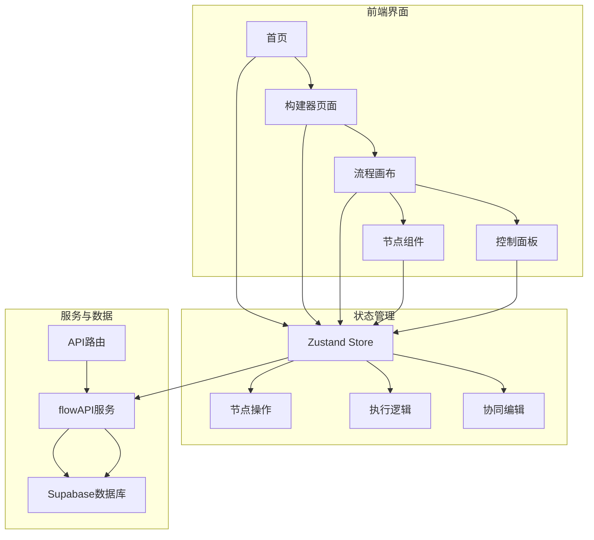
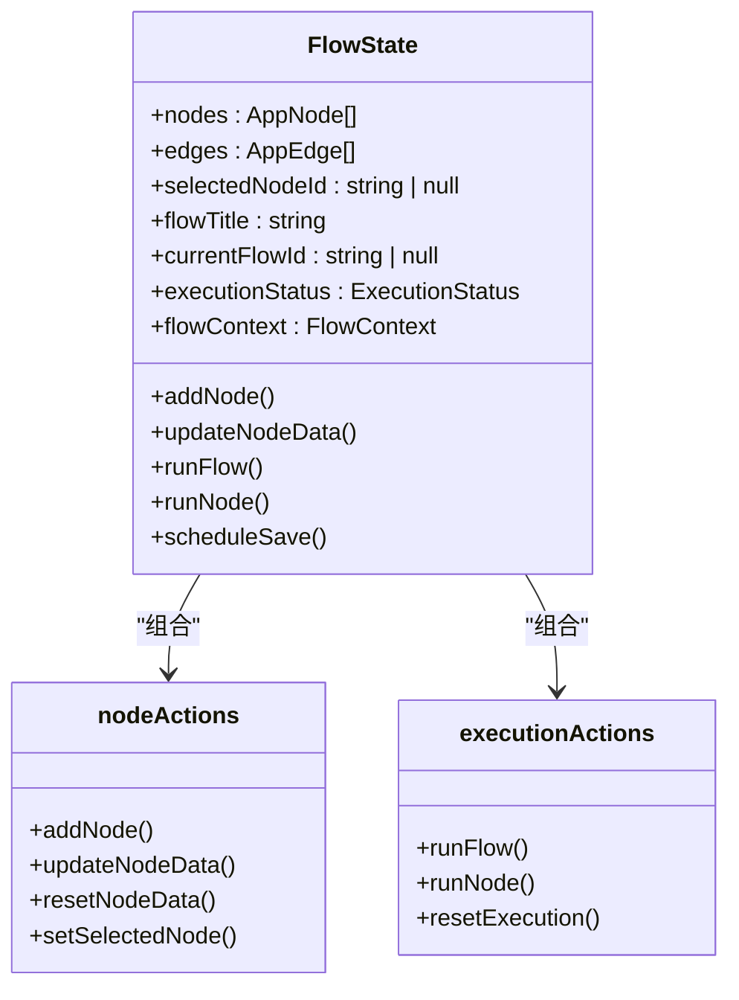
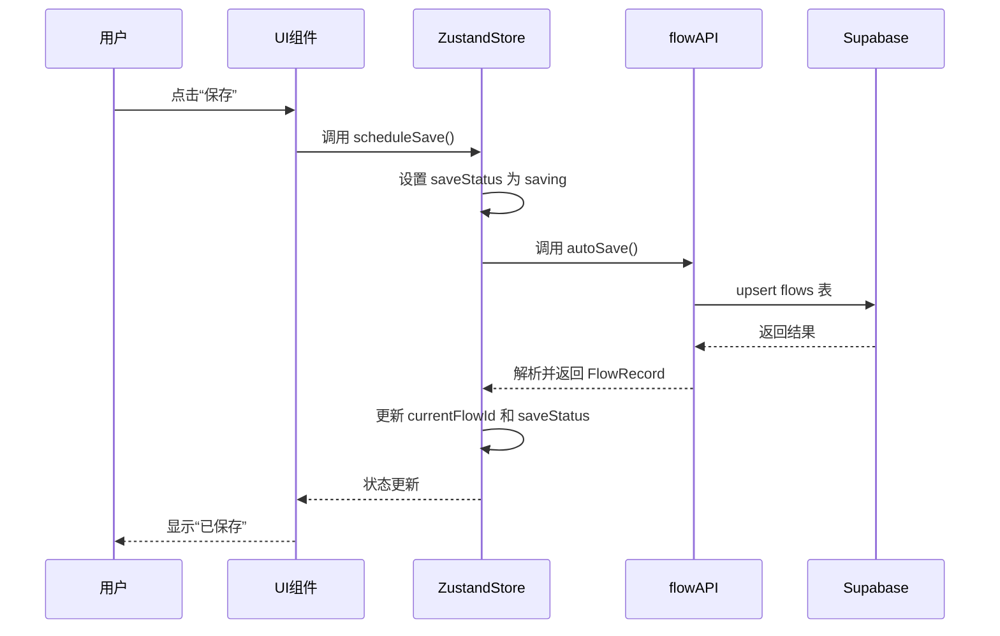

# 项目概述

<cite>
**本文档引用的文件**  
- [README.md](file://README.md)
- [package.json](file://package.json)
- [layout.tsx](file://src/app/layout.tsx)
- [page.tsx](file://src/app/page.tsx)
- [flowStore.ts](file://src/store/flowStore.ts)
- [flow.ts](file://src/types/flow.ts)
- [flowAPI.ts](file://src/services/flowAPI.ts)
- [supabase.ts](file://src/lib/supabase.ts)
- [CustomNode.tsx](file://src/components/flow/CustomNode.tsx)
- [nodeActions.ts](file://src/store/actions/nodeActions.ts)
- [executionActions.ts](file://src/store/actions/executionActions.ts)
- [builder/page.tsx](file://src/app/builder/page.tsx)
- [database.ts](file://src/types/database.ts)
</cite>

## 目录
1. [项目简介](#项目简介)
2. [项目结构](#项目结构)
3. [核心功能与架构设计](#核心功能与架构设计)
4. [状态管理机制](#状态管理机制)
5. [数据流与服务层](#数据流与服务层)
6. [可视化画布与节点交互](#可视化画布与节点交互)
7. [API路由与后端集成](#api路由与后端集成)
8. [启动与部署指南](#启动与部署指南)

## 项目简介

flash-flow 是一个基于 Next.js 构建的可视化低代码工作流平台，旨在通过图形化界面简化复杂任务流程的构建与执行。用户可以通过拖拽节点、连接边线的方式快速搭建自动化流程，无需编写代码即可实现数据处理、AI调用、HTTP请求等操作。项目采用现代化前端技术栈，结合 Zustand 状态管理、@xyflow/react 可视化引擎和 Supabase 数据持久化方案，提供流畅的用户体验和强大的扩展能力。

该平台支持实时执行与调试功能，允许用户在构建过程中即时测试每个节点的行为，并查看执行结果和耗时。同时，系统具备自动保存机制，确保用户工作不会丢失。整体设计理念强调“无代码、可视化、即时反馈”，适用于从初学者到高级开发者的广泛用户群体。

**Section sources**
- [README.md](file://README.md)
- [package.json](file://package.json)

## 项目结构

项目采用标准的 Next.js App Router 架构，组织清晰，模块化程度高。主要目录包括：

- `src/app/`：应用主路由，包含首页、构建器页面、API路由等。
- `src/components/`：可复用的UI组件，按功能划分（如 builder、flow、ui 等）。
- `src/store/`：全局状态管理，使用 Zustand 实现，包含 actions、constants 和 store 定义。
- `src/services/`：业务逻辑服务层，封装与外部系统的交互（如 flowAPI）。
- `src/types/`：类型定义，包括 flow 和 database 的 TypeScript 接口。
- `src/lib/`：工具库，如 Supabase 客户端初始化。
- `src/utils/`：通用工具函数。

这种分层结构使得前端组件、状态管理、服务层和类型系统各司其职，便于维护和扩展。



**Diagram sources**
- [src/app/page.tsx](file://src/app/page.tsx)
- [src/app/builder/page.tsx](file://src/app/builder/page.tsx)
- [src/store/flowStore.ts](file://src/store/flowStore.ts)
- [src/services/flowAPI.ts](file://src/services/flowAPI.ts)
- [src/lib/supabase.ts](file://src/lib/supabase.ts)

## 核心功能与架构设计

flash-flow 的核心功能围绕可视化流程构建展开，主要包括：

- **可视化流程构建**：用户可通过拖拽添加不同类型的节点（输入、LLM、RAG、HTTP、输出等），并通过连线定义执行顺序。
- **节点连接与拓扑排序**：系统自动维护节点间的依赖关系，执行时按拓扑顺序处理，确保数据流正确传递。
- **实时执行与调试**：支持一键运行整个流程或单独测试某个节点，提供执行状态反馈（运行中、完成、错误）和执行时间统计。
- **上下文管理**：每个节点的输出可作为后续节点的输入，形成上下文链，支持复杂的数据流转。
- **自动保存与持久化**：所有更改通过 debounce 机制自动保存至 Supabase 数据库，保障数据安全。

架构上，项目采用“状态驱动UI”的设计模式，所有用户交互最终转化为对 Zustand store 的状态变更，UI 组件监听状态变化并重新渲染。这种模式简化了数据流管理，提升了可预测性和可测试性。

**Section sources**
- [src/types/flow.ts](file://src/types/flow.ts)
- [src/store/flowStore.ts](file://src/store/flowStore.ts)
- [src/components/flow/CustomNode.tsx](file://src/components/flow/CustomNode.tsx)

## 状态管理机制

项目使用 Zustand 作为状态管理解决方案，相较于 Redux 更加轻量且无需样板代码。`flowStore.ts` 定义了整个应用的核心状态模型 `FlowState`，包含节点列表、边线列表、执行状态、上下文数据等。

状态管理采用模块化设计，将不同功能的操作封装为独立的 action 模块：
- `nodeActions.ts`：处理节点的增删改查
- `edgeActions.ts`：管理边线的变更
- `executionActions.ts`：控制流程的执行逻辑
- `copilotActions.ts`：支持智能生成流程

所有状态变更均通过 `set` 函数进行，并在必要时触发副作用（如调用 `scheduleSave` 进行自动保存）。Zustand 的中间件机制还支持状态持久化和时间旅行调试等高级功能。



**Diagram sources**
- [src/store/flowStore.ts](file://src/store/flowStore.ts)
- [src/store/actions/nodeActions.ts](file://src/store/actions/nodeActions.ts)
- [src/store/actions/executionActions.ts](file://src/store/actions/executionActions.ts)
- [src/types/flow.ts](file://src/types/flow.ts)

## 数据流与服务层

项目的数据流遵循清晰的单向数据流原则：用户操作 → 状态更新 → UI 重渲染 → 副作用（如 API 调用）→ 数据持久化。

服务层主要由 `flowAPI.ts` 构成，封装了与 Supabase 数据库的所有交互操作，包括：
- `listFlows()`：获取用户所有流程
- `getFlow(id)`：根据 ID 获取单个流程
- `createFlow()`：创建新流程
- `updateFlow()`：更新现有流程
- `deleteFlow()`：删除流程
- `autoSave()`：自动保存当前状态

这些服务函数在状态变更后被调用，确保本地状态与远程数据库保持同步。类型系统通过 `Database` 接口与 Supabase 模式严格对应，保证类型安全。



**Diagram sources**
- [src/services/flowAPI.ts](file://src/services/flowAPI.ts)
- [src/store/flowStore.ts](file://src/store/flowStore.ts)
- [src/lib/supabase.ts](file://src/lib/supabase.ts)

## 可视化画布与节点交互

可视化核心由 `@xyflow/react` 提供支持，`FlowCanvas` 组件作为画布容器，管理节点和边线的渲染与交互。每个节点由 `CustomNode.tsx` 渲染，根据节点类型显示不同的图标和元信息（如 LLM 模型名、HTTP 方法等）。

节点支持以下交互：
- 点击选中：高亮显示并显示控制手柄
- 拖拽移动：改变节点位置
- 连线操作：从源句柄拖出连接到目标句柄
- 测试运行：点击“播放”按钮单独执行该节点

性能优化方面，`CustomNode` 使用 `React.memo` 防止不必要的重渲染，确保在大型流程图中仍能保持流畅体验。

**Section sources**
- [src/components/flow/CustomNode.tsx](file://src/components/flow/CustomNode.tsx)
- [src/app/builder/page.tsx](file://src/app/builder/page.tsx)
- [src/store/flowStore.ts](file://src/store/flowStore.ts)

## API路由与后端集成

项目利用 Next.js 的 API Routes 功能，在 `src/app/api/` 目录下定义了多个服务端端点：
- `/api/health`：健康检查
- `/api/modify-flow`：流程修改
- `/api/plan`：计划任务
- `/api/run-node`：执行单个节点（如 LLM 调用）

这些 API 路由在服务端运行，可安全地访问环境变量和外部服务，避免敏感信息暴露给客户端。例如，`run-node` 路由可调用 OpenAI 或其他 LLM 服务，而无需将 API 密钥发送到前端。

数据库集成通过 Supabase 实现，`supabase.ts` 初始化客户端并导出单例，供全项目使用。类型定义 `database.ts` 与 Supabase 模式同步，确保查询操作的类型安全。

**Section sources**
- [src/app/api/run-node/route.ts](file://src/app/api/run-node/route.ts)
- [src/lib/supabase.ts](file://src/lib/supabase.ts)
- [src/types/database.ts](file://src/types/database.ts)

## 启动与部署指南

根据 `README.md` 指南，项目启动命令如下：

```bash
npm run dev
# 或
yarn dev
# 或
pnpm dev
```

启动后访问 [http://localhost:3000](http://localhost:3000) 即可使用。

部署推荐使用 Vercel，作为 Next.js 的官方平台，提供无缝集成和自动构建部署。只需将代码推送到 GitHub 仓库，并在 Vercel 中导入项目即可完成部署。Vercel 还提供环境变量管理、自定义域名、SSL 证书等企业级功能。

**Section sources**
- [README.md](file://README.md)
- [package.json](file://package.json)