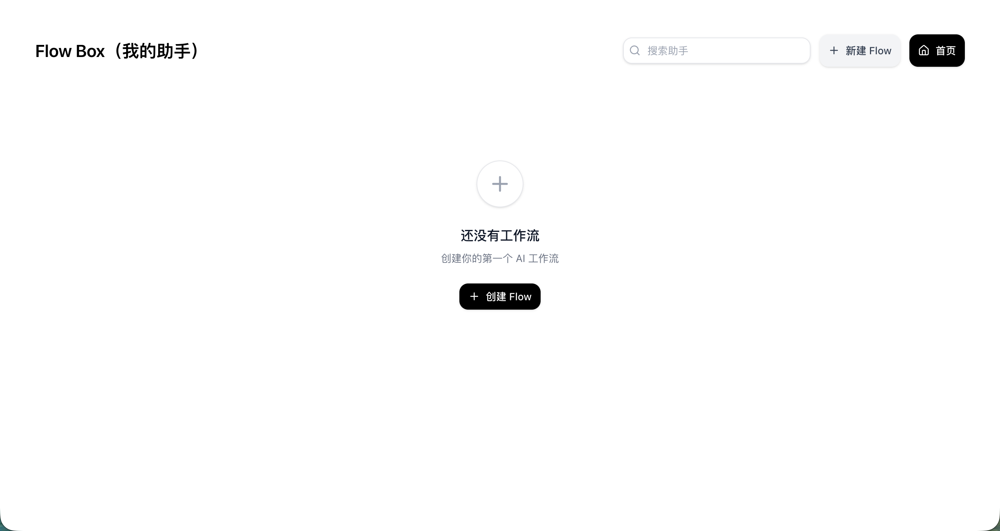
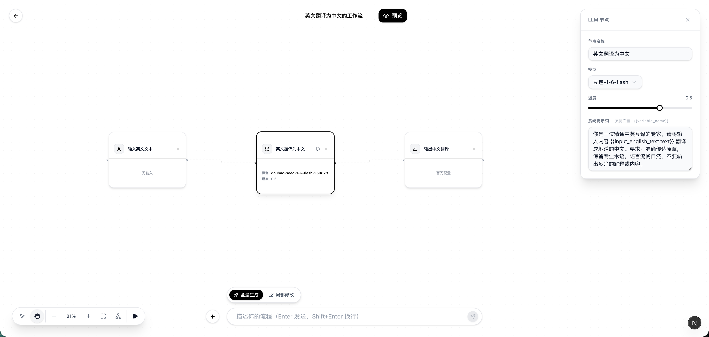

# ⚡ Flash Flow

> A next-generation visual flow builder for AI-powered workflows.
> 下一代 AI 工作流可视化编排平台。


**Flash Flow** 是一个基于 Next.js 构建的可视化低代码工作流平台，旨在通过图形化界面简化复杂任务流程的构建与执行。用户可以通过拖拽节点、连接边线的方式快速搭建自动化流程，无需编写代码即可实现数据处理、AI调用、HTTP请求等操作。

项目采用现代化前端技术栈，结合 **Zustand** 状态管理、**@xyflow/react** 可视化引擎和 **Supabase** 数据持久化方案，提供极致的交互体验与强大的扩展能力。

## ✨ 核心特性 (Features)

- 🎨 **可视化编排**: 基于节点（Node-based）的直观拖拽界面，支持 Input, LLM, RAG, HTTP, Output 等多种节点类型。
- 🤖 **AI 集成**: 内置 LLM 节点，支持与 OpenAI 等模型无缝交互，轻松构建智能应用。
- ⚡ **实时执行与调试**: 浏览器端实时运行流引擎，支持一键运行或单节点调试，提供即时状态反馈与耗时统计。
- 💾 **云端同步**: 基于 Supabase 的实时数据存储，支持自动保存机制，确保数据安全。
- 🔄 **智能状态管理**: 采用 "状态驱动UI" 设计模式，通过 Zustand 管理复杂的应用状态与数据流。
- 🛠 **高度可扩展**: 模块化架构设计，清晰分离视图、状态与服务层，便于二次开发与功能扩展。

## 🛠 技术栈 (Tech Stack)

- **Frontend Framework**: [Next.js 16](https://nextjs.org) (App Router)
- **UI Library**: [React 19](https://react.dev)
- **Language**: [TypeScript](https://www.typescriptlang.org/)
- **State Management**: [Zustand](https://github.com/pmndrs/zustand)
- **Flow Engine**: [@xyflow/react](https://reactflow.dev) (React Flow)
- **Styling**: [Tailwind CSS v4](https://tailwindcss.com), [Shadcn UI](https://ui.shadcn.com), [Lucide Icons](https://lucide.dev)
- **Backend/Database**: [Supabase](https://supabase.com)

## 📂 项目结构 (Project Structure)

项目采用标准的 Next.js App Router 架构，组织清晰：

```
src/
├── app/          # 应用主路由 (首页, 构建器, API)
├── components/   # UI 组件 (Builder, Flow, Common UI)
├── store/        # Zustand 全局状态管理 (Actions, Store)
├── services/     # 业务逻辑服务层 (API 交互, Flow逻辑)
├── lib/          # 基础工具库 (Supabase Client)
├── types/        # TypeScript 类型定义 (Flow, Database)
└── utils/        # 通用工具函数
```

## 🚀 快速开始 (Getting Started)

### 前置要求

- Node.js 18.0+
- npm (8.0+) 或 pnpm

### 安装步骤

1. **克隆仓库**
   ```bash
   git clone https://github.com/your-username/flash-flow.git
   cd flash-flow
   ```

2. **安装依赖**
   ```bash
   npm install
   # or
   pnpm install
   ```

3. **环境配置**
   
   复制示例配置文件并填入你的 Supabase 密钥：
   ```bash
   cp .env.example .env.local
   ```
   
   在 `.env.local` 中填入:
   ```env
   NEXT_PUBLIC_SUPABASE_URL=your_supabase_url
   NEXT_PUBLIC_SUPABASE_ANON_KEY=your_supabase_anon_key
   ```

4. **启动开发服务器**
   ```bash
   npm run dev
   ```
   访问 [http://localhost:3000](http://localhost:3000) 即可开始使用。

## 🤝 贡献 (Contributing)

欢迎提交 Pull Request 或 Issue！

1. Fork 本仓库
2. 新建 Feat_xxx 分支
3. 提交代码
4. 新建 Pull Request

## 📄 License

MIT License © 2025 Flash Flow






