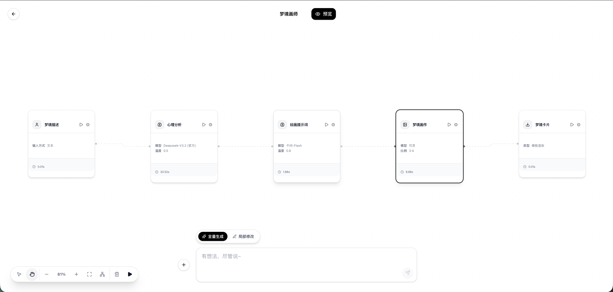

<p align="center">
  
</p>

<h1 align="center">⚡ Flash Flow</h1>

<p align="center">
  <strong>说出来，就做出来 —— AI 工作流，30秒搞定</strong>
</p>

<p align="center">
  <a href="https://www.flashflow.com.cn/">
    
  </a>
  &nbsp;&nbsp;
  <a href="https://flash-flow-gray.vercel.app/flows">
    
  </a>
</p>

<br>


<br>

---

## 🌟 Overview

> **一句话描述你的需求，AI 帮你生成完整工作流。**

Flash Flow 是一款革命性的 AI 工作流生成平台。无需拖拽、无需配置、无需编程 —— 只需 **自然语言描述**，即可在 **30秒内** 完成从想法到落地的全过程。

```
"帮我做一个文档问答工具，用户上传PDF后可以提问"
```

<p align="center">⬇️ <strong>AI 自动生成完整工作流</strong> ⬇️</p>

```
📥 输入节点(文件上传) → 📖 RAG智能检索 → 🧠 LLM深度理解 → 📤 精准输出
```

<br>

## ✨ 核心特性

Flash Flow 不仅仅是一个工作流生成器，更是一个拥有 **Agentic Capabilities** 的智能体：

- **🧠 意图理解 (Intent Understanding)**: **从模糊想法到精准落地**。深度解析你的需求，自动推断最佳的节点配置与复杂逻辑，让“一句话生成工作流”成为现实。
- **🛡️ 结构自愈 (Auto-Fix)**: **生成即刻可用**。内置智能修复引擎，自动检测并修正逻辑连接错误，确保每一个生成的工作流都能 100% 成功运行。
- **🌊 思考链展示 (Thought Process)**: **看得见的 AI 智慧**。实时呈现 AI 架构师的规划路径与推理逻辑，让你清楚知道 AI 的每一个设计决策。

<br>

---

## 🆕 最新更新 (v0.3)

| 新功能 | 描述 |
|:---:|:---|
| 🎨 **图像生成节点** | 支持可灵 Kolors / 千问 Qwen-Image 文生图、图生图 |
| 🔐 **邮箱 OTP 认证** | 支持邮箱验证码登录/注册，更安全的身份认证 |
| 📊 **用户配额管理** | LLM 调用次数、工作流生成次数、应用使用次数追踪 |
| 🤖 **多模型动态路由** | 智能选择 SiliconFlow / DashScope / OpenAI 等服务商 |
| 💬 **节点级对话记忆** | 每个 LLM 节点独立保持 1-20 轮上下文记忆 |
| 📝 **Markdown 渲染** | 丰富的输出格式支持（表格、代码高亮、任务列表等） |
| 🌊 **智能流式响应** | 打字机效果 + 首字锁定竞速 + 分段流式输出 |
| 🐍 **代码执行器** | E2B 沙箱 Python 执行，支持文件输入输出 |
| 🏗️ **模块化执行器** | 重构节点执行架构，支持独立调试和测试 |

<br>

---

## 🎬 产品展示

<p align="center">
  
</p>

<br>

---

## 🔧 节点能力

Flash Flow 提供 **7 种**强大的节点类型，覆盖各类工作流场景：

### 📥 输入节点 (Input)

工作流的入口，负责收集用户输入。

| 能力 | 说明 | 输出变量 |
|:---|:---|:---|
| **📝 文本输入** | 默认开启。用户自由输入文本。 | `{{节点名.user_input}}` |
| **📎 文件上传** | 支持 PDF/Word/图片等。限制：单文件 max 100MB，最多 10 个。 | `{{节点名.files}}` (数组)<br>`{{节点名.files[0].url}}` |
| **📋 结构化表单** | 支持下拉/多选/文本框。隐式开启验证（仅必填项）。 | `{{节点名.formData.字段名}}` (推荐)<br>`{{节点名.formData.field_id}}` (底层) |

### 🧠 LLM 节点 (LLM)

智能核心，支持多模型与记忆。

- **多模型路由**：自动路由到 SiliconFlow, DashScope, 或 OpenAI。
- **输入映射**：**精确控制**，支持显式配置 `inputMappings.user_input`。
- **对话记忆**：`enableMemory=true` 时启用**节点级独立记忆** (Node Scope)，默认保留 10 轮。
- **输出格式**：支持 `text` 和 `json_object` (需在 Prompt 中明确指示输出 JSON)。
- **流式策略**：依赖下游 Output 配置。若下游为 `select` 模式，启用**极速响应**机制。

### 📖 RAG 节点 (Knowledge)

基于 Google Gemini 的智能检索。

| 模式 | 配置 (`fileMode`) | 场景 |
|:---|:---|:---|
| **🏛️ 静态模式** | `static` | Builder 预上传固定知识库 (File Search Store)。 |
| **🔄 动态模式** | `variable` | 引用上游文件 `{{Input.files}}` (Multimodal API)。 |

> **参数微调**：支持调整 `maxTokensPerChunk` (50-500) 和 `maxOverlapTokens`。

### 🔧 工具节点 (Tool)

连接外部世界的能力。

| 工具类型 | 功能描述 | 核心参数示例 |
|:---|:---|:---|
| `web_search` | Tavily 联网搜索 | `query: "最新AI新闻"`, `maxResults: 5` |
| `calculator` | 数学表达式计算 | `expression: "(100 * 0.8) + 20"` |
| `datetime` | 时间计算/格式化 | `op: "diff"`, `date: "2024-01-01"`, `unit: "day"` |
| `url_reader` | 网页正文提取 | `url: "https://..."` |
| `code_interpreter` | **E2B 沙箱** Python 执行 | `code: "import pandas..."`, `inputFiles`: `{{Input.files}}` |

### 🔀 分支节点 (Branch)

逻辑分流控制，**确保流程永不中断**。

- **功能**：根据条件自动选择不同的后续路径。
- **示例场景**：
    - 如果用户输入包含“投诉”，则转入紧急处理流程。
    - 如果评分 > 80，则发放奖励，否则发送鼓励信息。
- **特性**：支持字符串匹配、数值比较和复杂的逻辑组合（&&, ||）。

### 🎨 图像生成节点 (ImageGen)

集成 SiliconFlow 绘图模型。

| 模型 | 特性 | 参考图模式 |
|:---|:---|:---|
| **Kolors** | 高质量文生图 | ❌ 不支持 |
| **Qwen-Image** | 快速文生图 | ❌ 不支持 |
| **Qwen-Image-Edit** | 图生图/风格迁移 | ✅ 支持 (静态上传/变量引用) |

> **核心参数**：`prompt` (必填), `cfg` (创意度), `steps` (推理步数)。

### 📤 输出节点 (Output)

工作流终点，决定流式响应行为。

| 模式 | 说明 | 流式行为 |
|:---|:---|:---|
| **Direct** | 直接输出。单来源。 | ✅ Single Stream |
| **Select** | **竞速模式**。多来源，输出最先有结果的一个。 | ✅ **首字锁定** (First-Token Lock) |
| **Merge** | 内容合并。多来源，按顺序拼接。 | 🌊 Segmented Stream (分段输出) |
| **Template** | 模板渲染。自定义报告格式。 | ❌ 不支持 (需等待全部完成) |

> **附件支持**：可返回文件/图片数组 `{{ImageGen.imageUrl}}`，前端自动渲染为卡片。

<br>

---

## 🔗 变量引用系统

Flash Flow 实现了**全链路变量透传**，支持引用任意上游节点的输出。

### 引用语法

| 目标 | 语法 (推荐) | 语法 (底层) | 说明 |
|:---|:---|:---|:---|
| **节点字段** | `{{Input.user_input}}` | `{{input_abc123.user_input}}` | 推荐使用 Label 引用，可读性更强 |
| **表单字段** | `{{Input.formData.姓名}}` | `{{input_abc123.formData.field_id}}` | 系统自动建立 Label 到 ID 的映射 |
| **文件属性** | `{{Input.files[0].url}}` | - | 支持数组索引和属性访问 |
| **JSON字段** | `{{Llm.response.name}}` | - | 若 LLM 输出为 JSON，可直接访问内部属性 |

> 🖱️ **Click-to-Insert**: 节点配置面板提供"可用变量"列表，点击即可插入标准格式变量。

<br>

---

## ⚡ 执行机制 (Execution Logic)

Flash Flow 采用 **智能并发执行引擎**，确保高效与稳定。

1.  **智能逻辑检测**：构建时实时检测逻辑闭环，防止无限循环，确保流程结构合法。
2.  **执行顺序优化**：自动分析节点依赖关系，构建最佳执行路径。
3.  **最大化并发**：
    *   **并行加速**：无依赖关系的节点将自动并行执行，显著缩短总耗时。
    *   **错误阻断**：任一节点失败将中止后续路径，并在画布上高亮错误位置，方便快速定位。

<br>

---

## 🚀 典型应用场景

| 场景 | 一句话需求 | 生成耗时 |
|:---:|:---|:---:|
| 📊 **智能报告** | "输入主题，搜索资料生成分析报告" | ~30s |
| 📝 **文档问答** | "上传文档，基于内容智能问答" | ~20s |
| 🔀 **智能分流** | "根据用户意图路由到不同处理" | ~40s |
| 📰 **资讯摘要** | "输入URL，提取正文并生成摘要" | ~25s |
| 🐍 **数据处理** | "上传CSV，用Python分析生成图表" | ~35s |
| 🎨 **海报生成** | "输入产品信息，AI生成营销海报" | ~30s |

<br>

---

## 🎯 复杂工作流示例

> **看看 Flash Flow 如何一句话生成复杂的金融危机应对工作流**

<details>
<summary><b>📝 查看生成提示词</b></summary>

```
请构建一个非常复杂的金融危机应对工作流。
用户输入股票代码并上传财报，同时填写当前持仓金额。
工作流同时进行联网搜索新闻和 RAG 分析上传的财报。
用一个 LLM 汇总信息并输出 JSON 格式的风险评分（0-100）。
使用 Branch 节点判断：如果分 >80，检索静态知识库中的危机 SOP 并生成公关稿；
如果分 <=80，调用计算器工具计算加仓 20% 后的金额，并生成交易日报。
最后输出一份包含时间戳、风险评估和最终策略（公关稿或交易建议）的综合报告，并附带原始财报文件。
```

</details>


<br>

---

## 🛠️ 技术架构


### 🏗️ 核心架构

```
┌─────────────────────────────────────────────────────────────┐
│                     Flash Flow Architecture                  │
├─────────────────────────────────────────────────────────────┤
│  Frontend (Next.js 16 + React 19)                           │
│  ├── XYFlow Canvas (可视化编排)                              │
│  ├── Zustand Store (状态管理)                                │
│  └── Streaming UI (流式响应)                                 │
├─────────────────────────────────────────────────────────────┤
│  Modular Executor Layer (模块化执行层)                       │
│  ├── InputNodeExecutor   │  LLMNodeExecutor                 │
│  ├── RAGNodeExecutor     │  ToolNodeExecutor                │
│  ├── BranchNodeExecutor  │  ImageGenNodeExecutor            │
│  ├── OutputNodeExecutor  │  ContextUtils (变量解析)         │
│  └── ExecutionOrchestrator (拓扑排序 + 循环检测)             │
├─────────────────────────────────────────────────────────────┤
│  Services Layer (服务层)                                     │
│  ├── AuthService (OTP 认证)  │  QuotaService (配额管理)      │
│  ├── LLMMemoryService (记忆) │  FileUploadService           │
│  ├── GeminiFileSearchAPI (静态 RAG)                          │
│  └── GeminiMultimodalAPI (动态 RAG)                          │
├─────────────────────────────────────────────────────────────┤
│  Backend (Supabase)                                         │
│  ├── PostgreSQL (数据存储)  │  Row Level Security           │
│  ├── Auth (用户认证)        │  Storage (文件存储)            │
│  └── Realtime (实时同步)                                     │
└─────────────────────────────────────────────────────────────┘
```

<br>

---

## 📦 快速开始

### 1️⃣ 克隆项目

```bash
git clone https://github.com/JasperLin2333/Flash-Flow.git
cd flash-flow
```

### 2️⃣ 安装依赖

```bash
npm install
```

### 3️⃣ 环境配置

创建 `.env.local` 文件并配置以下环境变量：

```env
# =============================================
# 必需配置
# =============================================

# Supabase 配置（必需）
NEXT_PUBLIC_SUPABASE_URL=your_supabase_url
NEXT_PUBLIC_SUPABASE_ANON_KEY=your_supabase_anon_key
SUPABASE_SERVICE_ROLE_KEY=your_service_role_key  # 服务端 API 必需

# Gemini API（必需，RAG 功能依赖）
GEMINI_API_KEY=your_google_api_key

# =============================================
# AI 模型配置（至少配置一个）
# =============================================

# SiliconFlow（推荐，支持 DeepSeek/Qwen/Kolors）
SILICONFLOW_API_KEY=your_siliconflow_api_key

# 阿里云 DashScope（可选，Qwen 系列）
DASHSCOPE_API_KEY=your_dashscope_api_key

# OpenAI（可选，GPT 系列）
OPENAI_API_KEY=your_openai_api_key

# DeepSeek 官方（可选，直连 API）
DEEPSEEK_API_KEY=your_deepseek_api_key

# 字节豆包（可选，Doubao 系列）
DOUBAO_API_KEY=your_doubao_api_key

# =============================================
# 工具 API 配置（按需配置）
# =============================================

# Tavily 网页搜索（强烈推荐）
TAVILY_API_KEY=your_tavily_api_key

# E2B 代码执行沙箱（可选，支持 Python 执行）
E2B_API_KEY=your_e2b_api_key
```

> 💡 **配置建议**：
> - **最小配置**：Supabase + Gemini + SiliconFlow（即可体验完整功能）
> - **推荐配置**：额外添加 Tavily（网页搜索）+ E2B（代码执行）
> - **完整配置**：所有 API Keys 配齐，享受最佳体验

### 4️⃣ 启动开发服务器

```bash
npm run dev
```

🎉 访问 **[http://localhost:3000](http://localhost:3000)** 开始体验！

<br>

---

## 🔒 安全保障

Flash Flow 内置多层安全机制，保障数据和执行安全：

| 机制 | 说明 |
|:---:|:---|
| ✅ **智能循环检测** | 执行前自动检测闭环，防止工作流无限循环 |
| ✅ **并发控制** | 多重并发保护机制，防止资源冲突 |
| ✅ **参数验证** | 严格类型校验，自动拦截非法输入 |
| ✅ **表达式白名单** | Branch 节点内置安全表达式引擎，防代码注入 |
| ✅ **数据隔离** | 基于 RLS 的多租户数据严格隔离 |
| ✅ **沙箱执行** | 代码执行器在 E2B 隔离沙箱中运行 |
| ✅ **文件大小限制** | 上传文件 1-100MB，防止资源滥用 |

<br>

---

## 📄 开源协议

本项目基于 [MIT License](LICENSE) 开源 —— 自由使用，欢迎贡献！

<br>

---

<p align="center">
  <strong>⚡ Flash Flow —— 让 AI 工作流回归简单</strong>
</p>
