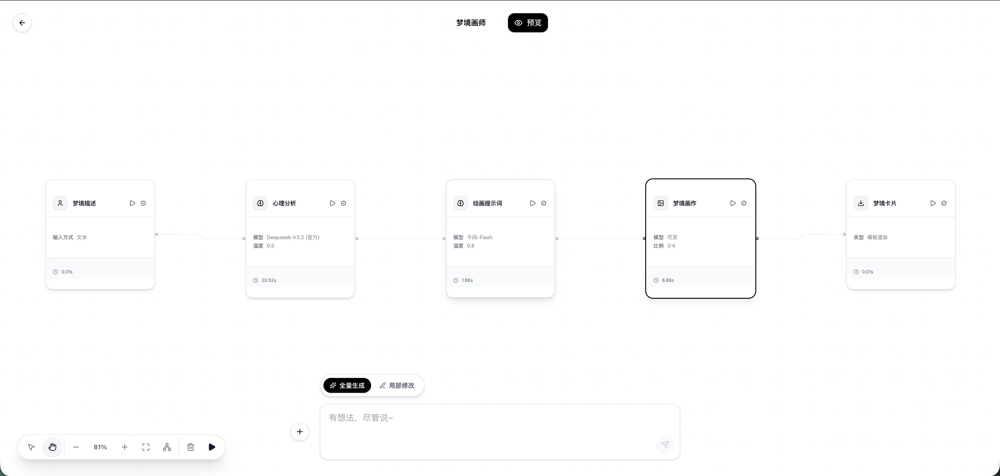

<p align="center">
  
</p>

<h1 align="center">⚡ Flash Flow</h1>

<p align="center">
  <strong>说出来，就做出来 —— AI 工作流，30秒搞定</strong>
</p>

<p align="center">
  <em>开源的 Agentic 自然语言工作流生成与即时应用平台</em>
</p>

<p align="center">
  <a href="https://www.flashflow.com.cn/">
    
  </a>
  &nbsp;&nbsp;
  <a href="https://flash-flow-gray.vercel.app/flows">
    
  </a>
  &nbsp;&nbsp;
  <a href="docs/FEATURES_AND_ARCHITECTURE.md">
    
  </a>
</p>

<p align="center">
  
  
  
  
  
  
</p>

<br>

---

## 💡 产品思考与设计理念

### 1. 从“纯生产端”到“生产端与应用端合一”
在传统 AI 工作流的设计中，产品形态往往定位于面向专业开发者的 **“生产端” (Production Tool)** —— 开发者在复杂的画布上组装节点、配置参数，再将其作为 API 服务暴露给外部调用。

然而，对于更广大的业务人员、分析师、创作者与非开发者而言，他们需要的不是复杂的 API 后台，而是 **“生产与应用合一”** 的直觉体验：
- 用自然语言清晰表达业务逻辑；
- 由 AI 现场构思并自动生成工作流；
- 生成完成后**无需繁琐部署，当场即可在沉浸式对话界面中直接使用**。

> **“生产即应用，对话即生产”** —— 这正是 Flash Flow 的核心愿景。

---

### 2. 工程挑战与自愈设计：从概率生成到确定性执行
让大模型直接输出结构严谨、包含复杂依赖的有向无环图（DAG），在实际工程落地中具有天然的不确定性。纯依赖大模型 Prompt 直接生成拓扑时，容易出现节点环路、孤立悬空、变量名未对齐以及分支端口缺失等问题。

**Flash Flow 的工程解法**：我们自主研发了 **“四层确定性自愈引擎 (Deterministic Auto-Healing)”**。在模型完成意图规划后，由工程规则管线进行确定性的图结构校验与变量路径修复，**有效弥合了大模型概率生成与严谨工程执行之间的鸿沟**，使得自然语言构建复杂工作流真正具备了高可用性与工程稳定性。

<br>

```
"帮我做一个财报研判助手，用户上传PDF并输入股票代码，
同时进行联网新闻搜索和财报RAG，由大模型给出0-100的风险分，
若评分>80则生成公关SOP，否则调用Python计算加仓金额并输出交易日报"
```

<p align="center">⬇️ <strong>AI 架构师 30 秒规划 + 四层自愈引擎自动纠偏修复</strong> ⬇️</p>

```
📥 动态输入(表单/财报) ──┬──► 📖 RAG 智能检索 ────┐
                         └──► 🌐 Tavily 联网搜索 ──┼──► 🧠 LLM 深度研判 (输出JSON) ──► 🔀 Branch 分支决策
                                                                                            ├─► [>80]  SOP公关预案 ──┐
                                                                                            └─► [<=80] Python计算 ───┴─► 📤 格式化交付
```

<br>

---

## 🏆 核心优势与架构对比

| 核心维度 | 传统基于画布拖拽的编排平台 | ⚡ Flash Flow (Agentic Next-Gen) |
|---|---|---|
| **产品定位** | 偏向开发者的纯生产端 (配置 Agent 后走 API) | **生产端与应用端合一 (生成后即刻对话运行)** |
| **交互门槛** | 手工寻找节点、连线拉取、逐个表单配置 | **自然语言直接生成完整工作流 (Prompt-to-Workflow)** |
| **构建耗时** | 15 ~ 45 分钟复杂连线与调试 | **< 30 秒快速全量生成** |
| **生成可靠性** | 依赖人工手动排错，模型生成容错较低 | **四层确定性自愈引擎，自动纠偏保障可用** |
| **执行调度引擎** | 串行拓扑遍历或简单队列 | **依赖驱动的并发拓扑调度 (最大化并行)** |
| **流式交互体验** | 单一终端流式输出 | **首字锁定竞速流、分段流式、模板合并四重模式** |
| **代码运行安全** | 本地运行 / 容器受限 (存在提权风险) | **E2B 隔离沙箱安全执行 Python + 跨模态文件传递** |
| **单点调试能力** | 必须全流程从头运行 | **节点级独立无状态试运行 (Stateless Mock Runner)** |

<br>

---

## ✨ 核心特性全景

- **🧠 意图理解与架构规划 (Agentic Planning)**：深度解析自然语言需求，自动推断节点配置、数据流转与参数映射。
- **🛡️ 四层确定性自愈引擎 (Deterministic Auto-Healing)**：
  - **结构自愈 (`StructureHealer`)**：DFS 检测自动消除环路依赖，孤立节点自动按优先级接回主干。
  - **拓扑完整性校验 (`FlowUtils`)**：自动补全缺失的 Input/Output 根节点，自动为 Branch 节点绑定 `true`/`false` 端口。
  - **变量命名自愈 (`VariableHealer`)**：自动纠正模型生成的引用路径，建立 Label ↔ NodeID 映射字典。
- **🌊 思考链流式透传 (Reasoning Stream)**：支持 DeepSeek-R1 等推理模型的思维链输出，实时呈现 AI 的规划逻辑。
- **⚡ 依赖驱动并发执行引擎**：前驱节点完成瞬间立即激活下游，无依赖分支全速并行，大幅缩短工作流执行耗时。
- **💬 节点级跨轮对话记忆 (`Node Scope Memory`)**：每个 LLM 节点可独立维持 1~20 轮上下文记忆。
- **📱 沉浸式终端应用转化 (`Flow App Interface`)**：工作流生成后一键切换至独立对话应用，支持动态表单、代码高亮、KaTeX 数学公式与图片/文件交互卡片。

<br>

---

## 🎬 产品展示

<p align="center">
  
</p>

<br>

---

## 🔧 七大模块化节点能力

Flash Flow 提供 **7 种**工业级节点类型，覆盖绝大多数企业与个人自动化场景：

### 📥 1. 输入节点 (Input)
* **文本自由输入**：支持自由 Prompt 录入与必填项校验。
* **多模态文件上传**：支持 PDF、Word、TXT、图片等，单文件最高 100MB，批量上传自动持久化至 Supabase Storage。
* **结构化动态表单**：支持下拉选择、多选框、文本域等多类型字段定义与前置校验。

### 🧠 2. LLM 大模型节点 (LLM)
* **多模型动态路由**：支持 SiliconFlow (DeepSeek V3/R1, Qwen 2.5)、阿里千问 DashScope、OpenAI GPT、字节豆包等。
* **节点级独立会话记忆**：基于 `llm_node_memory` 维持跨轮次独立记忆。
* **强健的 JSON Object 提取**：内置容错提取器，彻底解决 Markdown 代码块污染与 JSON 解析失败问题。

### 📖 3. RAG 知识库检索节点 (Knowledge)
* **🏛️ 静态模式 (`static`)**：基于 Google Gemini File Search Store 进行大容量固定知识库检索。
* **🔄 动态模式 (`variable`)**：直接引用上游上传的文件 `{{Input.files}}`，基于 Gemini Multimodal API 进行即时文档理解。

### 🔧 4. 通用工具节点 (Tool)
* **`code_interpreter`**：**E2B 隔离 Python 沙箱**，支持读取上游文件、运行数据分析并生成图表或文件附件。
* **`web_search`**：Tavily 实时联网搜索，获取最新资讯。
* **`calculator`**：基于 Math.js 的高精度公式计算，杜绝大模型算术幻觉。
* **`url_reader`**：网页正文提取与 HTML 转 Markdown。
* **`datetime`**：精准时间推算、时差计算与格式化。

### 🔀 5. 条件分支节点 (Branch)
* **安全表达式求值**：基于白名单 AST 语法树解析（支持字符串包含、数值对比、正则与逻辑符组合），防代码注入。
* **双端口路由**：提供 `true` / `false` 独立端口。
* **死路优雅过滤**：未命中分支的下游节点自动标记为 `_skipped`，绝不引发后续节点阻塞死锁。

### 🎨 6. 图像生成节点 (ImageGen)
* **模型集成**：快手 Kolors (高质量文生图)、阿里千问 Qwen-Image (极速文生图)、Qwen-Image-Edit (图生图/风格迁移)。
* **动态参考图**：支持引用上游生成的图片或上传的图片变量进行二次创作。

### 📤 7. 输出节点 (Output)
* **Direct 模式**：直连单源，零延迟 SSE 原生流式。
* **Select 模式 (首字锁定竞速)**：多模型/多路径竞争，优先锁定最快输出的通道。
* **Merge 模式 (分段流式)**：多节点结果按序分段拼接流式呈现。
* **Template 模式**：基于 Mustache 模版渲染严谨的 Markdown 格式报告。
* **富媒体附件卡片**：自动捕获并渲染图片、文件等交付物卡片。

<br>

---

## 🔗 全链路变量透传系统

Flash Flow 实现了直观、无歧义的跨节点变量引用协议：

| 引用目标 | 语义化语法 (推荐) | 底层 ID 语法 | 示例 |
|:---|:---|:---|:---|
| **节点字段** | `{{输入.user_input}}` | `{{input_abc123.user_input}}` | 文本自由传递 |
| **表单字段** | `{{输入.formData.姓名}}` | `{{input_abc123.formData.field_id}}` | 动态表单数据提取 |
| **文件属性** | `{{输入.files[0].url}}` | - | 动态文件对象与 URL |
| **JSON 解构** | `{{LLM.response.risk_score}}` | - | 深度提取模型结构化输出 |
| **沙箱生成物** | `{{代码执行.generatedFile.url}}`| - | 提取 Python 沙箱绘制的图表 |

> 🖱️ **Click-to-Insert**：画布右侧 ContextHUD 面板实时展示当前所有可用前驱变量，点击即可一键填入 Prompt。

<br>

---

## 🛠️ 技术架构

> 📚 **深入阅读技术白皮书**: [📖 **Flash Flow 核心技术架构与全功能深度解析 (Technical Showcase)**](docs/FEATURES_AND_ARCHITECTURE.md)

### 🏗️ 架构分层

```
┌─────────────────────────────────────────────────────────────┐
│                     Flash Flow Architecture                  │
├─────────────────────────────────────────────────────────────┤
│  Frontend (Next.js 16 + React 19)                           │
│  ├── XYFlow Canvas (可视化编排)                              │
│  ├── Zustand Store (状态切片与统一驱动)                      │
│  ├── BrainBar (自然语言意图规划悬浮条)                       │
│  └── Streaming UI (原生 SSE / 首字锁定 / 分段流式)           │
├─────────────────────────────────────────────────────────────┤
│  Agentic & Self-Repair Layer (智能规划与自愈层)              │
│  ├── Plan API (/api/agent/plan) 意图规划                     │
│  ├── StructureHealer (环路检测与孤岛修复)                    │
│  ├── VariableHealer (变量命名空间与路径修复)                 │
│  └── DeterministicFixer (确定性兜底保障管线)                 │
├─────────────────────────────────────────────────────────────┤
│  Modular Executor Layer (模块化执行层)                       │
│  ├── InputNodeExecutor   │  LLMNodeExecutor                 │
│  ├── RAGNodeExecutor     │  ToolNodeExecutor                │
│  ├── BranchNodeExecutor  │  ImageGenNodeExecutor            │
│  ├── OutputNodeExecutor  │  ContextUtils (变量解析)         │
│  └── ExecutionOrchestrator (拓扑排序 + 并发调度)             │
├─────────────────────────────────────────────────────────────┤
│  Services Layer (服务与基础设施层)                           │
│  ├── AuthService (OTP 认证)  │  QuotaService (配额与积分账本)│
│  ├── LLMMemoryService (记忆) │  FileUploadService           │
│  ├── Gemini File API (RAG)   │  E2B Code Sandbox (Python)   │
│  └── SiliconFlow / DashScope / OpenAI / Tavily API          │
├─────────────────────────────────────────────────────────────┤
│  Backend (Supabase)                                         │
│  ├── PostgreSQL (数据存储)  │  Row Level Security 租户隔离  │
│  ├── Auth (用户鉴权)        │  Storage (素材与文件存储)      │
│  └── Realtime (实时同步)                                     │
└─────────────────────────────────────────────────────────────┘
```

<br>

---

## 📦 快速开始

### 1️⃣ 克隆项目

```bash
git clone https://github.com/JasperLin2333/Flash-Flow.git
cd flash-flow
```

### 2️⃣ 安装依赖

```bash
npm install
```

### 3️⃣ 环境配置

创建 `.env.local` 文件并配置以下环境变量：

```env
# =============================================
# 必需配置
# =============================================

# Supabase 配置（必需）
NEXT_PUBLIC_SUPABASE_URL=your_supabase_url
NEXT_PUBLIC_SUPABASE_ANON_KEY=your_supabase_anon_key
SUPABASE_SERVICE_ROLE_KEY=your_service_role_key  # 服务端 API 必需

# Gemini API（必需，RAG 功能依赖）
GEMINI_API_KEY=your_google_api_key

# =============================================
# AI 模型配置（至少配置一个）
# =============================================

# SiliconFlow（强烈推荐，支持 DeepSeek V3/R1、Qwen、Kolors）
SILICONFLOW_API_KEY=your_siliconflow_api_key

# 阿里云 DashScope（可选，Qwen 系列）
DASHSCOPE_API_KEY=your_dashscope_api_key

# OpenAI（可选，GPT 系列）
OPENAI_API_KEY=your_openai_api_key

# DeepSeek 官方（可选，直连 API）
DEEPSEEK_API_KEY=your_deepseek_api_key

# 字节豆包（可选，Doubao 系列）
DOUBAO_API_KEY=your_doubao_api_key

# =============================================
# 工具 API 配置（按需配置）
# =============================================

# Tavily 网页搜索（强烈推荐）
TAVILY_API_KEY=your_tavily_api_key

# E2B 代码执行沙箱（可选，支持 Python 执行）
E2B_API_KEY=your_e2b_api_key
```

### 4️⃣ 启动开发服务器

```bash
npm run dev
```

🎉 访问 **[http://localhost:3000](http://localhost:3000)** 开始体验！

<br>

---

## 🔒 安全保障

| 机制 | 说明 |
|:---:|:---|
| 🛡️ **沙箱安全隔离** | Python 代码在 E2B 隔离沙箱中执行，杜绝主机提权风险 |
| 🛡️ **智能环路检测** | 运行前 DFS 实时检测，防止无限制递归与执行死锁 |
| 🛡️ **表达式安全求值** | Branch 节点采用安全 AST 解析，拒绝 `eval` 代码注入 |
| 🛡️ **多租户数据隔离** | 基于 Supabase PostgreSQL RLS 行级安全策略进行强制隔离 |
| 🛡️ **用量与积分审计** | 基于 `users_quota` 与 `points_ledger` 实现原子计费与明细留存 |
| 🛡️ **单文件上传限制** | 严格限制文件类型与 100MB 上限，防止存储与计算资源被滥用 |

<br>

---

## 📄 开源协议

本项目基于 [MIT License](LICENSE) 开源 —— 欢迎自由使用、学习与贡献！

<br>

---

<p align="center">
  <strong>⚡ Flash Flow —— 说出来，就做出来。让 AI 工作流回归简单。</strong>
</p>
