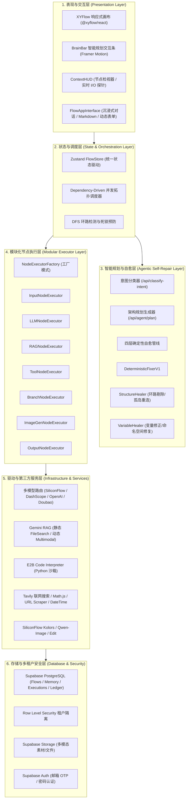
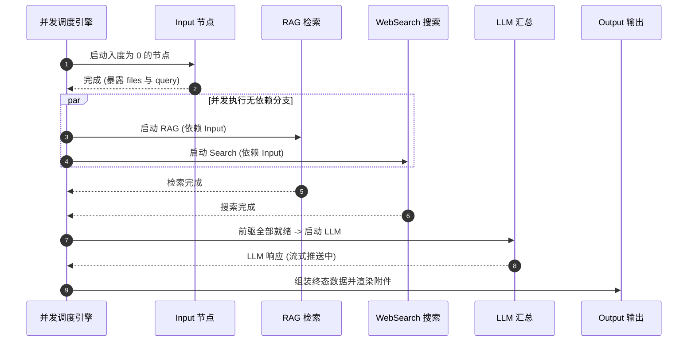

# ⚡ Flash Flow 核心技术架构与全功能深度解析

<p align="center">
  <strong>说出来，就做出来 —— 新一代 Agentic AI 工作流生成与执行引擎</strong>
</p>

<p align="center">
  
  
  
  
  
  
</p>

---

## 📖 目录

- [1. 项目愿景与行业创新对比](#1-项目愿景与行业创新对比)
- [2. 总体技术架构设计](#2-总体技术架构设计)
- [3. 核心创新：Agentic 智能规划与确定性自愈引擎](#3-核心创新agentic-智能规划与确定性自愈引擎)
- [4. 高性能事件驱动并发执行引擎](#4-高性能事件驱动并发执行引擎)
- [5. 七大模块化节点能力矩阵](#5-七大模块化节点能力矩阵)
- [6. 全链路变量透传与动态模板系统](#6-全链路变量透传与动态模板系统)
- [7. 先进的流式响应与输出竞速策略](#7-先进的流式响应与输出竞速策略)
- [8. 企业级安全与全栈工程实践](#8-企业级安全与全栈工程实践)

---

## 1. 项目愿景与行业创新对比

### 1.1 设计理念：从“纯生产端”到“生产与应用端合一”
在传统 AI 工作流的设计中，产品形态往往定位于面向专业开发者的 **“生产端” (Production Tool)** —— 开发者在复杂的画布上组装节点、配置参数，再将其封装为 API 供外部系统调用。

然而，对于更广泛的业务人员、分析师、创作者与非开发者而言，他们需要的不是复杂的 API 后台，而是 **“生产与应用合一”** 的直觉体验：
- 用自然语言清晰表达业务逻辑；
- 由 AI 现场构思并自动生成工作流；
- 生成完成后**无需繁琐部署，当场即可在沉浸式对话界面中直接使用**。

> **“生产即应用，对话即生产”** —— 这正是 Flash Flow 的核心产品哲学。

### 1.2 工程挑战与自愈设计：从概率生成到确定性执行
让大模型直接输出结构严谨、包含复杂依赖的有向无环图（DAG），在实际工程落地中具有天然的不确定性。纯依赖大模型直接生成拓扑时，容易出现节点环路、孤立悬空、变量名未对齐以及条件分支端口缺失等问题。

**Flash Flow 的工程解法**：我们自主研发了 **“四层确定性自愈引擎 (Deterministic Auto-Healing)”**。在模型完成意图规划后，由工程规则管线进行确定性的图结构校验与变量路径修复，**有效弥合了大模型概率生成与严谨工程执行之间的鸿沟**，使得自然语言构建复杂工作流真正具备了高可用性与工程稳定性。

### 🌟 行业特性对比

| 评估维度 | 传统基于画布拖拽的编排平台 | ⚡ Flash Flow (Agentic Next-Gen) |
|---|---|---|
| **产品定位** | 偏向开发者的纯生产端 (配置 Agent 后走 API) | **生产端与应用端合一 (生成后即刻对话运行)** |
| **构建方式** | 手动寻找节点、拖拽连线、逐一填写入参 | **自然语言一句话生成 (Prompt-to-DAG)** |
| **构建耗时** | 10 ~ 30 分钟复杂配置与排错 | **< 30 秒全量生成即用工作流** |
| **生成可靠性** | 依赖人工手动排错，模型生成容错较低 | **四层确定性自愈引擎，自动纠偏保障可用** |
| **执行性能** | 串行拓扑或简单遍历执行 | **事件驱动的依赖并发调度 (最大化并行)** |
| **流式交互** | 单一终点流式返回 | **首字锁定竞速流、分段流式、模板合并四大模式** |
| **代码运行** | 本地 Eval / 受限环境 (安全隐患) | **E2B 隔离沙箱安全执行 Python + 跨模态文件传递** |
| **调试支持** | 必须执行完整全流程 | **节点级独立无状态试运行 (Stateless Mock Runner)** |

---

## 2. 总体技术架构设计

Flash Flow 采用现代化分层架构，各层之间严格遵循单一职责与解耦原则：



---

## 3. 核心创新：Agentic 智能规划与确定性自愈引擎

大模型直接生成工作流 DAG 图时，往往存在**循环死锁、孤岛节点悬空、变量名幻觉、分支端口缺失**等致命缺陷。Flash Flow 首创了 **「LLM 柔性规划 + 确定性硬规则自愈」** 的双引擎机制：

```
 用户自然语言输入
       │
       ▼
 ┌──────────────┐
 │ 意图分类检索 │ ─── 检索节点 Schema 与架构最佳实践
 └──────┬───────┘
       ▼
 ┌──────────────┐
 │ 大模型图规划 │ ─── 输出初始 Nodes、Edges、InputMappings
 └──────┬───────┘
       ▼
 ┌─────────────────────────────────────────────────────────────┐
 │            四层确定性自愈引擎 (Deterministic Pipeline)        │
 ├─────────────────────────────────────────────────────────────┤
 │ 1. 结构自愈 (StructureHealer)                               │
 │    • DFS 环路检测，自动断开 Back Edge 消除死锁               │
 │    • 孤立节点 (Island Nodes) 按拓扑优先级自动接回主干        │
 │    • 无效边/重复边自动过滤与去重                            │
 ├─────────────────────────────────────────────────────────────┤
 │ 2. 拓扑完整性校验 (FlowUtils)                               │
 │    • 自动补齐缺失的 Input 根节点与 Output 汇聚节点          │
 │    • 为 Branch 节点自动绑定 true / false 专属端口           │
 ├─────────────────────────────────────────────────────────────┤
 │ 3. 变量自愈 (VariableHealer)                                │
 │    • 自动纠正被模型错写或幻觉的变量路径 ({{Input.text}} 等)   │
 │    • 自动建立 Label ↔ Node ID 映射字典                       │
 │    • 自动为下游 LLM 补全 inputMappings.user_input 映射      │
 ├─────────────────────────────────────────────────────────────┤
 │ 4. 强规则校验 (GeneratedWorkflowValidator)                  │
 │    • 零容忍拦截 Hard Errors，输出细粒度修复日志              │
 └─────────────────────────────────────────────────────────────┘
       │
       ▼
 100% 结构合法且可直接执行的工作流
```

---

## 4. 高性能事件驱动并发执行引擎

Flash Flow 摒弃了传统的顺序轮询遍历，基于 Promise Resolver 机制开发了**依赖驱动的并发拓扑调度器**（`src/store/actions/executionActions.ts`）：

### 🚀 执行机制亮点
1. **最大化并发吞吐**：节点在所有前驱依赖完成的瞬间立刻被激活启动，互不依赖的并行分支（如并行搜索、并行文档分析）全速并发执行。
2. **分支安全截断（Dead-path Pruning）**：当 Branch 节点计算出结果后，未命中分支的后继节点会被优雅标记为 `_skipped`，既不消耗资源，又绝不引发下游等待死锁。
3. **全局中断与超时防护**：全链路注入 `AbortController`，支持毫秒级用户取消；单节点配置 5 分钟超时兜底。
4. **单节点独立无状态调试（Stateless Mock Runner）**：开发者无需启动整条工作流，可单独为任意节点注入 Mock 数据进行毫秒级单点测试与参数调优。



---

## 5. 七大模块化节点能力矩阵

Flash Flow 基于工厂模式设计了 7 大高内聚执行器，覆盖全场景业务需求：

```
                               ┌─────────────┐
                               │  Input 节点 │
                               └──────┬──────┘
        ┌──────────────┬──────────────┼──────────────┬──────────────┐
        ▼              ▼              ▼              ▼              ▼
   ┌─────────┐   ┌───────────┐   ┌─────────┐   ┌───────────┐  ┌───────────┐
   │ LLM 节点 │   │  RAG 节点 │   │ Tool 节点│  │ImageGen节点│  │Branch 节点│
   └────┬────┘   └─────┬─────┘   └────┬────┘   └─────┬─────┘  └─────┬─────┘
        └──────────────┴──────────────┼──────────────┴──────────────┘
                                      ▼
                               ┌─────────────┐
                               │ Output 节点 │
                               └─────────────┘
```

### 节点功能清单

| 节点类型 | 核心执行器 | 能力范围 | 关键配置与技术参数 | 暴露变量规范 |
|---|---|---|---|---|
| **📥 Input 输入** | `InputNodeExecutor.ts` | 收集文本、多文件、动态结构化表单 | • 单文件 100MB 限制<br>• Supabase Storage 自动持久化<br>• 下拉/多选/文本动态表单校验 | `{{Input.user_input}}`<br>`{{Input.files}}`<br>`{{Input.formData.xxx}}` |
| **🧠 LLM 大模型** | `LLMNodeExecutor.ts` | 多模型路由、思考链透传、独立记忆 | • 接入 DeepSeek-V3/R1、Qwen-2.5、GPT 等<br>• 1~20 轮节点独立会话记忆<br>• 容错提取 JSON Object | `{{LLM.response}}`<br>`{{LLM.reasoning}}`<br>`{{LLM.response.jsonField}}` |
| **📖 RAG 知识库** | `RAGNodeExecutor.ts` | 静态知识库检索 & 动态多模态文档理解 | • 静态模式：Gemini File Search Store<br>• 动态模式：即时 Multimodal API 解析上游文件<br>• 切片 Token 与重叠度可配 | `{{RAG.documents}}`<br>`{{RAG.citations}}`<br>`{{RAG.query}}` |
| **🔧 Tool 通用工具**| `ToolNodeExecutor.ts` | 联网搜索、公式计算、代码沙箱、网页抓取 | • **E2B Python 安全沙箱**（支持生成图表/文件）<br>• Tavily Web 搜索 API<br>• Math.js 精准算式引擎<br>• URL 正文清洗提取与 DateTime | `{{Tool.data}}`<br>`{{Tool.generatedFile}}`<br>`{{Tool.results}}` |
| **🔀 Branch 分支** | `BranchNodeExecutor.ts` | 逻辑条件求值与动态流向分发 | • AST 安全表达式解析（防代码注入）<br>• 双端口输出 (`true` / `false`)<br>• 上游数据安全透传与死路截断 | `{{Branch.conditionResult}}` + 透传上游字段 |
| **🎨 ImageGen 生图**| `ImageGenNodeExecutor.ts` | 文生图、图生图与风格迁移 | • 快手 Kolors、千问 Qwen-Image、Qwen-Image-Edit<br>• 支持引用上游图片变量<br>• CFG、步数、负向提示词精细控制 | `{{ImageGen.imageUrl}}` |
| **📤 Output 输出** | `OutputNodeExecutor.ts` | 结果汇聚、多流合并、富媒体附件渲染 | • 4 种输出模式（Direct / Select / Merge / Template）<br>• 自动聚合图片与文件卡片 | `{{Output.text}}`<br>`{{Output.attachments}}` |

---

## 6. 全链路变量透传与动态模板系统

Flash Flow 实现了声明式、无歧义的跨节点变量引用协议：

```
                ┌───────────────────────────────────┐
                │ 变量语法: {{NodeLabel.fieldName}}  │
                └─────────────────┬─────────────────┘
         ┌────────────────────────┼────────────────────────┐
         ▼                        ▼                        ▼
┌──────────────────┐    ┌──────────────────┐    ┌──────────────────┐
│   基础属性提取   │    │   深层 JSON 解构 │    │  数组与文件索引  │
│ {{输入.user_input}}│    │{{LLM.response.code}}│   │{{输入.files[0].url}}│
└──────────────────┘    └──────────────────┘    └──────────────────┘
```

- **语义化优先**：全面支持节点中文别名（如 `{{输入.user_input}}`），底层自动解析为唯一 Node ID。
- **Click-to-Insert**：画布右侧检视区（ContextHUD）实时扫描可用前驱变量，点击即可一键填入 Prompt 或参数输入框。
- **模板深度递归替换**：支持字符串、嵌套对象、数组全结构的递归变量注入与类型保真。

---

## 7. 先进的流式响应与输出竞速策略

Flash Flow 的 Output 节点设计了四种创新的输出控制模式，完美解决复杂 DAG 流式传输痛点：

```
                                  ┌──────────────────────────┐
                                  │   Output 输出模式策略     │
                                  └─────────────┬────────────┘
         ┌────────────────────────┬─────────────┴────────────┬────────────────────────┐
         ▼                        ▼                          ▼                        ▼
┌──────────────────┐    ┌──────────────────┐       ┌──────────────────┐    ┌──────────────────┐
│  Direct 直接直连 │    │  Select 竞速锁定 │       │  Merge 分段流式  │    │ Template 模板排版│
│   (单源流式传输) │    │(首字抢占 First-Lock)│    │ (多源按序流式拼接)│    │(Markdown 格式渲染)│
└──────────────────┘    └──────────────────┘       └──────────────────┘    └──────────────────┘
```

1. **Direct 模式**：单上游直连，实现零延迟原生 SSE 打字机流式。
2. **Select 模式 (First-Token Race Lock)**：当存在多个上游 LLM（或不同分支）时，**以第一个产生 Token 的节点为准锁定输出通道**，兼顾高可用与极速响应。
3. **Merge 模式 (Segmented Stream)**：多段分析依次生成时，按照定义顺序进行分段流式拼接，提供结构清晰的长篇输出。
4. **Template 模式**：待全链路完成后，利用 Mustache 语法渲染出格式严密的 Markdown 商业报告或数据汇总。

---

## 8. 企业级安全与全栈工程实践

### 8.1 严密的安全防御架构
- **E2B 沙箱隔离**：代码执行器运行在严格隔离的云端轻量虚拟机中，杜绝服务器提权与内网渗透风险。
- **行级数据安全 (Postgres RLS)**：工作流定义、会话记录、用户知识库在数据库层由 RLS 进行严格的租户所有权隔离。
- **表达式安全沙箱**：Branch 节点拒绝使用原生 `eval()`，采用白名单 AST 解析，根除注入漏洞。

### 8.2 积分与用量治理体系
- **分布式账本记录**：基于 `users_quota` 与 `points_ledger` 实现用量原子扣减与明细审计。
- **精细化计费模型**：大模型、生图、代码解释器根据实际算力成本差异化扣费。

### 8.3 工业级代码质量与测试保障
- **全栈 TypeScript 严格模式**：消除运行时隐式类型转换。
- **高覆盖率单元测试**：内置 20+ Vitest 自动化测试套件（涵盖环路检测、分支阻塞过滤、分段流式、持久化归一化等核心模块）。
- **自动化网络与健康探测**：提供专用网络延迟与抖动探测脚本（`scripts/check-speed.ts`）与诊断面板。

---

<p align="center">
  <strong>⚡ Flash Flow —— 让复杂 AI 工作流的构建回归直觉与优雅</strong>
</p>
