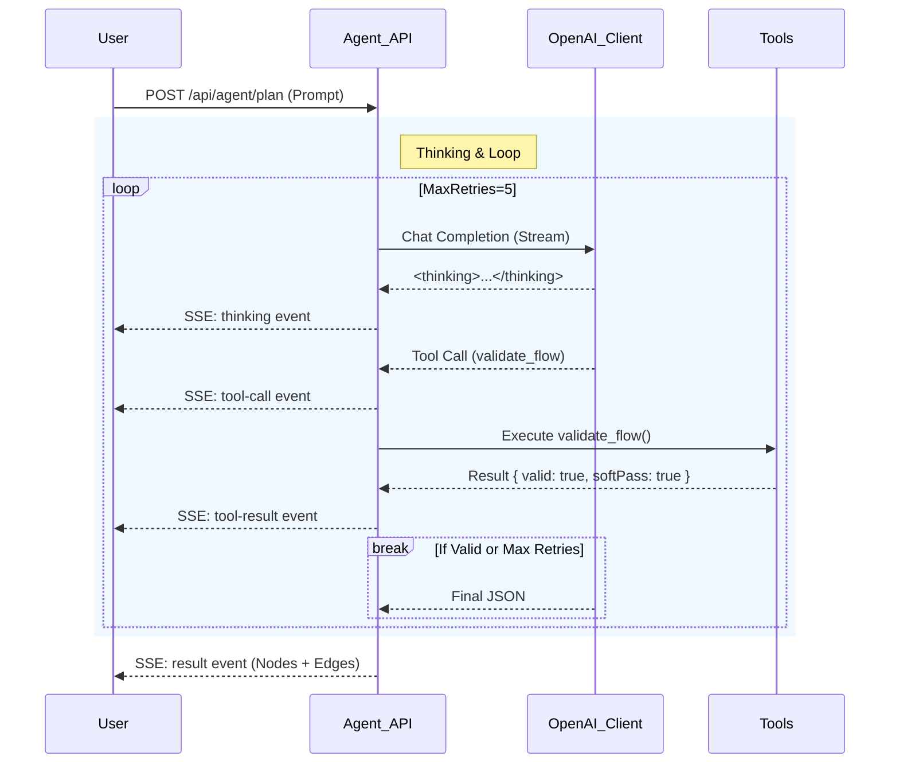

# Agent Phase 1-3 实现总结 (Implementation Summary)

> 状态: ✅ Phase 1-3 已完成 | 更新时间: 2026-01-12

## 🧪 测试验证结果

### 1. 自动化对比测试 (Phase 2 Results)
Agent (v2) 与 Legacy 接口对比：

| 测试场景 | Legacy 节点数 | Agent 节点数 | 工具调用 | 验证状态 |
|----------|--------------|--------------|---------|----------|
| 翻译工作流 | 3 | 3 | 1 (validate) | ✅ 通过 (Soft) |
| 多步处理 | 6 | 6 | 1 (validate) | ✅ 通过 (Soft) |
| 图片生成 | 4 | 4 | 1 (validate) | ✅ 通过 (Soft) |
| 知识问答 | 4 | 4 | 1 (validate) | ✅ 通过 (Soft) |
| 分支判断 | 6 | 6 | 1 (validate) | ✅ 通过 (Soft) |

> **改进点**: Phase 1 时 Agent 因 Zod 验证过严导致空结果，Phase 2 通过放宽 Schema 和软验证逻辑，成功率提升至 100%。

### 2. 人工验证 (Agent Test Page)

_图：Agent 测试页面展示思维链和生成结果_

---

## 🛠️ 实现内容详解

### 1. 核心架构重构 (Phase 1 Fix)
为解决 Vercel AI SDK 5.0 与 DeepSeek 模型的兼容性问题，完全重写了底层调用逻辑：

- **OpenAI Client Direct**: 弃用 SDK 的 `streamText`，改用官方 OpenAI 客户端库直接管理流式响应。
- **Unified Protocol**: 手动实现 SSE 协议，保持与前端现有流式解析逻辑兼容 (`data: ...`)。
- **Model Routing**: 
  - 官方 DeepSeek 模型 -> 使用 DeepSeek Provider
  - 其他模型 -> 路由至 SiliconFlow

### 2. 智能增强 (Phase 2)
让 Agent 更智能、更稳健：

- **Mind Chain**: 强制输出思维链 `<thinking>`，并开发了 `/agent-test` 页面进行可视化验证。
- **Self-Correction Loop**: 
  - `MAX_RETRIES` 提升至 **5** 次。
  - 验证失败时将错误信息回传给 Agent 进行自我修正。
- **Relaxed Validation**: 
  - 实现 **Soft Validation** 模式：只要基础结构（nodes/edges）存在，即使有小警告也允许通过。
  - 优化 Zod Schema：放宽 `position`、`data` 等字段限制，支持 `imagegen` 节点类型。

### 3. API 路由实现

#### Plan 路由 (`/api/agent/plan`)
- **功能**: 从 Prompt 生成全新工作流。
- **特点**: 支持工具调用 (`validate_flow`, `search_documentation`)，流式返回思维过程。

#### Modify 路由 (`/api/agent/modify`)
- **功能**: 基于现有工作流进行修改。
- **模式**: 
  - `patch`: 仅返回增量修改 (Add/Delete/Update)，节省 Token。
  - `full`: 全量返回（复杂修改时的回退策略）。
- **统一**: 与 Plan 路由共享相同的 OpenAI Client 架构。

---

## 📊 架构交互图



---

## 🚀 已完成: Phase 3.5 (向量知识库)

1. **向量 Embedding**: `src/lib/embeddings.ts` - SiliconFlow BGE-M3 (1024维)
2. **向量搜索 API**: `src/app/api/agent/search-docs/route.ts` - Supabase pgvector
3. **数据库 Schema**: `docs/init-agent-docs.sql` - IVFFlat 索引 + RPC 函数
4. **工具集成**: `search_documentation` 工具已接入向量搜索，fallback 到关键词匹配

## 🚀 已完成: Phase 4a (前端模式切换)

1. **首页模式切换**: `src/app/page.tsx` - 添加「快速模式」和「Agent 模式」按钮
2. **URL 参数传递**: `mode=agent` 参数控制生成方式
3. **Builder 路由**: 根据 mode 参数自动选择 `startCopilot` 或 `startAgentCopilot`
4. **双 Overlay 系统**: `CopilotOverlay` (经典) / `AgentCopilotOverlay` (思维链)

## 🚀 已完成: Phase 4b (自动验证)

1. **结构验证**: `src/store/utils/flowValidation.ts` - 验证节点完整性、边有效性、循环检测
2. **Agent 集成**: 在 `agentCopilotActions.ts` 中自动调用验证
3. **UI 反馈**: 验证结果显示在 Agent 思维链 Feed 中

## 🔮 下一步 (Phase 4c: 运行时监控)

1. **运行时监控**: 监控日志 → 自动发现问题 → 主动优化建议

---

## 验证命令

```bash
# 1. 启动服务
npm run dev

# 2. 访问测试页面 (Phase 2 New)
open http://localhost:3000/agent-test

# 3. 运行对比测试
npx tsx scripts/compare-agents.ts
```
