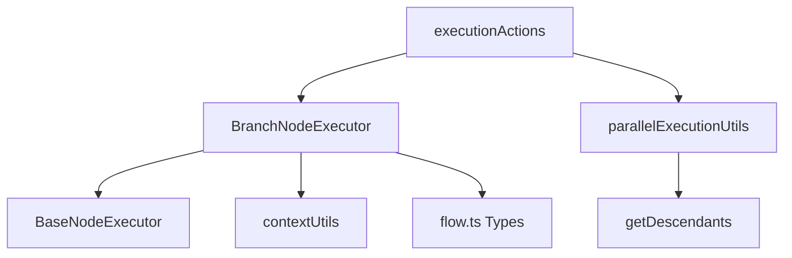
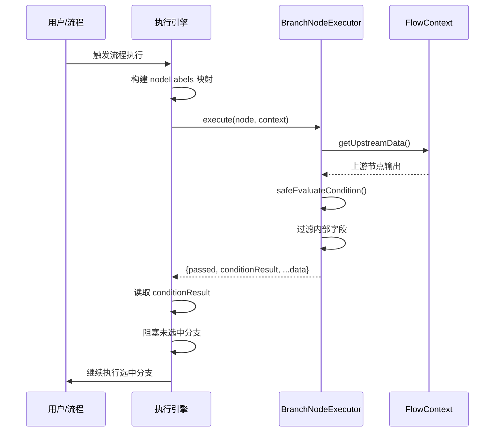

# Branch 节点 (分支节点)

## 功能描述

基于条件表达式控制流程的分支走向。内置**安全表达式求值器**，通过白名单机制防止代码注入，确保执行安全。

## 核心参数

| 参数名 | 类型 | 必填 | 默认值 | 描述 |
|-------|------|-----|-------|------|
| `label` | string | ❌ | - | 节点显示名称 |
| `condition` | string | ❌ | `""` | 判断条件表达式 (见下文) |

**类型定义** (`src/types/flow.ts`):
```typescript
export interface BranchNodeData extends BaseNodeData {
  condition: string; // JavaScript expression, e.g., "input.text.length > 10"
}
```

> [!NOTE]
> 如果 `condition` 为空，节点默认返回 `true`，以保证流程连通性。

## 完整 JSON 示例

### 节点配置示例

```json
{
  "id": "branch-age-check",
  "type": "branch",
  "position": { "x": 500, "y": 200 },
  "data": {
    "label": "年龄检查",
    "condition": "用户信息.age > 18"
  }
}
```

### 运行节点的完整请求示例

**场景**: 测试年龄判断分支节点

```json
{
  "nodeId": "branch-age-check",
  "mockInputData": {
    "用户信息": {
      "name": "张三",
      "age": 25,
      "verified": true
    }
  }
}
```

**执行输出**:
```json
{
  "passed": true,
  "condition": "用户信息.age > 18",
  "conditionResult": true,
  "name": "张三",
  "age": 25,
  "verified": true
}
```

### 复杂条件示例

**使用 AND 逻辑**:
```json
{
  "id": "branch-combined",
  "type": "branch",
  "data": {
    "label": "综合验证",
    "condition": "用户.age >= 18 && 用户.verified === true"
  }
}
```

**使用 OR 逻辑**:
```json
{
  "id": "branch-media-type",
  "type": "branch",
  "data": {
    "label": "媒体类型检测",
    "condition": "输入.type === 'image' || 输入.type === 'video'"
  }
}
```

**字符串方法**:
```json
{
  "id": "branch-refund-intent",
  "type": "branch",
  "data": {
    "label": "退款意图检测",
    "condition": "意图分析.response.includes('退款')"
  }
}
```

## 核心执行逻辑 (Execution Logic)

### 1. 节点查找与数据访问

**高性能索引机制**：
- 构建节点查找 Map（`buildNodeLookupMap`），实现 O(1) 查找性能
- 支持多种查找方式：
  - 节点 ID（精确匹配 & 小写匹配）
  - 节点 Label/标签（精确匹配 & 小写匹配）
- 大小写不敏感，增强用户体验
- 利用 `context._meta.nodeLabels` 进行节点名称到 ID 的映射

### 2. 安全表达式求值

**白名单机制**：
- 所有表达式格式通过预编译正则表达式验证（模块级编译，避免重复创建）
- 不符合白名单的表达式直接返回 `false` 并输出警告到控制台
- 防止代码注入攻击，确保执行安全

**求值流程**：
1. 构建节点查找 Map（一次构建，多次 O(1) 查找）
2. 正则匹配表达式格式
3. 提取节点名称和属性路径
4. 查找节点数据（支持嵌套属性访问）
5. 执行安全的比较或字符串操作

### 3. 上游数据透传

**数据过滤机制**：
- 自动过滤以 `_` 开头的内部字段（如 `_meta`）
- 非对象数据包装为 `{ value: upstreamData }` 格式
- 透传过滤后的数据，确保下游节点可访问

**输出结构**：
```typescript
{
  passed: true,              // 节点执行成功标志
  conditionResult: boolean,  // 条件求值结果
  ...filteredUpstreamData    // 过滤后的上游数据
}
```

### 4. 分支路径选择

**执行引擎集成** (`executionActions.ts`)：
- 执行引擎检测 Branch 节点类型
- 读取 `conditionResult` 决定激活路径
- **阻塞机制**：
  - `conditionResult === true` → 阻塞 `false` 句柄的所有下游节点
  - `conditionResult === false` → 阻塞 `true` 句柄的所有下游节点
  - 使用 `getDescendants` 递归获取所有下游节点并加入阻塞集合
- 并行执行优化：被阻塞的节点不会被执行，节省计算资源

## 支持的表达式格式 (White-list)

为确保安全，仅支持以下几种特定的表达式格式。`NodeName` 代表上游节点的名称或 ID，**支持中文节点名称**。

### 表达式规则

**节点名称规范**：
- 支持字母、中文、下划线、数字组合
- 首字符不能是数字
- 正则模式：`/^([a-zA-Z\u4e00-\u9fa5_][\w\u4e00-\u9fa5]*)/`

**属性路径访问**：
- 支持多级嵌套：`NodeName.level1.level2.field`
- 使用点号 `.` 分隔属性路径
- 自动处理 `undefined`/`null` 安全访问

**大小写处理**：
- 节点名称查找支持大小写不敏感
- 但建议使用与实际节点 Label 一致的大小写以提高可读性

### 1. 字符串匹配

*   **包含**: `NodeName.field.includes('value')`
*   **前缀**: `NodeName.field.startsWith('value')`
*   **后缀**: `NodeName.field.endsWith('value')`

### 2. 等值判断 (Equality)

支持字符串、数字、布尔值的比较。

*   **相等**: `NodeName.field === 'value'` 或 `NodeName.field === 123` 或 `NodeName.field === true`
*   **不等**: `NodeName.field !== 'value'`

### 3. 数值比较 (Comparison)

仅支持数值类型。

*   **大于**: `NodeName.field > 10`
*   **大于等于**: `NodeName.field >= 10.5`
*   **小于**: `NodeName.field < 100`
*   **小于等于**: `NodeName.field <= 50`

### 4. 嵌套属性与数组访问

支持多级路径、数组索引及内置属性访问。

*   **嵌套对象**: `NodeName.data.result.score > 0.8`
*   **数组索引**: 使用点号访问 (不支持 `[0]` 语法)
    *   `NodeName.items.0.name === 'item1'` (访问 items 数组第 1 个元素的 name)
*   **属性访问**:
    *   `NodeName.response.length > 5` (字符串/数组长度)

### 5. 逻辑组合 (AND/OR)

支持通过 `&&` 和 `||` 连接多个条件。

| 运算符 | 语法 | 说明 |
|--------|------|------|
| AND | `条件1 && 条件2` | 两个条件都为 true 时返回 true |
| OR | `条件1 \|\| 条件2` | 任一条件为 true 时返回 true |

**示例**：
*   `用户.age >= 18 && 用户.verified === true` (同时满足年龄和认证)
*   `输入.type === 'image' || 输入.type === 'video'` (图片或视频)

> [!IMPORTANT]
> **语法严苛要求**: 逻辑运算符前后**必须保留空格** (` && ` 而非 `&&`)，否则解析器无法正确识别拆分条件。

[!TIP]
> **最佳实践**：
> - 节点名称支持：字母、中文、下划线、数字 (首字符不能是数字)
> - 完整格式：`NodeName.path.to.field` + 操作符 + 值
> - 示例：`用户信息.data.age > 18` 或 `UserInfo.data.status === 'active'`
> - 复杂逻辑可使用 `&&` 和 `||` 组合多个条件

## 性能优化

### 查找性能
- **O(1) 节点查找**：使用 Map 数据结构，避免线性遍历
- **一次构建多次使用**：每次条件求值只构建一次查找 Map
- **预编译正则**：所有正则表达式在模块加载时编译，避免运行时编译开销

### 内存优化
- **数据过滤**：自动过滤内部字段，减少内存占用
- **智能包装**：只有非对象数据才包装为 `{ value: ... }`
- **浅拷贝透传**：通过解构运算符 `...` 进行浅拷贝，避免深拷贝开销

### 执行优化
- **分支阻塞**：未选中的分支路径不会执行，节省计算资源
- **并行执行兼容**：支持同层级多个 Branch 节点并行执行
- **执行计时**：继承 BaseNodeExecutor 的 `measureTime` 方法，精确记录执行耗时

## 故障排查

### 常见问题

**1. 表达式不生效（总是返回 false）**

可能原因：
- ❌ 表达式格式不符合白名单规则
- ❌ 节点名称或属性路径错误
- ❌ 上游节点未执行或数据为空

解决方法：
- ✅ 检查控制台警告信息
- ✅ 确认节点名称与实际 Label 一致
- ✅ 验证属性路径是否存在于上游数据中

**2. 分支未按预期执行**

可能原因：
- ❌ 条件表达式结果与预期不符
- ❌ 句柄连接错误（true/false 连反了）
- ❌ 上游数据类型不匹配

解决方法：
- ✅ 在调试模式下查看 `conditionResult` 值
- ✅ 检查边的 `sourceHandle` 是否正确
- ✅ 验证数据类型（字符串 vs 数字）

**3. 提示"Unsupported condition format"**

原因：表达式使用了不支持的语法

示例：
```javascript
// ❌ 错误：使用不支持的方法
Node.text.match(/pattern/)  // 不支持正则

// ✅ 正确：使用支持的字符串方法
Node.text.includes('pattern')

// ✅ 逻辑组合也支持
Node.age > 18 && Node.status === 'active'
```

**4. 上游数据访问不到**

可能原因：
- ❌ 上游节点输出字段名与表达式不匹配
- ❌ 上游数据被包装为 `{ value: ... }`

解决方法：
```javascript
// 如果上游输出是字符串 "hello"
// ❌ 错误：Node.text === 'hello'
// ✅ 正确：Node.value === 'hello'
```

## 技术架构

### 核心文件

| 文件 | 职责 |
|------|------|
| [BranchNodeExecutor.ts](file:///Users/jasperlin/Desktop/product/flash-flow-saas/flash-flow/src/store/executors/BranchNodeExecutor.ts) | Branch 节点执行器实现 |
| [executionActions.ts](file:///Users/jasperlin/Desktop/product/flash-flow-saas/flash-flow/src/store/actions/executionActions.ts) | 流程执行引擎与分支控制 |
| [contextUtils.ts](file:///Users/jasperlin/Desktop/product/flash-flow-saas/flash-flow/src/store/executors/contextUtils.ts) | 上下文数据访问工具 |
| [flow.ts](file:///Users/jasperlin/Desktop/product/flash-flow-saas/flash-flow/src/types/flow.ts) | BranchNodeData 类型定义 |

### 依赖关系



### 执行流程



## 安全特性

### 代码注入防护

**白名单策略**：
- ✅ 仅允许预定义的操作符和方法
- ✅ 禁止 `eval()` 或任何动态代码执行
- ✅ 禁止访问全局对象（`window`, `process` 等）
- ✅ 禁止函数调用（除白名单方法外）

**输入验证**：
- 所有表达式通过正则严格验证
- 不匹配的表达式直接拒绝，不进行任何求值
- 控制台输出警告，帮助调试

### 数据隔离

- 自动过滤 `_` 前缀的内部字段
- 防止泄露执行上下文元数据
- 每个节点只能访问其上游节点的输出数据

## 输出格式 (Output Format)

### 标准输出结构

```typescript
{
  "passed": true,             // 固定为 true，表示节点自身执行成功
  "conditionResult": boolean, // 条件表达式的求值结果 (true/false)
  ...upstreamData             // 上游节点数据的完整副本 (已过滤敏感字段)
}
```

### 字段说明

| 字段 | 类型 | 说明 |
|------|------|------|
| `passed` | boolean | 节点执行状态，始终为 `true`（失败时抛出异常） |
| `conditionResult` | boolean | 条件表达式求值结果，决定分支走向 |
| `...upstreamData` | any | 上游节点的输出数据（过滤 `_` 前缀字段） |

### 输出示例

**示例 1：上游为对象数据**
```json
// 上游 LLM 节点输出
{
  "response": "用户年龄为 25 岁",
  "age": 25,
  "_meta": { "executionTime": 1200 }
}

// Branch 节点条件：LLM.age > 18
// Branch 节点输出
{
  "passed": true,
  "conditionResult": true,
  "response": "用户年龄为 25 岁",  // 透传
  "age": 25                        // 透传
  // 注意：_meta 被过滤
}
```

**示例 2：上游为非对象数据**
```json
// 上游节点输出："hello world"

// Branch 节点条件：Node.value.includes('hello')
// Branch 节点输出
{
  "passed": true,
  "conditionResult": true,
  "value": "hello world"  // 自动包装为对象
}
```

**示例 3：条件为空（默认通过）**
```json
// condition 字段为空或未配置

// Branch 节点输出
{
  "passed": true,
  "conditionResult": true,
  ...upstreamData
}
```

### 连线逻辑

**句柄系统**：
- Branch 节点具有两个输出句柄：`true` 和 `false`
- 每个句柄可连接到不同的下游节点

**路径激活规则**：
- **True 路径**: 当 `conditionResult === true` 时：
  - ✅ 激活连接到 `true` 句柄的下游节点
  - ❌ 阻塞连接到 `false` 句柄的所有下游节点（包括间接下游）
  
- **False 路径**: 当 `conditionResult === false` 时：
  - ✅ 激活连接到 `false` 句柄的下游节点
  - ❌ 阻塞连接到 `true` 句柄的所有下游节点（包括间接下游）

**阻塞传播**：
- 阻塞是递归的：被阻塞分支的所有下游节点（包括多层嵌套）都会被阻塞
- 这确保了只有满足条件的路径会被执行，避免资源浪费

## 实战示例

### 示例 1：简单年龄判断

**流程结构**：
```
[Input] → [LLM：提取年龄] → [Branch：age > 18] → true → [Output：成年人]
                                              ↓ false
                                              → [Output：未成年人]
```

**配置**：
```json
{
  "id": "branch-1",
  "type": "branch",
  "data": {
    "label": "年龄检查",
    "condition": "LLM.age > 18"
  }
}
```

**执行过程**：
1. LLM 节点输出：`{ "response": "...", "age": 25 }`
2. Branch 节点求值：`25 > 18` → `true`
3. 激活 true 路径，输出成年人信息
4. 阻塞 false 路径，未成年人分支不执行

### 示例 2：字符串关键词检测

**流程结构**：
```
[Input] → [LLM：意图分析] → [Branch：response.includes('退款')] → true → [退款流程]
                                                            ↓ false
                                                            → [其他流程]
```

**配置**：
```json
{
  "id": "branch-2",
  "type": "branch",
  "data": {
    "label": "退款意图检测",
    "condition": "意图分析.response.includes('退款')"
  }
}
```

### 示例 3：多条件组合（AND/OR 逻辑）

**使用 AND 逻辑**：
```json
{
  "id": "branch-3",
  "type": "branch",
  "data": {
    "label": "综合验证",
    "condition": "LLM.age >= 18 && LLM.verified === true"
  }
}
```

**使用 OR 逻辑**：
```json
{
  "id": "branch-4",
  "type": "branch",
  "data": {
    "label": "媒体类型检测",
    "condition": "输入.type === 'image' || 输入.type === 'video'"
  }
}
```

> [!TIP]
> 对于更复杂的逻辑（如嵌套括号），仍建议使用多个 Branch 节点串联。

### 示例 4：嵌套属性访问

**配置**：
```json
{
  "condition": "用户信息.data.profile.score > 0.8"
}
```

**上游数据**：
```json
{
  "data": {
    "profile": {
      "score": 0.85,
      "level": "VIP"
    }
  }
}
```

**求值过程**：
1. 查找节点"用户信息"
2. 访问路径 `data.profile.score` → `0.85`
3. 比较 `0.85 > 0.8` → `true`

### 示例 5：数值比较

**配置**：
```json
// 不同比较操作符示例
{
  "condition": "订单.amount >= 100"     // 大于等于
}
{
  "condition": "库存.count < 10"        // 小于
}
{
  "condition": "评分.score <= 3"        // 小于等于
}
{
  "condition": "温度.value !== 0"       // 不等于
}
```

### 示例 6：处理包装数据

**场景**：上游节点输出的是原始值（非对象）

```json
// 上游节点输出："已通过审核"

// Branch 配置
{
  "condition": "审核结果.value.startsWith('已通过')"
}

// 注意：使用 .value 访问包装后的数据
```

## 版本历史

### 当前版本特性

**v2.2（当前）**
- ✅ **数组索引支持**：支持 `Node.list.0` 格式访问数组元素
- ✅ **属性访问支持**：支持 `.length` 等标准属性访问
- ✅ **文档更新**：完善数组访问与逻辑运算符使用说明

**v2.1**
- ✅ **支持逻辑运算符** `&&` (AND) 和 `||` (OR)
- ✅ 单个 Branch 节点可处理复杂条件组合
- ✅ 递归求值，支持多条件链式组合

**v2.0**
- ✅ O(1) 节点查找性能优化
- ✅ 大小写不敏感的节点名称匹配
- ✅ 支持中文节点名称
- ✅ 预编译正则表达式
- ✅ 自动过滤内部字段
- ✅ 并行执行引擎集成
- ✅ 分支阻塞机制
- ✅ 执行计时统计

### 核心改进

**性能优化**：
- 从 O(n) 线性查找优化到 O(1) Map 查找
- 正则表达式从运行时编译改为模块级预编译
- 数据透传使用浅拷贝替代深拷贝

**安全增强**：
- 完全白名单机制，禁止任何动态代码执行
- 输入严格验证，不匹配直接拒绝
- 自动过滤敏感内部字段

**用户体验**：
- 支持中文节点名称
- 大小写不敏感匹配
- 控制台友好的错误提示
- 详细的调试信息
