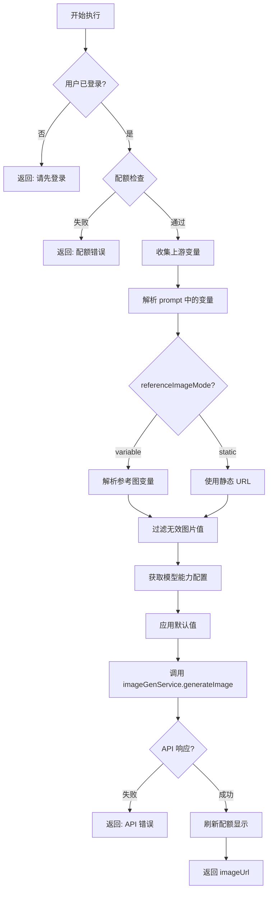

# ImageGen 节点（图像生成节点）

## 功能语意（节点生态位）

ImageGen 节点是工作流中的**生成器**（Generator）节点，一般位于工作流的中后段。它接收上游节点提供的文本或图像变量，调用 SiliconFlow API 生成图像，并输出图像 URL 供下游节点（如 Output、LLM 多模态）使用。

---

## 核心参数（Schema Contract）

> [!NOTE]
> 接口定义位于 `src/types/flow.ts` 的 `ImageGenNodeData` 接口。
> 以下所有字段均从代码溯源，与 TypeScript 类型定义严格对齐。

### 完整字段清单

| 字段名 | TypeScript 类型 | 必填 | 默认值 | 来源文件 | 描述 |
|--------|----------------|------|--------|----------|------|
| `label` | `string` | ❌ | `"图像生成节点"` | `nodeDefaults.ts` | 节点显示名称 |
| `model` | `string` | ❌ | `"Kwai-Kolors/Kolors"` | `IMAGEGEN_CONFIG.DEFAULT_MODEL` | 图像生成模型 ID |
| `prompt` | `string` | ✅ | `""` | `ImageGenNodeData` | 图片描述（**唯一硬性必填**，支持 `{{变量}}` 语法） |
| `negativePrompt` | `string` | ❌ | `""` | `ImageGenNodeData` | 负向提示词（仅部分模型支持） |
| `imageSize` | `string` | ❌ | 模型 `imageSizes[0]` | `capabilities.imageSizes` | 输出图片尺寸 |
| `cfg` | `number` | ❌ | 模型 `defaultCfg` | `capabilities.defaultCfg` | 创意系数（统一存储字段） |
| `guidanceScale` | `number` | ❌ | - | `ImageGenNodeData` | **兼容旧数据**，已弃用，优先读取 `cfg` |
| `numInferenceSteps` | `number` | ❌ | 模型 `defaultSteps` | `capabilities.defaultSteps` | 推理步数 |
| `referenceImageMode` | `'variable' \| 'static'` | ❌ | `"static"` | `ImageGenNodeData` | 参考图来源模式 |
| `referenceImageUrl` | `string` | ❌ | - | `ImageGenNodeData` | 静态上传的主参考图 URL (Slot 1) |
| `referenceImageUrl2` | `string` | ❌ | - | `ImageGenNodeData` | 静态上传的副参考图 URL (Slot 2) |
| `referenceImageUrl3` | `string` | ❌ | - | `ImageGenNodeData` | 静态上传的副参考图 URL (Slot 3) |
| `referenceImageVariable` | `string` | ❌ | - | `ImageGenNodeData` | 变量引用的主参考图 (Slot 1) |
| `referenceImage2Variable` | `string` | ❌ | - | `ImageGenNodeData` | 变量引用的副参考图 (Slot 2) |
| `referenceImage3Variable` | `string` | ❌ | - | `ImageGenNodeData` | 变量引用的副参考图 (Slot 3) |

### 继承自 BaseNodeData 的字段

| 字段名 | TypeScript 类型 | 描述 |
|--------|----------------|------|
| `status` | `ExecutionStatus` (`'idle' \| 'running' \| 'completed' \| 'error'`) | 节点执行状态 |
| `executionTime` | `number` | 执行耗时（毫秒） |
| `output` | `Record<string, unknown>` | 节点输出数据 |

---

## 模型能力配置（Model Capabilities）

> [!IMPORTANT]
> 模型能力决定了 UI 表单的动态显隐逻辑。
> 定义位于 `src/services/imageGenModelsAPI.ts` 的 `ImageGenModelCapabilities` 接口。

### Capabilities 接口定义

```typescript
interface ImageGenModelCapabilities {
    supportsNegativePrompt: boolean;      // 是否显示负向提示词输入框
    supportsImageSize: boolean;           // 是否显示图片尺寸选择器
    supportsReferenceImage: boolean;      // 是否显示参考图配置区域
    supportsInferenceSteps: boolean;      // 是否显示推理步数滑块
    minInferenceSteps?: number;           // 推理步数最小值（默认 1）
    maxInferenceSteps?: number;           // 推理步数最大值（默认 50）
    cfgParam: 'guidance_scale' | 'cfg' | null; // CFG 参数名（null = 不支持 CFG）
    cfgRange?: { min: number; max: number };   // CFG 取值范围
    defaultCfg?: number;                  // 默认 CFG 值
    defaultSteps?: number;                // 默认推理步数
    imageSizes?: string[] | null;         // 支持的图片尺寸列表
    maxReferenceImages?: number;          // 最多支持的参考图数量
}
```

### 当前支持的模型

| 模型 ID | 显示名称 | 负向提示词 | 尺寸调节 | 参考图 | CFG 参数 | 推理步数范围 | 默认值 |
|---------|---------|-----------|---------|--------|----------|-------------|--------|
| `Kwai-Kolors/Kolors` | 可灵 | ✅ | ✅ | ❌ | `guidance_scale` (0-20) | 1-49 | cfg=7.5, steps=25 |
| `Qwen/Qwen-Image` | 千问-文生图 | ✅ | ✅ | ❌ | `cfg` (0.1-20) | 1-50 | cfg=4.0, steps=50 |
| `Qwen/Qwen-Image-Edit-2509` | 千问-图生图 | ✅ | ❌ | ✅ (1-3张) | `cfg` (0.1-20) | 1-50 | cfg=4.0, steps=50 |

### UI 动态显隐规则

以下参数的 UI 显示取决于当前选中模型的 capabilities：

| 字段 | 显隐条件 |
|-----|---------|
| `negativePrompt` 输入框 | `capabilities.supportsNegativePrompt === true` |
| `imageSize` 选择器 | `capabilities.supportsImageSize === true && sizeOptions.length > 0` |
| `cfg` 滑块 | `capabilities.cfgParam !== null` |
| `numInferenceSteps` 滑块 | `capabilities.supportsInferenceSteps === true` |
| 参考图配置区 | `capabilities.supportsReferenceImage === true` |
| 添加更多参考图按钮 | `capabilities.maxReferenceImages > 1` |

---

## 逻辑约束与边界条件

### 必填校验（硬约束）

| 约束 | 校验位置 | 失败行为 |
|-----|---------|---------|
| `prompt` 不能为空 | UI 层 (`FormField` + `*` 标记) | 表单不阻止提交，但生成结果可能为空图 |

> [!WARNING]
> 当前代码在 Executor 层**未强制校验 prompt 为空**的情况。如果 prompt 为空字符串，会发送到 API，由 API 层返回错误。

### 取值范围约束

| 字段 | 最小值 | 最大值 | 校验位置 | 备注 |
|-----|-------|--------|---------|------|
| `numInferenceSteps` | `capabilities.minInferenceSteps` (默认 1) | `capabilities.maxInferenceSteps` (默认 50) | UI 层 (`useEffect` + `hookCalculateSteps`) | 模型切换时自动修正超出范围的值 |
| `cfg` | `capabilities.cfgRange.min` (0 或 0.1) | `capabilities.cfgRange.max` (20) | UI 层 (`useEffect`) | 模型切换时自动修正超出范围的值 |
| 参考图文件大小 | - | 10 MB | UI 层 (`ImageGenNodeForm.tsx` L189) | 超出提示 `"图片大小不能超过 10MB"` |
| 参考图数量 | 1 | `capabilities.maxReferenceImages` (最大 3) | UI 层 | 仅 `Qwen-Image-Edit-2509` 支持多图 |

### 文件类型约束

| 约束 | 值 | 校验位置 |
|-----|---|---------|
| 参考图 MIME 类型 | `image/*` (PNG, JPG, JPEG, WEBP) | UI 层 (`ImageGenNodeForm.tsx` L184) |

### 运行时报错条件（Execute 层硬约束）

以下条件会导致节点执行失败，返回 `output.error`：

| 错误条件 | 错误信息 | 代码位置 |
|---------|---------|---------|
| 用户未登录 | `"请先登录以使用图片生成功能"` | `ImageGenNodeExecutor.ts` L150-154 |
| 配额用尽 | `"图片生成次数已用完 (used/limit)。请联系管理员增加配额。"` | `ImageGenNodeExecutor.ts` L156-161 |
| 配额检查失败 | `"配额检查失败，请稍后重试"` | `ImageGenNodeExecutor.ts` L163-167 |
| API 调用失败 | `"Image generation failed: {status}"` 或 API 返回的 error | `imageGenService.ts` L44-46 |

### 参数逻辑依赖

| 依赖关系 | 逻辑描述 |
|---------|---------|
| `referenceImageMode` → 参考图字段 | `static` 模式使用 `referenceImageUrl/Url2/Url3`；`variable` 模式使用 `referenceImageVariable/2Variable/3Variable` |
| `model` → 所有 capabilities 相关字段 | 模型切换会触发 UI 重建，根据新模型的 capabilities 显隐字段并重置越界值 |

---

## 输出格式（Output Contract）

### 执行成功时

```typescript
{
  "imageUrl": string  // 生成图片的永久访问 URL（存储在 Supabase Storage）
}
```

### 执行失败时

```typescript
{
  "error": string  // 错误信息
}
```

### Schema 输出（供下游节点引用）

ImageGen 节点输出的 Schema 为：

```json
{
  "imageUrl": "string"
}
```

**变量引用方式**：`{{图像生成节点.imageUrl}}`

---

## 执行流程



### 关键代码逻辑

1. **变量收集**：`collectVariables(context, globalFlowContext, allNodes, mockData)` 收集所有上游节点输出
2. **变量替换**：`replaceVariables(prompt, allVariables)` 替换 `{{变量}}` 占位符
3. **参考图验证**：`isValidImageValue(resolved)` 过滤未解析的占位符和无效 URL
4. **默认值应用**：
   - `cfg` = `nodeData.cfg ?? nodeData.guidanceScale ?? capabilities.defaultCfg ?? IMAGEGEN_CONFIG.DEFAULT_CFG`
   - `numInferenceSteps` = `nodeData.numInferenceSteps ?? capabilities.defaultSteps ?? IMAGEGEN_CONFIG.DEFAULT_STEPS`
   - `imageSize` = `nodeData.imageSize ?? capabilities.imageSizes?.[0] ?? IMAGEGEN_CONFIG.DEFAULT_IMAGE_SIZE`

---

## 完整节点 JSON 示例

### 文生图模式（最简配置）

```json
{
  "id": "imagegen-abc12345",
  "type": "imagegen",
  "position": { "x": 400, "y": 200 },
  "data": {
    "label": "生成封面图",
    "model": "Kwai-Kolors/Kolors",
    "prompt": "一只可爱的橘猫坐在窗台上看夕阳",
    "status": "idle"
  }
}
```

### 文生图模式（完整配置）

```json
{
  "id": "imagegen-abc12345",
  "type": "imagegen",
  "position": { "x": 400, "y": 200 },
  "data": {
    "label": "生成产品图片",
    "status": "completed",
    
    "model": "Kwai-Kolors/Kolors",
    "prompt": "一张{{输入节点.formData.product_name}}的产品展示图，{{输入节点.formData.style}}风格，高清质感，专业摄影",
    "negativePrompt": "模糊，低质量，变形，水印",
    "imageSize": "1024x1024",
    "cfg": 7.5,
    "numInferenceSteps": 30,
    
    "referenceImageMode": "static",
    "referenceImageUrl": "",
    "referenceImageUrl2": "",
    "referenceImageUrl3": "",
    
    "output": {
      "imageUrl": "https://xxxxx.supabase.co/storage/v1/object/public/generated-images/1704038400000_abc123.png"
    },
    "executionTime": 8500
  }
}
```

### 图生图模式（变量引用参考图，最复杂配置）

```json
{
  "id": "imagegen-def67890",
  "type": "imagegen",
  "position": { "x": 600, "y": 200 },
  "data": {
    "label": "多图融合风格迁移",
    "status": "completed",
    
    "model": "Qwen/Qwen-Image-Edit-2509",
    "prompt": "将这些图片融合，转换为{{输入节点.formData.target_style}}风格",
    "negativePrompt": "真实照片，写实风格",
    "cfg": 4.0,
    "numInferenceSteps": 40,
    
    "referenceImageMode": "variable",
    "referenceImageVariable": "{{输入节点.files[0].url}}",
    "referenceImage2Variable": "{{输入节点.files[1].url}}",
    "referenceImage3Variable": "{{上游图像生成节点.imageUrl}}",
    
    "output": {
      "imageUrl": "https://xxxxx.supabase.co/storage/v1/object/public/generated-images/1704038500000_def456.png"
    },
    "executionTime": 12300
  }
}
```

### 图生图模式（静态上传参考图）

```json
{
  "id": "imagegen-ghi11223",
  "type": "imagegen",
  "position": { "x": 800, "y": 200 },
  "data": {
    "label": "基于参考图生成",
    "status": "idle",
    
    "model": "Qwen/Qwen-Image-Edit-2509",
    "prompt": "根据参考图生成同风格的产品图",
    "negativePrompt": "",
    "cfg": 4.0,
    "numInferenceSteps": 50,
    
    "referenceImageMode": "static",
    "referenceImageUrl": "https://xxxxx.supabase.co/storage/v1/object/public/flow-files/flowId/nodeId/ref1.png",
    "referenceImageUrl2": "https://xxxxx.supabase.co/storage/v1/object/public/flow-files/flowId/nodeId/ref2.png",
    "referenceImageUrl3": ""
  }
}
```

---

## 常量与默认值清单

> 定义位于 `src/store/constants/imageGenConstants.ts`

```typescript
const IMAGEGEN_CONFIG = {
    DEFAULT_MODEL: "Kwai-Kolors/Kolors",
    DEFAULT_CFG: 7.5,
    DEFAULT_STEPS: 25,
    DEFAULT_IMAGE_SIZE: "1024x1024",
    STEPS_MIN_DEFAULT: 1,
    STEPS_MAX_DEFAULT: 50,
    QUALITY_MIN: 1,
    QUALITY_MAX: 100,
    CFG_STEP: 0.1,
};
```

---

## 相关源文件索引

| 文件 | 路径 | 职责 |
|-----|------|------|
| ImageGenNodeData 接口 | `src/types/flow.ts` | 节点数据类型定义 |
| ImageGenNodeExecutor | `src/store/executors/ImageGenNodeExecutor.ts` | 节点执行逻辑 |
| ImageGenNodeForm | `src/components/builder/node-forms/ImageGenNodeForm.tsx` | 节点配置表单 |
| ImageGenDebugDialog | `src/components/flow/ImageGenDebugDialog.tsx` | 调试对话框 |
| ImageGenMetadata | `src/components/flow/nodes/metadata/ImageGenMetadata.tsx` | 节点元数据展示 |
| imageGenConstants | `src/store/constants/imageGenConstants.ts` | 常量配置 |
| imageGenModelsAPI | `src/services/imageGenModelsAPI.ts` | 模型能力配置 |
| imageGenService | `src/services/imageGenService.ts` | API 调用服务 |
| useImageGenModel | `src/hooks/useImageGenModel.ts` | 模型选择 Hook |
