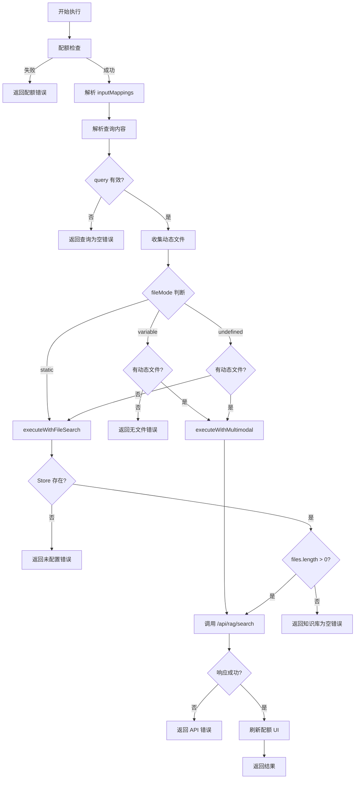

# RAG 节点 (检索增强生成节点)

## 功能描述

> **生态位**：RAG 节点是工作流中的**知识检索与增强节点**，负责将用户查询与外部知识库匹配，返回相关文档片段或 AI 生成的回答。它是连接用户输入与 LLM 节点的知识桥梁。

RAG（检索增强生成）节点使用 Google Gemini API 进行智能文档检索和问答，支持两种工作模式：

1.  **静态模式 (Static Mode)**：使用 Builder 中预先上传到 File Search Store 的知识库文件。
2.  **变量引用模式 (Variable Mode)**：从上游节点（通常是 Input 节点）实时引用用户上传的文件。

### 模式选择机制

系统优先使用用户在 UI 上显式选择的模式：

| `fileMode` 值 | 行为 | 文件来源 |
|--------------|------|---------|
| `'variable'` | 强制使用动态文件引用 | `inputMappings.files/files2/files3` |
| `'static'` | 强制使用预上传的文件 | `files/files2/files3` 静态数组 |
| `undefined` | 自动判断（兼容旧节点） | 优先动态，无则静态 |

---

## 核心参数

### 节点数据参数 (`RAGNodeData`)

> **源码位置**：[flow.ts](file:///Users/jasperlin/Desktop/product/flash-flow-saas/flash-flow/src/types/flow.ts#L38-L68)

| 参数名 | 类型 | 必填 | 默认值 | 约束 | 描述 |
|-------|------|-----|--------|------|------|
| `label` | `string` | ❌ | `"RAG"` | - | 节点显示名称 |
| `fileMode` | `'variable' \| 'static'` | ❌ | `undefined` | 仅 UI 选择 | 模式选择，见上表 |
| `files` | `FileInfo[]` | ❌ | `[]` | 单文件 ≤100MB | 知识库文件 (槽位1) |
| `files2` | `FileInfo[]` | ❌ | `[]` | 单文件 ≤100MB | 知识库文件 (槽位2) |
| `files3` | `FileInfo[]` | ❌ | `[]` | 单文件 ≤100MB | 知识库文件 (槽位3) |
| `fileSearchStoreName` | `string` | ❌ | 自动创建 | 格式：`fileSearchStores/xxx` | Gemini File Search Store 完整名称 |
| `fileSearchStoreId` | `string` | ❌ | - | 格式：`store-{nodeId前8位}-{timestamp}` | Store 显示 ID（用户友好标识） |
| `maxTokensPerChunk` | `number` | ❌ | `200` | `50 ≤ n ≤ 500`，步长 10 | 文档分块大小（tokens） |
| `maxOverlapTokens` | `number` | ❌ | `20` | `0 ≤ n ≤ 100`，步长 5 | 分块重叠大小（tokens） |
| `uploadStatus` | `string` | ❌ | `'idle'` | 枚举 | 文件上传状态 |
| `uploadError` | `string` | ❌ | - | - | 上传错误信息 |
| `query` | `string` | ❌ | - | 执行结果 | 最后一次执行的搜索查询 |
| `documents` | `string[]` | ❌ | - | 执行结果 | 找到的文档片段 |

#### `FileInfo` 类型定义

```typescript
interface FileInfo {
  id?: string;
  name: string;
  size?: number;
  type?: string;
  url?: string;
}
```

#### `uploadStatus` 枚举值

| 值 | 描述 |
|----|------|
| `'idle'` | 空闲状态 |
| `'uploading'` | 正在上传 |
| `'processing'` | 处理中（服务端解析） |
| `'completed'` | 上传完成 |
| `'error'` | 上传失败 |

---

### 输入映射参数 (`inputMappings`)

> **源码位置**：[flow.ts L57-63](file:///Users/jasperlin/Desktop/product/flash-flow-saas/flash-flow/src/types/flow.ts#L57-L63)

`inputMappings` 是 `RAGNodeData` 的**显式声明字段**，用于从上游节点引用数据。支持 `{{变量}}` 模板语法。

| 参数名 | 类型 | 必填 | 描述 | 示例 |
|-------|------|-----|------|------|
| `query` | `string` | ❌ | 检索查询内容模板 | `{{用户输入.user_input}}` |
| `files` | `string` | ❌ | 动态文件引用 (槽位1) | `{{用户输入.files}}` |
| `files2` | `string` | ❌ | 动态文件引用 (槽位2) | `{{API.files}}` |
| `files3` | `string` | ❌ | 动态文件引用 (槽位3) | `{{Other.files}}` |

#### 变量解析规则

1. **查找优先级**：节点 ID → 节点标签（Label）→ 直接字段名
2. **支持格式**：
   - `{{nodeLabel.field}}` - 引用节点标签的字段
   - `{{nodeId.field}}` - 引用节点 ID 的字段  
   - `{{field}}` - 直接字段名（从上下文自动查找）
3. **嵌套路径**：支持 `{{node.formData.destination}}` 点号访问
4. **数组访问**：支持 `{{node.files[0].url}}` 索引访问

#### 查询内容解析优先级

| 优先级 | 来源 | 条件 |
|-------|------|------|
| 1 | `mockData.query` | 调试模式运行时传入 |
| 2 | `inputMappings.query` | 模板解析 |
| 3 | `extractInputFromContext()` | 自动从上游提取文本 |

---

## 逻辑约束与边界

### 参数约束

| 参数 | 约束类型 | 约束值 | 来源 |
|-----|---------|-------|------|
| `maxTokensPerChunk` | 范围 | `[50, 500]` | UI Slider |
| `maxTokensPerChunk` | 步长 | `10` | UI Slider |
| `maxOverlapTokens` | 范围 | `[0, 100]` | UI Slider |
| `maxOverlapTokens` | 步长 | `5` | UI Slider |
| 单文件大小 | 最大值 | `100MB` | API 校验 |
| 静态文件槽位 | 最大数量 | `3` | UI 限制 |
| 动态文件变量 | 最大数量 | `3` | UI 限制 |

### 支持的文件格式

| 模式 | 支持格式 |
|-----|---------|
| 静态模式 | `.pdf`, `.txt`, `.md`, `.doc(x)`, `.csv/tsv`, `.xml/html/css`, `.json/yaml`, `代码`, `.log`, `图片` |
| 动态模式 | 上述所有格式 |

### 逻辑依赖（显隐控制）

| 条件 | 显示的 UI 元素 |
|-----|---------------|
| `fileMode === 'variable'` | 文件变量输入框 (1-3) |
| `fileMode !== 'variable'` | 静态文件上传区域 (1-3) |
| `fileSearchStoreName` 存在 | 高级设置折叠区 |

---

## 运行时错误条件

> **源码位置**：[RAGNodeExecutor.ts](file:///Users/jasperlin/Desktop/product/flash-flow-saas/flash-flow/src/store/executors/RAGNodeExecutor.ts)

### 执行器错误

| 错误条件 | 错误消息 | 触发位置 |
|---------|---------|---------|
| 查询内容为空 | `"未找到查询内容。请确保 RAG 节点连接到包含查询内容的上游节点。"` | L45-49 |
| 变量模式无文件 | `"当前为变量模式，但未检测到有效的文件输入。请检查 inputMappings 配置。"` | L76 |
| 静态模式无 Store | `"RAG 节点未配置知识库。请在 Builder 中上传文件，或配置 inputMappings.files 引用上游文件。"` | L196-199 |
| 静态模式无文件 | `"知识库为空，请先上传至少一个文件。"` | L203-206 |
| API 超时 (60s) | `"搜索请求超时 (60s)，请稍后重试。"` | L255-256 |
| 配额耗尽 | `"LLM 执行次数已用完 (used/limit)。请联系管理员增加配额。"` | L281-283 |
| 未登录 | `"请先登录以使用 RAG 功能"` | L273-276 |

### API 错误

| HTTP 状态码 | 错误条件 | 错误消息 |
|-----------|---------|---------|
| 401 | 未认证 | `"Unauthorized"` |
| 400 | 查询为空 | `"查询内容不能为空"` |
| 400 | Store 未指定 | `"未指定 FileSearchStore"` |
| 400 | 文件为空 | `"未提供文件"` |
| 400 | 无效模式 | `"无效的搜索模式"` |
| 400 | 文件加载失败 | `"无法加载任何有效文件"` |
| 500 | API Key 未配置 | `"Gemini API Key 未配置"` |
| 500 | 其他错误 | 具体错误消息 |

---

## 输出格式 (Output Format)

### 成功执行时的输出

```typescript
interface RAGNodeOutput {
  query: string;              // 实际执行的检索查询内容
  documents: string[];        // 检索到的文档片段或 AI 回答
  citations?: Array<{         // 引用来源信息（可选）
    source: string;           // 来源文件名或标题
    chunk: string;            // 引用的文本片段
  }>;
  documentCount: number;      // 返回的文档数量
  mode: 'fileSearch' | 'multimodal';  // 实际使用的执行模式
}
```

### 错误时的输出

```typescript
interface RAGNodeErrorOutput {
  error: string;  // 错误描述信息
}
```

### 输出字段说明

| 字段 | 类型 | 必有 | 描述 |
|-----|------|-----|------|
| `query` | `string` | ✅ | 实际执行的查询内容（解析后） |
| `documents` | `string[]` | ✅ | 文档片段数组或 AI 回答 |
| `citations` | `object[]` | ❌ | 引用来源（fileSearch 模式更详细） |
| `documentCount` | `number` | ✅ | 返回的文档数量 |
| `mode` | `string` | ✅ | 执行模式标识 |
| `error` | `string` | ❌ | 错误信息（仅失败时存在） |

---

## 完整 JSON Payload 示例

### 示例 1：静态模式配置

```json
{
  "label": "产品知识库",
  "fileMode": "static",
  "files": [
    { "name": "产品手册.pdf", "size": 2048000, "type": "application/pdf" }
  ],
  "files2": [],
  "files3": [],
  "fileSearchStoreName": "fileSearchStores/abc123xyz",
  "fileSearchStoreId": "store-node1234-1704499200000",
  "maxTokensPerChunk": 300,
  "maxOverlapTokens": 50,
  "uploadStatus": "completed",
  "inputMappings": {
    "query": "{{用户输入.user_input}}"
  }
}
```

### 示例 2：变量引用模式配置

```json
{
  "label": "动态文档分析",
  "fileMode": "variable",
  "inputMappings": {
    "query": "{{用户输入.question}}",
    "files": "{{用户输入.files}}",
    "files2": "{{API节点.attachments}}",
    "files3": ""
  },
  "maxTokensPerChunk": 200,
  "maxOverlapTokens": 20
}
```

### 示例 3：成功执行输出（静态模式）

```json
{
  "query": "什么是 RAG？",
  "documents": [
    "RAG (检索增强生成) 是一种结合检索和生成的 AI 技术...",
    "通过检索相关文档片段，RAG 可以提供更准确的回答..."
  ],
  "citations": [
    { "source": "AI技术手册.pdf", "chunk": "RAG (检索增强生成)..." },
    { "source": "AI技术手册.pdf", "chunk": "通过检索相关文档..." }
  ],
  "documentCount": 2,
  "mode": "fileSearch"
}
```

### 示例 4：成功执行输出（动态模式）

```json
{
  "query": "总结这份文档的主要内容",
  "documents": [
    "该文档主要介绍了...[AI 生成的完整回答]"
  ],
  "citations": [
    { "source": "用户文档.pdf", "chunk": "" }
  ],
  "documentCount": 1,
  "mode": "multimodal"
}
```

---

## 核心执行逻辑

> **源码位置**：[RAGNodeExecutor.ts](file:///Users/jasperlin/Desktop/product/flash-flow-saas/flash-flow/src/store/executors/RAGNodeExecutor.ts)

### 执行流程



### 模式判断伪代码

```typescript
// RAGNodeExecutor.execute() 核心逻辑
const fileMode = ragData.fileMode;

if (fileMode === 'variable') {
  // 显式变量模式：必须有动态文件
  if (allDynamicFiles.length > 0) {
    return executeWithMultimodal(query, allDynamicFiles);
  } else {
    return { error: "变量模式无文件" };
  }
} else if (fileMode === 'static') {
  // 显式静态模式：使用 File Search Store
  return executeWithFileSearch(query, ragData);
} else {
  // 自动判断 (兼容旧节点)
  if (allDynamicFiles.length > 0) {
    return executeWithMultimodal(query, allDynamicFiles);
  } else {
    return executeWithFileSearch(query, ragData);
  }
}
```

---

## 开发与调试 (Development & Debugging)

### 测试运行逻辑 (`HandleNodeTest`)

RAG 节点的测试运行遵循以下逻辑判定：

1.  **直接运行条件**（必须全部满足）：
    *   `fileMode` 必须为 `'static'`（或隐式静态）。
    *   **至少存在一个静态文件**（检查 `files`, `files2`, `files3` 任意槽位）。
    *   查询语句 `inputMappings.query` 存在且**不包含变量**（`{{...}}`）。

2.  **触发调试弹窗条件**（满足任一）：
    *   `fileMode` 为 `'variable'`（需要模拟文件输入，但目前调试弹窗仅支持 Query）。
    *   未配置任何静态文件。
    *   查询语句包含变量引用。
    *   完全未配置查询语句。

### 统一调试弹窗行为 (`Unified Debug Dialog`)

RAG 节点遵循系统的“统一调试组件”标准，采用 **Store-Driven** 架构：

*   **自动预填 (Auto-Pre-fill)**：
    *   打开弹窗时，系统 action (`openDialog`) 会自动读取当前节点的 `inputMappings.query` 配置。
    *   即使查询语句包含变量（如 `{{user_input}}`），也会原样回显到调试输入框中，方便用户快速修改为测试值。
*   **状态管理**：
    *   弹窗组件为纯 UI (`Stateless`)，直接绑定全局 Store 数据，确保数据永不丢失且实时同步。
    *   严禁在组件内部使用 `useEffect` 进行状态重置（Anti-Pattern）。

---

## 服务端 API

### API 路由总览

| 路由 | 方法 | Runtime | 功能 | 超时 |
|------|------|---------|------|------|
| `/api/rag/search` | POST | Edge | 执行 RAG 检索 | 60s (客户端) |
| `/api/rag/store` | POST | Edge | 创建 FileSearchStore | - |
| `/api/rag/upload` | POST | Node.js | 上传文件到 Store | - |
| `/api/rag/delete` | POST | Node.js | 删除文件 | - |

> [!IMPORTANT]
> - 所有 API 都需要用户身份认证
> - 环境变量 `GEMINI_API_KEY` 必须配置
> - RAG 执行消耗 `llm_executions` 配额

### `/api/rag/search` 请求格式

**静态模式**：
```typescript
{
  mode: "fileSearch",
  query: string,
  fileSearchStoreName: string  // 如 "fileSearchStores/abc123"
}
```

**动态模式**：
```typescript
{
  mode: "multimodal",
  query: string,
  files: Array<{ name: string; url: string; type?: string }>
}
```

### `/api/rag/upload` 请求格式

```typescript
// Content-Type: multipart/form-data
{
  file: File,
  fileSearchStoreName: string,
  displayName?: string,
  maxTokensPerChunk?: number,  // 默认 200
  maxOverlapTokens?: number    // 默认 20
}
```

---

## 环境变量配置

```bash
# .env.local
GEMINI_API_KEY=your_api_key_here
```

> [!WARNING]
> - 不要使用 `NEXT_PUBLIC_` 前缀（会暴露到客户端）
> - API Key 检查在每个请求中进行
