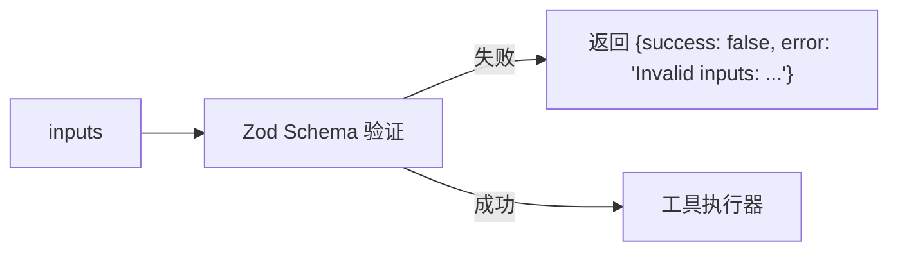
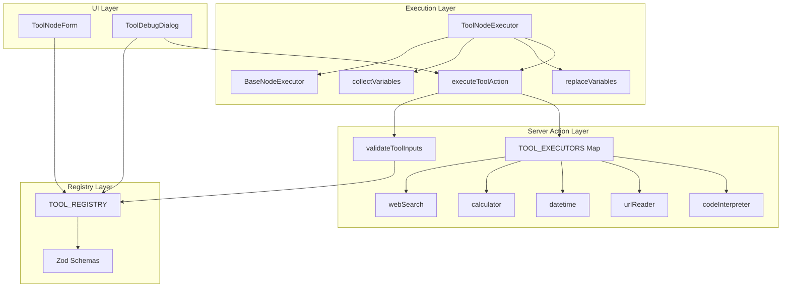

# Tool 节点 (工具节点)

## 功能语义 (Semantic Role)

> **生态位**：工具节点是工作流中连接 AI 与外部世界的**桥梁节点**，负责调用外部 API 或执行代码来完成专项任务。它是一个**数据转换器**，接收上游变量输入，经过工具执行后输出结构化结果供下游消费。

---

## 核心参数 (Schema Definition)

> **源文件**: `src/types/flow.ts` (L166-169)

```typescript
export interface ToolNodeData extends BaseNodeData {
  toolType?: ToolType; // 工具类型标识符
  inputs?: Record<string, unknown>; // 动态输入参数（由工具 Schema 定义）
}
```

| 参数名 | 类型 | 必填 | 默认值 | 约束 | 描述 |
|--------|------|:----:|--------|------|------|
| `label` | `string` | ❌ | `undefined` | 继承自 `BaseNodeData` | 节点显示名称 |
| `toolType` | `ToolType` | ⚠️ | `"web_search"` | 枚举值见下表 | 工具类型标识符。**运行时必填**：执行时若为空或无效将抛出错误 |
| `inputs` | `Record<string, unknown>` | ❌ | `{}` | 由具体工具 Schema 定义 | 工具特定的输入参数，支持 `{{变量}}` 引用 |

### ToolType 枚举值

> **源文件**: `src/lib/tools/registry.ts` (L10)

```typescript
export type ToolType = "web_search" | "calculator" | "datetime" | "url_reader" | "code_interpreter";
```

| 值 | 名称 | 分类 | 描述 |
|----|------|------|------|
| `web_search` | 网页搜索 | `search` | 使用 Tavily API 联网查找实时信息 |
| `calculator` | 计算器 | `math` | 使用 mathjs 安全计算数学表达式 |
| `datetime` | 日期时间 | `utility` | 处理时间获取、格式化及计算 |
| `url_reader` | 网页读取 | `data` | 提取并解析目标网页的正文内容 |
| `code_interpreter` | 代码执行 | `utility` | 在 E2B 沙箱环境中执行 Python 代码 |

---

## 各工具详细参数 (Per-Tool Schema)

### 1. 🔍 网页搜索 (`web_search`)

> **源文件**: `src/lib/tools/registry.ts` (L41-50), `src/app/actions/tools/executors/webSearch.ts`

**输入参数 (Zod Schema)**:

| 参数名 | 类型 | 必填 | 默认值 | 约束 | 描述 |
|--------|------|:----:|--------|------|------|
| `query` | `string` | ✅ | - | `min(1)` | 搜索关键词 |
| `maxResults` | `number` | ✅ | - | `int`, `min(1)`, `max(10)` | 最大结果数 |

**环境变量依赖**:
- `TAVILY_API_KEY` (必需)：缺失时返回错误 `"Tavily API key not configured..."`

**输出示例**:
```json
{
  "query": "Next.js 15 新特性",
  "results": [
    { "title": "...", "url": "...", "content": "..." }
  ],
  "count": 5
}
```

**运行时错误**:
| 条件 | 错误信息 |
|------|----------|
| `TAVILY_API_KEY` 未配置 | `"Tavily API key not configured. Please add TAVILY_API_KEY to your environment variables."` |
| API 调用失败 | `"Tavily API error: {status} {statusText}"` |

---

### 2. 🧮 计算器 (`calculator`)

> **源文件**: `src/lib/tools/registry.ts` (L56-60), `src/app/actions/tools/executors/calculator.ts`

**输入参数 (Zod Schema)**:

| 参数名 | 类型 | 必填 | 默认值 | 约束 | 描述 |
|--------|------|:----:|--------|------|------|
| `expression` | `string` | ✅ | - | `min(1)` | 数学表达式 (如 `(10 * 5) + 2`) |

**依赖库**: `mathjs` 的 `evaluate()` 函数

**输出示例**:
```json
{
  "expression": "(10 * 5) + 2",
  "result": 52
}
```

**运行时错误**:
| 条件 | 错误信息 |
|------|----------|
| 表达式语法错误 | mathjs 原生错误信息 (如 `"Undefined symbol..."`) |

---

### 3. 🕐 日期时间 (`datetime`)

> **源文件**: `src/lib/tools/registry.ts` (L66-118), `src/app/actions/tools/executors/datetime.ts`

**输入参数 (Zod Discriminated Union)**:

此工具使用 **discriminatedUnion** 模式，`operation` 字段决定其他字段的可用性。

#### 操作类型：`now` (获取当前时间)

| 参数名 | 类型 | 必填 | 默认值 | 约束 | 描述 |
|--------|------|:----:|--------|------|------|
| `operation` | `"now"` | ✅ | - | literal | 操作类型 |
| `format` | `string` | ❌ | `"YYYY-MM-DD HH:mm:ss"` | - | 输出格式 |

**输出示例**:
```json
{
  "operation": "now",
  "formatted": "2024-03-20 10:00:00",
  "timestamp": 1710900000000,
  "iso": "2024-03-20T02:00:00.000Z",
  "timezone": "Asia/Shanghai"
}
```

#### 操作类型：`format` (格式化日期)

| 参数名 | 类型 | 必填 | 默认值 | 约束 | 描述 |
|--------|------|:----:|--------|------|------|
| `operation` | `"format"` | ✅ | - | literal | 操作类型 |
| `date` | `string` | ✅ | - | `min(1)` | 输入日期 (ISO 或常见格式) |
| `format` | `string` | ✅ | `"YYYY-MM-DD HH:mm:ss"` | `min(1)` | 输出格式 |

**输出示例**:
```json
{
  "operation": "format",
  "input": "2024-03-20",
  "formatted": "2024-03-20 00:00:00",
  "format": "YYYY-MM-DD HH:mm:ss"
}
```

#### 操作类型：`diff` (计算日期差)

| 参数名 | 类型 | 必填 | 默认值 | 约束 | 描述 |
|--------|------|:----:|--------|------|------|
| `operation` | `"diff"` | ✅ | - | literal | 操作类型 |
| `date` | `string` | ✅ | - | `min(1)` | 开始日期 |
| `targetDate` | `string` | ✅ | - | `min(1)` | 结束日期 |
| `unit` | `enum` | ❌ | `"day"` | `year\|month\|day\|hour\|minute\|second` | 时间单位 |

**输出示例**:
```json
{
  "operation": "diff",
  "from": "2024-01-01",
  "to": "2024-03-20",
  "difference": {
    "days": 79,
    "hours": 1896,
    "minutes": 113760,
    "milliseconds": 6825600000
  },
  "humanReadable": "79 天"
}
```

**运行时错误**:
| 条件 | 错误信息 |
|------|----------|
| `targetDate` 缺失 | `"计算日期差需要提供目标日期 (targetDate)"` |

#### 操作类型：`add` (日期加减)

| 参数名 | 类型 | 必填 | 默认值 | 约束 | 描述 |
|--------|------|:----:|--------|------|------|
| `operation` | `"add"` | ✅ | - | literal | 操作类型 |
| `date` | `string` | ✅ | - | `min(1)` | 基础日期 |
| `amount` | `number` | ✅ | - | `int` (coerced) | 增减数量 (负数代表减少) |
| `unit` | `enum` | ✅ | - | `year\|month\|day\|hour\|minute\|second` | 时间单位 |
| `format` | `string` | ❌ | `"YYYY-MM-DD HH:mm:ss"` | - | 输出格式 |

**输出示例**:
```json
{
  "operation": "add",
  "originalDate": "2024-03-20",
  "amount": 7,
  "unit": "day",
  "result": "2024-03-27 00:00:00",
  "iso": "2024-03-26T16:00:00.000Z"
}
```

**运行时错误**:
| 条件 | 错误信息 |
|------|----------|
| `amount` 缺失 | `"日期加减需要提供数量 (amount)"` |
| 日期解析失败 | `"无法解析日期: {dateStr}"` |
| 未知操作类型 | `"未知的操作类型: {operation}"` |

---

### 4. 🌐 网页读取 (`url_reader`)

> **源文件**: `src/lib/tools/registry.ts` (L127-138), `src/app/actions/tools/executors/urlReader.ts`

**输入参数 (Zod Schema)**:

| 参数名 | 类型 | 必填 | 默认值 | 约束 | 描述 |
|--------|------|:----:|--------|------|------|
| `url` | `string` | ✅ | - | `url()` 格式验证 | 目标网页 URL |
| `maxLength` | `number` | ❌ | `5000` | `int`, `min(100)`, `max(50000)` | 返回内容的最大字符数 |

**输出示例**:
```json
{
  "url": "https://example.com",
  "title": "Example Domain",
  "description": "This domain is for use in illustrative examples...",
  "content": "正文内容...",
  "contentLength": 1234,
  "truncated": false
}
```

**运行时错误**:
| 条件 | 错误信息 |
|------|----------|
| 页面不可访问 | `"无法访问页面: {status} {statusText}"` |
| 不支持的内容类型 | `"不支持的内容类型: {contentType}。仅支持 HTML 和纯文本页面。"` |

**支持的 Content-Type**:
- `text/html`
- `text/plain`

---

### 5. 🐍 代码执行 (`code_interpreter`)

> **源文件**: `src/lib/tools/registry.ts` (L144-156), `src/app/actions/tools/executors/codeInterpreter.ts`

**输入参数 (Zod Schema)**:

| 参数名 | 类型 | 必填 | 默认值 | 约束 | 描述 |
|--------|------|:----:|--------|------|------|
| `code` | `string` | ✅ | - | `min(1)` | 要执行的 Python 代码 (自动清理 markdown 代码块标记) |
| `outputFileName` | `string` | ❌ | - | - | 期望生成的输出文件名 (如 `output.csv`) |
| `inputFiles` | `array` | ❌ | - | `[{name: string, url: string}]` | 需要上传到沙箱的输入文件列表 |

**环境变量依赖**:
| 变量 | 必需性 | 用途 |
|------|--------|------|
| `E2B_API_KEY` | ✅ 必需 | E2B 沙箱 API 密钥 |
| `NEXT_PUBLIC_SUPABASE_URL` | ⚠️ 可选 | Supabase URL (用于持久化输出文件) |
| `SUPABASE_SERVICE_ROLE_KEY` | ⚠️ 可选 | Supabase 服务密钥 |

**执行约束**:
- **超时**: 60 秒 (`timeoutMs: 60000`)
- **工作目录**: `/home/user/`
- **输入文件**: 下载后写入 `/home/user/{filename}`
- **输出文件**: 从 `/home/user/{outputFileName}` 读取

**输出示例**:
```json
{
  "logs": "DataFrame loaded successfully\n   A  B  C\n0  1  2  3",
  "errors": "",
  "result": null,
  "generatedFile": {
    "name": "output.csv",
    "url": "https://xxx.supabase.co/storage/v1/object/public/flow-files/sandbox-outputs/1234-output.csv",
    "type": "text/csv"
  },
  "message": null
}
```

**运行时错误**:
| 条件 | 错误信息 |
|------|----------|
| `E2B_API_KEY` 未配置 | `"E2B API Key 未配置。请在环境变量中设置 E2B_API_KEY"` |
| Python 代码执行错误 | `"代码执行错误: {error.name}: {error.value}"` |
| Supabase 未配置时生成文件 | `message` 字段包含配置提示 |

---

## 逻辑约束与边界 (Constraints & Edge Cases)

### 1. 参数验证流程



**验证位置**: `src/lib/tools/registry.ts` → `validateToolInputs()`

**错误格式**: `"Invalid inputs: {path}: {message}, {path2}: {message2}"`

### 2. 变量替换规则

> **源文件**: `src/store/executors/ToolNodeExecutor.ts` (L50-60)

| 规则 | 说明 |
|------|------|
| **仅字符串替换** | 只有 `typeof value === 'string'` 的字段会执行 `{{变量}}` 替换 |
| **非字符串保留** | 数字、布尔、对象等类型保持原值不变 |
| **空值处理** | `null` / `undefined` → `""` (空字符串) |
| **数组序列化** | `[1, 2, 3]` → `"[1,2,3]"` (JSON 序列化) |

### 3. 显隐控制逻辑 (datetime 工具)

> **源文件**: `src/components/flow/ToolDebugDialog.tsx` (L46-82)

`datetime` 工具使用 `z.discriminatedUnion("operation", [...])` 模式，`operation` 字段决定其他字段的显示：

| operation | 显示字段 |
|-----------|----------|
| `now` | `format` (可选) |
| `format` | `date`, `format` |
| `diff` | `date`, `targetDate`, `unit` (可选) |
| `add` | `date`, `amount`, `unit`, `format` (可选) |

### 4. 运行时硬约束

| 约束 | 检查位置 | 错误条件 |
|------|----------|----------|
| `toolType` 必须有效 | `ToolNodeExecutor.ts` L36-38 | `!isValidToolType(data.toolType)` |
| Zod Schema 验证 | `index.ts` L25-32 | `!validation.success` |
| 执行器必须存在 | `index.ts` L38-44 | `!executor` |

---

## 执行流程 (Execution Flow)

```mermaid
flowchart TD
    Start([开始执行]) --> CheckData{isToolNodeData?}
    CheckData -->|否| Err1[抛出 "Invalid node data for Tool node"]
    CheckData -->|是| CheckType{isValidToolType?}
    CheckType -->|否| Err2[抛出 "Tool type is not configured or invalid"]
    CheckType -->|是| GetInputs[获取 inputs: mockData || context.mock || data.inputs || {}]
    GetInputs --> CollectVars[collectVariables 收集上游变量]
    CollectVars --> ReplaceVars{存在变量?}
    ReplaceVars -->|是| DoReplace[对字符串字段执行 replaceVariables]
    ReplaceVars -->|否| CallAction
    DoReplace --> CallAction[executeToolAction Server Action]
    CallAction --> Validate[validateToolInputs Zod 验证]
    Validate -->|失败| Err3["返回 {success: false, error: 'Invalid inputs: ...'}"]
    Validate -->|成功| RouteExecutor[TOOL_EXECUTORS[toolType] 路由]
    RouteExecutor -->|未找到| Err4["返回 {success: false, error: 'Unknown tool type: ...'}"]
    RouteExecutor -->|找到| Execute[执行具体工具]
    Execute -->|失败| Err5["返回 {success: false, error: '...'}"]
    Execute -->|成功| Return["返回 {output, executionTime}"]
    
    Err1 --> End([结束])
    Err2 --> End
    Err3 --> End
    Err4 --> End
    Err5 --> End
    Return --> End
```

---

## 输出契约 (Output Contract)

工具节点的输出存储在 `flowContext[nodeId]` 中，结构由具体工具决定。

### 通用输出结构

```typescript
interface ToolNodeOutput {
  // 工具特定的输出字段 (由具体工具执行器返回)
  [key: string]: unknown;
}
```

### 各工具输出 Schema

| 工具 | 主要输出字段 |
|------|-------------|
| `web_search` | `query`, `results[]`, `count` |
| `calculator` | `expression`, `result` |
| `datetime` | `operation`, `formatted`, `timestamp` (因操作而异) |
| `url_reader` | `url`, `title`, `description`, `content`, `contentLength`, `truncated` |
| `code_interpreter` | `logs`, `errors`, `result`, `generatedFile?`, `message?` |

---

## 完整 JSON 示例 (LLM-Ready Examples)

### 网页搜索节点
```json
{
  "id": "tool_web_search_1",
  "type": "tool",
  "position": { "x": 400, "y": 200 },
  "data": {
    "label": "搜索最新资讯",
    "toolType": "web_search",
    "inputs": {
      "query": "{{Input节点.text}}",
      "maxResults": 5
    }
  }
}
```

### 计算器节点
```json
{
  "id": "tool_calculator_1",
  "type": "tool",
  "position": { "x": 400, "y": 200 },
  "data": {
    "label": "计算价格",
    "toolType": "calculator",
    "inputs": {
      "expression": "(100 * 5) + 50"
    }
  }
}
```

### 日期时间节点 (完整示例)
```json
{
  "id": "tool_datetime_1",
  "type": "tool",
  "position": { "x": 400, "y": 200 },
  "data": {
    "label": "计算7天后日期",
    "toolType": "datetime",
    "inputs": {
      "operation": "add",
      "date": "{{Input节点.startDate}}",
      "amount": 7,
      "unit": "day",
      "format": "YYYY-MM-DD"
    }
  }
}
```

### 网页读取节点
```json
{
  "id": "tool_url_reader_1",
  "type": "tool",
  "position": { "x": 400, "y": 200 },
  "data": {
    "label": "读取网页内容",
    "toolType": "url_reader",
    "inputs": {
      "url": "https://example.com/article",
      "maxLength": 5000
    }
  }
}
```

### 代码执行节点 (最复杂示例)
```json
{
  "id": "tool_code_1",
  "type": "tool",
  "position": { "x": 400, "y": 200 },
  "data": {
    "label": "执行数据处理",
    "toolType": "code_interpreter",
    "inputs": {
      "code": "import pandas as pd\ndf = pd.read_csv('/home/user/data.csv')\ndf['total'] = df['price'] * df['quantity']\ndf.to_csv('/home/user/result.csv', index=False)\nprint(f'Processed {len(df)} rows')",
      "inputFiles": [
        { "name": "data.csv", "url": "{{Input节点.files.0.url}}" }
      ],
      "outputFileName": "result.csv"
    }
  }
}
```

---

## 技术架构 (Technical Architecture)

### 核心文件映射

| 层级 | 文件 | 职责 |
|------|------|------|
| **类型** | [flow.ts](file:///src/types/flow.ts#L166-169) | `ToolNodeData` 接口定义 |
| **执行器** | [ToolNodeExecutor.ts](file:///src/store/executors/ToolNodeExecutor.ts) | 变量收集、替换、调用 Server Action |
| **注册中心** | [registry.ts](file:///src/lib/tools/registry.ts) | Zod Schema、工具元数据、验证函数 |
| **路由** | [index.ts](file:///src/app/actions/tools/index.ts) | Server Action 入口 |
| **映射** | [toolExecutorMap.ts](file:///src/app/actions/tools/toolExecutorMap.ts) | 工具类型到执行器的映射 |
| **执行器实现** | `executors/` 目录 | 各工具的具体实现 |
| **UI 配置** | [ToolNodeForm.tsx](file:///src/components/builder/node-forms/ToolNodeForm.tsx) | 节点配置表单 |
| **UI 调试** | [ToolDebugDialog.tsx](file:///src/components/flow/ToolDebugDialog.tsx) | 动态表单调试对话框 |

### 依赖关系图



---

## 扩展指南 (Extension Guide)

### 添加新工具的完整步骤

1. **定义 Zod Schema** (`registry.ts`):
   ```typescript
   const myToolSchema = z.object({
     input: z.string().min(1).describe("输入描述"),
     options: z.number().optional().describe("可选参数"),
   });
   ```

2. **更新 ToolType 类型** (`registry.ts` L10):
   ```typescript
   export type ToolType = "web_search" | ... | "my_tool";
   ```

3. **注册工具** (`registry.ts` TOOL_REGISTRY):
   ```typescript
   my_tool: {
     id: "my_tool" as const,
     name: "我的工具",
     description: "工具功能说明",
     icon: MyIcon,
     schema: myToolSchema,
     category: "utility" as const,
   },
   ```

4. **实现执行器** (`executors/myTool.ts`):
   ```typescript
   "use server";
   import type { ToolExecutionResult } from "../types";
   
   export async function executeMyTool(
     inputs: { input: string; options?: number }
   ): Promise<ToolExecutionResult> {
     try {
       const result = await doSomething(inputs.input);
       return { success: true, data: { result } };
     } catch (error) {
       return {
         success: false,
         error: error instanceof Error ? error.message : "执行失败",
       };
     }
   }
   ```

5. **添加到映射** (`toolExecutorMap.ts`):
   ```typescript
   import { executeMyTool } from "./executors/myTool";
   
   export const TOOL_EXECUTORS: Record<ToolType, ToolExecutor> = {
     // ...
     my_tool: executeMyTool,
   };
   ```

### 最佳实践

| 项目 | 建议 |
|------|------|
| **Schema 设计** | 使用 `.describe()` 提供 UI 提示；合理设置 `.min()`, `.max()` 约束 |
| **错误处理** | 始终返回 `{success, data?, error?}` 结构；区分用户错误和系统错误 |
| **环境变量** | 在执行器开头检查必需变量；提供友好的配置缺失提示 |
| **超时控制** | 为外部 API 设置合理超时；使用 `Promise.race()` 实现超时机制 |
