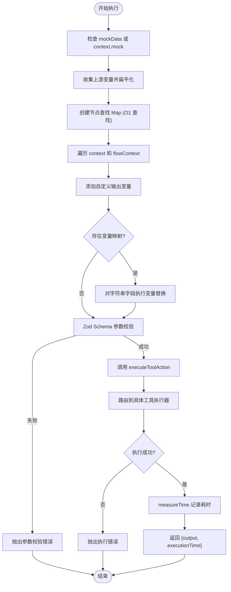
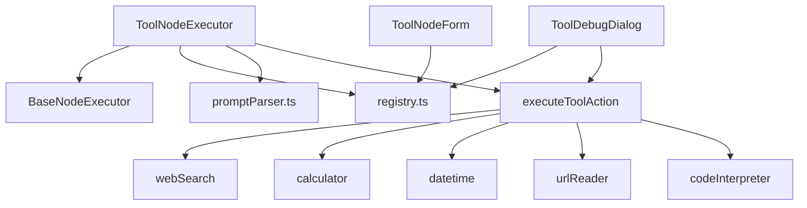

# Tool 节点 (工具节点)

## 功能描述

调用外部工具或执行代码来完成专项任务。作为连接 AI 与外部世界的桥梁，支持**参数自动验证**和**变量引用**。

## 核心参数

| 参数名 | 类型 | 必填 | 默认值 | 描述 |
|-------|------|-----|-------|------|
| `label` | string | ✅ | - | 节点显示名称 |
| `toolType` | string | ✅ | - | 工具类型选择 (见下文) |
| `inputs` | object | ❌ | `{}` | 工具特定的输入参数 (支持 `{{变量}}` 引用) |
| `customOutputs` | array | ❌ | `[]` | 用户自定义输出变量列表 `{name, value}` |

## 支持的工具 (Supported Tools)

### 1. 🔍 网页搜索 (Web Search)

使用 Tavily 搜索引擎联网查找实时信息。

*   **ID**: `web_search`
*   **分类**: `search`
*   **输入参数**:
    *   `query` (string, 必填): 搜索关键词（请在此输入你想要搜索的内容）。
    *   `maxResults` (number, 选填): 最大结果数 (1-10, 默认 5)（请在此输入你期望搜索内容的最大数量）。
*   **输出示例**:
    ```json
    {
      "results": [
        { "title": "...", "url": "...", "content": "..." }
      ],
      "count": 5
    }
    ```

### 2. 🐍 代码执行 (Code Interpreter)

在安全的 E2B 沙箱环境中执行 Python 代码。支持文件处理和图表生成。

*   **ID**: `code_interpreter`
*   **分类**: `utility`
*   **输入参数**:
    *   `code` (string, 必填): 要执行的 Python 代码（支持自动清理 markdown 代码块标记如 \`\`\`python\`\`\`）。
    *   `inputFiles` (array, 选填): 需要上传到沙箱的输入文件列表，格式为 `[{name: string, url: string}]`。文件将被下载并上传到沙箱的 `/home/user/` 目录，可通过 `{{Input节点.files}}` 引用上游 Input 节点的文件。
    *   `outputFileName` (string, 选填): 期望生成的输出文件名（如 `output.csv`, `result.xlsx`），文件将从 `/home/user/` 读取并上传到 Supabase Storage。
*   **环境要求**:
    *   `E2B_API_KEY`: E2B API 密钥（必需）。
    *   `NEXT_PUBLIC_SUPABASE_URL` 和 `SUPABASE_SERVICE_ROLE_KEY`: Supabase 配置（用于持久化输出文件，可选）。
*   **超时设置**: 60 秒
*   **支持的文件类型**: CSV, XLSX, XLS, PDF, PNG, JPG, JSON, TXT, MD 等
*   **输出示例**:
    ```json
    {
      "logs": "标准输出日志...",
      "errors": "错误日志...",
      "result": "代码最后一行表达式的返回值",
      "generatedFile": {
        "name": "plot.png",
        "url": "https://...",
        "type": "image/png"
      },
      "message": "配置提示信息（如果Supabase未配置）"
    }
    ```

### 3. 🧮 计算器 (Calculator)

安全计算数学表达式。

*   **ID**: `calculator`
*   **分类**: `math`
*   **输入参数**:
    *   `expression` (string, 必填): 数学表达式（请在此输入你想要计算的表达式，如 `(10 * 5) + 2`）。
*   **输出示例**:
    ```json
    {
      "expression": "(10 * 5) + 2",
      "result": 52
    }
    ```

### 4. 🕐 日期时间 (Datetime)

处理时间获取、格式化及计算。

*   **ID**: `datetime`
*   **分类**: `utility`
*   **输入参数**（按操作类型）:

    | 操作 | 参数 |
    |:-----|:----|
    | `now` (默认) | `format` |
    | `format` | `date`, `format` |
    | `diff` | `date`, `targetDate` |
    | `add` | `date`, `format`, `amount`, `unit` |

*   **输出示例**:
    ```json
    {
      "operation": "now",
      "formatted": "2024-03-20 10:00:00",
      "timestamp": 1710900000000
    }
    ```

### 5. 🌐 网页读取 (URL Reader)

提取并解析目标网页的正文内容。

*   **ID**: `url_reader`
*   **分类**: `data`
*   **输入参数**:
    *   `url` (string, 必填): 目标网页 URL（请输入有效的 URL）。
    *   `maxLength` (number, 选填): 返回内容的最大字符数（100-50000，默认 5000）。
*   **输出示例**:
    ```json
    {
      "title": "页面标题",
      "content": "正文内容...",
      "truncated": false
    }
    ```

## 核心执行逻辑 (Execution Logic)

### 执行流程概览



### 详细执行步骤

1.  **变量收集 (Variable Collection)**: 
    - 系统会自动收集所有上游节点的输出，包括：
      - 直接上游 context（来自入边的上游节点输出）
      - 全局 flowContext（全局可见的所有节点输出）
    - 支持用户自定义输出变量 (`customOutputs`)
    - 创建节点查找 Map，实现 O(1) 查找性能优化

2.  **变量压平 (Variable Flattening)**: 
    - 递归展开嵌套对象，将多层结构压平为一维键值对
    - 生成多种引用格式，支持灵活的变量引用：
      - 无前缀：`field`（顶层字段）
      - 节点标签前缀：`Label.field`（通过节点名称引用）
      - 节点 ID 前缀：`nodeId.field`（通过节点 ID 引用）
    - 特殊处理：
      - 数组序列化为 JSON 字符串
      - null/undefined 转换为空字符串
      - 跳过以 `_` 开头的内部字段

3.  **参数替换 (Variable Replacement)**: 
    - 在执行前，`inputs` 中的字符串值会被解析
    - `{{变量}}` 占位符会被替换为实际值
    - **只替换字符串类型的值**，保留非字符串数据结构的完整性

4.  **Schema 验证 (Validation)**: 
    - 使用工具注册中心的 Zod Schema 进行**二次验证**：
      - 第一次：UI 层调试对话框验证
      - 第二次：执行器层验证（此处）
    - 验证失败会抛出详细的错误信息，包括字段路径和错误描述
    - 防止无效参数调用外部服务

5.  **工具执行 (Tool Execution)**:
    - 通过 `executeToolAction` 路由到具体工具执行器
    - 执行结果包含：
      - `success`: 执行状态
      - `data`: 工具返回的数据
      - `error`: 错误信息（失败时）

6.  **计时与返回 (Timing & Return)**:
    - 使用 `measureTime` 记录完整执行耗时
    - 返回格式化的执行结果：`{output, executionTime}`

## 技术架构

### 核心文件

| 文件 | 职责 |
|------|------|
| [ToolNodeExecutor.ts](file:///Users/jasperlin/Desktop/product/flash-flow-saas/flash-flow/src/store/executors/ToolNodeExecutor.ts) | Tool 节点执行器，负责变量收集、替换和执行编排 |
| [registry.ts](file:///Users/jasperlin/Desktop/product/flash-flow-saas/flash-flow/src/lib/tools/registry.ts) | 工具注册中心，管理所有工具的 Schema 和元数据 |
| [index.ts](file:///Users/jasperlin/Desktop/product/flash-flow-saas/flash-flow/src/app/actions/tools/index.ts) | 工具执行入口，路由到具体工具执行器 |
| [executors/*](file:///Users/jasperlin/Desktop/product/flash-flow-saas/flash-flow/src/app/actions/tools/executors) | 具体工具执行器实现（webSearch、calculator、datetime 等） |
| [ToolDebugDialog.tsx](file:///Users/jasperlin/Desktop/product/flash-flow-saas/flash-flow/src/components/flow/ToolDebugDialog.tsx) | 调试对话框，动态渲染工具输入表单 |
| [ToolNodeForm.tsx](file:///Users/jasperlin/Desktop/product/flash-flow-saas/flash-flow/src/components/builder/node-forms/ToolNodeForm.tsx) | 节点配置表单 |

### 依赖关系



### 工具注册机制

Tool Registry 是所有工具的单一数据源（Single Source of Truth），每个工具必须定义：

1. **基本元数据**：
   - `id`: 工具唯一标识符（ToolType）
   - `name`: 显示名称
   - `description`: 功能描述
   - `icon`: Lucide 图标组件
   - `category`: 工具分类（search/math/data/utility/integration）

2. **Zod Schema**：
   - 定义输入参数的类型和验证规则
   - 支持 `.describe()` 添加字段描述（用于 UI 提示）
   - 支持 `.optional()`、`.default()` 等修饰符

3. **工具添加流程**：
   ```typescript
   // 1. 在 registry.ts 定义 Schema
   const newToolSchema = z.object({
     param: z.string().min(1).describe("参数描述"),
   });
   
   // 2. 在 TOOL_REGISTRY 注册
   export const TOOL_REGISTRY = {
     new_tool: {
       id: "new_tool" as const,
       name: "新工具",
       description: "工具描述",
       icon: IconComponent,
       schema: newToolSchema,
       category: "utility" as const,
     },
   };
   
   // 3. 在 executors/ 实现执行器
   export async function executeNewTool(inputs) {
     // 实现逻辑
   }
   
   // 4. 在 index.ts 添加路由
   case "new_tool": {
     return await executeNewTool(validation.data);
   }
   ```

## 变量引用系统

### 支持的引用格式

Tool 节点支持三种变量引用格式，优先级从高到低：

1. **节点标签引用**（推荐）：`{{LLM节点.response}}`
   - 使用节点的 `label` 字段
   - 可读性强，适合用户界面
   - 示例：`{{搜索结果.content}}`

2. **节点 ID 引用**：`{{node_abc123.response}}`
   - 使用节点的唯一 ID
   - 确保唯一性，不受重命名影响
   - 示例：`{{llm_1.text}}`

3. **直接字段引用**：`{{response}}`
   - 仅引用顶层字段名
   - 适用于简单场景
   - 可能存在命名冲突

### 嵌套字段访问

支持点号分隔的嵌套访问：
```
{{LLM节点.data.items.0.title}}  ❌ 数组索引不支持
{{LLM节点.metadata.timestamp}}  ✅ 嵌套对象支持
```

### 特殊值处理

| 原始值类型 | 转换后的字符串 |
|-----------|---------------|
| `null` | `""` (空字符串) |
| `undefined` | `""` (空字符串) |
| `[1, 2, 3]` | `"[1,2,3]"` (JSON序列化) |
| `{a: 1}` | 递归展开为 `obj.a = "1"` |

## 错误处理

### 错误类型

1. **参数验证错误**（执行前）：
   - 触发条件：必填参数缺失、类型不匹配、范围超限
   - 错误格式：`参数验证失败: field: error message`
   - 处理方式：抛出异常，节点状态变为 `error`

2. **工具执行错误**（执行中）：
   - 触发条件：API 调用失败、网络超时、外部服务错误
   - 错误格式：具体工具的错误消息
   - 处理方式：返回 `{success: false, error: message}`

3. **环境配置错误**：
   - 触发条件：缺少必需的环境变量（如 E2B_API_KEY）
   - 错误格式：明确指出缺失的配置项
   - 处理方式：返回友好的配置提示

### 调试技巧

1. **使用调试对话框**：
   - 点击节点的测试按钮打开调试面板
   - 手动输入参数值，验证工具行为
   - 查看原始输出和执行耗时

2. **检查变量替换**：
   - 确认上游节点已成功执行
   - 检查变量名拼写和大小写
   - 使用浏览器控制台查看 `allVariables` 对象

3. **查看执行日志**：
   - Code Interpreter 返回 `logs` 和 `errors` 字段
   - Web Search 返回 `results` 数组
   - 所有工具都记录 `executionTime`

## 性能优化

### 已实现的优化

1. **节点查找 Map**（O(1) 查找）：
   ```typescript
   const nodeMap = new Map(allNodes.map(n => [n.id, n]));
   ```

2. **预编译正则表达式**（模块级别）：
   - 避免每次执行时重新编译
   - 减少 CPU 开销

3. **按需变量替换**：
   - 仅替换字符串类型的字段
   - 保留数字、布尔等类型的原始值

4. **沙箱超时控制**：
   - Code Interpreter 设置 60 秒超时
   - 防止长时间挂起

### 潜在优化点

1. **变量收集缓存**：
   - 当前每次执行都重新收集
   - 可考虑在 flowContext 更新时缓存扁平化结果

2. **Schema 验证缓存**：
   - Zod 验证结果可缓存（相同输入）
   - 减少重复验证开销

3. **工具执行器连接池**：
   - 对高频调用的工具（如 calculator）使用连接池
   - 减少初始化开销

## 扩展指南

### 添加新工具的完整步骤

1. **定义 Schema**（`registry.ts`）：
   ```typescript
   const myToolSchema = z.object({
     input: z.string().min(1).describe("输入描述"),
     options: z.number().optional().describe("可选参数"),
   });
   ```

2. **注册工具**（`registry.ts`）：
   ```typescript
   export type ToolType = "web_search" | "calculator" | "my_tool";
   
   export const TOOL_REGISTRY = {
     my_tool: {
       id: "my_tool" as const,
       name: "我的工具",
       description: "工具功能说明",
       icon: MyIcon,
       schema: myToolSchema,
       category: "utility" as const,
     },
   };
   ```

3. **实现执行器**（`executors/myTool.ts`）：
   ```typescript
   "use server";
   import type { ToolExecutionResult } from "../types";
   
   export async function executeMyTool(
     inputs: { input: string; options?: number }
   ): Promise<ToolExecutionResult> {
     try {
       // 实现业务逻辑
       const result = await doSomething(inputs.input);
       
       return {
         success: true,
         data: { result },
       };
     } catch (error) {
       return {
         success: false,
         error: error instanceof Error ? error.message : "执行失败",
       };
     }
   }
   ```

4. **添加路由**（`index.ts`）：
   ```typescript
   import { executeMyTool } from "./executors/myTool";
   
   case "my_tool": {
     const myToolInputs = validation.data as { input: string; options?: number };
     return await executeMyTool(myToolInputs);
   }
   ```

5. **更新 UI 图标映射**（可选，`CustomNode.tsx`）：
   ```typescript
   const toolLabels: Record<string, string> = {
     my_tool: "我的工具",
     // ...
   };
   ```

### 最佳实践

1. **Schema 设计**：
   - 使用 `.describe()` 提供清晰的参数说明
   - 合理设置 `.min()`、`.max()` 约束
   - 为可选参数提供 `.default()` 默认值

2. **错误处理**：
   - 始终返回 `{success, data?, error?}` 结构
   - 错误消息应具体且可操作
   - 区分用户错误和系统错误

3. **环境变量**：
   - 在执行器开头检查必需的环境变量
   - 提供配置缺失时的友好提示
   - 敏感信息使用 `.env.local`

4. **超时控制**：
   - 为外部 API 调用设置合理超时
   - 使用 `Promise.race()` 实现超时机制
   - 提供超时后的清理逻辑

5. **测试**：
   - 编写单元测试验证 Schema
   - 测试边界条件（空值、极值）
   - 模拟外部服务失败场景
