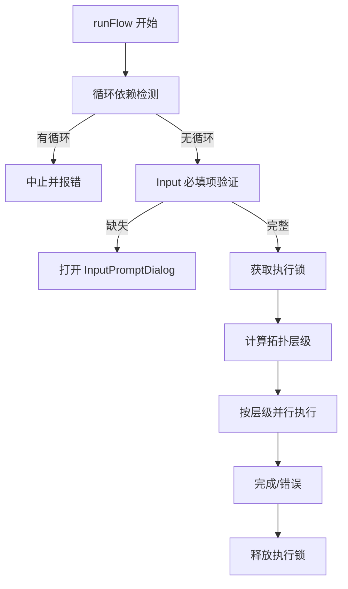
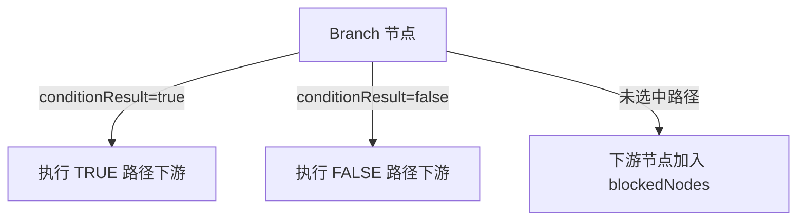

# 🔗 Flash-Flow 工作流编排与数据拓扑规范

> **文档目的**: 本规范为 AI 自动生成工作流提供底层协议，确保画布拓扑结构合法、变量引用正确、执行逻辑符合预期。

---

## 0. 用户可见文案规范（风格 + 术语）

本节用于约束「用户能看到」的文案（按钮、提示、状态、错误信息、节点配置文案）。目标是：在不牺牲专业性的前提下，让非技术用户也能快速理解并完成操作（目标阅读等级 ≤ 8 年级）。

### 0.1 成功标准（从第一性原理出发）

用户在关键路径上需要的最小信息只有三类：

1. **此刻我能做什么**（行动按钮/下一步）
2. **系统正在做什么**（状态反馈）
3. **如果失败我该怎么做**（可执行的纠错指引）

文案只要满足这三类信息，就算“足够好”；超出部分会增加认知负担。

### 0.2 文案风格（写给用户看）

- **短句优先**：一个句子表达一个动作或一个结果；避免长串并列从句。
- **动词开头**：按钮/提示语用动词起句（如“运行”“试运行”“上传”“清除搜索”）。
- **信息闭环**：错误信息必须包含“发生了什么 + 怎么办”；避免只说“失败/异常”。
- **避免术语堆叠**：用户不需要知道 JSON/Handlebars/NodeID/SSE 等内部概念。
- **一致性优先**：同类状态/动作在全站使用同一套词（减少学习成本）。

### 0.3 标点与格式（降低阅读摩擦）

- 进行中状态统一使用中文省略号：**…**（例如“加载中…”“上传中…”“运行中…”）。
- Tooltip/短提示避免叠加语气词：不使用“请”“一下”等弱化指令的词。
- 数字与单位：使用紧凑格式（如“10MB”“3轮”），避免冗余空格。

### 0.4 术语表（全站统一口径）

| 概念 | 面向用户的推荐说法 | 不推荐 | 使用边界 |
|---|---|---|---|
| Flow（产品对象） | 工作流 / 工作流应用 | Flow | 列表页、创建、运行、分享等产品层面 |
| Agent（产品对象） | 智能体 | Agent | 当产品对外以“智能体”命名时使用（如“我的智能体”） |
| AI（能力） | AI | 智能体（泛指能力时） | 描述能力来源时使用（如“AI 生成”“AI 生成功能”） |
| Plan（中间产物） | 工作流方案 | 任务蓝图 | Copilot/Agent 场景中对“规划结果”的称呼 |
| Node（画布元素） | 节点 | 模块/组件（混用） | 画布与配置面板，始终用“节点” |
| 变量引用 | 变量引用 / 变量 | 模板语法 | 仅在必须让用户理解 `{{ }}` 时提及 |
| 测试运行（单节点） | 试运行 | 测试 | 用于调试运行单个节点，避免与“单元测试”混淆 |

### 0.5 交互文案模板（可直接复用）

| 场景 | 推荐模板 | 说明 |
|---|---|---|
| 运行类按钮 | `运行` / `运行此节点` | Button 用短词，Tooltip 用更明确的对象 |
| 进行中状态 | `加载中…` `上传中…` `运行中…` `创建中…` | 统一用中文省略号 |
| 空状态 | `还没有…` + `去创建一个吧` | 先描述现状，再给出轻量行动 |
| 网络/服务错误 | `网络连接失败` + `请检查网络后重试` | 先归因再给动作，避免“未知错误” |
| 规划降级提示 | `规划阶段未产出有效计划…` | 说明原因 + 系统将如何继续 |

---

## 1. 拓扑连接契约 (Connection Rules)

### 1.1 节点端口规则 (Handle Rules)

每个节点具备输入端口 (Target Handle) 和输出端口 (Source Handle)，规则如下：

| 节点类型 | 输入端口 (target) | 输出端口 (source) | 备注 |
|---------|------------------|------------------|------|
| **Input** | ❌ 无 | ✅ 单个 (null) | 工作流起点，无上游依赖 |
| **LLM** | ✅ 单个 | ✅ 单个 (null) | 多入单出 |
| **RAG** | ✅ 单个 | ✅ 单个 (null) | 多入单出 |
| **Tool** | ✅ 单个 | ✅ 单个 (null) | 多入单出 |
| **ImageGen** | ✅ 单个 | ✅ 单个 (null) | 多入单出 |
| **Branch** | ✅ 单个 | ✅ 双分支 (`"true"` / `"false"`) | 条件分支，输出需指定 handle |
| **Output** | ✅ 单个 | ❌ 无 | 工作流终点，无下游节点 |

### 1.2 连接语法 (Edge JSON Schema)

```typescript
interface EdgeDefinition {
    source: string;       // 源节点 ID (必填)
    target: string;       // 目标节点 ID (必填)
    sourceHandle?: string | null; // 输出端口 ID (仅 Branch 节点需要)
}
```

**Edge 示例**:
```json
// 普通节点连接
{ "source": "input_1", "target": "llm_1" }

// Branch 节点连接 (必须指定 sourceHandle)
{ "source": "branch_1", "target": "llm_true", "sourceHandle": "true" }
{ "source": "branch_1", "target": "llm_false", "sourceHandle": "false" }
```

### 1.3 拓扑约束 (Graph Constraints)

| 约束类型 | 规则 | 违规后果 |
|---------|------|---------|
| **自环禁止** | `source === target` 时连接被拒绝 | 连接无效，不创建 Edge |
| **循环禁止 (DAG)** | 禁止有向环，使用 DFS 实时检测 | 连接无效，不创建 Edge |
| **弱类型连接** | 无数据类型匹配限制 | 任意输出可连接任意输入 |

> [!CAUTION]
> **AI 编排约束**: 生成工作流时 **必须保证 DAG 结构**，任何形成循环的 Edge 都会被系统静默拒绝。

### 1.4 多入多出规则

- **多入 (Multi-In)**: 除 Input 节点外，所有节点均支持多个上游连接
- **多出 (Multi-Out)**: 所有节点（除 Output）支持连接多个下游节点
- **Branch 特殊性**: Branch 有两个独立输出端口，每个端口可独立连接多个下游

---

## 2. 数据引用语法 (Variable Referencing Protocol)

### 2.1 变量格式

```
{{变量路径}}
```

**正则表达式**:
```regex
/\{\{([^}]+)\}\}/g
```

### 2.2 引用路径类型

| 格式 | 示例 | 说明 | 推荐度 |
|------|------|------|--------|
| **直接字段** | `{{response}}` | 从所有上游查找匹配字段 | ⚠️ 有歧义风险 |
| **节点标签.字段** | `{{文章生成.response}}` | 使用节点 label 前缀 | ✅ 推荐 |
| **节点ID.字段** | `{{llm_abc123.response}}` | 使用节点 ID 前缀 | ✅ 精确 |

### 2.3 深层嵌套支持

```
// 对象嵌套
{{节点名.formData.字段名}}

// 数组下标 (仅 collectVariablesRaw 场景)
{{节点名.files[0].url}}
```

### 2.4 优先级规则

```
直接上游节点输出 > 全局 flowContext 中的节点输出
```

**关键点**:
1. 同名字段时，直接相连的上游节点优先
2. 变量未找到时替换为**空字符串**
3. 控制台输出警告: `[PromptParser] 未找到变量: xxx`

### 2.5 各节点输出 Schema

| 节点类型 | 输出字段 | 类型 | 说明 |
|---------|---------|------|------|
| **Input** | `user_input` | `string` | 用户输入文本 |
| | `files` | `array` | 上传文件列表 |
| | `formData` | `object` | 结构化表单数据 |
| **LLM** | `response` | `string` | AI 生成回复 |
| **RAG** | `query` | `string` | 检索查询 |
| | `documents` | `array` | 文档块数组 |
| | `citations` | `array` | 引用列表 |
| **Tool** | *(工具特定)* | `any` | 如 `formatted`, `results` 等 |
| **Branch** | `conditionResult` | `boolean` | 条件判断结果 |
| | `passed` | `boolean` | 同 conditionResult |
| | *(透传)* | `any` | 上游数据透传 |
| **ImageGen** | `imageUrl` | `string` | 生成图片 URL |
| **Output** | `text` | `string` | 最终输出文本 |
| | `attachments` | `array` | 附件列表 |

---

## 3. 执行时序逻辑 (Execution Lifecycle)

### 3.1 执行流程



### 3.2 并行执行规则

| 规则 | 说明 |
|------|------|
| **拓扑层级** | Level 0 = 无上游节点，Level N = max(上游层级) + 1 |
| **同层并行** | 同层级节点使用 `Promise.allSettled` 并行执行 |
| **层级串行** | 等待当前层级全部完成后，执行下一层级 |
| **错误中止** | 任一节点失败，当前层级完成后中止后续执行 |

### 3.3 条件分支触发



**路径汇合处理**: 如果两条分支最终汇合到同一节点，该节点只要从任一选中路径可达，就会执行。

### 3.4 起点要求

| 规则 | 说明 |
|------|------|
| **必须有 Input 节点** | 工作流至少包含一个 Input 节点作为入口 |
| **孤立节点** | 无连接的节点会被计算到 Level 0 并执行 |

### 3.5 超时机制

- **节点执行超时**: 5 分钟 (300,000ms)
- **超时后抛出错误**: `Node execution timed out`

---

## 4. 画布状态与校验机制

### 4.1 预执行校验

| 校验项 | 触发时机 | 失败处理 |
|--------|---------|---------|
| 循环依赖检测 | `runFlow` 调用时 | `executionError: "检测到循环依赖..."` |
| Input 必填项 | `runFlow` 调用时 | 打开 InputPromptDialog |
| 执行锁冲突 | `runFlow` 调用时 | Toast 警告 + 返回 |
| 节点完整性 | 每层执行前 | `Error: Flow structure changed` |

### 4.2 节点参数验证

| 节点类型 | 验证项 | 验证时机 |
|---------|-------|---------|
| **LLM** | systemPrompt 非空, temperature 范围 | 执行时 |
| **RAG** | files/fileSearchStoreName 已配置 | 执行时 |
| **Output** | sources/template 与 mode 一致 | 执行时 |
| **ImageGen** | prompt 非空, 配额充足 | 执行时 |
| **Branch** | 条件表达式在白名单内 | 执行时 (不在白名单返回 false) |

### 4.3 错误传播

```typescript
// 执行失败时
if (executionErrors.length > 0) {
    const errorMessages = executionErrors
        .map(e => `${e.nodeId}: ${e.error.message}`)
        .join('; ');
    throw new Error(`节点执行失败: ${errorMessages}`);
}
```

- **失败节点**: `status = "error"`
- **后续节点**: 不再执行
- **整体状态**: `executionStatus = "error"`

---

## 5. AI 编排最佳实践

### 5.1 合法拓扑构建规则

```
✅ DO:
- 确保图结构为 DAG (无环)
- 从 Input 节点开始构建
- 以 Output 节点结束
- Branch 输出必须指定 sourceHandle ("true" 或 "false")

❌ DON'T:
- 创建自环 (source === target)
- 创建循环依赖 (A → B → C → A)
- Input 节点作为连接目标
- Output 节点作为连接源
- Branch 连接忘记 sourceHandle
```

### 5.2 变量引用规范

```
✅ DO:
- 使用节点 label 前缀: {{文章生成.response}}
- 确认目标节点在当前节点的上游
- 使用节点实际输出的字段名

❌ DON'T:
- 引用下游节点的输出 (执行时还不存在)
- 拼写错误的字段名 (会被替换为空)
- 同名字段歧义时使用无前缀引用
```

### 5.3 分支设计规范

```
✅ DO:
- 使用支持的条件表达式格式
- 确保两条分支都有有效下游 (或显式终止)
- 汇合点节点具备处理空上游的能力

❌ DON'T:
- 使用不支持的 JavaScript 表达式
- 创建死循环分支 (Branch → ... → Branch)
```

### 5.4 推荐拓扑模式

**线性流程**:
```
Input → LLM → Output
```

**并行处理**:
```
Input → LLM1 ─┬→ Output (merge mode)
      → LLM2 ─┘
```

**条件分支**:
```
Input → Branch ─true──→ LLM1 ─┬→ Output
               ─false─→ LLM2 ─┘
```

**RAG 增强**:
```
Input → RAG → LLM → Output
```

---

## 6. TypeScript 类型声明

```typescript
// === 核心节点类型 ===
type NodeKind = 'input' | 'llm' | 'rag' | 'tool' | 'branch' | 'imagegen' | 'output';

// === Edge 定义 ===
interface AppEdge {
    id: string;
    source: string;
    target: string;
    sourceHandle?: 'true' | 'false' | null; // 仅 Branch 节点使用
    targetHandle?: string | null;
}

// === FlowContext 结构 ===
interface FlowContext {
    [nodeId: string]: Record<string, unknown> | FlowContextMeta | undefined;
    _meta?: FlowContextMeta;
}

interface FlowContextMeta {
    flowId?: string | null;
    sessionId?: string;
    nodeLabels?: Record<string, string>; // nodeId → label
}

// === 变量引用解析 ===
// 正则: /\{\{([^}]+)\}\}/g
// 匹配: {{变量名}} 或 {{节点名.字段名}}

// === 节点输出类型 ===
interface InputNodeOutput {
    user_input: string;
    files: FileData[];
    formData: Record<string, unknown>;
}

interface LLMNodeOutput {
    response: string;
}

interface RAGNodeOutput {
    query: string;
    documents: DocumentChunk[];
    citations: Citation[];
    documentCount: number;
    mode: 'fileSearch' | 'multimodal';
}

interface BranchNodeOutput {
    conditionResult: boolean;
    passed: boolean;
    value: unknown;
    // + 上游数据透传
    [key: string]: unknown;
}

interface ImageGenNodeOutput {
    imageUrl: string;
}

interface OutputNodeOutput {
    text: string;
    attachments: AttachmentData[];
}
```

---

## 7. 核心代码文件索引

| 模块 | 文件路径 | 功能 |
|------|---------|------|
| **连接校验** | [edgeActions.ts](file:///Users/jasperlin/Desktop/product/flash-flow-saas/flash-flow/src/store/actions/edgeActions.ts) | `onConnect` 钩子，自环/循环检测 |
| **循环检测** | [cycleDetection.ts](file:///Users/jasperlin/Desktop/product/flash-flow-saas/flash-flow/src/store/utils/cycleDetection.ts) | DFS 算法实现 |
| **并行执行** | [parallelExecutionUtils.ts](file:///Users/jasperlin/Desktop/product/flash-flow-saas/flash-flow/src/store/utils/parallelExecutionUtils.ts) | 拓扑层级计算，分支阻塞 |
| **执行引擎** | [executionActions.ts](file:///Users/jasperlin/Desktop/product/flash-flow-saas/flash-flow/src/store/actions/executionActions.ts) | `runFlow` 主入口 |
| **变量收集** | [variableUtils.ts](file:///Users/jasperlin/Desktop/product/flash-flow-saas/flash-flow/src/store/executors/utils/variableUtils.ts) | `collectVariables` 函数 |
| **变量替换** | [promptParser.ts](file:///Users/jasperlin/Desktop/product/flash-flow-saas/flash-flow/src/lib/promptParser.ts) | `replaceVariables` 函数 |
| **Handle 渲染** | [CustomNode.tsx](file:///Users/jasperlin/Desktop/product/flash-flow-saas/flash-flow/src/components/flow/CustomNode.tsx) | 节点端口 UI |
| **输入验证** | [inputValidation.ts](file:///Users/jasperlin/Desktop/product/flash-flow-saas/flash-flow/src/store/utils/inputValidation.ts) | Input 必填项检查 |

---

## 8. 文案优化对比清单（含理由）

说明：本清单聚焦“影响用户理解与操作效率”的高频入口文案（状态、运行、降级提示、搜索与加载）。其余节点配置文案的逐项优化以代码提交为准。

| 场景 | 优化前 | 优化后 | 修改理由 | 位置 |
|---|---|---|---|---|
| 规划失败降级提示 | 方案整理没有成功，我会直接生成工作流（你可以稍后再调整）。 | 规划阶段未产出有效计划，我会直接生成工作流（你可以稍后再调整）。 | 明确失败发生在“规划阶段”，减少主观措辞；与测试断言保持一致 | [route.ts](file:///Users/jasperlin/Desktop/product/flash-flow-saas/flash-flow/src/app/api/agent/plan/route.ts#L690-L697) |
| 节点运行 Tooltip | 正在运行… / 运行该节点 | 运行中… / 运行此节点 | “运行中”与状态栏口径一致；“此节点”指代更自然 | [context-hud/index.tsx](file:///Users/jasperlin/Desktop/product/flash-flow-saas/flash-flow/src/components/builder/context-hud/index.tsx#L340-L367) |
| 单节点调试入口 | 运行中... / 测试 | 运行中… / 试运行 | 统一省略号风格；“试运行”避免与测试体系混淆 | [CustomNode.tsx](file:///Users/jasperlin/Desktop/product/flash-flow-saas/flash-flow/src/components/flow/CustomNode.tsx#L195-L218) |
| 工具节点调试入口 | 运行中... / 测试 | 运行中… / 试运行 | 同上，保证不同节点组件表达一致 | [ToolNode.tsx](file:///Users/jasperlin/Desktop/product/flash-flow-saas/flash-flow/src/components/flow/nodes/ToolNode.tsx#L69-L91) |
| 智能体列表搜索 | 查找我的智能体... | 查找我的智能体… | 统一省略号风格，降低“不同页面不同写法”的学习成本 | [flows/page.tsx](file:///Users/jasperlin/Desktop/product/flash-flow-saas/flash-flow/src/app/flows/page.tsx#L97-L114) |
| 创建按钮状态 | 创建中... | 创建中… | 同上 | [flows/page.tsx](file:///Users/jasperlin/Desktop/product/flash-flow-saas/flash-flow/src/app/flows/page.tsx#L107-L110) |
| 列表加载状态 | 加载中... | 加载中… | 同上 | [flows/page.tsx](file:///Users/jasperlin/Desktop/product/flash-flow-saas/flash-flow/src/app/flows/page.tsx#L132-L139) |
| 应用页加载状态 | 加载中... | 加载中… | 同上 | [app/page.tsx](file:///Users/jasperlin/Desktop/product/flash-flow-saas/flash-flow/src/app/app/page.tsx#L201-L208) |
| 侧边栏加载状态 | 加载中... | 加载中… | 同上 | [home-sidebar.tsx](file:///Users/jasperlin/Desktop/product/flash-flow-saas/flash-flow/src/components/sidebar/home-sidebar.tsx#L170-L186) |
| 模型名占位 | 加载中... | 加载中… | 同上 | [LLMMetadata.tsx](file:///Users/jasperlin/Desktop/product/flash-flow-saas/flash-flow/src/components/flow/nodes/metadata/LLMMetadata.tsx#L45-L51) |
| 上传按钮状态 | 上传中... | 上传中… | 同上 | [CodeInterpreterFileUpload.tsx](file:///Users/jasperlin/Desktop/product/flash-flow-saas/flash-flow/src/components/flow/tool-inputs/CodeInterpreterFileUpload.tsx#L99-L110) |

---

## 9. 优化文案库与使用规范（MVP）

### 9.1 状态文案（统一口径）

| 状态类型 | 文案 |
|---|---|
| Loading | 加载中… |
| Uploading | 上传中… |
| Running | 运行中… |
| Creating | 创建中… |
| Ready | 就绪 |
| Success | 成功 |
| Error | 错误 |

### 9.2 行动文案（按钮/入口）

| 目标 | Button（短） | Tooltip（明确对象） |
|---|---|---|
| 运行当前节点 | 运行 | 运行此节点 |
| 调试运行单节点 | 试运行 | 试运行 |
| 重试 | 重试 | 重试 |
| 清理筛选/搜索 | 清除搜索 | 清除搜索 |

### 9.3 关键提示文案（解释系统行为）

| 场景 | 推荐文案 | 使用说明 |
|---|---|---|
| 规划降级 | 规划阶段未产出有效计划，我会直接生成工作流（你可以稍后再调整）。 | 仅在“从规划模式降级到直出模式”时出现 |
| 输入缺失 | 信息未填写完整，请补充后再运行。 | 用于表单校验，不描述内部字段名 |
| 网络异常 | 网络连接失败，请检查网络后重试。 | 无法区分服务端/客户端时的保底提示 |

### 9.4 落地方式（避免再次分裂）

- 新增或改动用户可见文案时，优先复用第 9 节的“状态/行动/提示”标准口径。
- 同一概念只保留一个主称呼（见第 0.4 节术语表），其他称呼作为“内部字段名”不暴露给用户。
- 同类组件若存在多处入口（如节点卡片、配置面板、Tooltip），以“主入口词”统一（Button 短、Tooltip 明确对象）。

---

*文档版本: 1.0 | 生成日期: 2026-01-06 | 基于代码审计*
