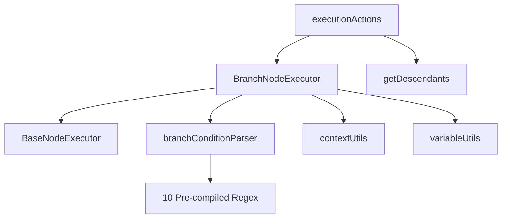
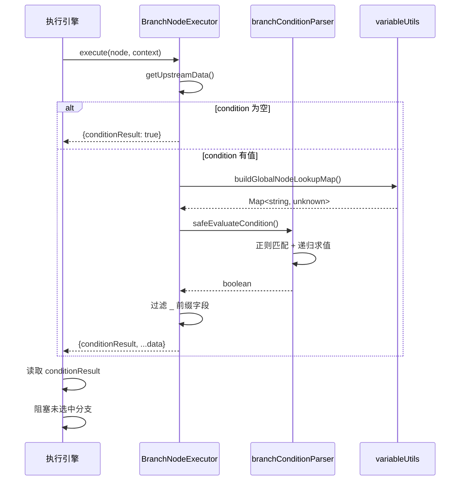

# Branch 节点 (条件分支节点)

## 功能语义 (AI 生态位)

**数据流控制器（Decision Router）**：根据条件表达式决定流程走向，不产生新数据，仅透传上游输出并附加分支结果。

## 类型定义

> [!IMPORTANT]
> 以下类型定义与 [flow.ts](file:///Users/jasperlin/Desktop/product/flash-flow-saas/flash-flow/src/types/flow.ts#L171-L173) 完全同步。

```typescript
// BaseNodeData 继承字段
export interface BranchNodeData extends BaseNodeData {
  condition: string; // JavaScript-like expression, e.g., "{{Input.text.length}} > 10"
}

// BaseNodeData 继承字段
interface BaseNodeData {
  label?: string;           // 节点显示名称
  status?: ExecutionStatus; // 执行状态 (运行时)
  executionTime?: number;   // 执行耗时 (运行时)
  output?: Record<string, unknown>; // 输出数据 (运行时)
}
```

## 核心参数表

| 参数名 | 类型 | 必填 | 默认值 | 来源验证 | 描述 |
|--------|------|------|--------|----------|------|
| `label` | `string` | ❌ | `undefined` | BaseNodeData | 节点显示名称，用于画布展示和条件表达式引用 |
| `condition` | `string` | ❌ | `""` | BranchNodeData | 判断条件表达式，详见白名单规则 |

### 参数约束详情

#### `condition` 字段

| 约束类型 | 约束值 | 来源 |
|----------|--------|------|
| 数据类型 | `string` | [flow.ts:172](file:///Users/jasperlin/Desktop/product/flash-flow-saas/flash-flow/src/types/flow.ts#L172) |
| 必填性 | ❌ 非必填 | UI 无 `required` 属性 |
| 空值行为 | 返回 `conditionResult: true` | [BranchNodeExecutor.ts:35](file:///Users/jasperlin/Desktop/product/flash-flow-saas/flash-flow/src/store/executors/BranchNodeExecutor.ts#L35) |
| 格式验证 | 白名单正则匹配 | [branchConditionParser.ts](file:///Users/jasperlin/Desktop/product/flash-flow-saas/flash-flow/src/lib/branchConditionParser.ts) |
| 无效格式行为 | 返回 `false` + console.warn | [branchConditionParser.ts:309-312](file:///Users/jasperlin/Desktop/product/flash-flow-saas/flash-flow/src/lib/branchConditionParser.ts#L309-L312) |

> [!NOTE]
> **空条件保护**：当 `condition` 为空字符串或纯空白时，节点默认返回 `conditionResult: true`，保证流程连通性。

## 表达式白名单规则

> 🟢 **变量引用规范**: 自 v2.3 起，**必须**使用 `{{}}` 包裹变量，例如 `{{Node.Field}}`。系统会自动去除 `{{}}` 进行内部处理，这与 UI 的复制功能保持一致。

### 预编译正则模式

以下10种模式在模块加载时预编译，避免运行时开销。

> [!IMPORTANT]
> **节点名称规范**：支持字母、中文、下划线、数字组合；首字符不能是数字。
> 正则模式：`/^([a-zA-Z\u4e00-\u9fa5_][\w\u4e00-\u9fa5]*)/`

#### 1. 字符串方法 (Pattern 1-3)

| 方法 | 格式 | 正则模式 |
|------|------|----------|
| 包含 | `{{Node.field}}.includes('value')` | `INCLUDES_PATTERN` |
| 前缀 | `{{Node.field}}.startsWith('value')` | `STARTS_WITH_PATTERN` |
| 后缀 | `{{Node.field}}.endsWith('value')` | `ENDS_WITH_PATTERN` |

#### 2. 等值判断 (Pattern 4-5)

| 操作 | 格式 | 支持类型 |
|------|------|----------|
| 相等 | `{{Node.field}} === value` | string, number, boolean |
| 不等 | `{{Node.field}} !== value` | string, number, boolean |

#### 3. 数值比较 (Pattern 6)

| 操作符 | 格式 | 示例 |
|--------|------|------|
| `>` | `{{Node.field}} > number` | `{{LLM.score}} > 0.8` |
| `>=` | `{{Node.field}} >= number` | `{{User.age}} >= 18` |
| `<` | `{{Node.field}} < number` | `{{Cart.count}} < 10` |
| `<=` | `{{Node.field}} <= number` | `{{Temp.value}} <= 37.5` |

#### 4. 字面量比较 (Pattern 7-9)

| 类型 | 格式 | 示例 |
|------|------|------|
| 相等 | `literal === literal` | `1 === 1`, `'a' === 'a'` |
| 不等 | `literal !== literal` | `true !== false` |
| 数值比较 | `number > number` | `10 > 5` |

#### 5. 常量布尔值 (Pattern 10)

| 格式 | 结果 |
|------|------|
| `true` | 返回 `true` |
| `false` | 返回 `false` |

### 逻辑运算符

| 运算符 | 语法 | 说明 |
|--------|------|------|
| AND | `条件1 && 条件2` | 两个条件都为 true 时返回 true |
| OR | `条件1 \|\| 条件2` | 任一条件为 true 时返回 true |

> [!CAUTION]
> **语法强制要求**：逻辑运算符前后**必须保留空格** (` && ` 而非 `&&`)，否则解析器无法正确拆分条件。这是代码中 `split(' && ')` 和 `split(' || ')` 的实现限制。

## 运行时行为

### 节点永不失败

> [!IMPORTANT]
> Branch 节点**不会抛出异常**，执行器中无 `throw Error` 语句。所有边界情况都被优雅处理：

| 边界情况 | 处理方式 | 结果 |
|----------|----------|------|
| `condition` 为空 | 默认通过 | `conditionResult: true` |
| 表达式格式不支持 | console.warn + 返回 false | `conditionResult: false` |
| 引用节点不存在 | 查找返回 undefined | `conditionResult: false` |
| 属性路径无效 | getNestedValue 返回 undefined | `conditionResult: false` |
| 类型不匹配 (如字符串比数值) | isNaN 检测 | `conditionResult: false` |

### 控制台警告

当表达式格式不被支持时，会输出以下警告：

```
[BranchNodeExecutor] Unsupported condition format: <expression>
[BranchNodeExecutor] Supported formats: nodeName.x.includes("y"), nodeName.x > 5, nodeName.x === "value"
```

## 输出格式 (Output Schema)

### TypeScript 类型

```typescript
interface BranchNodeOutput {
  passed: true;                    // 固定为 true（节点永不失败）
  condition: string;               // 原始条件表达式
  conditionResult: boolean;        // 条件求值结果
  [key: string]: unknown;          // 上游数据透传（已过滤 _ 前缀字段）
}
```

### 字段详解

| 字段 | 类型 | 必有 | 描述 |
|------|------|------|------|
| `passed` | `boolean` | ✅ | 始终为 `true`，表示节点执行成功 |
| `condition` | `string` | ✅ | 当前节点配置的条件表达式 |
| `conditionResult` | `boolean` | ✅ | 条件求值结果，决定分支走向 |
| `value` | `unknown` | ⚠️ | 仅当上游输出为非对象时存在 |
| `...upstreamData` | `unknown` | ⚠️ | 上游对象数据透传（过滤 `_` 前缀） |

### 数据透传规则

```typescript
// 源码位置: BranchNodeExecutor.ts:51-56
const filteredData = typeof upstreamData === 'object' && upstreamData !== null
  ? Object.fromEntries(
      Object.entries(upstreamData).filter(([key]) => !key.startsWith('_'))
    )
  : { value: upstreamData };  // 非对象数据包装为 { value: ... }
```

## 完整 JSON 示例

### 节点配置

```json
{
  "id": "branch-age-check",
  "type": "branch",
  "position": { "x": 500, "y": 200 },
  "data": {
    "label": "年龄检查",
    "condition": "{{用户信息.age}} > 18"
  }
}
```

### 执行输出示例

#### 示例 1: 上游为对象数据

```json
// 上游 LLM 节点输出
{
  "response": "用户年龄为 25 岁",
  "age": 25,
  "_meta": { "executionTime": 1200 }
}

// Branch 条件: {{LLM.age}} > 18 → true
// Branch 输出
{
  "passed": true,
  "condition": "{{LLM.age}} > 18",
  "conditionResult": true,
  "response": "用户年龄为 25 岁",
  "age": 25
}
// 注意: _meta 被过滤
```

#### 示例 2: 上游为非对象数据

```json
// 上游节点输出: "hello world" (原始字符串)

// Branch 条件: {{Node.value}}.includes('hello') → true
// Branch 输出
{
  "passed": true,
  "condition": "{{Node.value}}.includes('hello')",
  "conditionResult": true,
  "value": "hello world"
}
```

#### 示例 3: 空条件（默认通过）

```json
// condition 字段为空或未配置

// Branch 输出
{
  "passed": true,
  "condition": "",
  "conditionResult": true,
  ...upstreamData
}
```

#### 示例 4: 无效表达式

```json
// condition: "Node.text.match(/pattern/)" (正则不支持)

// 控制台输出:
// [BranchNodeExecutor] Unsupported condition format: Node.text.match(/pattern/)

// Branch 输出
{
  "passed": true,
  "condition": "Node.text.match(/pattern/)",
  "conditionResult": false,
  ...upstreamData
}
```

## 分支路径控制

### 句柄系统

Branch 节点具有两个输出句柄：

| 句柄 | ID | 激活条件 |
|------|-----|----------|
| True 路径 | `true` | `conditionResult === true` |
| False 路径 | `false` | `conditionResult === false` |

### 执行引擎集成

> [!IMPORTANT]
> 分支控制逻辑位于 [executionActions.ts:282-284](file:///Users/jasperlin/Desktop/product/flash-flow-saas/flash-flow/src/store/actions/executionActions.ts#L282-L284)

```typescript
const conditionResult = !!branchOutput?.conditionResult;
const notTakenHandle = conditionResult ? 'false' : 'true';
const takenHandle = conditionResult ? 'true' : 'false';
```

### 阻塞传播机制

- ✅ 激活选中句柄的所有下游节点
- ❌ 阻塞未选中句柄的所有下游节点（包括递归下游）
- 使用 `getDescendants` 递归获取所有下游节点

## 节点查找机制

### O(1) 查找性能

使用 `buildGlobalNodeLookupMap` 构建 Map 数据结构：

```typescript
// 支持的查找 Key
lookupMap.set(nodeId, nodeOutput);           // 节点 ID
lookupMap.set(nodeId.toLowerCase(), nodeOutput); // 小写 ID
lookupMap.set(nodeLabel, nodeOutput);        // 节点 Label
lookupMap.set(nodeLabel.toLowerCase(), nodeOutput); // 小写 Label
```

### 查找优先级

1. 精确匹配节点 ID
2. 小写匹配节点 ID
3. 精确匹配节点 Label
4. 小写匹配节点 Label

## AI 生成工作流指引

### 功能定位

| 属性 | 值 |
|------|-----|
| 节点类型 | 控制节点 |
| 数据产出 | ❌ 不产生新数据 |
| 数据消费 | ✅ 读取上游输出进行条件判断 |
| 流程影响 | ✅ 决定后续执行路径 |

### 使用场景

1. **条件路由**: 根据 LLM 的输出字段决定后续处理流程
2. **阈值判断**: 基于数值比较（分数、数量、金额等）分流
3. **关键词检测**: 使用 `.includes()` 检测特定关键词
4. **状态分支**: 根据上游节点的状态字段（如 `status === 'active'`）路由

### 生成约束

1. **condition 可选**: 不设置条件时默认走 True 路径
2. **格式严格**: 必须符合白名单正则模式，**务必使用 `{{}}`**
3. **空格必需**: 逻辑运算符 (`&&`, `||`) 前后必须有空格
4. **节点引用**: 使用节点 Label 或 ID 引用上游数据

### 示例模板

```json
// 简单数值判断
{
  "type": "branch",
  "data": {
    "label": "分数检查",
    "condition": "{{LLM.score}} > 0.8"
  }
}

// 字符串包含检测
{
  "type": "branch",
  "data": {
    "label": "意图检测",
    "condition": "{{意图分析.response}}.includes('退款')"
  }
}

// 复合条件
{
  "type": "branch",
  "data": {
    "label": "综合验证",
    "condition": "{{User.age}} >= 18 && {{User.verified}} === true"
  }
}
```

## 技术架构

### 核心文件

| 文件 | 职责 |
|------|------|
| [BranchNodeExecutor.ts](file:///Users/jasperlin/Desktop/product/flash-flow-saas/flash-flow/src/store/executors/BranchNodeExecutor.ts) | 节点执行器 (73行) |
| [branchConditionParser.ts](file:///Users/jasperlin/Desktop/product/flash-flow-saas/flash-flow/src/lib/branchConditionParser.ts) | 条件解析与求值 (314行) |
| [variableUtils.ts](file:///Users/jasperlin/Desktop/product/flash-flow-saas/flash-flow/src/store/executors/utils/variableUtils.ts) | 节点查找 Map 构建 |
| [executionActions.ts](file:///Users/jasperlin/Desktop/product/flash-flow-saas/flash-flow/src/store/actions/executionActions.ts) | 分支路径控制 |
| [flow.ts](file:///Users/jasperlin/Desktop/product/flash-flow-saas/flash-flow/src/types/flow.ts) | 类型定义 |

### 依赖关系



### 执行流程



## 版本历史

### v2.3（当前）
- ✅ 文档与代码完全同步审计
- ✅ 补充常量布尔值模式 (`true`/`false`)
- ✅ 补充字面量比较模式
- ✅ 详细记录运行时行为与边界处理

### v2.2
- ✅ 数组索引支持：`Node.list.0` 格式
- ✅ 属性访问支持：`.length` 等标准属性

### v2.1
- ✅ 支持逻辑运算符 `&&` 和 `||`
- ✅ 递归求值，支持多条件链式组合

### v2.0
- ✅ O(1) 节点查找性能优化
- ✅ 大小写不敏感的节点名称匹配
- ✅ 支持中文节点名称
- ✅ 预编译正则表达式
