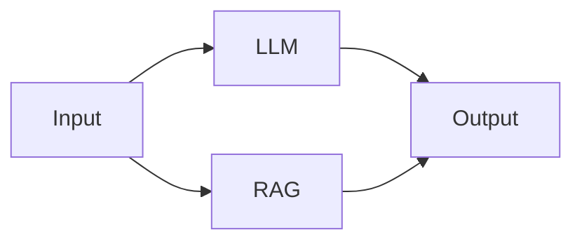

## 📋 Flash Flow 节点功能与参数总结

### 1️⃣ **Input 节点（输入节点）**
**功能**：用户输入的入口，支持文本、文件、结构化表单三种输入模式

**核心参数**：
- `label`（节点名称）：string，必填
- `enableTextInput`（启用文本输入）：boolean，默认 true
- `enableFileInput`（启用文件上传）：boolean，默认 false
- `enableStructuredForm`（启用结构化表单）：boolean，默认 false

**文件上传配置**（`enableFileInput=true` 时）：
- `fileConfig.allowedTypes`：允许的文件类型，支持：
  - `image/*` - 所有图片格式
  - `.pdf`, `.doc`, `.docx` - 文档
  - `.xls`, `.xlsx` - 表格
  - `.ppt`, `.pptx` - 演示文稿
  - `.txt`, `.md`, `.json`, `.csv` - 文本
- `fileConfig.maxSizeMB`：单文件最大体积（MB），默认 50
- `fileConfig.maxCount`：最大文件数量，默认 999

**结构化表单配置**（`enableStructuredForm=true` 时）：
- `formFields`：字段配置数组，每个字段包含：
  - `type`：字段类型 - `"text"` | `"select"` | `"multi-select"`
  - `name`：变量名（自动生成，格式：`field_xxxxxx`）
  - `label`：显示标签文本
  - `required`：是否必填字段
  - **文本字段额外参数**：
    - `placeholder`：输入提示文本
    - `defaultValue`：默认填充值
  - **单选下拉额外参数**：
    - `options`：选项列表（string[]）
    - `defaultValue`：默认选中项
  - **多选下拉额外参数**：
    - `options`：选项列表（string[]）
    - `defaultValue`：默认选中项数组

**输出格式**：
```typescript
{
  user_input: string,           // 文本输入内容
  files: File[],                // 上传的文件列表
  formData: Record<string, any> // 表单字段的键值对
}
```

---

## 2️⃣ **LLM 节点（大语言模型节点）**
**功能**：调用大语言模型生成文本内容，支持对话记忆和变量引用

**核心参数**：
- `label`（节点名称）：string，必填
- `model`（模型选择）：string，从 Supabase 动态加载，默认 `"qwen-flash"`
- `systemPrompt`（系统提示词）：string，支持 `{{variable_name}}` 语法引用上游数据
- `temperature`（生成温度）：number，范围 0.0-1.0，步长 0.1，默认 0.7
  - 0.0 = 确定性输出，适合翻译、摘要
  - 1.0 = 创造性输出，适合创作、头脑风暴
- `enableMemory`（启用记忆）：boolean，默认 false
- `memoryMaxTurns`（记忆轮数）：number，范围 1-20，默认 10（仅 `enableMemory=true` 时显示）

**记忆机制说明**：
- **用户交互 LLM**（连接到 Output 或来自 Branch）使用全局共享记忆键 `"__main__"`
- **中间处理 LLM** 使用节点独立记忆键（节点 ID）
- 记忆存储在 Supabase `llm_node_memory` 表，支持跨会话持久化
- 可通过控制面板的"清空对话记忆"按钮清空所有 LLM 记忆

**输出格式**：
```typescript
{
  response: string  // LLM 生成的文本内容
}
```

---

### 3️⃣ **RAG 节点（检索增强生成节点）**
**功能**：基于知识库文件进行语义检索，使用 Gemini File Search API

**核心参数**：
- `label`（节点名称）：string，必填
- `files`（知识库文件）：文件数组，支持 `.pdf`, `.txt`, `.md`, `.doc`, `.docx`
  - 单文件最大 100MB
  - 自动创建 Gemini File Search Store
- `fileSearchStoreName`：Store 资源名称（系统自动生成）
- `fileSearchStoreId`：Store 显示 ID（用户可见标识）
- `maxTokensPerChunk`（分块大小）：number，范围 50-500，步长 10，默认 200
- `maxOverlapTokens`（重叠 Token 数）：number，范围 0-100，步长 5，默认 20
- `topK`（检索结果数）：number，可选值 1/3/5/7/10，默认 5

**上传状态追踪**：
- `uploadStatus`：`idle` | `uploading` | `processing` | `completed` | `error`
- `uploadError`：错误详情（失败时）

**安全验证**：
- 执行前检查 `files` 数组非空，否则返回错误
- 避免空知识库执行导致资源浪费

**输出格式**：
```typescript
{
  query: string,        // 检索查询文本
  documents: string[],  // 检索到的文档片段
  citations: any[]      // 引用信息（可选）
}
```

---

### 4️⃣ **Tool 节点（工具节点）**
**功能**：调用外部工具 API 执行专项任务

**核心参数**：
- `label`（节点名称）：string，必填
- `toolType`（工具类型）：从工具注册表动态加载，当前支持：
  - `"web_search"` - 网页搜索（Tavily API）
  - `"calculator"` - 数学计算器
- `inputs`（输入参数）：动态参数对象，根据工具类型自动验证

**工具详细参数**：

#### 🔍 **web_search**（网页搜索）
- `query`：搜索查询字符串（必填）
- `maxResults`：返回结果数量，范围 1-10，默认 5（可选）
- **输出示例**：`{ results: [{title, url, snippet}, ...] }`

#### 🧮 **calculator**（计算器）
- `expression`：数学表达式（必填），如 `"2 + 2 * 3"`
- **输出示例**：`{ answer: 8 }`

**参数验证机制**：
- 调试模式：UI 层实时验证（ToolDebugDialog）
- 正式执行：执行器二次验证（ToolNodeExecutor）
- 使用 Zod Schema 确保类型安全

---

### 5️⃣ **Branch 节点（分支节点）**
**功能**：基于条件表达式控制流程分支走向

**核心参数**：
- `label`（节点名称）：string，必填
- `condition`（判断条件）：string，安全的 JavaScript 表达式

**支持的表达式格式**（白名单模式，防止代码注入）：
1. **字符串方法**：
   - `input.response.includes('关键词')`
   - `input.text.startsWith('前缀')`
   - `input.text.endsWith('后缀')`

2. **数值比较**：
   - `input.score > 60`
   - `input.value >= 100`
   - `input.count < 10`
   - `input.amount <= 50`

3. **等值判断**：
   - `input.status === 'active'`
   - `input.type !== 'deleted'`

4. **属性访问**：
   - `input.text.length > 5`

**数据透传规则**：
- 过滤以 `_` 开头的内部字段（如 `_meta`）
- 透传其他上游数据，并附加 `conditionResult` 字段
- 条件为空时默认返回 `true`（保持连通性）

**输出格式**：
```typescript
{
  conditionResult: boolean,  // 条件判断结果
  ...upstreamData           // 过滤后的上游数据
}
```

---

### 6️⃣ **Output 节点（输出节点）**
**功能**：流程的终点，展示最终结果

**参数**：
- `label`（节点名称）：string，必填

---

## 🎯 关键设计要点

### 1. **变量引用机制**
- **LLM 节点**：`systemPrompt` 支持 `{{variable_name}}` 语法
  - 自动从上游 FlowContext 提取变量
  - 未找到的变量替换为空字符串（并输出控制台警告）
  - 支持嵌套字段引用（如 `{{input.formData.title}}`）
- **Branch 节点**：通过 `input` 对象访问上游数据
  - 使用白名单安全表达式求值器
  - 防止任意代码执行攻击

### 2. **动态配置加载**
- LLM 模型列表：从 Supabase `llm_models` 表动态查询
- Tool 工具类型：从 `TOOL_REGISTRY` 注册表读取
- 支持热更新，无需修改代码

### 3. **执行状态管理**
所有节点共享的状态字段：
- `status`：`idle` | `running` | `completed` | `error`
- `output`：执行结果对象
- `executionTime`：执行耗时（毫秒）

### 4. **默认值策略**
- Input 节点：仅启用文本输入（最简单模式）
- LLM 节点：关闭记忆、温度 0.7（平衡模式）
- RAG 节点：topK=5、分块 200 tokens（通用检索）
- Tool 节点：默认工具 `web_search`

### 5. **安全防护机制**
- **循环依赖检测**：执行前 DFS 检测，阻止无限循环
- **并发控制**：执行锁防止多次点击导致配额重复扣减
- **参数验证**：
  - RAG 节点：检查文件非空
  - Tool 节点：Zod Schema 二次验证
  - Branch 节点：白名单表达式过滤
- **敏感数据过滤**：Branch 透传时过滤 `_` 开头字段


---

## 🔄 **工作流编排核心机制补充**

### 1️⃣ **节点间参数传递机制**

#### **FlowContext 上下文结构**
工作流使用 `FlowContext` 作为全局上下文，采用**键值对映射**存储每个节点的输出：

```typescript
interface FlowContext {
  [nodeId: string]: Record<string, unknown>;  // 节点ID → 输出数据
  _meta?: {                                    // 元数据（以 _ 开头）
    flowId: string;
    sessionId: string;
  }
}
```

**示例**：
```javascript
{
  "input_abc123": {
    "user_input": "帮我写一篇文章",
    "timestamp": "2024-12-06T00:00:00Z"
  },
  "llm_def456": {
    "response": "这是生成的文章内容..."
  },
  "_meta": {
    "flowId": "flow_xyz",
    "sessionId": "session_123"
  }
}
```

---

#### **节点输出标准格式**

每种节点类型都有标准的输出字段：

| 节点类型 | 主要输出字段 | 输出示例 |
|---------|-------------|---------|
| **Input** | `user_input` | `{user_input: "用户输入", files: [...], formData: {...}}` |
| **LLM** | `response` | `{response: "AI生成的回复内容"}` |
| **RAG** | `query`, `documents`, `citations` | `{query: "检索词", documents: ["文档1", "文档2"], citations: [...]}` |
| **Tool** | 工具特定字段 | `{result: "搜索结果"}` 或 `{answer: 42}` |
| **Branch** | `conditionResult`, 透传上游数据 | `{conditionResult: true, user_input: "原始数据"}` |
| **Output** | `text` | `{text: "最终展示文本"}` |

---

#### **数据提取优先级**

系统使用 `extractTextFromUpstream()` 函数智能提取文本内容，优先级顺序：

```
text > response > user_input > query > JSON.stringify(整个对象)
```

这确保无论上游节点是什么类型，下游节点都能获取到有意义的内容。

---

### 2️⃣ **变量引用机制**

#### **LLM 节点的变量替换**

LLM 节点的 `systemPrompt` 支持 `{{variable_name}}` 语法引用上游节点的输出字段：

**格式**：
```
{{variable_name}}
```

**实际示例**：
```
System Prompt: 
你是一个专业的文章写手，请根据用户的输入 {{user_input}} 和检索到的资料 {{documents}} 来撰写文章。

执行时自动替换为：
你是一个专业的文章写手，请根据用户的输入 帮我写一篇关于AI的文章 和检索到的资料 ["资料1", "资料2"] 来撰写文章。
```

**变量来源**：
- 从上游节点的 FlowContext 输出中提取
- 支持嵌套字段引用（如 `{{input.formData.title}}`）
- 未找到的变量会被替换为空字符串

---

#### **Branch 节点的条件表达式**

Branch 节点使用 **JavaScript 表达式**判断走向，通过 `input` 对象访问上游数据：

**支持的表达式格式**：

1. **字符串方法**：
   - `input.response.includes('关键词')`
   - `input.text.startsWith('前缀')`
   - `input.text.endsWith('后缀')`

2. **数值比较**：
   - `input.score > 60`
   - `input.value >= 100`
   - `input.count < 10`
   - `input.amount <= 50`

3. **等值判断**：
   - `input.status === 'active'`
   - `input.type !== 'deleted'`

4. **属性访问**：
   - `input.text.length > 5`
   - `input.response.includes('成功')`

**安全机制**：
- 使用白名单模式，只支持特定的安全表达式
- 不支持任意 JavaScript 代码执行（防止注入攻击）
- 不支持的表达式默认返回 `false`

---

### 3️⃣ **LLM 对话记忆机制**

#### **记忆类型：智能共享策略**

LLM 节点采用 **智能记忆共享** 机制：

**节点类型判断**：
```typescript
// 用户交互 LLM 识别条件（满足任一）：
1. 直接连接到 Output 节点
2. 输入来自 Branch 节点

// 记忆键分配：
- 用户交互 LLM → 共享键 "__main__"
- 中间处理 LLM → 节点独立键（node.id）
```

**实际效果**：
- ✅ 对话界面多轮交互记住上下文
- ✅ 同一 Flow 内所有用户交互 LLM 共享历史
- ✅ 中间处理节点（数据清洗/格式转换）保持独立记忆
- ✅ 支持通过控制面板一键清空所有记忆

---

#### **存储架构**

**数据库表**：`llm_node_memory`（Supabase）

**记录结构**：
```typescript
{
  flow_id: string;        // Flow 标识
  node_id: string;        // "__main__" 或节点 ID
  session_id: string;     // 会话标识（每次执行生成）
  role: 'user' | 'assistant',
  content: string;        // 消息内容
  turn_index: number;     // 轮次索引（排序+裁剪依据）
}
```

**生命周期管理**：
1. **加载历史**：`getHistory()` 按 `turn_index` 升序获取最近 N 轮
2. **保存用户消息**：LLM 调用前 `appendMessage(role: 'user')`
3. **保存助手回复**：LLM 响应后 `appendMessage(role: 'assistant')`
4. **自动修剪**：`trimHistory()` 删除超过 `memoryMaxTurns` 的旧消息
5. **手动清空**：`clearHistory()` 支持清空指定节点或所有会话记忆

**会话隔离机制**：
- 每次执行生成唯一 `sessionId`（UUID）
- 不同 session 记忆完全隔离
- 适配聊天机器人、客服助手等多轮对话场景

---

### 4️⃣ **执行流程控制**

#### **拓扑排序执行**

系统使用拓扑排序确保节点按依赖关系正确执行：



执行顺序：`Input → LLM → RAG → Output`（并行执行 LLM 和 RAG）

---

#### **Branch 节点的路径选择**

Branch 节点有两个输出句柄：

- **TRUE 句柄**（绿色）：条件为 `true` 时走这条路径
- **FALSE 句柄**（红色）：条件为 `false` 时走这条路径

**执行逻辑**：
1. 评估条件表达式，得到 `conditionResult`
2. 只执行对应句柄连接的下游节点
3. 另一条路径的节点会被跳过

**数据透传**：
Branch 节点会透传上游数据，并附加 `conditionResult` 字段：
```javascript
{
  conditionResult: true,    // 判断结果
  user_input: "原始输入",   // 透传的上游数据
  response: "上游回复"
}
```

---

### 5️⃣ **流式输出机制**

**启用条件**：仅用户交互 LLM 节点启用（判断逻辑同记忆机制）

**SSE 流式处理流程**：
```
1. LLMNodeExecutor 调用 /api/run-node-stream
2. 后端通过 Server-Sent Events (SSE) 返回数据流
3. 前端逐 chunk 接收，调用 appendStreamingText()
4. 每块延迟 30ms（模拟打字机效果）
5. 流结束后 UI 组件将 streamingText 添加到消息列表
6. 不自动清空 streamingText（防止闪烁，由 UI 层控制）
```

**状态清理规则**：
- ✅ 执行失败时自动调用 `clearStreaming()`
- ✅ 开始新的流式输出前清空旧内容
- ❌ 成功完成时不清空（UI 层负责）

**性能优化**：
- 中间处理 LLM 直接返回完整结果
- 避免不必要的 SSE 连接开销
- 减少数据库写入次数

---

### 6️⃣ **调试机制**

#### **单节点调试**

**触发条件**：
- 点击节点的"运行"按钮
- 节点有上游连接但缺少输入数据

**调试模式**：
- **LLM 节点**：打开调试对话框，输入 mock 变量值
- **RAG 节点**：打开调试对话框，输入 mock 查询
- **Tool 节点**：打开调试对话框，输入 mock 参数

**Mock 数据结构**：
```typescript
{
  variable_name: {
    type: 'text',  // 预留多模态支持
    value: '模拟值'
  }
}
```

---

### 7️⃣ **配额与并发控制**

#### **配额检查机制**
**触发条件**：仅正式执行（`runFlow`），调试模式（`runNode`）跳过

**检查流程**：
```
1. LLM 节点执行前查询 Supabase quota 表
2. 配额不足 → 抛出错误，中止整个工作流
3. 执行成功 → 增加 llm_executions 计数
4. 前端自动刷新配额显示（reactivity）
```

#### **并发执行控制**
**执行锁机制**（`_executionLock`）：
```typescript
// 防止多次点击运行导致配额重复扣减
if (get()._executionLock) {
  console.warn('执行已在进行中，请等待完成');
  return;
}
set({ _executionLock: true });
try {
  // ... 执行逻辑
} finally {
  set({ _executionLock: false });
}
```

**循环依赖检测**：
- 执行前遍历所有节点调用 `hasCycle()` DFS 检测
- 发现循环 → 立即返回错误，防止系统崩溃

---

### 8️⃣ **错误处理与容错**

#### **执行失败处理**
```typescript
// 节点状态更新
node.status = 'error'
node.output = { error: errorMessage }

// 工作流中止
executionStatus = 'error'
executionError = '具体错误信息'
```

**错误传播**：
- 单个节点失败 → 停止下游节点执行
- 显示错误通知（ErrorNotification 组件）
- 用户可选择重试或取消

#### **常见错误场景与预防**

| 场景 | 错误信息 | 预防措施 |
|------|---------|----------|
| RAG 空知识库 | "知识库为空，请先上传文件" | `files` 数组非空验证 |
| LLM 配额耗尽 | "配额不足" | 执行前 quota 检查 |
| Tool 参数缺失 | "参数验证失败: query: Required" | Zod Schema 验证 |
| Branch 非法表达式 | "Unsupported condition format" | 白名单表达式匹配 |
| 多 Input 数据覆盖 | 数据错乱 | 优先使用直接上游 context |
| 流式状态残留 | UI 显示异常 | 失败时自动 `clearStreaming()` |
| 循环依赖 | "检测到循环依赖" | 执行前 DFS 检测 |
| 并发执行 | 配额重复扣减 | 执行锁 `_executionLock` |

#### **调试支持**
- 节点独立运行：通过 Debug Dialog 提供 mock 数据
- 控制台日志：详细的执行追踪和警告
- 执行时间统计：性能瓶颈定位

---

## 🎯 **提示词设计关键点**

基于以上机制，设计生成 Flow 的提示词时应重点说明：

1. **参数传递**：明确每个节点的输出字段名，下游节点可通过 `{{字段名}}` 引用
2. **变量命名**：Input 节点的结构化表单字段名会成为可引用的变量
3. **记忆配置**：用户交互 LLM 建议启用记忆，中间处理 LLM 不需要
4. **Branch 条件**：提供清晰的条件表达式示例和支持的语法
5. **执行顺序**：AI 自动处理拓扑排序，无需手动指定执行顺序
6. **数据流向**：通过连线（edges）定义数据流向，系统自动传递上下文