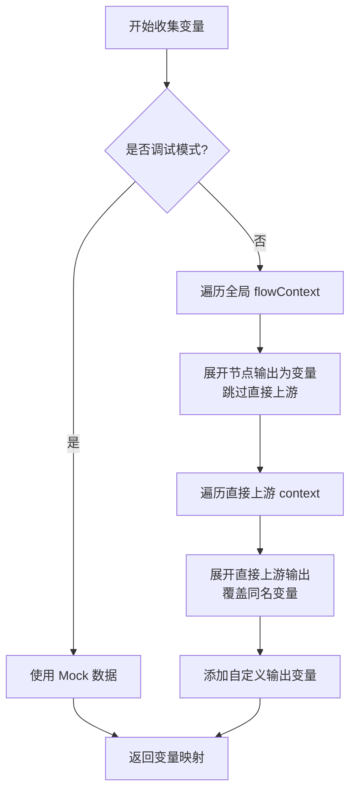
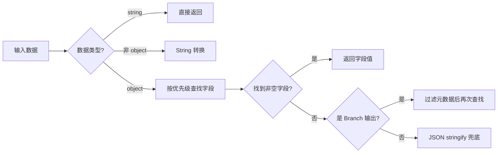
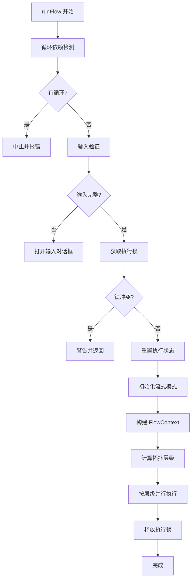
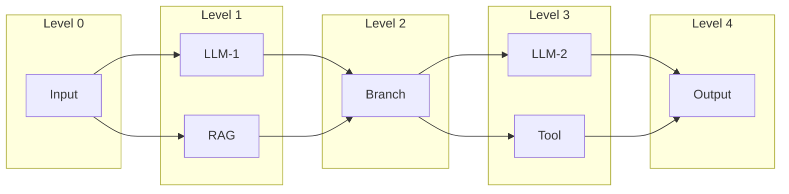
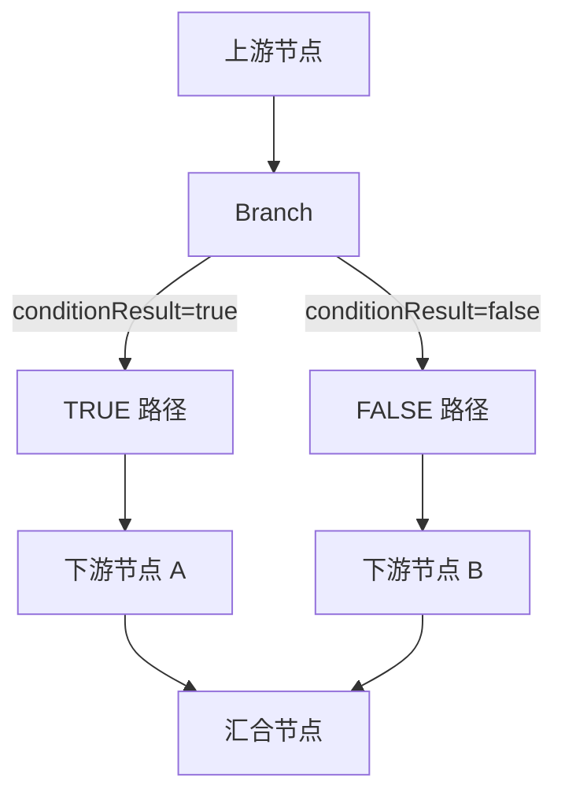

# 🔄 工作流编排机制详情

本文档详细描述 Flash Flow 工作流的底层编排机制，包括上下文管理、变量系统、执行引擎、分支控制和安全机制。

---

## 📦 FlowContext 上下文结构

工作流使用 `FlowContext` 作为全局上下文，采用**键值对映射**存储每个节点的输出数据：

```typescript
// 定义于 src/types/flow.ts

export interface FlowContextMeta {
  flowId?: string | null;   // 当前工作流 ID
  sessionId?: string;        // 会话 ID（用于对话记忆）
  nodeLabels?: Record<string, string>;  // nodeId → label 映射
}

export interface FlowContext {
  [nodeId: string]: Record<string, unknown> | FlowContextMeta | undefined;
  _meta?: FlowContextMeta;  // 元数据（以 _ 开头）
}
```

### 上下文示例

```javascript
{
  "input_abc123": {
    "user_input": "帮我写一篇文章",
    "files": [],
    "formData": {}
  },
  "llm_def456": {
    "response": "这是生成的文章内容..."
  },
  "tool_ghi789": {
    "formatted": "2025-12-15 12:00:00",
    "timestamp": 1734220800000,
    "timezone": "Asia/Shanghai"
  },
  "_meta": {
    "flowId": "flow_xyz",
    "sessionId": "session_123",
    "nodeLabels": {
      "input_abc123": "用户输入",
      "llm_def456": "文章生成",
      "tool_ghi789": "获取当前时间"
    }
  }
}
```

### 上下文数据访问工具

系统提供标准化的上下文访问函数，定义于 [contextUtils.ts](file:///Users/jasperlin/Desktop/product/flash-flow-saas/flash-flow/src/store/executors/contextUtils.ts)：

| 函数 | 功能 |
|------|------|
| `getUpstreamData(context)` | 获取第一个上游节点的输出数据 |
| `getUpstreamEntries(context)` | 获取所有上游节点的 `[nodeId, output]` 数组 |
| `extractTextFromUpstream(data)` | 智能提取文本内容 |
| `extractInputFromContext(context)` | 组合提取输入文本 |
| `extractOutputFromContext(nodes, context)` | 提取 Output 节点的完整输出（含附件） |

---

## 📊 节点输出标准格式

| 节点类型 | 主要输出字段 | 说明 |
|---------|-------------|------|
| **Input** | `user_input`, `files`, `formData` | 用户输入的文本、文件和表单数据 |
| **LLM** | `response` | AI 生成的回复内容（支持流式） |
| **RAG** | `query`, `documents`, `citations`, `documentCount` | 检索查询及结果 |
| **Tool** | 工具特定字段 | 根据工具类型不同，如 `formatted`, `results`, `content` 等 |
| **Branch** | `conditionResult`, `passed`, + 透传数据 | 条件判断结果及上游数据透传 |
| **Output** | `text`, `attachments` | 最终展示文本和附件列表 |

---

## 🔗 变量引用机制

### 支持的引用格式

| 格式 | 说明 | 示例 |
|------|------|------|
| `{{field_name}}` | 直接使用字段名（在所有上游节点中查找） | `{{user_input}}`, `{{response}}` |
| `{{节点名称.field_name}}` | 使用节点 label 前缀（**推荐**，更明确） | `{{获取当前时间.formatted}}` |
| `{{node_id.field_name}}` | 使用节点 ID 前缀 | `{{tool_abc123.formatted}}` |

### 变量收集流程

变量收集由 [variableUtils.ts](file:///Users/jasperlin/Desktop/product/flash-flow-saas/flash-flow/src/store/executors/utils/variableUtils.ts) 中的 `collectVariables()` 函数实现：



### 变量收集算法

```typescript
function collectVariables(context, globalFlowContext, allNodes, mockData?) {
  const allVariables = {};
  
  // 1. 调试模式：直接使用 mock 数据
  if (mockData && Object.keys(mockData).length > 0) {
    Object.entries(mockData).forEach(([key, value]) => {
      allVariables[key] = String(value);
    });
    return allVariables;
  }
  
  // 2. 先从全局 flowContext 提取（较早执行的节点）
  for (const [nodeId, nodeOutput] of Object.entries(globalFlowContext)) {
    if (nodeId.startsWith('_')) continue;
    if (context[nodeId]) continue;  // 跳过直接上游（后面处理）
    
    const nodeLabel = findNodeLabel(nodeId, allNodes);
    flattenObject(nodeOutput, allVariables);            // {{fieldName}}
    flattenObject(nodeOutput, allVariables, nodeLabel); // {{节点名称.fieldName}}
    flattenObject(nodeOutput, allVariables, nodeId);    // {{nodeId.fieldName}}
    addCustomOutputs(nodeId, allVariables);
  }
  
  // 3. 最后从直接上游 context 提取（会覆盖全局同名变量）
  for (const [nodeId, nodeOutput] of Object.entries(context)) {
    if (nodeId.startsWith('_')) continue;
    
    flattenObject(nodeOutput, allVariables);            // 直接上游优先
    flattenObject(nodeOutput, allVariables, nodeLabel);
    flattenObject(nodeOutput, allVariables, nodeId);
    addCustomOutputs(nodeId, allVariables);
  }
  
  return allVariables;
}
```

### 变量优先级

1. **直接上游** context 中的节点输出（**最高优先级**）
2. **全局** flowContext 中的节点输出

### 变量未找到时的处理

- 替换为**空字符串**
- 控制台输出警告：`[PromptParser] 未找到变量: xxx，已替换为空字符串`

### flattenObject 展开规则

| 数据类型 | 处理方式 |
|---------|---------|
| `null` / `undefined` | 空字符串 `""` |
| 基础类型 | `String(value)` |
| 嵌套对象 | 递归展开，如 `obj.a.b` → `{{a.b}}` |
| 数组 | `JSON.stringify(array)` |
| `_` 开头的键 | **跳过**（内部字段） |

---

## 📝 文本提取优先级

`extractTextFromUpstream()` 函数按以下优先级智能提取文本：

```typescript
const TEXT_FIELD_PRIORITY = ['text', 'response', 'user_input', 'query'];
```

### 提取流程



### Branch 节点特殊处理

```typescript
const BRANCH_METADATA_FIELDS = ['conditionResult', 'passed', 'value'];

// Branch 输出中会过滤这些元数据字段后再提取文本
```

---

## ⚡ 并行执行引擎

系统使用基于**拓扑层级**的并行执行引擎，定义于 [executionActions.ts](file:///Users/jasperlin/Desktop/product/flash-flow-saas/flash-flow/src/store/actions/executionActions.ts) 和 [parallelExecutionUtils.ts](file:///Users/jasperlin/Desktop/product/flash-flow-saas/flash-flow/src/store/utils/parallelExecutionUtils.ts)。

### 执行流程概览



### 拓扑层级计算

```typescript
// src/store/utils/parallelExecutionUtils.ts

function calculateTopologicalLevels(nodes, edges): Map<nodeId, level> {
  // Level 0 = 入口节点（无上游依赖）
  // Level N = max(所有前置节点层级) + 1
  
  const calculateLevel = (nodeId) => {
    const incomers = getIncomers(node, nodes, edges);
    if (incomers.length === 0) return 0;  // 入口节点
    
    let maxUpstreamLevel = -1;
    for (const incomer of incomers) {
      maxUpstreamLevel = Math.max(maxUpstreamLevel, calculateLevel(incomer.id));
    }
    return maxUpstreamLevel + 1;
  };
}
```

### 层级并行执行



**执行规则**：
- 同层级节点**并行执行**（`Promise.allSettled`）
- 等待当前层级全部完成后，才执行下一层级
- 任一节点执行失败会记录错误并在当前层级结束后中止

### 执行锁机制

```typescript
// 防止并发执行
if (get()._executionLock) {
  console.warn('[RunFlow] 执行已在进行中，请等待完成');
  return;
}
set({ _executionLock: true });

try {
  // 执行工作流...
} finally {
  set({ _executionLock: false });  // 确保释放锁
}
```

---

## 🌳 分支节点执行

Branch 节点使用**安全表达式求值器**，详见 [BranchNodeExecutor.ts](file:///Users/jasperlin/Desktop/product/flash-flow-saas/flash-flow/src/store/executors/BranchNodeExecutor.ts)。

### 支持的条件表达式

| 表达式类型 | 格式 | 示例 |
|-----------|------|------|
| **包含判断** | `节点名.字段.includes('关键词')` | `LLM1.response.includes('成功')` |
| **前缀判断** | `节点名.字段.startsWith('前缀')` | `Input.text.startsWith('查询')` |
| **后缀判断** | `节点名.字段.endsWith('后缀')` | `Tool.result.endsWith('.pdf')` |
| **相等判断** | `节点名.字段 === 'value'` | `Branch.status === 'active'` |
| **不等判断** | `节点名.字段 !== 'value'` | `LLM.type !== 'error'` |
| **数值比较** | `节点名.字段 > 数值` | `Score.value >= 60` |
| **长度比较** | `节点名.字段.length > 数值` | `Input.text.length > 10` |

### 安全求值机制

```typescript
// 预编译正则表达式（模块级别，避免重复创建）
const INCLUDES_PATTERN = /^([...]).includes\(['"](.*)['"]\)$/;
const COMPARISON_PATTERN = /^([...])([>=<])(\d+)$/;

function safeEvaluateCondition(condition, context): boolean {
  // 1. 构建节点查找 Map（O(1) 查找）
  const lookupMap = buildNodeLookupMap(context);
  
  // 2. 白名单模式匹配
  const includesMatch = condition.match(INCLUDES_PATTERN);
  if (includesMatch) {
    // 安全执行 includes 检查
    return value.includes(searchStr);
  }
  
  // 3. 不支持的表达式 → 返回 false + 警告
  console.warn('Unsupported condition format:', condition);
  return false;
}
```

### 分支路径控制



**路径阻塞机制**：
1. Branch 节点执行后返回 `conditionResult: boolean`
2. 根据结果确定未选中的 handle（`true` → 阻塞 `false` 路径）
3. 使用 `getDescendants()` 获取未选中路径的所有下游节点
4. 将这些节点加入 `blockedNodes` 集合，后续层级执行时跳过

```typescript
if (node.type === 'branch' && result) {
  const conditionResult = !!result.conditionResult;
  const notTakenHandle = conditionResult ? 'false' : 'true';
  
  // 获取并阻塞未选中分支的所有下游
  const blockedDescendants = getDescendants(nodeId, edges, notTakenHandle);
  blockedDescendants.forEach(id => blockedNodes.add(id));
}
```

---

## 🔄 循环依赖检测

系统使用 DFS 算法检测 DAG 中的循环，定义于 [cycleDetection.ts](file:///Users/jasperlin/Desktop/product/flash-flow-saas/flash-flow/src/store/utils/cycleDetection.ts)。

```typescript
function hasCycle(nodeId, nodes, edges, visited = new Set(), stack = new Set()): boolean {
  if (stack.has(nodeId)) return true;   // 当前路径中已存在 → 循环
  if (visited.has(nodeId)) return false; // 已访问过且无循环
  
  visited.add(nodeId);
  stack.add(nodeId);  // 加入当前路径栈
  
  const outgoers = getOutgoers({ id: nodeId }, nodes, edges);
  for (const out of outgoers) {
    if (hasCycle(out.id, nodes, edges, visited, stack)) return true;
  }
  
  stack.delete(nodeId);  // 回溯时移出路径栈
  return false;
}
```

**执行时机**：工作流执行前，对每个节点进行循环检测。

---

## 🔍 节点解析工具

定义于 [sourceResolver.ts](file:///Users/jasperlin/Desktop/product/flash-flow-saas/flash-flow/src/store/utils/sourceResolver.ts)，提供高性能的节点查找能力。

### 节点索引结构

```typescript
interface NodeIndex {
  byId: Map<string, AppNode>;     // nodeId → node
  byLabel: Map<string, AppNode>;  // label → node
}

function buildNodeIndex(nodes): NodeIndex {
  // O(n) 构建，支持 O(1) 查找
}
```

### 变量引用解析

```typescript
function resolveSourceNodeId(value, nodes): string | null {
  // 输入: "{{LLM1.response}}" 或 "{{节点名.字段}}"
  // 输出: 对应的 nodeId 或 null
  
  const match = value.match(/\{\{(.+?)\}\}/);
  const varPath = match[1];  // "LLM1.response"
  
  // 尝试匹配 "节点名.字段" 格式
  const dotIndex = varPath.indexOf('.');
  if (dotIndex > 0) {
    const nodeLabel = varPath.substring(0, dotIndex);
    // 先查 label，再查 id
  }
}
```

---

## 🛡️ 安全与容错机制

### 参数验证

| 节点类型 | 验证机制 |
|---------|---------|
| **Input** | 文本/文件/表单必填项检查 |
| **RAG** | `files` 数组非空、`fileSearchStoreName` 已配置 |
| **Tool** | Zod Schema 二次验证 |
| **Branch** | 白名单表达式匹配（非白名单返回 false） |
| **Output** | 模式与配置一致性检查 |

### 敏感数据过滤

| 场景 | 过滤规则 |
|------|---------|
| Branch 透传 | 过滤 `_` 开头字段 |
| FlowContext 访问 | 过滤 `_meta` 等内部字段 |
| 变量收集 | 跳过 `_` 开头的键 |

### 执行完整性检查

```typescript
const checkFlowIntegrity = () => {
  const currentNodes = get().nodes;
  const currentIds = new Set(currentNodes.map(n => n.id));
  for (const id of initialNodeIds) {
    if (!currentIds.has(id)) {
      throw new Error("Execution interrupted: Flow structure changed");
    }
  }
};
```

---

## 🎚️ 流式输出模式

Output 节点支持多种流式输出模式：

| 模式 | 说明 | 初始化函数 |
|------|------|-----------|
| `single` | 单源直接输出 | 默认 |
| `segmented` | 分段流式（merge 模式） | `initSegmentedStreaming(sourceIds)` |
| `select` | 首字锁定（select 模式） | `initSelectStreaming(sourceIds)` |

### Select 模式首字锁定

```typescript
function tryLockSource(sourceId): boolean {
  if (lockedSourceId === null) {
    set({ lockedSourceId: sourceId });
    return true;  // 成功锁定
  }
  return lockedSourceId === sourceId;  // 已锁定同一源
}
```

---

## ⚠️ 常见错误与处理

| 错误场景 | 错误信息 | 预防措施 |
|---------|---------|---------|
| 循环依赖 | `"检测到循环依赖，无法执行工作流"` | 执行前 DFS 检测 |
| 并发执行 | 控制台警告 | `_executionLock` 执行锁 |
| 节点删除 | `"Execution interrupted: Flow structure changed"` | `checkFlowIntegrity()` 检查 |
| 非法表达式 | 控制台警告 + 默认 false | 白名单模式匹配 |
| 变量未找到 | 替换为空 + 警告 | 控制台日志 |

---

## 📁 核心代码文件索引

| 文件 | 功能 |
|------|------|
| [flow.ts](file:///Users/jasperlin/Desktop/product/flash-flow-saas/flash-flow/src/types/flow.ts) | 类型定义（FlowContext、节点数据接口） |
| [executionActions.ts](file:///Users/jasperlin/Desktop/product/flash-flow-saas/flash-flow/src/store/actions/executionActions.ts) | 执行引擎主入口 |
| [parallelExecutionUtils.ts](file:///Users/jasperlin/Desktop/product/flash-flow-saas/flash-flow/src/store/utils/parallelExecutionUtils.ts) | 拓扑层级计算、并行执行工具 |
| [cycleDetection.ts](file:///Users/jasperlin/Desktop/product/flash-flow-saas/flash-flow/src/store/utils/cycleDetection.ts) | 循环依赖检测 |
| [variableUtils.ts](file:///Users/jasperlin/Desktop/product/flash-flow-saas/flash-flow/src/store/executors/utils/variableUtils.ts) | 变量收集与展开 |
| [contextUtils.ts](file:///Users/jasperlin/Desktop/product/flash-flow-saas/flash-flow/src/store/executors/contextUtils.ts) | 上下文数据访问工具 |
| [sourceResolver.ts](file:///Users/jasperlin/Desktop/product/flash-flow-saas/flash-flow/src/store/utils/sourceResolver.ts) | 节点解析与索引 |
| [BranchNodeExecutor.ts](file:///Users/jasperlin/Desktop/product/flash-flow-saas/flash-flow/src/store/executors/BranchNodeExecutor.ts) | 分支节点执行器 |
