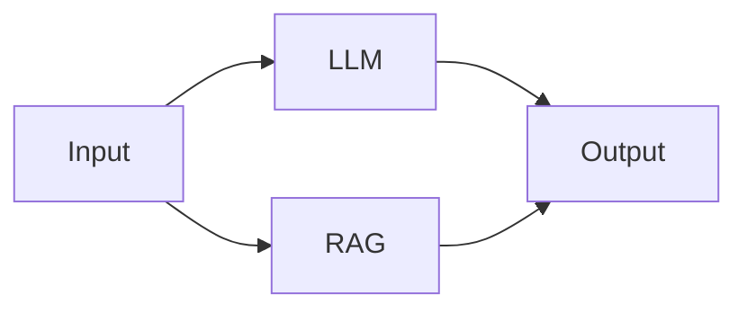
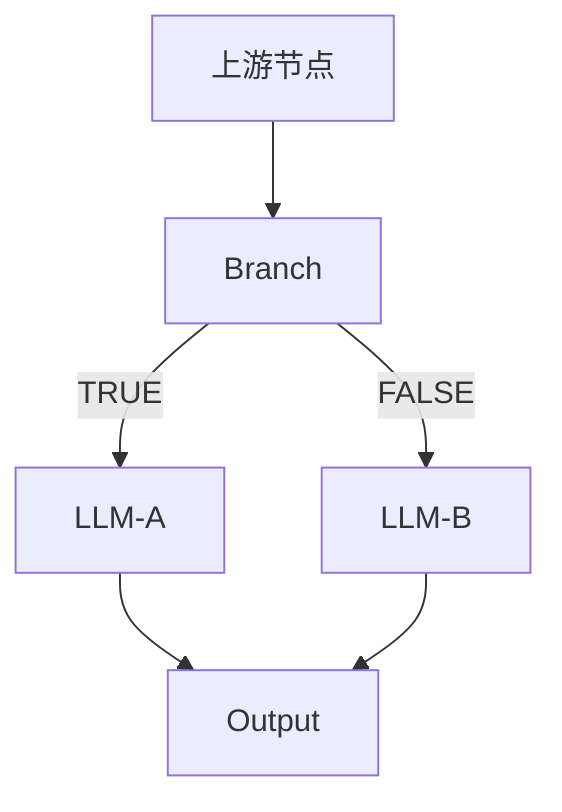

# 📋 Flash Flow 节点功能与参数详情

> **更新时间**: 2025-12-08  
> **版本**: v3.0 (基于实际代码实现)

---

## 🔢 节点类型总览

Flash Flow 支持 6 种节点类型，构成完整的工作流编排能力：

| 节点类型 | 英文 ID | 功能描述 | 图标 |
|---------|--------|---------|------|
| 输入节点 | `input` | 工作流入口，接收用户输入 | ⬇️ |
| LLM 节点 | `llm` | 调用大语言模型生成内容 | 🤖 |
| RAG 节点 | `rag` | 基于知识库的语义检索 | 📚 |
| 工具节点 | `tool` | 调用外部工具 API | 🔧 |
| 分支节点 | `branch` | 条件判断与流程分支 | 🔀 |
| 输出节点 | `output` | 工作流终点，展示结果 | ⬆️ |

---

## 1️⃣ Input 节点（输入节点）

### 功能描述
用户输入的入口节点，支持**文本输入**、**文件上传**、**结构化表单**三种输入模式，可单独或组合使用。

### 核心参数

| 参数名 | 类型 | 必填 | 默认值 | 描述 |
|-------|------|-----|-------|------|
| `label` | string | ✅ | - | 节点显示名称 |
| `enableTextInput` | boolean | ❌ | `true` | 启用文本输入框 |
| `enableFileInput` | boolean | ❌ | `false` | 启用文件上传 |
| `enableStructuredForm` | boolean | ❌ | `false` | 启用结构化表单 |
| `text` | string | ❌ | `""` | 用户输入的文本内容 |

### 文件上传配置 (`enableFileInput=true` 时)

| 参数名 | 类型 | 默认值 | 描述 |
|-------|------|-------|------|
| `fileConfig.allowedTypes` | string[] | - | 允许的文件类型 |
| `fileConfig.maxSizeMB` | number | `50` | 单文件最大体积 (MB) |
| `fileConfig.maxCount` | number | `999` | 最大文件数量 |

**支持的文件类型**:
- `image/*` - 所有图片格式
- `.pdf`, `.doc`, `.docx` - 文档
- `.xls`, `.xlsx` - 表格
- `.ppt`, `.pptx` - 演示文稿
- `.txt`, `.md`, `.json`, `.csv` - 文本

### 结构化表单配置 (`enableStructuredForm=true` 时)

`formFields` 数组，每个字段包含：

| 字段类型 | type 值 | 额外参数 |
|---------|--------|---------|
| 文本输入 | `"text"` | `placeholder`, `defaultValue` |
| 单选下拉 | `"select"` | `options`, `defaultValue` |
| 多选下拉 | `"multi-select"` | `options`, `defaultValue` (数组) |

**通用字段参数**:
- `name`: 变量名（自动生成，格式：`field_xxxxxx`）
- `label`: 显示标签文本
- `required`: 是否必填

### 执行逻辑 (InputNodeExecutor.ts)

```typescript
// 核心输出构建逻辑
const output: Record<string, unknown> = {
  user_input: inputData.text || "",      // 主文本输入
  timestamp: new Date().toISOString(),   // ISO 格式时间戳
};

// 文件附加（如启用）
if (inputData.files?.length > 0) {
  output.files = inputData.files;
}

// 表单数据附加（如启用）- 作为嵌套对象保存
if (inputData.formData && Object.keys(inputData.formData).length > 0) {
  output.formData = inputData.formData;
```

### 输出格式

```typescript
{
  user_input: string,                         // 文本输入内容
  timestamp: string,                          // 输入时间戳 (ISO 格式)
  files?: { name: string; size: number; type: string; url?: string }[],  // 上传的文件列表
  formData?: Record<string, unknown>          // 结构化表单数据
}
```

### 变量引用方式

#### formData（结构化表单）
通过 `{{节点名称.formData.fieldName}}` 引用具体字段。

#### files（上传文件）
支持拆分引用访问每个文件的属性：

| 引用格式 | 说明 |
|---------|------|
| `{{节点名称.files[0].name}}` | 第一个文件的文件名 |
| `{{节点名称.files[0].type}}` | 第一个文件的 MIME 类型 |
| `{{节点名称.files[0].size}}` | 第一个文件的大小（字节） |
| `{{节点名称.files[0].url}}` | 第一个文件的 URL |
| `{{节点名称.files[1].name}}` | 第二个文件的文件名 |

> [!NOTE]
> `formData` 和 `files` 都是嵌套结构，字段**不会**自动展开为顶级变量。
> 必须通过完整路径引用，如 `{{输入节点.formData.style}}` 或 `{{输入节点.files[0].url}}`。

---

## 2️⃣ LLM 节点（大语言模型节点）

### 功能描述
调用大语言模型生成文本内容，支持**变量引用**、**对话记忆**和**流式输出**。

### 核心参数

| 参数名 | 类型 | 必填 | 默认值 | 描述 |
|-------|------|-----|-------|------|
| `label` | string | ✅ | - | 节点显示名称 |
| `model` | string | ❌ | `"doubao-seed-1-6-flash-250828"` | 模型选择 |
| `systemPrompt` | string | ❌ | `""` | 系统提示词，支持 `{{variable}}` 语法 |
| `temperature` | number | ❌ | `0.7` | 生成温度 (0.0-1.0) |
| `enableMemory` | boolean | ❌ | `false` | 启用对话记忆 |
| `memoryMaxTurns` | number | ❌ | `10` | 最大记忆轮数 (1-20) |

### Temperature 参数说明

| 值范围 | 效果 | 适用场景 |
|-------|------|---------|
| 0.0-0.3 | 确定性输出 | 翻译、摘要、问答 |
| 0.4-0.6 | 平衡模式 | 通用对话 |
| 0.7-1.0 | 创造性输出 | 创作、头脑风暴 |

### 需要的上游输入 (inputMappings)

| 字段名 | 描述 | 必填 |
|-------|------|-----|
| `user_input` | 用户消息内容 | ✅ |

### 执行逻辑 (LLMNodeExecutor.ts)

```typescript
// 1. 变量收集与替换
const allVariables = collectVariables(context, globalFlowContext, allNodes);
systemPrompt = replaceVariables(systemPrompt, allVariables);

// 2. 输入内容解析 (从上游 context 中提取 user_input)
const inputContent = resolveInputContent(context, ...);

// 3. 对话记忆处理（如启用）
if (memoryEnabled && flowId && sessionId) {
  conversationHistory = await fetchMemory(flowId, memoryNodeId, sessionId, maxTurns, inputContent);
}

// 4. 流式请求到 /api/run-node-stream
const resp = await fetch("/api/run-node-stream", {
  method: "POST",
  body: JSON.stringify({
    model: llmData.model,
    systemPrompt,
    temperature: llmData.temperature,
    input: inputContent,
    conversationHistory: memoryEnabled ? conversationHistory : undefined,
  }),
});
```

**输入解析逻辑 (`resolveInputContent`)**:
1. 调试模式：使用第一个 mock 值
2. 正常模式：遍历上游 context，查找包含 `user_input` 字段的节点输出

```typescript
// 从上游 context 中获取 user_input
for (const [, data] of upstreamEntries) {
  if (data && typeof data === 'object') {
    const obj = data as Record<string, unknown>;
    if (typeof obj.user_input === 'string' && obj.user_input.trim()) {
      return obj.user_input;
    }
  }
}
```

### 用户交互节点判定

```typescript
function checkIsUserFacingLLM(nodeId, nodes, edges): boolean {
  // 条件 1: 直接连接到 output 节点
  for (const edge of outgoingEdges) {
    if (targetNode?.type === 'output') return true;
  }
  
  // 条件 2: 从 branch 节点接收输入
  for (const inEdge of incomingEdges) {
    if (sourceNode?.type === 'branch') return true;
  }
  
  return false;
}
```

### 对话记忆机制

**记忆键分配规则**:
- **用户交互 LLM** → 共享键 `"__main__"`
- **中间处理 LLM** → 节点独立键 (`node.id`)

```typescript
const memoryNodeId = isUserFacingLLM ? "__main__" : node.id;
```

**存储架构**:
- 服务: `llmMemoryService`
- 支持跨会话持久化
- 自动裁剪超过 `memoryMaxTurns` 的旧消息

**流式输出**:
- 仅用户交互 LLM 节点启用
- 使用 Server-Sent Events (SSE) 实时返回
- 每 chunk 延迟 30ms（打字机效果）

### 输出格式

```typescript
{
  response: string  // LLM 生成的文本内容
}
```

---

## 3️⃣ RAG 节点（检索增强生成节点）

### 功能描述
支持两种模式的文档检索：
1. **静态模式**：基于 Builder 预上传的知识库文件，使用 Gemini File Search API
2. **动态模式**：从上游 Input 节点引用用户上传的文件，使用 Gemini 多模态 API（秒级响应）

### 核心参数

| 参数名 | 类型 | 必填 | 默认值 | 描述 |
|-------|------|-----|-------|------|
| `label` | string | ✅ | - | 节点显示名称 |
| `files` | File[] | ❌ | `[]` | 知识库文件列表（静态模式） |
| `topK` | number | ❌ | `5` | 检索结果数 (1/3/5/7/10) |
| `maxTokensPerChunk` | number | ❌ | `200` | 分块大小 (50-500) |
| `maxOverlapTokens` | number | ❌ | `20` | 重叠 Token 数 (0-100) |

**支持的文件格式**: `.pdf`, `.txt`, `.md`, `.doc`, `.docx`, 图片格式（动态模式）  
**单文件最大**: 100MB

### 系统自动生成的字段（静态模式）

| 字段名 | 描述 |
|-------|------|
| `fileSearchStoreName` | Gemini Store 资源名称 |
| `fileSearchStoreId` | Store 显示 ID |
| `uploadStatus` | 上传状态：`idle` / `uploading` / `processing` / `completed` / `error` |
| `uploadError` | 错误详情（失败时） |

### 需要的上游输入 (inputMappings)

| 字段名 | 描述 | 必填 |
|-------|------|-----|
| `query` | 检索查询文本 | ✅ |
| `files` | 动态文件引用（如 `{{输入节点.files}}`） | ❌ |

### 执行逻辑 (RAGNodeExecutor.ts)

```typescript
// 1. 解析 inputMappings
const inputMappings = ragData.inputMappings;

// 2. 解析查询内容（优先使用 inputMappings.query）
const query = this.resolveQuery(inputMappings?.query, context);

// 3. 检查是否有动态文件引用
const dynamicFiles = this.resolveDynamicFiles(inputMappings?.files, context);

if (dynamicFiles && dynamicFiles.length > 0) {
  // 动态模式：使用多模态 API 直接处理文件
  return await this.executeWithMultimodal(query, dynamicFiles);
  // 调用 geminiFileSearchAPI.queryWithFiles()
} else {
  // 静态模式：使用 File Search Store
  return await this.executeWithFileSearch(query, ragData);
  // 调用 geminiFileSearchAPI.searchInStore()
}
```

**动态文件解析** (`resolveDynamicFiles`):
1. 解析 `{{节点名称.files}}` 变量模板
2. 过滤出包含 `url` 属性的有效文件对象
3. 返回 `{ name, url, type }` 数组

**变量解析优先级**:
1. `nodeId.fieldName` - 按节点 ID 查找
2. `nodeLabel.fieldName` - 按节点标签查找（通过 `context._meta.nodeLabels`）
3. `fieldName` - 在所有上游节点中查找该字段

### 输出格式

```typescript
{
  query: string,           // 检索查询文本
  documents: string[],     // 检索到的文档片段/LLM回答
  citations: any[],        // 引用信息
  documentCount: number,   // 文档数量
  mode: 'multimodal' | 'fileSearch'  // 执行模式
}
```

> [!TIP]
> **场景选择**：
> - 用户上传文件并提问 → 使用动态模式，配置 `inputMappings.files`
> - 固定知识库问答 → 使用静态模式，在 Builder 预上传文件

---

## 4️⃣ Tool 节点（工具节点）

### 功能描述
调用外部工具 API 执行专项任务，支持参数验证和变量引用。

### 核心参数

| 参数名 | 类型 | 必填 | 默认值 | 描述 |
|-------|------|-----|-------|------|
| `label` | string | ✅ | - | 节点显示名称 |
| `toolType` | string | ✅ | `"web_search"` | 工具类型 |
| `inputs` | object | ❌ | `{}` | 工具输入参数（支持变量引用） |

### 执行逻辑 (ToolNodeExecutor.ts)

```typescript
// 1. 收集所有上游变量
const allVariables: Record<string, string> = {};

// 递归展开对象，生成多种引用格式
const flattenObject = (obj, prefix = "") => {
  for (const [key, value] of Object.entries(obj)) {
    const newKey = prefix ? `${prefix}.${key}` : key;
    if (typeof value === 'object' && !Array.isArray(value)) {
      flattenObject(value, newKey);  // 递归处理嵌套对象
    } else if (Array.isArray(value)) {
      allVariables[newKey] = JSON.stringify(value);
    } else {
      allVariables[newKey] = String(value);
    }
  }
};

// 从直接上游 context 提取
for (const [nodeId, nodeOutput] of Object.entries(context)) {
  flattenObject(nodeOutput);           // 无前缀: {{fieldName}}
  flattenObject(nodeOutput, nodeLabel); // 标签前缀: {{节点名称.fieldName}}
  flattenObject(nodeOutput, nodeId);    // ID前缀: {{node_xxx.fieldName}}
  
  // 添加自定义输出变量
  if (customOutputs) {
    customOutputs.forEach(cv => {
      allVariables[cv.name] = cv.value;
      allVariables[`${nodeLabel}.${cv.name}`] = cv.value;
    });
  }
}

// 2. 替换 inputs 中的变量
const replacedInputs = {};
for (const [key, value] of Object.entries(inputs)) {
  if (typeof value === 'string') {
    replacedInputs[key] = replaceVariables(value, allVariables, false);
  } else {
    replacedInputs[key] = value;
  }
}

// 3. Zod Schema 验证
const validation = validateToolInputs(toolType, replacedInputs);
if (!validation.success) {
  throw new Error(`参数验证失败: ${validation.error}`);
}

// 4. 执行工具
const result = await executeToolAction({ toolType, inputs: replacedInputs });
```

### 可用工具类型

---

#### 🔍 web_search（网页搜索）

**描述**: 使用 Tavily 搜索引擎联网查找相关信息

| 参数 | 类型 | 必填 | 默认值 | 描述 |
|-----|------|-----|-------|------|
| `query` | string | ✅ | - | 搜索查询内容 |
| `maxResults` | number | ❌ | `5` | 最大返回结果数 (1-10) |

**输出**:
```json
{
  "results": [{"title": "...", "url": "...", "snippet": "..."}],
  "count": 5
}
```

---

#### 🧮 calculator（计算器）

**描述**: 安全计算数学表达式

| 参数 | 类型 | 必填 | 描述 |
|-----|------|-----|------|
| `expression` | string | ✅ | 数学表达式，如 `"2 + 2 * 3"` |

**输出**:
```json
{
  "expression": "2 + 2 * 3",
  "result": 8
}
```

---

#### 🕐 datetime（日期时间）

**描述**: 获取当前时间、日期格式化、日期计算

| 参数 | 类型 | 必填 | 默认值 | 描述 |
|-----|------|-----|-------|------|
| `operation` | enum | ❌ | `"now"` | 操作类型：`now`/`format`/`diff`/`add` |
| `date` | string | ❌ | 当前时间 | 输入日期（ISO 格式） |
| `targetDate` | string | ❌ | - | 目标日期（用于 `diff` 操作） |
| `format` | string | ❌ | `"YYYY-MM-DD HH:mm:ss"` | 输出格式 |
| `amount` | number | ❌ | - | 增减数量（用于 `add` 操作） |
| `unit` | enum | ❌ | - | 时间单位：`year`/`month`/`day`/`hour`/`minute`/`second` |

**输出示例**:
```json
// now 操作
{ "formatted": "2025-12-07 11:15:00", "timestamp": 1733547300000, "timezone": "Asia/Shanghai" }

// diff 操作
{ "from": "2025-01-01", "to": "2025-12-31", "difference": { "days": 364 }, "humanReadable": "364 天" }
```

---

#### ⛅ weather（天气查询）

**描述**: 实时查询指定城市的天气信息（使用和风天气 API）

| 参数 | 类型 | 必填 | 描述 |
|-----|------|-----|------|
| `city` | string | ✅ | 城市名称，如 `"北京"`、`"上海"` |

**输出**:
```json
{
  "city": "北京",
  "weather": { "text": "晴", "temp": "5°C", "humidity": "30%" },
  "summary": "北京当前天气: 晴，温度 5°C，湿度 30%"
}
```

> [!IMPORTANT]
> 需要配置环境变量 `QWEATHER_API_KEY`

---

#### 🌐 url_reader（网页读取）

**描述**: 提取并解析网页的正文内容

| 参数 | 类型 | 必填 | 默认值 | 描述 |
|-----|------|-----|-------|------|
| `url` | string | ✅ | - | 要读取的网页 URL |
| `maxLength` | number | ❌ | `5000` | 最大返回字符数 (100-50000) |

**输出**:
```json
{
  "url": "https://example.com",
  "title": "页面标题",
  "content": "提取的正文内容...",
  "contentLength": 3500,
  "truncated": false
}
```

---

### 参数验证机制

1. **调试模式**: UI 层实时验证（ToolDebugDialog）
2. **正式执行**: 执行器二次验证（ToolNodeExecutor）
3. **验证工具**: 使用 Zod Schema 确保类型安全

### 变量引用支持

Tool 节点的 `inputs` 参数支持 `{{variable}}` 语法引用上游数据：

```
// 示例：在 query 参数中引用时间工具的输出
今日天气 {{获取当前时间.formatted}}
```

---

## 5️⃣ Branch 节点（分支节点）

### 功能描述
基于条件表达式控制流程分支走向，支持**安全表达式求值**，防止代码注入攻击。

### 核心参数

| 参数名 | 类型 | 必填 | 默认值 | 描述 |
|-------|------|-----|-------|------|
| `label` | string | ✅ | - | 节点显示名称 |
| `condition` | string | ❌ | `""` | 判断条件（安全表达式） |

### 需要的上游输入

> [!NOTE]
> Branch 节点**不需要**显式配置 `input` 字段。条件表达式使用 `节点名称.字段名` 格式直接引用上游数据。

### 执行逻辑 (BranchNodeExecutor.ts)

```typescript
// 1. 获取上游数据（过滤 _meta 等内部字段）
const upstreamData = getUpstreamData(context);

// 2. 条件为空时默认返回 true
if (!condition || !condition.trim()) {
  return {
    passed: true,
    conditionResult: true,
    ...upstreamData
  };
}

// 3. 安全表达式求值
const conditionResult = safeEvaluateCondition(condition, context);

// 4. 透传上游数据（过滤敏感字段）
const filteredData = Object.fromEntries(
  Object.entries(upstreamData).filter(([key]) => !key.startsWith('_'))
);

return {
  passed: true,
  conditionResult,
  ...filteredData
};
```

### 安全表达式求值器 (safeEvaluateCondition)

**核心机制**: 使用正则匹配白名单模式，只允许特定操作，防止代码注入。

**节点查找逻辑**:
```typescript
const extractNodeAndPath = (expr) => {
  // 1. 匹配 nodeName.path 格式（支持中英文节点名）
  const match = expr.match(/^([a-zA-Z\u4e00-\u9fa5_][\w\u4e00-\u9fa5]*)\.([\w.]+)/);
  
  // 2. 在 context 中按 nodeId 查找
  for (const [nodeId, nodeOutput] of Object.entries(context)) {
    if (nodeId === nodeName) return { nodeData: nodeOutput, path };
  }
  
  // 3. 如果没找到，从 _meta.nodeLabels 中按 label 查找
  if (meta?.nodeLabels) {
    for (const [nodeId, label] of Object.entries(meta.nodeLabels)) {
      if (label === nodeName) return { nodeData: context[nodeId], path };
    }
  }
};
```

### 支持的表达式格式（白名单模式）

#### 1. 字符串方法

```javascript
用户输入.user_input.includes('关键词')
LLM处理.response.startsWith('前缀')
节点名称.text.endsWith('后缀')
```

#### 2. 数值比较

```javascript
计算节点.result > 60
input_1.value >= 100
tool_abc123.count < 10
节点名称.amount <= 50
```

#### 3. 等值判断

```javascript
用户输入.user_input === 'hello'
RAG检索.documentCount !== 0
开关节点.enabled === true
状态节点.status === false
```

#### 4. 属性访问 (嵌套路径支持)

```javascript
用户输入.user_input.length > 5
LLM回复.response.data.status === 'success'
```

**嵌套值获取**:
```typescript
function getNestedValue(obj, path) {
  const parts = path.split('.');
  let current = obj;
  for (const part of parts) {
    if (current === null || current === undefined) return undefined;
    current = current[part];
  }
  return current;
}
```

### 输出句柄

- **TRUE 句柄**（绿色）: 条件为 `true` 时执行下游
- **FALSE 句柄**（红色）: 条件为 `false` 时执行下游

### 输出格式

```typescript
{
  passed: true,              // 固定为 true（表示节点执行成功）
  conditionResult: boolean,  // 条件判断结果
  ...upstreamData           // 过滤后的上游数据透传
}
```

> [!CAUTION]
> 不支持的表达式格式会触发警告并默认返回 `false`，请严格遵循白名单语法。

---

## 6️⃣ Output 节点（输出节点）

### 功能描述
工作流的终点节点，负责从上游节点提取最终输出文本并展示。支持**四种输出模式**，满足不同场景需求。

### 核心参数

| 参数名 | 类型 | 必填 | 默认值 | 描述 |
|-------|------|-----|-------|------|
| `label` | string | ✅ | - | 节点显示名称 |
| `inputMappings` | OutputInputMappings | ✅ | - | 内容来源配置 |

### 输入配置 (`inputMappings`) 类型定义

```typescript
type OutputMode = 'direct' | 'select' | 'merge' | 'template';

interface ContentSource {
  type: 'variable' | 'static';
  value: string;
  label?: string;
}

interface AttachmentSource {
  type: 'variable' | 'static';
  value: string;
}

interface OutputInputMappings {
  mode: OutputMode;
  sources?: ContentSource[];
  template?: string;
  attachments?: AttachmentSource[];
}
```

### 执行逻辑 (OutputNodeExecutor.ts)

```typescript
// 1. 收集变量（保留原始类型，用于附件）
const variables = collectDirectUpstreamVariables(context, allNodes);

// 2. 转换为字符串版本（用于模板替换）
const stringVariables: Record<string, string> = {};
for (const [key, value] of Object.entries(variables)) {
  stringVariables[key] = valueToString(value);
}

// 3. 根据模式处理
const mode = inputMappings?.mode || 'direct';
switch (mode) {
  case 'direct': 
    // 使用第一个 source
    text = resolveSource(sources[0], variables, stringVariables);
    break;
  case 'select':
    // 取第一个非空结果
    for (const source of sources) {
      const resolved = resolveSource(source, ...);
      if (resolved && resolved.trim() && !resolved.includes('{{')) {
        text = resolved;
        break;
      }
    }
    break;
  case 'merge':
    // 连接所有非空结果（用 \n\n 分隔）
    const parts = sources
      .map(s => resolveSource(s, ...))
      .filter(r => r && r.trim());
    text = parts.join('\n\n');
    break;
  case 'template':
    // 替换模板中的变量
    text = replaceVariables(template, stringVariables, false);
    break;
}

// 4. 处理附件
const attachments = resolveAttachments(inputMappings?.attachments, variables);
```

---

### 模式详解

#### 模式 1：`direct` - 直接引用

最简单的场景：输出来自单一上游节点的某个字段。

**配置示例：**
```json
{
  "mode": "direct",
  "sources": [
    { "type": "variable", "value": "{{LLM回复.response}}" }
  ]
}
```

**适用场景：** 简单的 Input → LLM → Output 流程

> [!WARNING]
> `direct` 模式**必须**配置至少一个来源，否则抛出错误：  
> `"Output 节点配置错误：direct 模式需要至少配置一个来源 (sources)"`

---

#### 模式 2：`select` - 分支选择

多分支场景：从多个候选中选择**第一个非空**结果。

**配置示例：**
```json
{
  "mode": "select",
  "sources": [
    { "type": "variable", "value": "{{技术支持.response}}" },
    { "type": "variable", "value": "{{销售咨询.response}}" },
    { "type": "variable", "value": "{{通用回复.response}}" }
  ]
}
```

**选择逻辑：**
```typescript
for (const source of sources) {
  const resolved = resolveSource(source, ...);
  // 非空 + 去除空白后非空 + 不含未替换的 {{变量}}
  if (resolved && resolved.trim() && !resolved.includes('{{')) {
    text = resolved;
    break;
  }
}
```

**适用场景：** Branch 节点后的多路径汇聚、条件分流

---

#### 模式 3：`merge` - 内容合并

组合多个来源的内容为一个输出，用**双换行**分隔。

**配置示例：**
```json
{
  "mode": "merge",
  "sources": [
    { "type": "variable", "value": "{{摘要生成.response}}" },
    { "type": "variable", "value": "{{详细分析.response}}" }
  ]
}
```

**合并逻辑：**
```typescript
const parts: string[] = [];
for (const source of sources) {
  const resolved = resolveSource(source, ...);
  if (resolved && resolved.trim() && !resolved.includes('{{')) {
    parts.push(resolved);
  }
}
text = parts.join('\n\n');
```

**适用场景：** 摘要 + 详情组合、多结果聚合

---

#### 模式 4：`template` - 模板渲染

完全自定义输出格式，支持 `{{变量名}}` 语法。

**配置示例：**
```json
{
  "mode": "template",
  "template": "## 用户问题\n{{user_input}}\n\n## AI 回复\n{{LLM处理.response}}"
}
```

**适用场景：** 自定义报告格式、多字段结构化展示

> [!WARNING]
> `template` 模式**必须**配置 `template` 字段，否则抛出错误：  
> `"Output 节点配置错误：template 模式需要配置模板内容 (template)"`

---

### 附件配置（可选）

所有模式都支持可选的 `attachments` 配置：

```json
{
  "mode": "direct",
  "sources": [{ "type": "variable", "value": "{{response}}" }],
  "attachments": [
    { "type": "variable", "value": "{{用户输入.files}}" }
  ]
}
```

**附件解析逻辑：**
```typescript
function resolveAttachments(attachments, variables) {
  const result = [];
  for (const attachment of attachments) {
    // 解析 {{varName}} 格式
    const varMatch = attachment.value.match(/\{\{(.+?)\}\}/);
    const varName = varMatch[1];
    const value = variables[varName];
    
    // 如果是文件数组
    if (Array.isArray(value)) {
      for (const file of value) {
        if (file && 'name' in file) {
          result.push({ name: file.name, url: file.url, type: file.type });
        }
      }
    }
  }
  return result;
}
```

### 输出格式

```typescript
{
  text: string;                                              // 最终展示的文本内容
  attachments?: { name: string; url: string; type?: string }[] // 可选附件
}
```

> [!IMPORTANT]
> Output 节点**必须显式配置** `inputMappings`，不再支持自动提取。

---

## 🔄 工作流编排核心机制

### 1️⃣ FlowContext 上下文结构

工作流使用 `FlowContext` 作为全局上下文，采用**键值对映射**存储每个节点的输出：

```typescript
interface FlowContext {
  [nodeId: string]: Record<string, unknown>;  // 节点ID → 输出数据
  _meta?: {                                    // 元数据（以 _ 开头）
    flowId: string;
    sessionId: string;
    nodeLabels?: Record<string, string>;  // nodeId → label 映射
  }
}
```

**示例**:
```javascript
{
  "input_abc123": {
    "user_input": "帮我写一篇文章",
    "timestamp": "2025-12-07T00:00:00Z"
  },
  "llm_def456": {
    "response": "这是生成的文章内容..."
  },
  "_meta": {
    "flowId": "flow_xyz",
    "sessionId": "session_123",
    "nodeLabels": {
      "input_abc123": "用户输入",
      "llm_def456": "文章生成"
    }
  }
}
```

---

### 2️⃣ 节点输出标准格式

| 节点类型 | 主要输出字段 | 输出示例 |
|---------|-------------|---------|
| **Input** | `user_input`, `timestamp`, `files?`, `formData?` | `{user_input: "用户输入", timestamp: "..."}` |
| **LLM** | `response` | `{response: "AI生成的回复内容"}` |
| **RAG** | `query`, `documents`, `citations`, `documentCount`, `mode` | `{query: "检索词", documents: [...], mode: "fileSearch"}` |
| **Tool** | 工具特定字段 | 根据工具类型不同 |
| **Branch** | `conditionResult`, `passed`, 透传数据 | `{conditionResult: true, passed: true, ...}` |
| **Output** | `text`, `attachments?` | `{text: "最终展示文本"}` |

---

### 3️⃣ 变量引用机制

#### 支持的引用格式

| 格式 | 说明 | 示例 |
|------|------|------|
| `{{field_name}}` | 直接使用字段名（在所有上游节点中查找） | `{{user_input}}`, `{{response}}` |
| `{{节点名称.field_name}}` | 使用节点 label 前缀（推荐，更明确） | `{{获取当前时间.formatted}}` |
| `{{node_id.field_name}}` | 使用节点 ID 前缀 | `{{tool_abc123.formatted}}` |

#### 变量收集机制 (variableUtils.ts)

```typescript
function collectVariables(context, globalFlowContext, allNodes) {
  const allVariables = {};
  
  // 1. 先从全局 flowContext 提取（较早执行的节点）
  for (const [nodeId, nodeOutput] of Object.entries(globalFlowContext)) {
    if (context[nodeId]) continue;  // 跳过直接上游（后面处理）
    flattenObject(nodeOutput, allVariables);            // {{fieldName}}
    flattenObject(nodeOutput, allVariables, nodeLabel); // {{节点名称.fieldName}}
    flattenObject(nodeOutput, allVariables, nodeId);    // {{nodeId.fieldName}}
  }
  
  // 2. 最后从直接上游 context 提取（会覆盖全局同名变量）
  // 确保直接上游优先级最高
  for (const [nodeId, nodeOutput] of Object.entries(context)) {
    flattenObject(nodeOutput, allVariables);
    flattenObject(nodeOutput, allVariables, nodeLabel);
    flattenObject(nodeOutput, allVariables, nodeId);
    
    // 添加自定义输出变量
    if (customOutputs) {
      customOutputs.forEach(cv => {
        allVariables[cv.name] = cv.value;
        allVariables[`${nodeLabel}.${cv.name}`] = cv.value;
      });
    }
  }
  
  return allVariables;
}
```

#### 变量来源优先级

1. **直接上游** context 中的节点输出（最高优先级）
2. **全局** flowContext 中的节点输出

#### 变量未找到时的处理

- 替换为空字符串
- 控制台输出警告信息：`[PromptParser] 未找到变量: xxx，已替换为空字符串`

#### 实际示例

假设工作流中有以下节点：
- **Input 节点**: 输出 `{ user_input: "今天天气怎么样" }`
- **日期时间工具**（label: `获取当前时间`）: 输出 `{ formatted: "2025-12-07 11:30:00" }`

在 LLM 节点的 `systemPrompt` 中可以这样引用：

```
当前时间：{{获取当前时间.formatted}}
用户问题：{{user_input}}
```

执行时自动替换为：

```
当前时间：2025-12-07 11:30:00
用户问题：今天天气怎么样
```

---

### 4️⃣ 数据提取优先级 (contextUtils.ts)

`extractTextFromUpstream()` 函数智能提取文本内容：

```typescript
const TEXT_FIELD_PRIORITY = ['text', 'response', 'user_input', 'query'];

function extractTextFromUpstream(data, fallbackToJson = true) {
  // 1. 字符串直接返回
  if (typeof data === 'string') return data;
  
  // 2. 按优先级尝试提取
  for (const field of TEXT_FIELD_PRIORITY) {
    if (typeof obj[field] === 'string' && obj[field].trim()) {
      return obj[field];
    }
  }
  
  // 3. Branch 节点特殊处理（过滤元数据字段）
  if ('conditionResult' in obj) {
    const cleanedData = Object.fromEntries(
      Object.entries(obj).filter(([key]) => 
        !['conditionResult', 'passed', 'value'].includes(key)
      )
    );
    // 从清理后的数据中再次提取
    for (const field of TEXT_FIELD_PRIORITY) {
      if (cleanedData[field]) return cleanedData[field];
    }
  }
  
  // 4. 兜底：JSON 字符串
  return fallbackToJson ? JSON.stringify(data) : "";
}
```

---

### 5️⃣ 执行流程控制

#### 拓扑排序执行

系统使用拓扑排序确保节点按依赖关系正确执行：



执行顺序：`Input → LLM/RAG (并行) → Output`

#### Branch 节点的路径选择



1. 评估条件表达式，得到 `conditionResult`
2. 只执行对应句柄连接的下游节点
3. 另一条路径的节点会被跳过

---

## 🎛️ 节点参数面板

点击任意节点后，右侧弹出的参数面板包含以下区域：

### 1️⃣ 需要的上游输入（⚙️ 配置参数）

显示当前节点需要配置的输入参数：

| 节点类型 | 可配置的输入参数 |
|---------|------------------|
| **LLM** | `user_input` - 用户消息内容 |
| **RAG** | `query` - 检索查询文本 |
| **Tool** | 根据工具类型动态显示所有必填/可选参数 |
| **Branch** | 无需配置（condition 表达式已定义数据来源） |
| **Output** | 通过 UI 配置 `mode` 和 `sources`/`template` |

**配置方式**:
- 直接输入固定值：`北京`
- 引用上游变量：`{{user_input}}` 或 `{{节点名称.字段名}}`

**状态颜色**:
- 🟢 **绿色 + ✓** = 已配置或上游已提供
- 🟠 **橙色** = 必填但未配置
- ⚪ **灰色** = 可选参数

**数据存储**:
- Tool 节点 → `node.data.inputs`
- LLM/RAG 节点 → `node.data.inputMappings`
- Output 节点 → `node.data.inputMappings`

---

### 2️⃣ 引用的变量（🔗）

动态检测当前节点配置中引用的 `{{变量名}}` 占位符：

**检测范围**:
- LLM 节点：`systemPrompt` 中的变量
- Tool 节点：`inputs` 参数中的变量
- Branch 节点：条件表达式中的 `节点名称.xxx`
- Output 节点：`sources` 和 `template` 中的变量

**状态指示**:
- 🟢 **绿色 ✓** = 变量可从上游获取
- 🟠 **橙色** = 变量未匹配上游输出

---

### 3️⃣ 可用输入变量（⬇️）

显示所有上游节点的输出字段：

**显示格式**: `{{节点名称.字段名}}`

**操作**:
- 点击复制按钮，自动复制完整变量引用
- 显示当前执行结果值（如有）

---

### 4️⃣ 输出参数（⬆️）

显示当前节点执行后会输出的字段：

#### 系统预定义输出（🟢 绿色）

| 节点类型 | 输出字段 |
|---------|---------| 
| **Input** | `user_input`, `timestamp`, `files`, `formData` |
| **LLM** | `response` |
| **RAG** | `query`, `documents`, `citations`, `documentCount` |
| **Tool** | 根据工具类型不同 |
| **Branch** | `conditionResult`, `passed`, 透传数据 |
| **Output** | `text`, `attachments` |

#### Tool 节点输出详情

| 工具类型 | 输出字段 |
|---------|---------| 
| `web_search` | `results`, `count` |
| `calculator` | `expression`, `result` |
| `datetime` | `formatted`, `timestamp`, `timezone` |
| `weather` | `city`, `weather`, `summary` |
| `url_reader` | `url`, `title`, `content`, `contentLength`, `truncated` |

#### 用户自定义变量（🟣 紫色）

用户可以手动添加自定义输出变量，供下游节点引用：

**添加方式**:
1. 点击 **"+ 添加自定义变量"** 按钮
2. 输入变量名和默认值
3. 按 Enter 或点击 ✓ 确认

**存储位置**: `node.data.customOutputs: { name: string; value: string }[]`

---

### 5️⃣ 最近一次执行输出

显示节点最近一次执行的原始 JSON 输出，便于调试和验证数据结构。

---

## 🛡️ 安全与容错机制

### 循环依赖检测

执行前通过 DFS 遍历检测循环依赖，发现循环立即返回错误。

### 并发执行控制

使用 `_executionLock` 执行锁防止多次点击导致：
- 配额重复扣减
- 状态竞争

### 参数验证

| 节点类型 | 验证机制 |
|---------|---------|
| RAG | 检查 `files` 数组非空、`fileSearchStoreName` 已配置 |
| Tool | Zod Schema 二次验证 |
| Branch | 白名单表达式匹配（非白名单返回 false） |
| Output | 模式与配置一致性检查 |

### 敏感数据过滤

- Branch 透传时过滤 `_` 开头字段
- FlowContext 过滤 `_meta` 等内部字段
- 变量收集时跳过 `_` 开头的键

### 配额检查

- 仅正式执行（`runFlow`）触发，调试模式跳过
- LLM 节点执行前查询 `quotaService.checkQuota()`
- 配额不足时中止整个工作流

---

## 🔧 调试机制

### 单节点调试

**触发条件**:
- 点击节点的"运行"按钮
- 节点有上游连接但缺少输入数据

**调试模式**:
- **LLM 节点**: 打开调试对话框，输入 mock 变量值
- **RAG 节点**: 打开调试对话框，输入 mock 查询
- **Tool 节点**: 打开调试对话框，输入 mock 参数

**Mock 数据使用**:
```typescript
// 调试模式判断
const effectiveMockData = mockData || (context.mock as Record<string, unknown>);

if (effectiveMockData && Object.keys(effectiveMockData).length > 0) {
  // 使用 mock 数据替换变量
  const stringValues = {};
  Object.entries(effectiveMockData).forEach(([key, value]) => {
    stringValues[key] = String(value);
  });
  systemPrompt = replaceVariables(systemPrompt, stringValues);
}
```

---

## ⚠️ 常见错误场景与预防

| 场景 | 错误信息 | 预防措施 |
|------|---------|----------|
| RAG 空知识库 | `"知识库为空，请先上传至少一个文件。"` | `files` 数组非空验证 |
| RAG 未配置 Store | `"RAG 节点未配置 File Search Store。请先上传文件。"` | 检查 `fileSearchStoreName` |
| LLM 配额耗尽 | `"LLM 执行次数已用完 (x/y)。请联系管理员增加配额。"` | 执行前 quota 检查 |
| Tool 参数缺失 | `"参数验证失败: query: Required"` | Zod Schema 验证 |
| Branch 非法表达式 | 警告 + 默认返回 false | 白名单表达式匹配 |
| 循环依赖 | `"检测到循环依赖"` | 执行前 DFS 检测 |
| 并发执行 | 配额重复扣减 | 执行锁 `_executionLock` |
| Output 配置错误 | `"Output 节点配置错误：xxx 模式需要..."` | 模式与配置一致性检查 |
| 用户未登录 | `"请先登录以使用 LLM 功能"` | 认证状态检查 |

---

## 📊 提示词设计关键点

基于以上机制，设计生成 Flow 的提示词时应重点说明：

1. **参数传递**: 明确每个节点的输出字段名，下游节点可通过 `{{字段名}}` 或 `{{节点名称.字段名}}` 引用
2. **变量命名**: 
   - Input 节点输出 `user_input`、`timestamp`、`files`、`formData`
   - LLM 节点输出 `response`
   - RAG 节点输出 `query`、`documents`、`citations`、`documentCount`
3. **inputMappings 配置**:
   - LLM 节点需要 `user_input`（通过上游 context 自动获取）
   - RAG 节点需要 `query`（配置 `inputMappings.query`）
   - Output 节点需要 `mode` 和对应的 `sources`/`template`
4. **记忆配置**: 用户交互 LLM 建议启用记忆，中间处理 LLM 不需要
5. **Branch 条件**: 使用 `节点名称.字段名` 格式，支持 `.includes()`、`===`、`>`等操作
6. **执行顺序**: AI 自动处理拓扑排序，无需手动指定执行顺序
7. **数据流向**: 通过连线（edges）定义数据流向，系统自动传递上下文

---